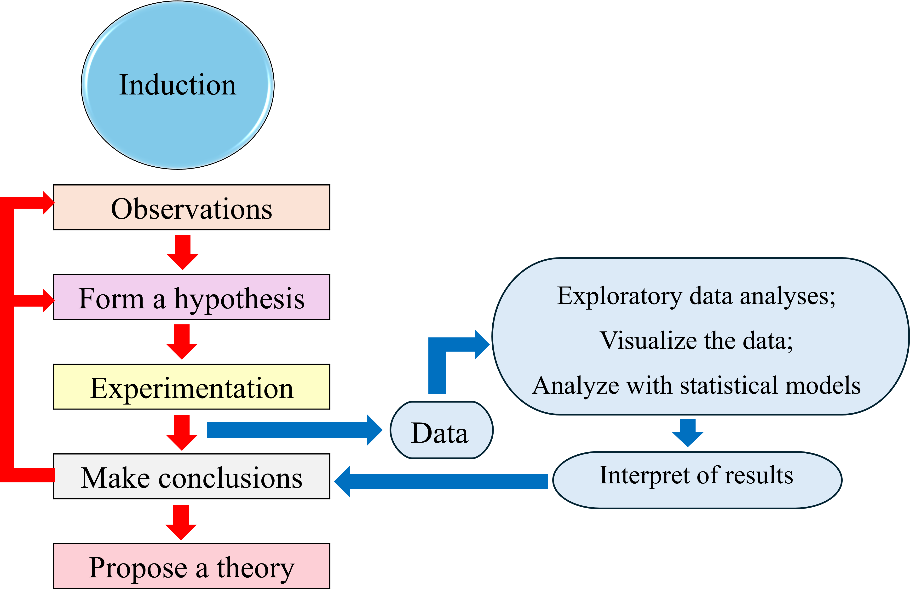
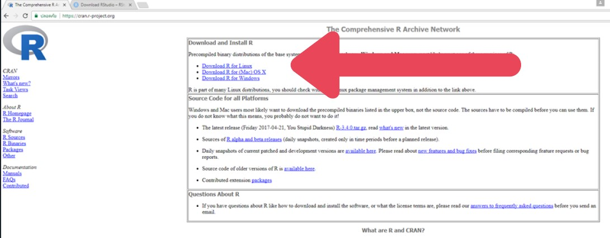
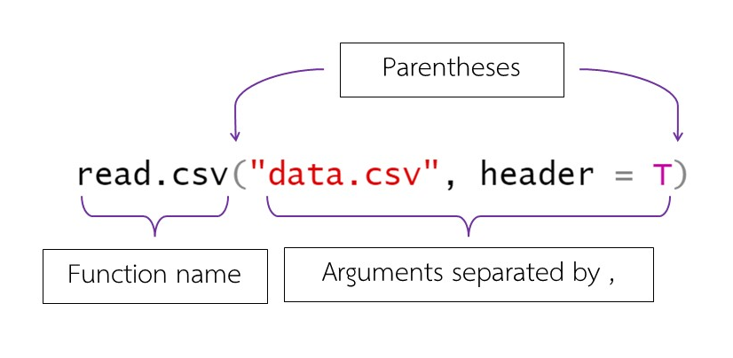

# Scientific methods, role of experimental design and statistics in ecological and environmental studies (Scientific methods and download R) {#basic1}

**Duration:** 3-hour lab

## Learning Outcomes

Students should be able to:

1.  Download R programming language and RStudio for scientific data analyses
2.  Describe what function is and use them in programming

## Data files for this lab

None

## What is R?

R is software for statistical computing and graphics [@R-base].
R is free to use and when you use it in your publications, simply cite the software:

> R Core Team (Year).
> R: A Language and Environment for Statistical Computing.
> R Foundation for Statistical Computing, Vienna, Austria.
> (<https://www.R-project.org/>).

## Role of R in Scientific Methods

Data from experiments are valuable and needed to be analyzed to gain useful information for making scientifically sound decision and communicate the findings (Figure \@ref(fig:relationship)).
The R programming language is a powerful tool for cleaning, visualizing, and analyzing data.
There are many tools to do so, but the R programming language is free, flexible, and able to make beautiful figures for publication.

```{r relationship, echo = FALSE, fig.cap = "The relationship between scientific methods, data collection and analyses. R programming is a powerful tool for data processing and analyzing.", out.width="100%", fig.align='center'}

```

## Download Instructions

### Download R

1.  Visit the Comprehensive R Archive Network (CRAN) website: <https://cran.r-project.org> and select a mirror location that close to you -- for example for Thailand select <http://mirrors.psu.ac.th/pub/cran/>
2.  Click on "Download R" for your operating system (Figure \@ref(fig:downloadR))

```{r downloadR, echo = FALSE, fig.cap = "Click to download", out.width="100%", fig.align='center'}

```

3.  Choose the "install R for the first time" link to download the R executable (.exe) file (for Window users)
4.  Run the downloaded file and follow the installation instructions

### Download RStudio

1.  Visit RStudio website: <https://posit.co/download/rstudio-desktop/>
2.  Click on "Download RStudio desktop" and select a file according to your operating system
3.  Run the downloaded file and follow the installation instructions

**Make sure you have downloaded R and RStudio before proceeding to the next instructions.**

## RStudio Interface

Open RStudio and you will see 4 windows:

1.  **Script window** is for typing your code
2.  **Console window** is for showing results after you run codes
3.  **Environment window** allows you to see what is in your workspace. There is also a tab to see the codes that you have run
4.  A window with 6 tabs is for showing plots, looking for syntax helps, showing a list of packages, etc.

**Note:** R is a case sensitive program, meaning if you type "A" vs "a", both will mean differently in R.

## Functions in R

A function is a block of code that performs some tasks (Figure \@ref(fig:functions)).
For data analyses, you write several functions that work together.
In R, functions include built-in functions and user-defined functions.
To write a function, you include this following:

1.  Write the name of the function
2.  Place a pair of parentheses after the name
3.  If the function needs arguments inside, place the input inside of the parentheses

```{r functions, class.source="bg-success", echo = FALSE, fig.cap = "An example of a function and arguments inside the parentheses", out.width="80%", fig.align='center'}

```

## How to Run Codes

To run you may do one of these options:

1.  Put your mouse cursor on the line of code you want to run and click "Ctrl + R" (for Windows) or "Ctrl + Enter" (for MAC) or
2.  Press the Run button on the top right corner of the Script window or
3.  Write the code into Console and then "Enter" to run (I do not recommend this)

## Syntax and Error Messages in R

Syntax refers to the structure of code and the rules defining the correct combinations of symbols and words in a programming language.
Syntax errors occur when code is written in a way that violates these rules, making it unrecognizable to the compiler or interpreter.
R will show error messages if R does not recognize what is in your codes.
Don't panic!

Read the error messages; sometimes R will say what is wrong.

```{css, echo=FALSE}
.border-chunk {
  background-color: lightgrey;
  border: 1px #000000;
}
```

Let's type this code using a function called "seq":

```{r error = TRUE, eval = F, class.source = "border-chunk"}
# This code will produce an error
seq(1; 10)
```

R shows Error: unexpected ';' in "seq(1;".
It says that ";" is not supposed to be in this code.
The solution is to change to be the right one:

```{r, eval = F, class.source = "border-chunk"}
seq(1, 10)
```

## Set Working Directory

Let R know where you want to R to read files and/or write to.
To see a current working directory:

```{r, eval = F, class.source = "border-chunk"}
getwd() # current directory
```

**Note:** "\#" indicates that the text after "\#" is a note.

## Simple Manipulation: Numbers and Vectors

The simplest data structure is a vector.
Think about it as a dataset arranged in sequence.
To create a vector you will use c() function in R:

```{r, eval = F, class.source = "border-chunk"}
x <- c(8, 6, 7, 3, 10, 15)
x
```

"\<-" is an assignment operator.
This code means you create a vector named "x" and assign six members which are 10, 5, 6, 9, 8, 5.

Let's do:

```{r, eval = F}
100 * x
```

You will see in the Console that R prints out a vector of 6 members which are multiplied by 10.
The new vector is not in Environment.
Why?

Now try:

```{r, eval = F}
y <- c(x, 0, x)
y
```

## Vector Arithmetic in R

The elementary arithmetic operators are the usual '+' for addition, '-' for subtraction, '\*' for multiplication, '/' for division and '\^' for raise to a power.

```{r, eval = F}
10 + 9
10 - pi
2 * 562
8 / 2
sqrt(25)
z <- 5 # assignment of a value to a variable
z # show the value
v <- sqrt(36)
v
```

Some other basic functions in R for calculation are:

```{r, eval = F}
10^2 # power
exp(1) # exponential
log(10) # natural logarithm (ln)
log10(10) # log base 10
sin(pi / 2)
cos(pi)
tan(pi / 4)
factorial(10)
```

## Basic Functions Table

| Function  | Meaning                                                   |
|-----------|-----------------------------------------------------------|
| max(x)    | largest elements of a vector x                            |
| min(x)    | smallest elements of a vector x                           |
| range(x)  | value is a vector of length two, namely c(min(x), max(x)) |
| sum(x)    | Summation of values of a vector x                         |
| length(x) | total of the elements in x                                |
| prod(x)   | Product of a vector x                                     |
| mean(x)   | calculates the sample mean                                |
| var(x)    | sample variance                                           |

## Create a Sequence in R

Let's try this and see the differences among codes:

```{r}
seq(1, 10, by = 0.5)
seq(1, by = 0.5, length = 10)
A <- seq(0, 3, by = 0.01) # create a vector named A
```

You can do this to the vector A:

```{r, eval = F}
length(A)
max(A)
min(A)
range(A)
length(A)
prod(A)
mean(A)
var(A)
```

**Note:** Using capital letters such as A and lowercase function R alternately will require greater caution.
I recommend using all lowercase letters in script writing.
However, it depends on personal preference.

Let's see more:

```{r, eval = F}
a <- seq(1, 5, by = 1)
a

3 * a

diff(a) # differences between values

cumsum(a) # cumulative sums

# We can also use rep() for making sequences
rep(1, 10)

b <- rep(a, time = 5)
b

b1 <- rep(a, each = 5) # repeats each element of x five times before moving on to the next
b1

rep(a, each = length(a))
```

## Tip: The example() Function

Each of the help entries comes with examples.
One really nice feature of R is that the example() function will actually run those examples for you.

```{r, eval = F}
example(seq)
```

## Character Vector

This is a common data type for names.
Writing character will have to use "...".
You can use either of '...' or "...".
To create a character vector, you will use the function c() or you may use paste():

```{r, eval = F}
### Character vector
char_vector <- c('one', 'two', 'three')
char_vector

labs <- paste(c('biol', 'chem'), 1:6, sep = '')
labs

str(char_vector) # see structure of an R object
```

## Logical Vector

We can work with logical data.
The logical vector elements can be TRUE or T, FALSE or F, and NA (for not available or missing data).
I suggest typing TRUE, FALSE to avoid confusion.
Logical operator used with logical vector are \<, \<=, \>, \>=, == (exact equality) and !=
(for inequality):

```{r, eval = F}
a

a.new <- a > 3
a.new

str(a.new) # see structure of an R object
```

## Factors

Factor is a special type of vector that shows categorical data.
Most of the factors are used to make different models.
For example, we have treatment with low, med, high level, with 2 repetitions each:

```{r, eval = F}
treatment <- c('med', 'low', 'high', 'low', 'med', 'high') # create character vector
str(treatment)

is.factor(treatment) ## ask if treatment is factor. Answer = logical

trt.or <- factor(treatment, levels = c('low', 'med', 'high'), ordered = TRUE)
str(trt.or)
trt.or

trt.inor <- as.factor(treatment) ## coercing to be factor
trt.inor
```

## Adding and Deleting Vector Elements

Vector elements can be deleted.
Try creating a new vector from the original vector and then browse to the new vector created:

```{r, eval = F}
d <- c(888, 5, 120, 13)

d1 <- d[-c(1, 3)] ## delete 1st and 3rd element
d1

d2 <- c(d[1:2], 100, 99, d[3:4]) ## add 100, 99
d2
```

"[...]" is for indexing the vector.

## Exercise

**Submission:** A PDF file containing your answers.
Your answers must contain **R codes** that you wrote and **the outputs** you get.
Your codes and outputs can be text and/or screen capture.

**Full score:** 10

**Data for this exercise:** None.

### Questions/Directions

**1.** Given a right triangle with sides x = 5 and y = 13, calculate the length of the hypotenuse

**2.** Generate a sequence of values from -4.8 to -3.43 that is length 8 (show code)

**3.** What is the sum of the exponential of this sequence?

**4.** Create a character vector and name it as you wish.
The vector consists of 3 elements -- name, last name and month that you were born.

**5.** Add your nickname behind your last name.

### Grading Rubric

| Question | Score = 2                 | Score = 1                                            | Score = 0                         |
|------------------|------------------|------------------|------------------|
| 1        | Correct R code and output | One of R code or output is not included or incorrect | R code and output is not included |
| 2        | Correct R code and output | One of R code or output is not included or incorrect | R code and output is not included |
| 3        | Correct R code and output | One of R code or output is not included or incorrect | R code and output is not included |
| 4        | Correct R code and output | One of R code or output is not included or incorrect | R code and output is not included |
| 5        | Correct R code and output | One of R code or output is not included or incorrect | R code and output is not included |

**End of Lab 1**
