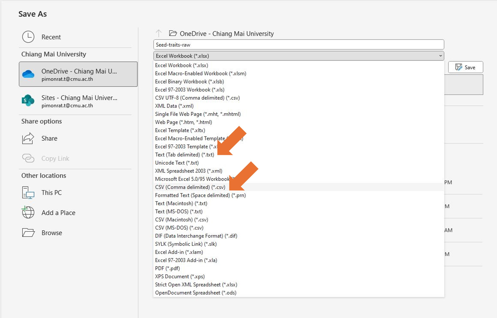

# Scientific methods, role of experimental design and statistics in ecological and environmental studies (Data import and management) {#basic2}

**Duration:** 3-hour lab

## Learning Outcomes

Students should be able to:

1.  Import a data set to the program to prepare for data analysis
2.  Remove some missing value from the data

## Data files for this lab

-   germination.txt [Click here to download the file](https://o365cmu-my.sharepoint.com/:t:/g/personal/pimonrat_t_cmu_ac_th/EQzNo6jjdE5IkDMjUS7PYlMBr3zp0Fd9cBHh1gthjY1BpQ?e=e0zL5v)

## What is a data frame?

A data frame consists of rows and columns resembling a matrix.
The word "data frame" is specific to R.
Each row usually represents each observation, and each column is a variable that we measure from experiments.
The components of the data frame must be vectors (either numeric, character, or logical), factors, numeric matrices, lists, or other data frames.

## Data from your research

Once we collect the data, we should digitize it immediately.
My suggestion is to input your data in Excel spreadsheets.
Then we save them in a .txt or .csv before importing them into R (Figure \@ref(fig:csv)).

```{r csv, echo = FALSE, fig.cap = "Save the data as .txt or .csv file", out.width="100%"}

```

## Data Input from files

The easiest way is to put our data in the form of a data frame before we read the data in R.
We can use Excel to record the data.
The data frame formats are:

1.  There is a header of the table at the top. **Variable names must not contain spaces.**
2.  Put the data of each variable in one column
3.  Each row is each subject that we measure
4.  If there is a missing value, put the NA or use another symbol such as "?", "." etc. We tell R to know when reading what missing value is.

**Save your file as .txt or .csv files before importing to R**

## Prepare for importing the file

1.  Open "germination.txt" in Excel and take a look to see whether the file is suitable to import into R
2.  Check your working directory. Use `dir(getwd())` to see what files are in a current working directory
3.  If the working directory is not set, set it with `setwd()` or Choose directory in Session menu

```{r, eval = FALSE}
# Check working directory
dir(getwd())
```

## Data Importing with read.table() Function

There are several ways to import data.

### Method 1: Direct file path

```{r eval = FALSE}
# read 1
dat <- read.table("germination.txt", header = TRUE, na.string = "NA")
```

What we did was to create an object called "dat" and import the data "germination.txt" into it.
We tell R that we have a header (header = TRUE) and tell R that we have missing values which are represented by NA.

### Method 2: File chooser

Another way is:

```{r eval=FALSE}
# read 2
dat <- read.table(file.choose(), header = TRUE, na.string = "NA")
```

Then you will see a window and you will click to select the file you want.

## For CSV files

In case that you have .csv file we will use **read.csv()** instead of read.table, for example:

```{r eval = FALSE}
data <- read.csv("germination.csv", header = TRUE)
```

## Exploring and Cleaning Data

Then let's take a look at your imported data and clean it up.
Run the codes below:

```{r eval=FALSE}
dim(dat) # see the dimension of data #rows and #columns

str(dat) # see more detail structure of the data

dat.no.na <- na.omit(dat) # remove every row with missing value
```

The function `na.omit` removes every row with NA.
If you would like to remove some specific row, you may use the command below to create a new data frame without a row in the column 'count' that has 'NA':

```{r eval=FALSE}
dat.reduced <- dat[!is.na(dat$count), ] ## omit the row with missing value of column count
```

Now compare the data frame 'dat.no.na' with 'dat.reduced'

## Editing Data in R

In addition, if you have a small change you want to make after a data set has been imported to R, you can use a function called `edit`.
The function `edit` brings up a separate spreadsheet for editing.
We will try this by making a new data frame called dat.new and make some small changes with `edit`:

```{r eval=FALSE}
dat.new <- edit(dat)
```

## Write a File from R to Your Working Directory

We can write the data as a text file into our working directory (if you want to read/write an Excel file directly, you have to use an additional package `xlsx`).
Now let's write the 'dat.new' dataset to a .txt file:

```{r eval=FALSE}
write.table(dat.new, "fulldata.txt", sep = "\t")

dir(getwd()) # check if we have the data file
```

## Index the Data in Data Frame

To index the data in the data frame, write the name of the data frame followed by "\$" (dollar sign) and write the column name.
R will show the vector of the data in that variable.

```{r eval = FALSE}
head(dat) # look at only few rows on the top of the data frame

dat$extract # see only the extract column

dat$count # see only the count column
```

In addition you can browse to any position by calling the row position and column position inside [ , ].
The first number is the **row number** and the second number is the **column number**.
For example, 'dat[10, 2]' means that you want to see a data point in row 10, column 2.
Let's do it:

```{r eval=FALSE}
dat[10, 4] # look at data in 10th row, 4th column (extract)

dat[2, 2] # look at data in 2nd row, 2nd column (sample)
```

## Create New Columns in Data Frame

We can add new columns of new variables from existing variables.
In the data frame without missing value, we have germination data -- the number of germinated seeds of each treatment (count) and we know the number of seeds we sown (sample).
If we want to create a new column for percent germination, we will do this following:

```{r eval=FALSE}
dat.no.na$percent <- (dat.no.na$count / dat.no.na$sample) * 100

head(dat.no.na)

str(dat.no.na) # see the structure
```

## Tip: Using attach() and detach()

With using \$ to call the column the code can be too long to type.
One way to simplify this step is to attach the data frame to the Global Environment using the attach() function.
After attaching you will be able to call the variable (column) by its name.

```{r eval=FALSE}
attach(dat.no.na)

extract

count
```

**However, there is a drawback.** If you work simultaneously with many data frames containing the same variables names, attaching data frames will make it confusing.

You may remove the data frames from the global environment using `detach()`:

```{r eval=FALSE}
detach(dat.no.na)

count # R will no longer know this

dat$count
```

## Saving Your Workspace

Before you leave this lab, make sure you save your current R workspace.
This workspace will be saved in your working directory.

```{r eval=FALSE}
save.image(file = "lab2.RData")
```

## Exercise

**Submission:** A PDF file containing your answers.
Your answers must contain **R codes** that you wrote and **the outputs** you get.
Your codes and outputs can be text and/or screen capture.

**Full score:** 10

**Data for this exercise:**

-   example.xlsx [Click here to download the file](https://o365cmu-my.sharepoint.com/:x:/g/personal/pimonrat_t_cmu_ac_th/ESyrKa6iihVHkMCVRQUFes4BFLfeRY_Q79fXhTAxy6Wc0A?e=z7ET6c)

### Questions/Directions

**1.** In Excel, open a file 'example.xlsx'.
See if the file is appropriate to be imported to R.
Answer in written words: What do you have to change in the data to make the file readable by R.

**2.** In Excel, arrange the data in such a way that it is ready to analyze in R and save as an 'example.txt' file.
For your answer, show a screen capture of your corrected file.

**3.**.
In R, create a data frame in R named 'data', and then import a file 'example.txt'.
Show the data frame.

**4.** In R, show the structure of this data frame.

**5.** In R, create a new data frame, called 'data.new' (from 'data') that does not have any missing value.

### Grading Rubric

| : Question | Score = 2                     | Score = 1                                            | Score = 0                                       |
|-------------------|------------------|------------------|------------------|
| 1          | Correctly answer the question | Give partially correct answer                        | No answer                                       |
| 2          | Correct data file             | Give partially correct data file                     | No answer                                       |
| 3          | Correct R code and output     | One of R code or output is not included or incorrect | R code and output are not included or incorrect |
| 4          | Correct R code and output     | One of R code or output is not included or incorrect | R code and output are not included or incorrect |
| 5          | Correct R code and output     | One of R code or output is not included or incorrect | R code and output are not included or incorrect |

**End of Lab 2**

------------------------------------------------------------------------
