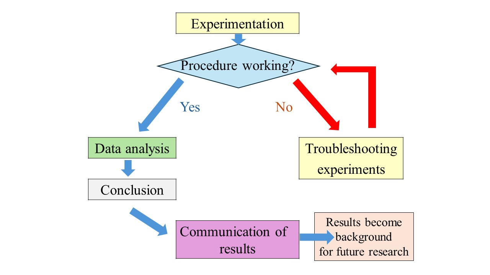
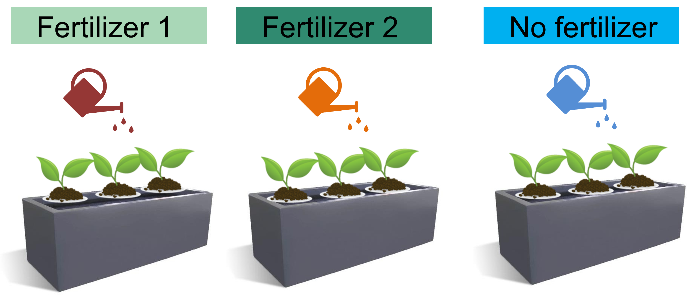
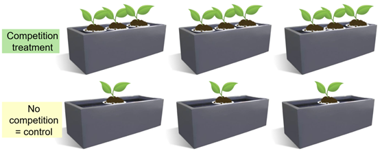

# Nature of Experimentation and Principles of Experimental Design {#experimentation}

**Duration:** 1-hour lecture**

## Learning Outcomes

Students should be able to:

1. Explain different types of variables in experiments
2. List three basic principles of experimental design and explain them

## Introduction

The second lesson emphasizes the components of experiments and the principles of experimental design. It is important to come up with research questions and hypotheses because it will lead to proper identification of variables in the experiments.

## Experimentation

After we have research questions and hypotheses, we are ready to run an experiment. At the beginning it is possible that the experiment may not be working as we expected. As researchers we should be flexible and come up with the solutions for the problems (Figure \@ref(fig:experiment-flow)). If the experiment works well, we should expect to get data and move on to the data analysis.

```{r experiment-flow, echo=FALSE, fig.cap="The flow of experimentation", out.width="80%"}

```

## Variables

It is very crucial to identify variables in an experiment.

1. **Independent variable:** The factor that is changed or manipulated in an experiment.
2. **Dependent variable:** The factor that is measured or observed in response to the independent variable. This is your measurement of the outcome of your experiment. In many experiments, there is more than one dependent variable.

For instance, in an experiment testing the effect of fertilizer on plant growth, the fertilizer would be the independent variable, the plant growth would be the dependent variable.

## Errors in Experiments

Experiments are prone to errors. It's important to understand experimental errors because by recognizing and addressing potential sources of error, researchers can improve the accuracy and reliability of their results. There are two common types of experimental errors.

### Random Error

This is unpredictable variations in measurements. The source of these errors may arise from variation in environmental conditions when the experiment was done, variations in equipment used for measurements. Human errors in measuring are also a cause.

**Example of random error:** When measuring the height of a seedling several times, you might get slightly different readings due to variations in how you align the measuring tape from the ground up to the top of the seedling.

### Systematic Error

This type of error consistently occurs in the experiment from issues with the experimental setup, equipment calibration, or assumptions made in the procedure.

**Example of systematic error:** When measuring the weight of seedlings, the scale that we use always reads 0.5 gram lower than the actual weight. When we use this to measure 30 seedlings, all seedlings will be 0.5 gram lighter.

When we know that errors can occur, we should use various techniques to minimize experimental errors. Techniques to minimize experimental errors include:

1. Multiple measurements of dependent variables,
2. Proper calibration of equipment,
3. Comparing experimental results to a control group,
etc.

## Three Principles of Experimental Design

First, let me give an example to make you think about experiments.

### Is This a Good Design?

A researcher is doing an experiment testing the effect of fertilization on plant growth. The researcher sets up an experiment as shown in Figure \@ref(fig:fertilizer-design). There are three treatments - no fertilizer and two types of fertilizers. The researcher put three seedlings in each of the growing pots and each growing pot received one of the treatments. At the end of the experiment the researcher measures the growth of each seedling. For each treatment, he has three numerical values of seedling growth (in total of nine values). He says that he had three replicates of each treatment. Does he really have three replicates?

```{r fertilizer-design, echo=FALSE, fig.cap="A fertilizer experiment. Is this a good design if a researcher treats each of the seedlings as a true replicate for each treatment?", out.width="80%"}

```

The answer is **no**. If you look closely at this experiment, the researcher only has one replicate of each treatment. The growing pot is the smallest unit that received independent treatments. Three seedlings are planted in the same growing pot. In each plot, the three seedlings are not independent from one another. The three seedlings are pseudo-replicates or subsamples. To make sure that there are three actual replicates in this experiment, the researcher must separate the three seedlings into each individual pot and apply the treatments to them or repeat multiple pots for each treatment. More detail is in a replication topic below.

Understanding and applying these principles is critical for minimizing bias and improving the power of statistical analyses. Three core principles of experimental design [@gotelli2013] are:

1. Randomization
2. Replication
3. Control group

### Randomization

Randomization refers to an unbiased process to assign treatments, participants, or experimental units to different groups. The goal is to minimize biases and ensure that the treatment groups have as similar starting conditions as possible.

#### Purposes of Randomization

**1. To reduce bias**

Randomization helps ensure that outcomes that are observed between groups or treatments are due to the treatment, not some other factors. Figure \@ref(fig:bias) shows the bias of assigning seedlings of different sizes into fertilizer treatments without randomization. For example, all small seedlings go into fertilizer 1 while the biggest seedlings go into fertilizer 2. It is possible that the different outcome among treatment (e.g. the growth of seedlings) may be due to the seedling size (not the fertilizer.)

```{r bias, echo=FALSE, fig.cap="Bias and confounding effect of seedling size and fertilizer", out.width="80%"}
knitr::include_graphics("figures/2p3.jpg")
```

**2. To avoid confounding effects**

Confounding effects are factors that could affect the outcomes. Figure \@ref(fig:bias) shows a confounding effect of seedling size and fertilizer treatment. It is possible that the different outcome among treatment (e.g. the growth of seedlings) may be due to the seedling size (not the fertilizer.) Randomization aims to evenly distribute confounding variables across different treatment groups (Figure \@ref(fig:randomization)).

```{r randomization, echo=FALSE, fig.cap="Randomization of seedling sizes among treatments", out.width="80%"}
knitr::include_graphics("figures/2p4.jpg")
```

**3. To enable statistical inference**

Randomization makes it possible to apply probability theory to the results of experiments. If group assignments are random, statistical tests (e.g. t-tests and ANOVA) can assume that any differences between treatment groups due to chance follow predictable distributions. Randomization makes the conclusions of cause-and-effect relationships reliable.

#### How to Randomize Test Subjects in Experimental Design

**1. Simple randomization**

Every participant or experimental unit has an equal chance of being assigned to any group. For example, we assign numbers to each treatment (Figure \@ref(fig:simple-random), e.g. treatment 1, 2, 3). Each experimental unit gets a number drawn from a pool.

```{r simple-random, echo=FALSE, fig.cap="An example of a simple randomization", out.width="80%"}
knitr::include_graphics("figures/2p5.jpg")
```

**2. Stratified randomization**

Experimental units are divided into subgroups (strata) based on a characteristic, for example, age or gender or size (Figure \@ref(fig:stratified-random)). Then the treatments are assigned randomly within those groups to ensure balance.

```{r stratified-random, echo=FALSE, fig.cap="An example of a stratified randomization", out.width="80%"}
knitr::include_graphics("figures/2p6.jpg")
```

### Replication {#replication}

Replication refers to the repetition of the same experimental conditions multiple times. Replication increases the reliability and credibility of experimental outcomes. In addition, replication ensures that the findings are not due to random chance, variability, or specific conditions of a single experiment.

The concept of **an experimental unit** is essential to ensure that there is true replication. The experimental unit is the smallest unit of test subjects or materials that treatments are applied independently. For example, in Figure \@ref(fig:fertilizer-design) the smallest unit that a treatment is applied to is a gray planting pot. The experiment only has one replication. There are two ways to solve the replication issue. First, the researcher must separate the three seedlings into each individual pot and apply the treatments to them. Second, the researcher must use multiple pots of three seedlings each for one treatment (Figure \@ref(fig:replicates)).

```{r replicates, echo=FALSE, fig.cap="An alternative way to have replicates in a fertilizer experiment", out.width="80%"}
knitr::include_graphics("figures/2p7.jpg")
```

#### How Many Replicates Are Enough in an Experiment?

The number of replicates depends on many factors [@herzog2019guidelines; @minitab2025]. Key factors are:

**1. Types of experiments**

Field experiments may require more replications than easy-to-control laboratory experiments due to high variability of the environmental conditions.

**2. The variability in the experimental units**

If there are biological differences among individuals and environmental factors, more replications are preferable to get reliable results.

**3. Desired precision and statistical power**

If you need high precision in your results, more replications will be necessary to detect these small effects. For example, if you are looking for small differences between treatments, more replications will be required. In addition, we also consider statistical power i.e. the likelihood of detecting a true effect if it exists. Experiments aim for a power of at least 80%, meaning an 80% chance of detecting a true effect. The more power you would like to have, the more replications you will want to have.

**4. Practical factors**

When it comes to experimentation, we have to consider resources we have - financial support, labor, and time. We should maximize the number of replicates when the cost, labor and time allow.

### Control Group

A control group is under identical conditions to the treatment group, except for the independent variable. It is important to have a control group to compare the effects of the independent variable (Figure \@ref(fig:replicates), Figure \@ref(fig:competition)). For example, we study the effects of plant competition on plant growth and survival. The independent variable is the existence of competition. The control group is the group that shows no competition, meaning seedlings that live alone without competing for resources from other plants (Figure \@ref(fig:competition)).

```{r competition, echo=FALSE, fig.cap="A study of the effect of plant competition", out.width="80%"}

```

In addition, if there are treatments that change some environmental conditions of the experimental unit, it is also useful to have an extra control group for the changes we make. For example, we study the effect of fungicide on fruit set on a tree species. The treatment is to apply fungicide in a liquid solution to flowers, and the control group has no fungicide application. Liquid fungicide may change the moisture content of the flowers and may affect the fruit set. To control the moisture change, we should have another treatment that applies water in the same way we apply the fungicide to the flowers.

## Exercises

1. In a field experiment, we want to test the effects of weed removal on seedling survival and growth. What is an independent variable and a dependent variable?

2. What are the three principles of experimental design? Explain why each of them is important.

3. In a field experiment, we want to test the effects of weed removal on seedling survival and growth. What would be the treatment and control group of this experiment?

## References

::: {#refs}
:::
