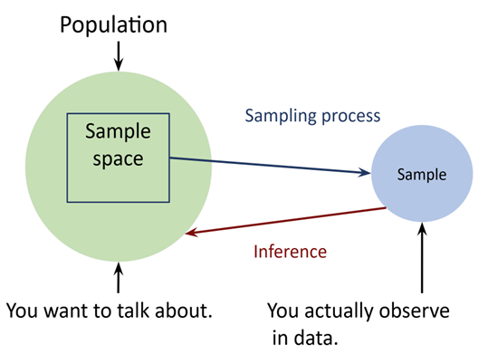
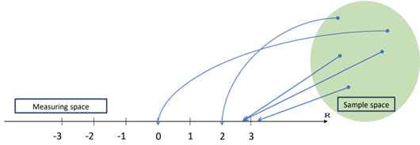

# Random Variables {#random-variables}

**Duration:** 2-hour lecture

## Learning Outcomes

Students should be able to:

1. Describe keywords related to the topics and describe expected values and variance
2. Explain how population, samples and inference are related
3. Identify different types of random variables

## Introduction

Random variables are a fundamental concept in probability and statistics. They allow us to model and analyze outcomes of random phenomena in a structured way. In this lesson, we will explore the definition of random variables, their types and characteristics. By understanding random variables, you will gain the tools to quantify uncertainty and make informed predictions. Before we learn about random variables, we should know the relationships among population, sample and inference.

## Population, Sample, and Statistical Inference

In a study, the **population** refers to the entire group of individuals or test subjects that we are interested in studying (Figure \@ref(fig:pop-sample-inference)). It is impossible to study the entire population of interest because we have limited resources. Therefore, we must take samples from the population. The **sample** is a smaller, representative subset of that population that we collect the data from. The sample data will come from sample space in the population. We work with samples - measuring and analyzing the data from the samples. Finally, we would like to make a conclusion about our population of interest. **Inference** bridges the gap between the sample and the population by using statistical methods to draw conclusions and/or make predictions about the population based on the sample data. The reliability of the inferences depends on the quality of the sampling process and the methods used for analysis.

For example, if we would like to sample the height of Chiang Mai University students. The population is the set of all students we can choose from. The sample space is the set of all possible outcomes of height from 0 to possible 250 cm. Then we can plan a sampling process to get height measurements from a subset of students in an unbiased way to represent our population. If we are interested in the academic performance of the Chiang Mai University students, the population will be the same, but sample space will be a set of possible outcomes of grade point average (0-4).

```{r pop-sample-inference, echo=FALSE, fig.cap="The relationship between population, sample, and inference.", out.width="80%"}
# Placeholder for Figure 3.1

```

## What is a Random Variable?

A **random variable** is a numerical value associated with the random outcome of an experiment/study in the sample space (Figure \@ref(fig:random-var-link)). Only one numerical value is assigned to each sample point. The results of the measurements (measuring space) are random variables. To continue with the height of Chiang Mai University students, the sample space is the set of all possible outcomes of height from 0 to possible 250 cm. When we measure the height of students we sample, we will get one numerical value from each student.

```{r random-var-link, echo=FALSE, fig.cap="The link of random variables and measurements.", out.width="80%"}
# Placeholder for Figure 3.2



```

## Types of Random Variables

There are two main types of random variables based on nature of their values:

### Discrete Random Variables

A **discrete random variable** takes on finite or countable values (integer). Examples of discrete random variables include:

a) The number of heads in a series of coin flips
b) The results of rolling a die
c) The number of birds you found when walking in the park for an hour
d) The number of seeds that germinate or not germinate

The probabilities associated with each possible value are described by a **probability mass function (PMF)**. PMF maps the possible values of X against their respective probabilities of occurrence, P(X). P(X) is a number from 0 to 1. The area under a probability function is always 1.

#### Example of PMF: Rolling a Fair Die

The sample space is point numbers on the six sides - 1, 2, 3, 4, 5, and 6.

- The probability of getting 1 (X = 1) is 1 in 6; $P(X) = \frac{1}{6}$
- The probability of getting 2 (X = 2) is 1 in 6; $P(X) = \frac{1}{6}$
- The probability of getting 3 (X = 3) is 1 in 6; $P(X) = \frac{1}{6}$, and so on

Then we make a graph of X on the x-axis and its P(X) on the y-axis. We will get the following graph (Figure \@ref(fig:die-pmf)):

```{r die-pmf, echo = FALSE, fig.cap="PMF of rolling a die.", fig.width=6, fig.height=4}
# Create PMF for rolling a die
x <- 1:6
prob <- rep(1/6, 6)

barplot(prob, names.arg = x, 
        xlab = "Outcome (X)", 
        ylab = "Probability P(X)",
        main = "Probability nass function of rolling a die",
        col = "steelblue",
        ylim = c(0, 0.2))
```

### Continuous Random Variables

A **continuous random variable** takes on an infinite number of possible values (real number), within a given range. The continuous random variable is uncountable. Examples of continuous random variables include:

a) The height of Chiang Mai University students
b) The length of leaves of a tree species
c) The weight of dry seeds
d) The distance traveled by car

These values are described by a **probability density function (PDF)**, which assigns probabilities to intervals rather than specific values. For example, if we measure the height of a human (X), the probability that X is any exact value is zero. In other words, the probability that X is 155.532340954... centimeters is zero. There is no ruler with a fine enough scale to measure it to the exact value. PDF maps the possible values of X against their respective probabilities of occurrence, P(X). The area under a probability function is always 1.

#### Example of PDF: Height Measurements of Students

Figure \@ref(fig:height-pdf) shows the height data modeled as a normal distribution with a mean height of 170 cm and a standard deviation of 10 cm. The curve represents the likelihood of observing a given height, with the area under the curve summing up to 1.

```{r height-pdf, echo = FALSE, fig.cap="PDF of height measurement of students.", fig.width=7, fig.height=5}
# Create PDF for height measurements
x <- seq(130, 210, length.out = 1000)
y <- dnorm(x, mean = 170, sd = 10)

plot(x, y, type = "l", lwd = 2, col = "darkblue",
     xlab = "Height (cm)", 
     ylab = "Probability density",
     main = "Probability density function of student heights")
grid()
```

## Expected Values and Variances

All probability distributions are characterized by an expected value (mean) and a variance (standard deviation squared).

### Expected Value of a Random Variable

The **expected value** of a random variable X represents how we expect X to behave on average over the long run. We can think of the expected value as the theoretical average of a random variable for the entire population. The average is called "weighted average" because more frequent values of X are weighted more highly in the average.

The expected value of a discrete random variable is defined as:

$$E(X) = \sum_{i=1}^{n} x_i \cdot P(x_i)$$

where:

- $x_1, x_2, ..., x_n$ are the possible values of the random variable X
- $P(x_i)$ is the probability of $x_i$

#### Example: Expected Value of Rolling a Die

From the example of rolling a fair die in Figure \@ref(fig:die-pmf), the expected value is:

$$E(X) = 1 \times \frac{1}{6} + 2 \times \frac{1}{6} + 3 \times \frac{1}{6} + 4 \times \frac{1}{6} + 5 \times \frac{1}{6} + 6 \times \frac{1}{6} = 3.5$$

This means that the average outcome over many rolls is 3.5 (Figure \@ref(fig:die-running-avg)).

```{r die-running-avg, echo = FALSE, fig.cap="Running average of rolling a die 1000 times and the expected value.", fig.width=7, fig.height=5}
# Simulate rolling a die 1000 times
set.seed(123)
rolls <- sample(1:6, 1000, replace = TRUE)
running_avg <- cumsum(rolls) / seq_along(rolls)

plot(1:1000, running_avg, type = "l", lwd = 2, col = "darkgreen",
     xlab = "Number of rolls", 
     ylab = "Running average",
     main = "Running average of die rolls",
     ylim = c(2.5, 4.5))
abline(h = 3.5, col = "red", lwd = 2, lty = 2)
legend("topright", legend = c("Running average", "Expected value (3.5)"),
       col = c("darkgreen", "red"), lwd = 2, lty = c(1, 2))
grid()
```

The expected value of a continuous random variable is defined as:

$$E(X) = \int_{-\infty}^{\infty} x \cdot f(x) \, dx$$

where $f(x)$ is the PDF of the random variable X.

### Expected Values of Population vs Sample Mean

A sample mean ($\bar{x}$) is a special case of the expected value. The sample mean represents the actual average of observed data points, while the expected value is the theoretical average of a random variable of the population ($\mu$). If we sample many times from the population, the sample mean is a good estimate of the population's expected value.

For example, from the example of student heights in Figure \@ref(fig:height-pdf), the expected value is 170 cm. If we sample about 30 students, we will calculate the average height of 30 sampled students, $\bar{x}$, as:

$$\bar{x} = \frac{x_1 + x_2 + ... + x_{30}}{30} = \sum_{i=1}^{30} x_i \cdot P(x_i)$$

The probability of each person in the sample is $\frac{1}{30}$.

### Example: Thai Government Lottery

Let's learn more about expected values from a Thai lottery example.

The Thai Government Lottery draws twice a month. Each ticket has a six-digit number (000000 – 999999). Each ticket costs 80 baht. The first prize money is 6,000,000 baht but it ends up paying 5,970,000 baht due to taxation.

If you buy a ticket, what are your expected wins or losses? Let's work it out with the money involved.

| Outcome | Money (baht) | P(X) |
|---------|--------------|------|
| Win | 5,970,000 | 1/1,000,000 = 0.000001 |
| Lose | -80 (You lose 80 baht of the ticket price) | 1 - (1/1,000,000) = 0.999999 |

Calculate the expected value for 1 ticket buying:

$$E(X) = 5,970,000 \times 0.000001 + (-80) \times 0.999999 = -74.03 \text{ baht}$$

Maybe if we hope to win a smaller prize - two-digit prize (00 - 99):

| Outcome | Money (baht) | P(X) |
|---------|--------------|------|
| Win | 2,000 | 1/100 = 0.01 |
| Lose | -80 (You lose 80 baht of the ticket price) | 1 - (1/100) = 0.99 |

$$E(X) = 2,000 \times 0.01 + (-80) \times 0.99 = -59.2 \text{ baht}$$

The expected value is still negative.

```{r lottery-expected, echo=TRUE}
# Calculate expected values for Thai lottery
first_prize <- 5970000 * 0.000001 + (-80) * 0.999999
two_digit <- 2000 * 0.01 + (-80) * 0.99

cat("Expected value for first prize ticket:", round(first_prize, 2), "baht\n")
cat("Expected value for two-digit prize:", round(two_digit, 2), "baht\n")
```

### Variance

The variance measures the **expected squared distance from the mean**. It indicates how much the data points deviate from the mean, on average, and is a key concept in probability and statistics. The unit of a variance is expressed as the square of the units of the variable itself. A small variance means that the data points are close to the mean (less spread) and a large variance means a wider spread. The expression of variance of a random variable is $\text{Var}(X)$ or $\sigma^2$.

For **population variance**, the symbol is $\sigma^2$:

$$\sigma^2 = \frac{\sum_{i=1}^{N}(x_i - \mu)^2}{N}$$

where:

- N is the number of data points
- $\mu$ is population mean
- $x_i$ are the values of each data point

For **sample variance**, the symbol is $s^2$:

$$s^2 = \frac{\sum_{i=1}^{n}(x_i - \bar{x})^2}{n-1}$$

where:

- $n$ is the number of sampled data points
- $x_i$ are the values of each data point
- $\bar{x}$ is sample mean

```{r variance-example, echo = FALSE, fig.cap="An example of 10 data points of cat's height and the mean.", fig.width=7, fig.height=5}
# Example: 10 data points
set.seed(456)
cat_heights <- c(25, 27, 26, 28, 24, 29, 25, 26, 27, 28)
mean_height <- mean(cat_heights)

# Visualize data points and mean
plot(1:10, cat_heights, pch = 19, col = "darkgreen", cex = 1.5,
     xlab = "Cat number", ylab = "Height (cm)",
     main = "Cat heights and mean",
     ylim = c(23, 30))
abline(h = mean_height, col = "purple", lwd = 2, lty = 2)
segments(1:10, mean_height, 1:10, cat_heights, col = "darkgreen", lty = 2)
legend("topright", legend = c("Cat Height", "Mean Height", "Deviation"),
       col = c("darkgreen", "purple", "darkgreen"), 
       pch = c(19, NA, NA), lty = c(NA, 2, 2), lwd = c(NA, 2, 1))

# Calculate variance
variance <- var(cat_heights)
cat("\nSample variance:", round(variance, 2), "cm²\n")
```

### Variance and Standard Deviation

A **standard deviation** is a square root of variance and expressed in the same unit as the data.

$$\text{Standard Deviation} = \sqrt{\text{Variance}}$$

For population: $\sigma = \sqrt{\sigma^2}$

For sample: $s = \sqrt{s^2}$

```{r std-dev, echo=TRUE}
# Calculate standard deviation
std_dev <- sd(cat_heights)
cat("Sample standard deviation:", round(std_dev, 2), "cm\n")
```

## Exercises

1. With the following research question, what is the population of interest and what is the sample?

   "Does seed mass variation underlie interspecific differences in seed physical and chemical defenses of species in the genus *Macaranga*?"

2. If you run a study with the research question in Exercise 1, what would be random variables we measure from the experiment?

3. From Question 2, what types of each of the random variables of the measurements?

4. If two populations of the same means have variances of 5 and 10, respectively, which population has the data points that are spread wider from the mean?

## Summary

In this lesson, we learned:

- The relationships among population, sample, and statistical inference
- The definition and characteristics of random variables
- The distinction between discrete and continuous random variables
- How to calculate and interpret expected values
- How to calculate and interpret variance and standard deviation
- Practical applications of these concepts through examples

These foundational concepts will be essential as we move forward to more advanced statistical topics in subsequent chapters.
