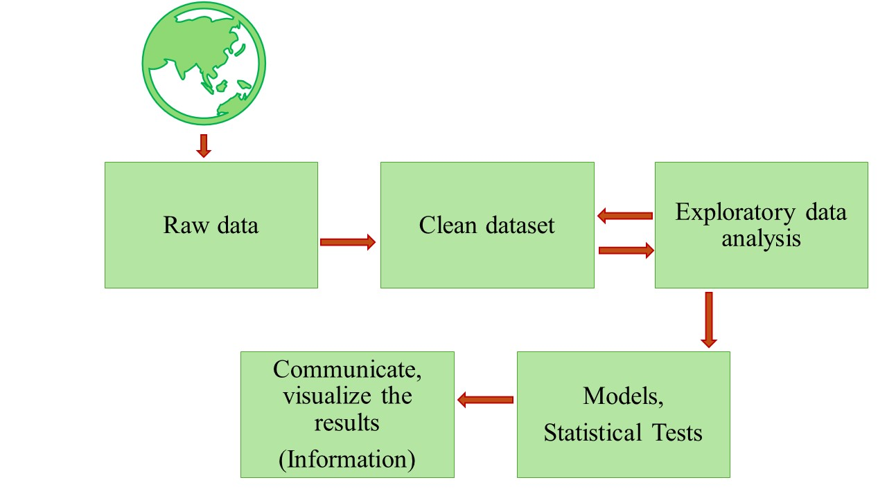
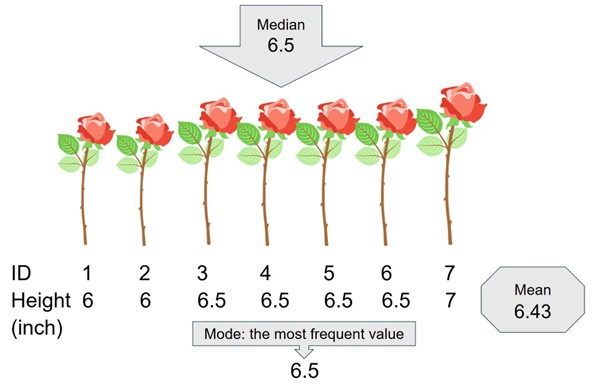
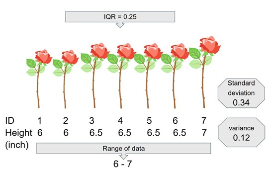
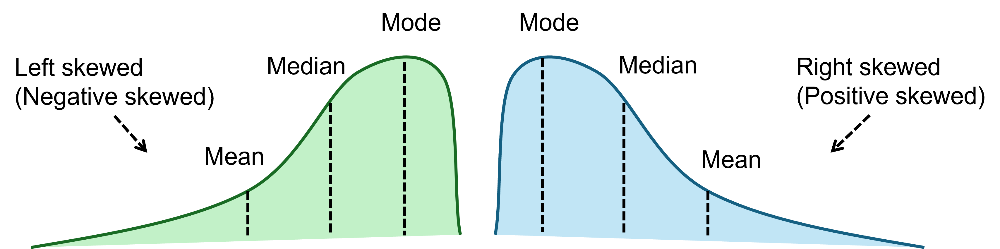
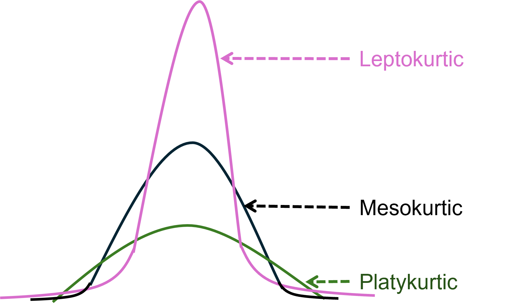

# Exploratory Data Analysis {#5eda}

**Duration:** 2-hour lecture

## Learning outcomes

Students should be able to:

1. Describe what measure of location and measure of spread are
2. Describe types of data attributes and give some examples
3. Give some examples of steps for exploratory data analysis

## Introduction

Exploratory Data Analysis is a fundamental process in environmental studies, where researchers delve into datasets to uncover patterns, identify trends, and gain insights that inform decision-making and further research. This lesson will discuss the key elements of Exploratory Data Analysis, including the central limit theorem, measures of location and spread, as well as univariate and bivariate exploratory analysis. [@mottin2017]

```{r data-process, echo = FALSE, fig.cap="Data process", out.width="80%"}
# Placeholder for Figure 3.2


```

## What is exploratory data analysis?

Exploratory Data Analysis is a data analysis approach that focuses on understanding the underlying structure of a dataset (Figure \@ref(fig:data-process)) before making any formal statistical inferences [@mottin2017]. It involves a systematic exploration of the data, with the aim of identifying relevant features, relationships, and potential outliers.

### An example of steps for exploratory data analysis 

(Modified from @geeksforgeeks2022)

**Step 1: Understand the research questions and link to the data**

The first step is to start identifying the statistical questions that are related to the research questions. It is important to know what independent and dependent variables are because it helps to identify appropriate analyses.

**Step 2: Import and inspect the data in the software you want to use**

**Step 3: Handling missing values**
(Clean data in Figure \@ref(fig:data-process))

Missing value is common in experiments. The decision whether to remove missing data or impute them should be made before further analysis.

**Step 4: Explore data characteristics and/or perform data transformation if necessary**

In this step. It is good practice to compute measures of central tendency and spread (see topics \@ref(central-tendency) and \@ref(spread) for more details).

**Step 6: Visualize data**

In this step, plots are made to see patterns of data and/or to see relationships between data. (see topic \@ref(graphical-eda) for more details).

**Step 7: Handling outliers**

Outliers are the data points that deviate significantly from the rest of the data points. Outliers may arise from measurement errors. It is good to check and handle them properly.

**Step 8: Interpret and communicate findings**

This step gives insights that guide further analysis.

## Understanding data attributes

Data attributes refer to the properties or characteristics of the data. These attributes determine how data should be analyzed and interpreted.

### Types of data attributes

**1. Nominal Data:** Categorical data with no inherent order

- Example: gender, eye color, ID numbers
- Operations: Equality (=, ≠)

**2. Ordinal Data:** Categorical data with a meaningful order but without a fixed interval between values

- Examples: Grades (A, B, C), rankings, levels (low, medium, high)
- Operations: Equality and comparison (<, >, =, ≠)

**3. Interval Data:** Numerical data where differences between values are meaningful, but there is no true zero

- Examples: Temperature in Celsius or Fahrenheit, calendar dates
- Operations: Addition, subtraction

**4. Ratio Data:** Numerical data where both differences and ratios are meaningful, and a true zero exists

- Examples: Height, weight, counts, temperature in Kelvin
- Operations: Addition, subtraction, multiplication, division

### Case Study: The Iris Dataset

The Iris flower dataset is one of the most famous datasets in the field of statistics and machine learning. The dataset was collected by botanist Edgar Anderson and introduced by statistician Ronald Fisher in 1936 [@fisher1936]. It consists of 50 samples from each of three species of Iris flowers: *Iris setosa*, *Iris virginica*, *Iris versicolor*.

For each sample, four features were measured (in centimeters):

- Sepal length
- Sepal width
- Petal length
- Petal width

**Sample of the Iris dataset**

| Sepal.Length | Sepal.Width | Petal.Length | Petal.Width | Species   |
|--------------|-------------|--------------|-------------|-----------|
| 5.1          | 3.5         | 1.4          | 0.2         | setosa    |
| 4.9          | 3.0         | 1.4          | 0.2         | setosa    |
| 4.7          | 3.2         | 1.3          | 0.2         | setosa    |
| 4.6          | 3.1         | 1.5          | 0.2         | setosa    |
| 5.0          | 3.6         | 1.4          | 0.2         | setosa    |
| ...          | ...         | ...          | ...         | ...       |
| 6.2          | 3.4         | 5.4          | 2.3         | virginica |
| 5.9          | 3.0         | 5.1          | 1.8         | virginica |

**Data attribute of the Iris dataset**

- ID: Nominal data (identifier with no natural order)
- Sepal.Length, Sepal.Width, Petal.Length, Petal.Width: Ratio data (continuous measurements with true zero point)
- Species: Nominal data (categorical with no inherent order)

## Measures of Location (Central Tendency) {#central-tendency}

Measures of location help summarize the dataset by identifying a central value:

### Mean (Arithmetic Mean)

The mean is the sum of all values divided by the total number of observations.

$$\bar{x} = \frac{\sum_{i=1}^{n} x_i}{n}$$

Where:

- $\bar{x}$ = Arithmetic Mean
- $x$ = data point
- $n$ = number of data points


```{r rose1, echo = FALSE, fig.cap="A dataset of seven roses with a mean, median, and mode", out.width="80%"}
# Placeholder for Figure


```

From the example of roses (Figure \@ref(fig:rose1)), the mean of rose height is $$\bar{x} = \frac{6 + 6 + 6.5 + 6.5 + 6.5 +6.5 + 7 }{7} = 6.43$$ inches.

**Properties of the Arithmetic Mean**

The arithmetic mean is an unbiased estimator of the population mean (μ) when observations are made on randomly selected individuals. The observations in the sample are independent of each other and observations are drawn from a population that can be described by a normal random variable.

### Median

The middle value when data is ordered. From the example of roses (Figure \@ref(fig:rose1)), the median of rose height is the height of the number 4th rose, which is 6.5 inches.

### Mode

The most frequently occurring value. From the example of roses (Figure \@ref(fig:rose1)), the mode of rose height is 6.5 because there are four data points with the value of 6.5 inches.

### Quartiles

Values that divide the dataset into four equal parts (25%, 50%, 75%).

### Choosing the right measure

- Use the **arithmetic mean** when data is symmetrically distributed. It is the best choice when data is evenly spread around a central point because it considers all values in the dataset, making it a reliable indicator of the overall trend. However, it can be misleading if the dataset contains extreme values (outliers) that disproportionately influence the mean.

- Use the **median** when data is skewed or contains outliers. It is particularly useful when dealing with skewed data or datasets with extreme values, as it is not affected by outliers. For example, in income distributions where a few individuals earn significantly more than the rest, the median provides a more representative measure of a typical income than the mean.

- Use the **mode** when identifying the most common category. It is especially useful for categorical data, such as determining the most popular product color in a survey or the most common diagnosis in a medical study. Unlike the mean and median, which describe numerical trends, the mode helps in understanding patterns in non-numeric data.

## Measures of spread (measures of dispersion) {#spread}

Measures of spread helps to understand how data values are spread out from the center (Figure \@ref(fig:rose2)). Key measures include:

### Range

It is the simplest measure of dispersion, calculated as the difference between the maximum and minimum values in a dataset. It provides a quick sense of variability but is highly sensitive to outliers, making it less reliable for datasets with extreme values.

### Variance (σ²)

It measures how much each data point deviates from the mean, on average. It is calculated by taking the average of the squared differences between each value and the mean. Squaring these deviations ensures that both positive and negative differences contribute equally, but it also means the units of variance are different from the original data, making interpretation less intuitive. For a sample variance, the symbol is S².

$$S^2 = \frac{\sum_{i=1}^{n} (x_i - \bar{x})^2}{n-1}$$

Where:

- $\bar{x}$ = Arithmetic Mean
- $x$ = data point
- $n$ = number of data points

**Degrees of Freedom**

The concept of degrees of freedom (df) refers to the number of values in the final calculation of statistics that are free to vary. For the sample variance, df is n-1 because there is one parameter estimated, the sample mean.

### Standard Deviation (σ)

It is the square root of the variance and provides a more interpretable measure of spread in the same units as the original data. A higher standard deviation indicates that data points are more spread out from the mean, while a lower standard deviation suggests that data points are closer together. For a sample standard deviation, the symbol is S.

$$S = \sqrt{\frac{\sum_{i=1}^{n} (x_i - \bar{x})^2}{n-1}}$$

Where:

- $\bar{x}$ = Arithmetic Mean
- $x$ = data point
- $n$ = number of data points

### Interquartile Range (IQR)

It is the difference between the third quartile (Q3) and the first quartile (Q1), representing the middle 50% of the data. Unlike the range, IQR is resistant to outliers because it focuses on the central portion of the dataset, making it a more robust measure of variability, especially for skewed distributions.

$$IQR = Q3 - Q1$$

```{r rose2, echo = FALSE, fig.cap="A dataset of seven roses with measures of spread", out.width="80%"}
# Placeholder for Figure


```

## Law of Large Numbers & Central Limit Theorem

- **Law of Large Numbers:** As the sample size increases, the sample mean approaches the true population mean.

- **Central Limit Theorem:** The distribution of the sample mean becomes approximately normal when the sample size is large, regardless of the original data distribution.

## Graphical Methods in EDA {#graphical-eda}

Different types of graphs help visualize data in meaningful ways, making it easier to identify patterns, trends, and distributions. Some useful graphs include:

### Histograms

They are used to display frequency distributions by grouping data into bins and showing how often values fall within each range (Figure \@ref(fig:hist)). The height of each bar represents the number of observations in that interval. Histograms are useful for identifying the shape of a distribution, such as whether it is symmetric, skewed, or multimodal.


```{r hist, echo = FALSE, fig.cap="Histogram of sepal length data in the iris dataset (Fisher 1936). The frequency on the y-axis and the sepal length data in centimeters on the x-axis. The curve is kernel smoothing for probability density estimation to show overall shape of the distribution", out.width="80%"}
# Placeholder for Figure

data(iris)

# Load necessary libraries
library(ggplot2)

# Load the iris dataset
data(iris)

# histogram
ggplot(iris, aes(x = Sepal.Length)) +
  geom_histogram(col = "black", fill = "lightgreen", 
                 bins = 15) +
  labs(x = "Sepal Length (cm)", y = "Count") +
  theme_bw() +
  theme_classic(base_size = 16)

```


### Skewness

It measures the asymmetry of a distribution. There are two types of skewness – skewed to the left and to the right (Figure \@ref(fig:skew)).

```{r skew, echo = FALSE, fig.cap="Two types of skewness", out.width="80%"}
# Placeholder for Figure


```


### Kurtosis

It measures how much probability is distributed in the tails versus the center. There are three types of kurtosis (Figure \@ref(fig:kurtosis)):

- **Mesokurtic:** Normal distribution
- **Leptokurtic:** Heavy-tailed distribution
- **Platykurtic:** Light-tailed distribution

```{r kurtosis, echo = FALSE, fig.cap="Three types of kurtosis", out.width="80%"}
# Placeholder for Figure


```

### Box-and-whisker plot (Box plot)

The plots summarize data distributions by showing key statistics such as the median, quartiles (Q1 and Q3), and potential outliers. The box represents (Figure \@ref(fig:boxplot)) the interquartile range (IQR), while the "whiskers" extend to the smallest and largest values within a reasonable range. Any points beyond the whiskers are considered outliers. Box plots are particularly useful for comparing multiple datasets and identifying skewness.


```{r boxplot, echo = FALSE, fig.cap="Box plot of sepal length data in the iris dataset (Fisher 1936)", out.width="80%"}
ggplot(iris, aes(y = Sepal.Length)) +
  geom_boxplot(col = "black", fill = "lightgreen", 
               width = 0.6, staplewidth = 0.5
               ) +
  xlim(-1, 1) +
  labs(y = "Sepal Length (cm)") +
  coord_flip() +
  theme_bw() +
  theme_classic(base_size = 16)
```

### Q-Q plots (Quantile-Quantile plots)

They are used to compare the distribution of a dataset to a theoretical distribution, such as the normal distribution. If the data points in a Q-Q plot align closely along a straight diagonal line (red line in Figure 5.8) it indicates that the data follows the expected distribution. Deviations from this line suggest skewness, heavy tails, or other departures from normality. Q-Q plots are particularly useful for checking assumptions of statistical tests that require normality.

```{r qqplot, echo = FALSE, fig.cap="Q-Q plot of sepal length data in the iris dataset (Fisher 1936). The data are on the y-axis and the theoretical quantiles of normal distribution is on the x-axis. A straight diagonal red line indicates the expected normal distribution", out.width="80%"}
ggplot(iris, aes(sample = Sepal.Length)) +
  stat_qq(col = "blue") +
  stat_qq_line(col = "red", lwd = 1) +
  labs(x = "Theoretical Quantiles", y = "Sample Quantiles") +
  theme_bw() +
  theme_classic(base_size = 16)
```

### Scatter plots

They are used to visualize the relationship between two numerical variables by plotting points on a coordinate plane (Figure \@ref(fig:scatter)). If the points form a clear pattern (such as a rising or falling trend), it suggests a correlation between the variables. Scatter plots are commonly used in regression analysis to examine how one variable influences another.

```{r scatter, echo = FALSE, fig.cap="Scatter plot of sepal length (x axis) and petal length (y axis) of the iris dataset (Fisher 1936)", out.width="80%"}
# Create a scatter plot of sepal length and sepal width
ggplot(iris, aes(x = Sepal.Length, y = Petal.Length)) +
  geom_point(col = "dark green") +
  labs(x = "Sepal Length (cm)", y = "Petal Length (cm)") +
  #theme(axis.text = element_text(size = 14), axis.title = element_text(size = 16)) +
  theme_bw() +
  theme_classic(base_size = 16)
```

## Correlation and Covariance

### Covariance

It measures how two variables change together (direction but not strength of relationship). A covariance of zero means that there is no clear directional relationship.

$$cov_{x,y} = \frac{\sum_{i=1}^{N} (x_i - \bar{x})(y_i - \bar{y})}{N-1}$$

Where:

- $cov_{x,y}$ is covariance between variable x and y
- $x_i$ is the value of x
- $\bar{x}$ is the mean of x
- $y_i$ is the value of y
- $\bar{y}$ is the mean of y
- $N$ is the number of data points

From the example of iris' sepal length (cm) and petal length (cm) (Figure \@ref(fig:scatter)) the covariance of the two variables is 1.27. The positive covariance means that the sepal and petal length move in the same direction.

### Correlation

It measures both direction and strength of the relationship, standardized between -1 and 1. There are many ways to calculate correlation. Pearson's correlation coefficient is the most common measuring a linear correlation of variables. A correlation of zero means that there is no clear linear relationship. The value of 1 (in both positive and negative direction) indicates perfect correlation of the two variables.

$$r_{xy} = \frac{cov_{x,y}}{S_x S_y}$$

Where:

- $r_{xy}$ is Pearson's correlation coefficient
- $cov_{x,y}$ is covariance between x and y
- $S_x$ and $S_y$ are standard deviation of x and y, respectively

From the example of iris' sepal length (cm) and petal length (cm) (Figure \@ref(fig:scatter)), the Pearson's correlation coefficient of the two variables is 0.87. This positive coefficient value indicates strong correlations between the two variables. It is to remember that "correlation does not imply causation". The idea that ones should not interpret correlation as causation is originated by Karl Pearson. The phrase is popularized overtime by various books e.g. @huff1954.

## Confidence Intervals (CI)

A confidence interval provides a range within which we expect the population parameter to lie, based on sample data. The sample standard deviation (S) is used to construct CI around the mean. The 95% CI is bound by:

$$(\bar{x} - 1.96 \cdot S, \bar{x} + 1.96 \cdot S)$$

From the example of iris' sepal length (cm) the 95% confidence interval lie between 5.71 to 5.98 cm. This CI will change if the samples are redrawn. It means that the probability that the true population mean of the iris' sepal length falls within 5.71 – 5.98 is 95%. 5% of the time the true population mean would lie outside of this CI. In other words, if we took 100 different samples and computed a 95% confidence interval for each sample, approximately 95 of the 100 confidence intervals would contain the true population mean.

**Misconception of CI:** There is a 95% chance that the population mean is within this interval.

## Exploratory analysis findings

After EDA, we gain more insights allowing us to choose further analyses. Here are examples of key findings from Iris dataset EDA:

- **Distribution:** Petal measurements show clear bi-modal or tri-modal distributions, suggesting distinct groups
- **Correlation analysis:** Strong positive correlation between petal length and petal width (r = 0.96)
- **Potential outliers:** Box plots reveal some outliers, particularly in sepal width measurements
- **Species differentiation:** *Iris setosa* is clearly separated from the other species based on petal measurements

EDA is a fundamental step in data analysis that ensures a deep understanding of the dataset before applying modeling techniques. By using summary statistics and visualizations, analysts can detect patterns, assess distributions, and draw meaningful conclusions from data.

## Exercises

1. What are measures of location and measures of spread? Provide two examples of each and explain their importance in data analysis.
2. What are the different types of data attributes? Give an example of each type and explain how they are used in data analysis.
3. Why is exploratory data analysis (EDA) important? Describe three key steps in EDA and their purpose.

---
