# Design of Experiments {#6doe}

**Duration:** 4-hour lecture

## Learning outcomes

Students should be able to:

1. Describe the basic principles of experimental design.
2. Differentiate between manipulative and natural experiments.
3. Understand the limitations of various types of experiments.
4. Apply key principles such as replication, randomization, and control.
5. Define experimental units, variables, and treatment structures.

## Introduction

Design of Experiments (DOE) is a systematic approach to planning, conducting, analyzing, and interpreting controlled tests to evaluate the factors that may influence a particular outcome or response. In ecology and other biological sciences, experimental design plays a critical role in establishing causal relationships and minimizing the effects of confounding variables.

## Components of Experimental Design

A well-structured experiment includes three primary components:

1. **Factors**: The independent variables that are manipulated in an experiment.
2. **Levels**: The different values or settings of a factor.
3. **Responses**: The dependent variables that are measured as outcomes.

For example, in an experiment making the best apple pie (Figure \@ref(fig:pie)). There are ingredient factors and baking factors that can be varied. For example, for the effect of apple type on pie taste, the factor would be apples, levels might be Granny Smith, Honeycrisp and Jazz. For the effect of baking temperature on pie taste, levels might include 190°C, and 200°C. The response could be texture and taste ratings given by participants.

```{r pie, echo = FALSE, fig.cap="Three components of experimental design analog to making pies", out.width="80%"}
# Placeholder for Figure

knitr::include_graphics("figures/fig6-1pie.jpg")
```

## Types of Experiments

Experiments generally fall into two categories: manipulative and natural experiments [@gotelli2004].

### Manipulative experiments

These involve direct intervention by the researcher, who alters one or more independent variables to observe the resulting changes in dependent variables. They are conducted either in the lab or in the field.

### Natural experiments (Observational Studies)

Here, the researcher observes natural variations without manipulation. These studies are often used when direct intervention is impractical or unethical.

## Principles of experimental design

The details of the three principles are in Lesson 2. Here a recap is presented. 

Three core principles ensure the reliability and validity of experimental results:

1. Replication
2. Randomization
3. Control

### Randomization

Randomization is the process of assigning treatments to experimental units in a random manner. It reduces selection bias and balances out unknown confounding variables across treatments. Avoiding confounding variables is essential. For example, treatments should be randomly distributed to prevent systematic biases due to environmental gradients or other factors.

**Example**: In a plant growth experiment, assigning treatments randomly to pots of different sizes (Figure \@ref(fig:randomization)).

### Replication

Replication involves repeating the same treatment across multiple experimental units. This reduces the influence of random variability and enhances the reliability of results (Figure \@ref(fig:replicates)). Replicates must be independent, meaning they should not influence each other. This often requires sufficient spatial or temporal separation between units.

The number of replicates needed depends on:

1. The variance in the data.
2. The expected effect size (i.e., the difference between treatment groups).

Effect size is often calculated as:

$$d = \frac{\bar{x}_1 - \bar{x}_2}{s}$$

where $s$ is the pooled standard deviation. Larger effect sizes require fewer replicates to detect statistically significant differences.

### Control group

Controls are untreated or standard conditions used for comparison. They help establish a baseline against which the effects of treatments can be assessed.

**Example**: In seed predation studies, researchers wanted to compare the effect of insect seed predators on seed set [@tiansawat2017]. They set up an insect exclusion experiment using netting to prevent insects access to the fruit. The researchers have a control group by leaving the fruit alone, representing control treatment. In addition, an extra control group, cut netting material, is also installed to the fruit controlling for the presence of netting material and its effect that it might have alter insect's behavior and/or microclimate condition around the fruit (Figure \@ref(fig:control))

```{r control, echo = FALSE, fig.cap="An example diagram of an additional control treatment in seed predation experiment [@tiansawat2017]", out.width="80%"}
# Placeholder for Figure

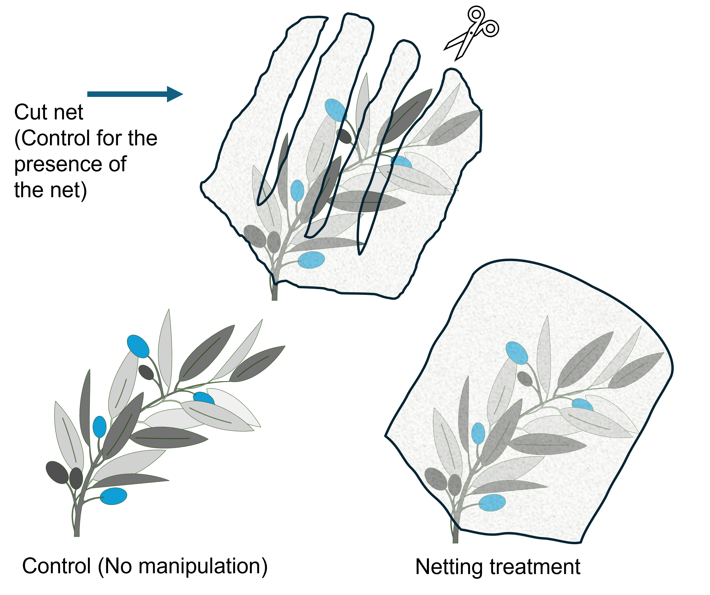
```

## Defining experimental design elements

### Experimental units

An experimental unit is the smallest division of the experimental material such that any two units may receive different treatments. It is the basic entity to which treatment is applied and from which data are independently collected.

**Example**: In a study examining the effect of water quality (two treatments: good and bad quality) on fish growth, each tank with fish could be considered an experimental unit if each tank receives a different treatment (Figure \@ref(fig:fish)). Fish in each tank are not the smallest independent unit of receiving the treatment. It is wrong to claim that there are six replicates of fish in this setup.

```{r fish, echo = FALSE, fig.cap="Tanks are experimental unit. Fish are subsample in each tank.", out.width="80%"}
# Placeholder for Figure

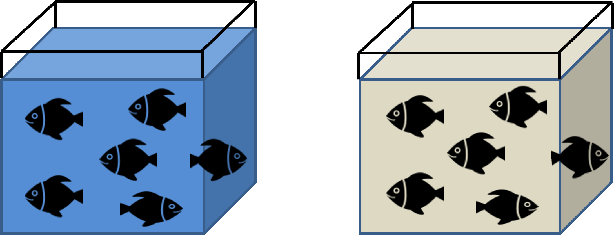
```

### Types of variables

Variables in experimental design are categorized based on their roles and measurement scales [@abs2025]:

#### Variable based on roles

a) **Independent variables (Factors)**: Manipulated to observe their effect.
b) **Dependent variables (Responses)**: Measured outcomes influenced by independent variables.

It is possible to have more than one independent and dependent variable in an experiment. It is crucial to identify what independent and dependent variables are in the experiment because it will help in selecting correct data analysis/models in the data analysis step.

**Examples**: 

1. In seed predation studies (Figure \@ref(fig:control)), researchers wanted to compare the effect of insect seed predators on seed set [@tiansawat2017]. They set up an insect exclusion experiment using netting to prevent insects access to the fruit.
   - Independent variable: exposure to seed predators.
   - Dependent variable: seed set.

2. In a study examining the effect of water quality (two treatments: good and bad quality) on fish growth (Figure \@ref(fig:fish)),
   - Independent variable: water quality.
   - Dependent variable: fish growth.

#### Variable based on measurement scales
[@abs2025]

a) **Categorical variables**: This type of variable takes on qualitative information or characteristics of the data. Categorical variables can be presented as non-numeric value. There are two types of categorical data (Figure \@ref(fig:variable)):

   1. **Nominal categorical data** with no inherent order
      - Examples: ID number of test subjects, color of eyes
   
   2. **Ordinal categorical data** with a meaningful order but without a fixed interval between values
      - Examples: academic grades A-F, size of seeds when expressed in small, medium, large.

b) **Numeric variables**: This type of variable can take on any measurable quantity as a number. There are two types of numeric variables (Figure 6.3):

   1. **Discrete data**: The data take a value based on a count. There is no value with a decimal point. (See topic \@ref(discrete-random-variables))
      - Examples: the number of seeds, the number of birds observed in an hour.
   
   2. **Continuous data**: The data take any value in a set of real numbers. (See lesson 3.3.2 continuous random variables)
      - Examples: The length of leaves of a tree species, the weight of seeds

```{r variable, echo = FALSE, fig.cap="Types of variables based on measurement scales", out.width="80%"}
# Placeholder for Figure

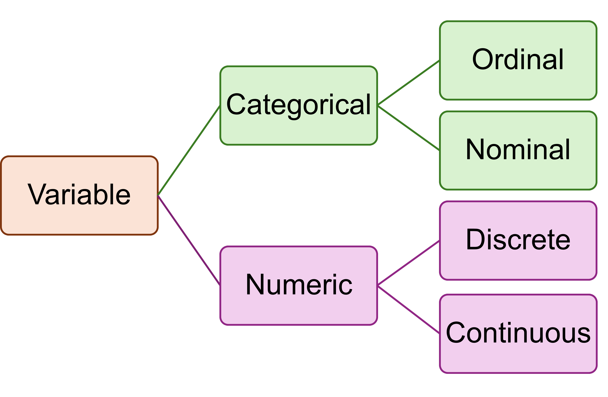
```

**Examples to link with variables based on roles**:

1. In seed predation studies (Figure \@ref(fig:control)), researchers wanted to compare the effect of insect seed predators on seed set of *Luehea seemanii* [@tiansawat2017]. They set up an insect exclusion experiment using netting to prevent insects access to the fruit.
   - Independent variable: exclusion treatment is categorical variable.
   - Dependent variable: seed set. If the seed set is the count of seeds in each treatment, it is a discrete numeric variable.

2. In a study examining the effect of water quality (two treatments: good and bad quality) on fish growth (Figure \@ref(fig:fish)),
   - Independent variable: water quality treatment is categorical in this setup.
   - Dependent variable: fish growth. If the fish growth is measured as fish weight, and length, they are continuous. It is possible also to have discrete data, if the fish growth measured, for example, health score.

### Treatment and design structures

**Terminology**:

1. **Factor**: An independent variable. In an experiment, it is possible to have more than one factor.
2. **Treatment**: A specific condition applied to experimental units.
3. **Treatment Level**: A value or category within a factor.

Treatment structure defines how the different levels of factors are organized in the experiment. Design structure refers to how experimental units are assigned to treatments.

**Example**: Comparing the growth of five plant species under four levels of nitrogen fertilizer involves:

1. **Factor**: plant species and fertilization
2. **Treatment**: nitrogen fertilizer addition applied to five plant species.
3. **Treatment Level**: 
   - nitrogen fertilizer addition: no fertilizer, small, medium, and large amount of fertilizer 
   - five plant species: level is each plant species

## Types of Experimental Designs

### Single-factor designs

A single-factor design is used when the experiment involves only one independent variable (factor). Each level of this factor represents a treatment group. This design is particularly useful for simple studies aiming to test one primary hypothesis.

**Example**:

A researcher wants to test the effect of nitrogen fertilization on the growth of one plant species. The treatment includes no fertilizer, low, medium, and high nitrogen treatments. The dependent variable (response variable) would be plant height or biomass.

**Advantages of single-factor designs**:

1. Simplicity
2. Easier analysis and interpretation

**Limitations of single-factor designs**:

1. Does not account for interactions between multiple variables
2. Less realistic for complex ecological or biological systems

### Multifactor (Factorial) Designs

Multifactor designs incorporate two or more factors and test their effects simultaneously. These are ideal for studying interactions between variables and are highly informative.

**Example**:

@yiamthaisong2024 determined suitable sterilizing agents for seed cleaning and suitable moist storage conditions. They used a factorial design with three factors: sterilizing agents, storage temperature and storage media. There were four surface-sterilization treatments – i) no sterilization (control), ii) 70% ethanol, iii) 3% NaOCl, and iv) 25% metalaxyl. Seeds were stored with two storage media (moist sand and moist filter paper) and at two storage temperatures (room temperature and 4 °C)

**Advantages of multiple-factor designs**:

1. Tests interactions between factors
2. Increases statistical power when properly replicated

**Limitations of multiple-factor designs**:

1. Complexity in setup and analysis
2. Requires a larger number of replicates

## Four classes of experimental and sampling designs

In case there is one dependent variable (univariate data), four different design classes can be classified based on the type of dependent and independent variables (Table \@ref(tab:designclass)). Note that all designs fit into these four categories [@gotelli2004].

Table: (\#tab:designclass) Four classes of designs

| Dependent variable | Independent variable |                         |
|-------------------|---------------------|-------------------------|
|                   | Continuous          | Categorical             |
| Continuous        | Regression          | ANOVA                   |
| Categorical       | Logistic regression | Chi-square or Tabular test |

### Regression designs

#### Single-factor regression

This is a simple design involving one continuous independent and one continuous dependent variable. For every replicate, the independent and dependent variables are measured.

**Example**:

@tiansawat2014 examined the relationship between seed dry mass and seed coat thickness of 11 *Macaranga* species. For seed samples of every species, seed dry mass and seed coat thickness were measured, and then the means of both variables for each of species were calculated [@tiansawat2014].


For regression, researchers should make sure that the sample size is large enough and span the entire range of the independent variable. If the sample size and range of measurement is too limited, the relationship between the variables does not reflect the truth (Figure \@ref(fig:regdesign)).

```{r regdesign, echo = FALSE, fig.cap="Inadequate sampling in regression designs leads to missing the true relationship between x and y", out.width="80%"}
# Placeholder for Figure

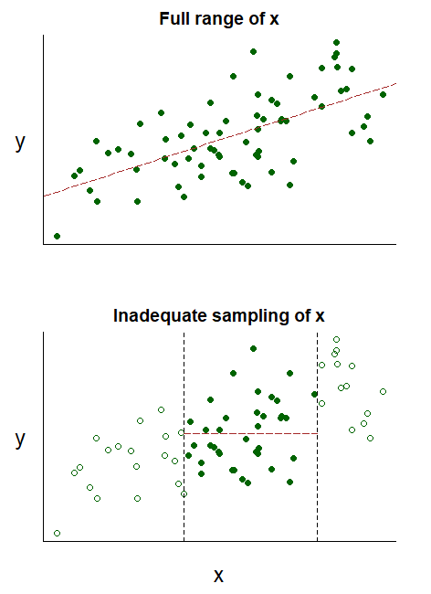
```

#### Multiple regression

This is more complex than single factor regression. It includes two or more independent variables and one dependent variable. It allows for modeling more complex relationships and interactions among factors.

Replications become important as we add predictor variables to the analysis. You should have at least 10 replicates for each predictor variable in your study.

### ANOVA designs

#### Single factor designs

##### Completely Randomized Design (CRD)

This is the simplest experimental layout where treatments are randomly assigned to all experimental units. CRD is appropriate when all units are similar, and there is no need to account for spatial or temporal variation.

**Example**:

Forty identical pots in a growth chamber are randomly assigned to one of four watering treatments (Figure \@ref(fig:crd), Table \@ref(tab:crd)).

```{r crd, echo = FALSE, fig.cap="CRD single-factor (one-way) layout and the example of a data sheet", out.width="80%"}
# Placeholder for Figure

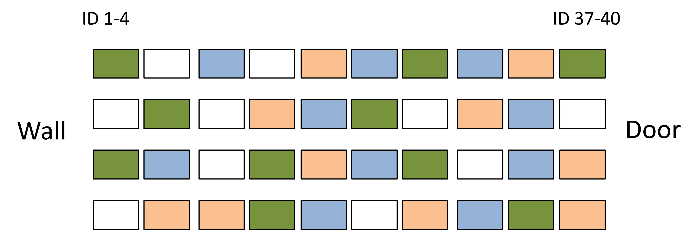

```
 
Table: (\#tab:crd) Example data sheet for CRD

| ID number | Treatment | Replicate | Response variable |
|:---------:|:----------:|:---------:|:-----------------:|
| 1         | A         | 1         |                   |
| 2         | Control   | 1         |                   |
| 3         | A         | 2         |                   |
| 4         | Control   | 2         |                   |
| 5         | Control   | 3         |                   |
| 6         | A         | 3         |                   |
| 7         | B         | 1         |                   |
| 8         | C         | 1         |                   |
| 9         | B         | 2         |                   |
| 10        | Control   | 4         |                   |
| 11        | Control   | 5         |                   |
| 12        | C         | 2         |                   |
| ...       | ...       | ...       | ...               |
| 40        | C         | 10        |                   |

**Advantages of CRD**:

1. CRD is easy to implement and analyze, making it especially suitable for simple experiments where experimental units are relatively uniform and logistical constraints are minimal.
2. The random assignment of treatments helps minimize bias, ensuring that unknown or uncontrollable confounding factors are evenly distributed across treatment groups, thereby improving the validity of the results.

**Limitations of CRD**:

1. CRD assumes that all experimental units are homogeneous, meaning they are expected to respond similarly in the absence of treatment effects. If this assumption is violated, the results may be misleading.
2. This design is highly sensitive to uncontrolled variation, such as environmental gradients or temporal fluctuations, which can introduce noise and reduce the ability to detect true treatment effects.

##### Randomized Block Design (RBD)

One simple experiment is a single-factor design with blocking. This design is a type of experimental design used when the study investigates the effect of only one independent variable (factor), but the experimental units are not homogeneous due to some known source of variation (e.g. soil fertility, light exposure, and time of day). To control this variation, the experiment is divided into blocks. Blocking is used to control for known or suspected sources of variability in the environment. By grouping similar experimental units together and applying all treatments within each block, researchers can reduce the impact of confounding variables and improve the sensitivity of the experiment.

Within a block, conditions are homogeneous. Each block must contain all treatment levels. Blocks are far enough from one another. Underwood (1997) suggested having replication within blocks. Replication ensures security for replicate loss. With replication researchers can analyze for main effects, block effects, and interaction effects (Underwood, 1997).

**Example**:

Forty identical pots in a growing house where the light environment is varied spatially i.e. a gradient of low to high light level. Researchers use RBD to account for light variation. (Figure \@ref(fig:rbd), Table \@ref(tab:rbd)). Note that the layout shown here is without replication.

```{r rbd, echo = FALSE, fig.cap="RBD single-factor with blocking", out.width="80%"}
# Placeholder for Figure

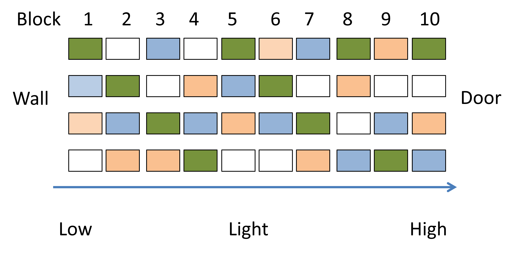
```

Table: (\#tab:rbd) Example data sheet for RBD

| ID number | Treatment | Block | Response variable |
|:---------:|:---------:|:-----:|:-----------------:|
| 1         | A         | 1     |                   |
| 2         | B         | 1     |                   |
| 3         | C         | 1     |                   |
| 4         | Control   | 1     |                   |
| 5         | Control   | 2     |                   |
| 6         | A         | 2     |                   |
| 7         | B         | 2     |                   |
| 8         | C         | 2     |                   |
| 9         | B         | 3     |                   |
| 10        | Control   | 3     |                   |
| 11        | A         | 3     |                   |
| 12        | C         | 3     |                   |
| ...       | ...       | ...   | ...               |
| 40        | B         | 10    |                   |

**Advantages of RBD**:

1. Blocking accounts for environmental or temporal heterogeneity that could confound treatment effects, improving the accuracy of comparisons.
2. By reducing within-block variability, blocking helps to isolate the treatment effect, making it easier to detect statistically significant differences.
3. Since there is only one factor of interest, the analysis (typically an ANOVA with blocks) remains straightforward while still improving rigor.

**Limitations of RBD**:

1. If the sample size is small and the block effect is weak, RBD is less powerful than a simple one-way layout.
2. RBD requires identification of meaningful blocks. Effective blocking depends on the experimenter's ability to identify and group units with similar conditions. Poorly chosen blocks may fail to reduce variability or could even introduce bias.
3. Compared to a CRD, implementing a blocked design requires more planning and care in layout and randomization within blocks.
4. It assumes there is no interaction between blocks and the treatments.

##### Interaction effect

Interaction effects occur when the effect of one independent variable on a dependent variable depends on the level of another independent variable. In other words, two factors do not act independently—their combined influence on the outcome is different from what would be expected based on their individual effects alone. Interaction effects are especially important in multifactor experiments, where researchers test more than one factor simultaneously.

**Example**:

A researcher tests the effect of three fertilization treatments (independent variable) on the growth rate (dependent variable) of one plant species in three greenhouses (block). The results of no interaction between block and the treatment would be in Figure \@ref(fig:nointer). The parallel trend lines indicate that the response to the effect of the fertilizer treatments are similar between the two greenhouses.

```{r nointer, echo = FALSE, fig.cap="There is no interaction between block and the treatment.", out.width="80%"}
# Placeholder for Figure

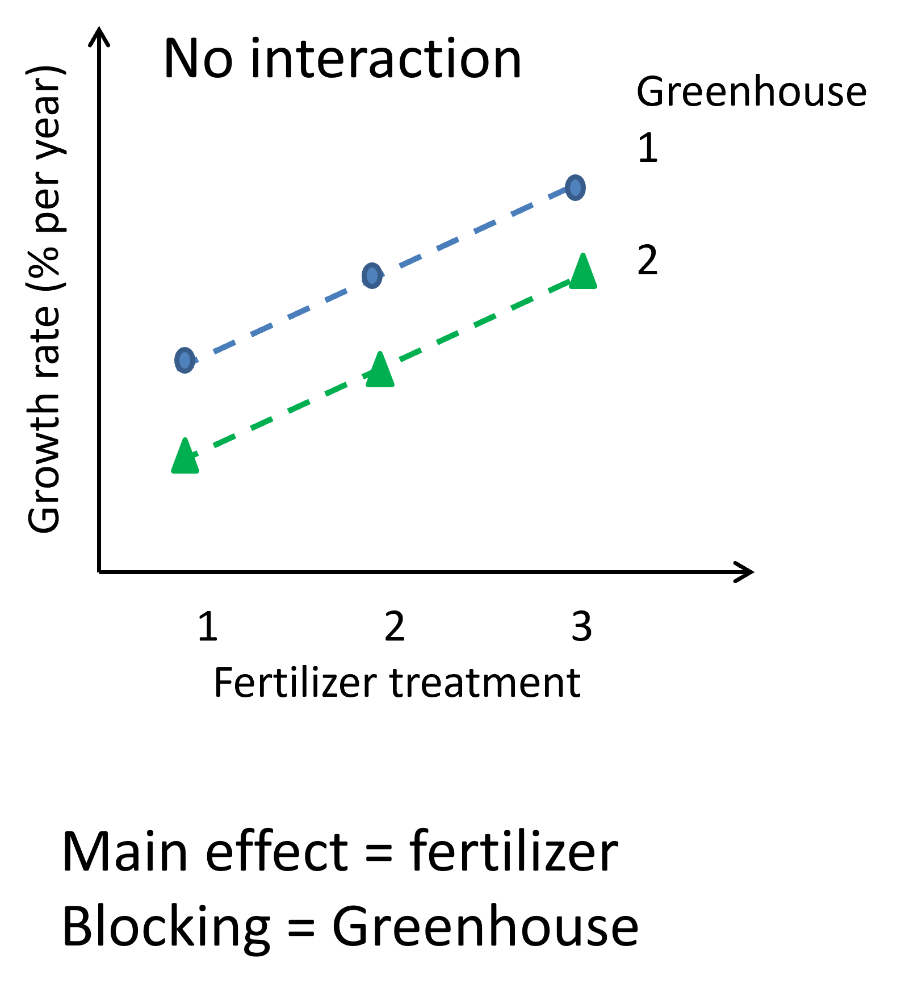
```

On the other hand, when there is an interaction between block and the treatment (Figure \@ref(fig:inter)). In the same fertilizer treatment example, the plot will show non-parallel trend lines meaning that the effect of treatment depends on the which greenhouse the plant is grown in. The researcher cannot conclude the effect of fertilizer without mentioning the block.

```{r inter, echo = FALSE, fig.cap="These plots show an interaction between block and the treatment.", out.width="80%"}
# Placeholder for Figure

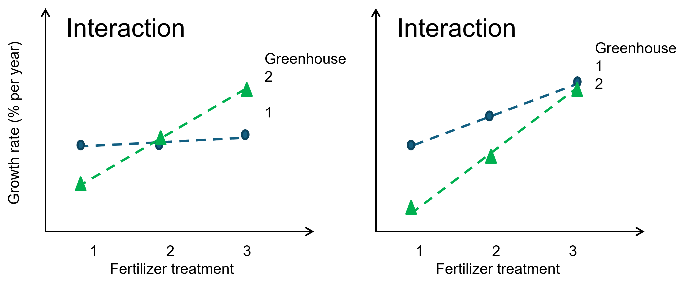
```

##### Nested design {#nested-design-section}

A nested design is a type of experimental design where one factor is contained entirely within the levels of another factor or multiple measurements taken within each experimental unit. This structure is used when experimental units are organized in a hierarchy, and the levels of one factor (the nested factor) are not repeated across the levels of another. For example, if leaves are sampled from different trees, and each leaf only belongs to one tree, then "leaf" is nested within "tree."

Nested designs are useful when dealing with grouped or clustered data and are common in ecological, educational, and hierarchical sampling studies. They require special statistical treatment to correctly account for the structure and avoid confounding variability across levels.

**Example**:

Forty identical pots in a growth chamber are randomly assigned to one of four watering treatments (Figure \@ref(fig:nested), Table \@ref(tab:nested)). For each of the pots, the researcher grows three seedlings and measures the size of three seedlings as a response variable. The three seedlings are not independent replicates. They are nested in the pot (subsample).

```{r nested, echo = FALSE, fig.cap="Nested single-factor design", out.width="80%"}
# Placeholder for Figure

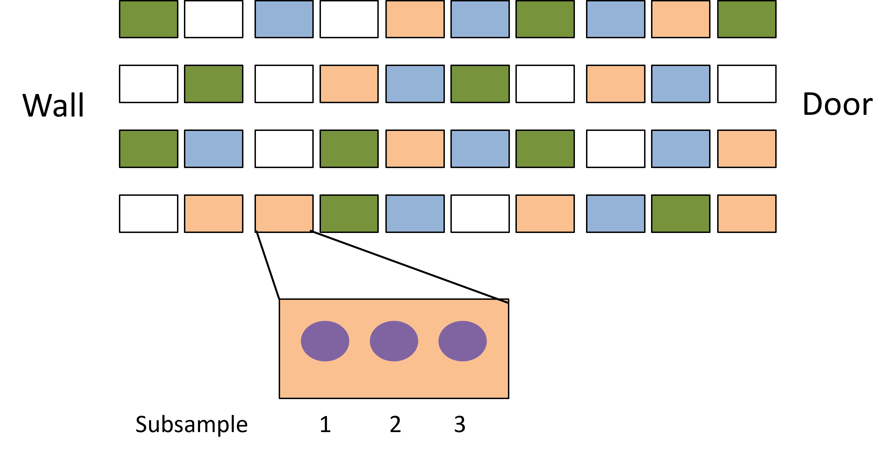
```

Table: (\#tab:nested) Example data sheet for nested design

| ID number | Treatment | Replicate | Subsample | Response variable |
|:---------:|:---------:|:---------:|:---------:|:-----------------:|
| 1         | A         | 1         | 1         |                   |
| 2         | A         | 1         | 2         |                   |
| 3         | A         | 1         | 3         |                   |
| 4         | Control   | 1         | 1         |                   |
| 5         | Control   | 1         | 2         |                   |
| 6         | Control   | 1         | 3         |                   |
| 7         | A         | 2         | 1         |                   |
| 8         | A         | 2         | 2         |                   |
| 9         | A         | 2         | 3         |                   |
| 10        | Control   | 2         | 1         |                   |
| ...       | ...       | ...       | ...       | ...               |
| 120       | C         | 10        | 3         |                   |

**Advantages of nested design**:

1. Subsampling increases the precision of the estimate. Subsampling reduces the effect of random measurement error and increases the precision of the estimate for each treatment group. Rather than relying on a single data point per unit, multiple measurements allow the researcher to better characterize the true mean and variation of each group.
2. Nested design allows testing of variation among treatments and variation among replicates within treatments. Nested designs allow researchers to clearly assess whether there is significant variation among treatments, which is often the main goal of the study. This improves the ability to detect meaningful differences between groups, even when noise exists at different levels. In addition to testing treatment effects, nested designs allow researchers to quantify variability within treatments, that is, among the replicates or subsamples nested within a treatment group. Identifying this variation helps researchers refining hypotheses and improving experimental control.
3. Nested designs naturally extend into hierarchical sampling designs, which are common in ecological, environmental, and social sciences. In hierarchical designs, data are collected across multiple levels of organization, such as regions, sites within regions, plots within sites, and subsamples within plots. This structure allows for multi-scale analysis, where variation can be partitioned at each level. Hierarchical sampling provides a more realistic representation of complex systems, where processes often operate at different spatial or temporal scales. It also supports more robust statistical models, such as mixed-effects or multilevel models, which can handle nested variance structures appropriately.

**Limitations of nested design**:

1. It is easy to mistake subsamples as independent replicates. In a nested design, subsamples are taken within a higher-level unit (e.g., leaves on the same tree, fish within the same tank), and they are not independent of one another. Treating them as independent replicates in statistical analysis artificially inflates the sample size. This mistake can result in significant results that are not truly meaningful. The analysis must account for the nested structure and treat higher-level units (e.g., trees, tanks) as the true replicates.
2. It is easy to misplace sampling effort and to overemphasize subsampling. Although subsampling improves precision, it does not substitute for true replication. A well-balanced design requires sufficient replication at the highest level of inference, often the treatment or block level. Overinvesting in subsampling may lead to a design that lacks the statistical power to detect treatment effects, especially if there are only a few actual replicates. Researchers must therefore carefully plan their sampling strategy, prioritizing the number of independent experimental units over excessive subsampling unless both can be accommodated.

#### Multiple factor designs

A multiple-factor design, a factorial design, is used when a study includes two or more independent variables (factors) of interest, and the goal is to understand not only the main effects of each factor but also their potential interactions (see interaction example in RBD). This approach allows researchers to explore more complex ecological or experimental systems where outcomes are influenced by combinations of factors rather than a single variable. While the design becomes more complex, the foundational principles of replication, randomization, and control remain just as essential as in single factor designs.

**Example**:

A researcher was interested in testing seed coating techniques to prevent seed removal in forests, aiming to apply in forest restoration by direct seeding [@rodpothong2018]. There were two independent factors - seed coating and odor treatments. For seed coating, there were three levels - no coating, coating with clay, and coating with clay and biochar mixture). The second factor was to test whether the presence of predators like cats would scare the seed removers like rats away from the seeds. The researcher used cat urine to represent the predator odor. There were two levels - urine and no-urine treatment. Then the researcher compared the number of seeds removed among treatments. In total, there were six treatment combinations (3 × 2 factorial) (Figure \@ref(fig:factorial), Table \@ref(tab:factorial)).

```{r factorial, echo = FALSE, fig.cap="An example diagram of a 3 × 2 factorial design of a seed-coating study ", out.width="80%"}
# Placeholder for Figure

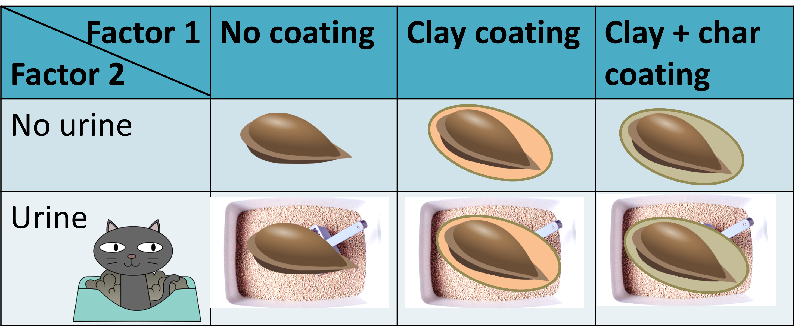
```

Table: (\#tab:factorial) Example data sheet for factorial design with 50 seeds per combination ($$3×2×50=300$$ seeds)

| Seed ID number | Factor 1 coating | Factor 2 urine | Removed or not |
|:--------------:|:----------------:|:--------------:|:--------------:|
| 1              | No               | No             |                |
| ...            | No               | No             |                |
| 50             | No               | No             |                |
| 51             | Clay             | No             |                |
| 52             | Clay             | No             |                |
| ...            | ...              | ...            | ...            |
| 101            | No               | Urine          |                |
| ...            | ...              | ...            | ...            |
| 251            | Clay + char      | Urine          |                |
| ...            | ...              | ...            | ...            |
| 300            | Clay + char      | Urine          |                |


Notice the difference between the factorial design and two single-factor designs (Figure \@ref(fig:twosingle)). There is no interaction between the two factors if doing the experiment separately for the two factors. Therefore, the conclusion would be limited to each factor only.

```{r twosingle, echo = FALSE, fig.cap="Two single-factor designs of coating and urine treatment", out.width="80%"}
# Placeholder for Figure

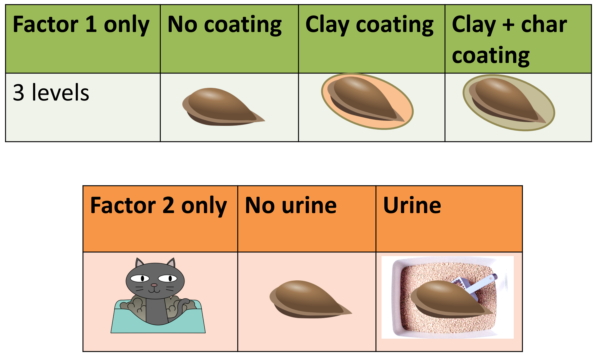
```

**Advantages of factorial designs**:

1. Factorial designs allow analyzing both main effects and interaction effects between two or more factors. The main effect refers to the independent influence of one factor on the outcome, while an interaction effect reveals whether the effect of one factor depends on the level of another. This helps researchers to uncover more complex and realistic relationships among variables.

**Limitations of factorial designs**:

1. As the number of factors and levels increases, the total number of treatment combinations can become very large, making the design difficult or even impossible to implement.
2. In some cases, not all combinations are feasible or logical. For example, in a study aiming to investigate the competition between two plant species on survival and growth rate. The full set will have four treatment combinations (Figure \@ref(fig:notsuitablefac)). However, the treatment where the two species are absent is not logical and the dependent variables would not be possible to collect. Finally, researchers may need to focus only on a subset of meaningful treatment combinations.

```{r notsuitablefac, echo = FALSE, fig.cap="The factorial design may not suitable for some studies", out.width="80%"}
# Placeholder for Figure

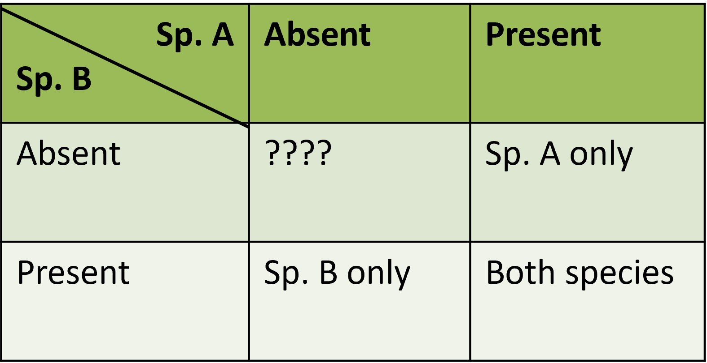
```

#### Split plot design

A split-plot design is an extension of RBD. It is used when two or more factors are tested. One of the factors is harder or more expensive to apply randomly across small units. The harder-to-set-up factor is applied at a larger scale (the whole plot), while the other factor(s) are applied within these units (the subplots). This design is common in agriculture, ecology, and field studies where logistical or spatial constraints make full randomization impractical.

**Example**:

In an experiment testing seed coating, there were two independent factors - seed coating and the types of areas (Figure \@ref(fig:split), \@ref(fig:splitlayout)). For seed coating, there were three levels - no coating, coating with clay, and coating with clay and biochar mixture). The second factor is to test whether the seeds are less likely to be removed if there are grasses cover. The grass cover is easier to set up in a large field than smaller one. The grass cover is the whole plot factor, and the seed coating treatment is the subplot factor (Figure \@ref(fig:splitlayout)). If there are 50 seeds per treatment, there will be $$4×3×50=600$$ seeds (Table \@ref(tab:splitplot)).

```{r split, echo = FALSE, fig.cap="An example diagran of a split-plot design experiment", out.width="80%"}
# Placeholder for Figure

knitr::include_graphics("figures/fig6-14split.jpg")
```

```{r splitlayout, echo = FALSE, fig.cap="The layout of whole plot and subplot factors", out.width="80%"}
# Placeholder for Figure

knitr::include_graphics("figures/fig6-15split.jpg")
```

Table: (\#tab:splitplot) An example of a split-plot design data sheet. If there are 50 seeds per treatment, there will be $$4×3×50=600$$ seeds.

| Seed ID number | Field | Whole plot: Grass or no grass | Subplot: Coating | Removed or not |
|:--------------:|:-----:|:-----------------------------:|:----------------:|:--------------:|
| 1              | 1     | Grass                                  | No                        |                |
| ...            | 1     | Grass                                  | No                        |                |
| 50             | 1     | Grass                                  | No                        |                |
| 51             | 1     | Grass                                  | Clay                      |                |
| ...            | 1     | Grass                                  | Clay                      |                |
| ...            | 1     | Grass                                  | Clay + char               |                |
| 300            | 1     | Grass                                  | Clay + char               |                |
| 301            | 2     | No                                     | No                        |                |
| 302            | 2     | No                                     | No                        |                |
| ...            | ...   | ...                                    | ...                       | ...            |
| 600            | 4     | Grass                                  | Clay + char               |                |

**Advantages of split plot design**:

1. It allows efficient testing of factors that are hard to randomize at fine scales, such as irrigation methods or landscape-level interventions.
2. The design is efficient for field studies because it supports factorial testing of both whole-plot and subplot treatments in a single design

**Limitations of split plot design**:

1. There is less precision of whole plot factor compared to subplot factors because of fewer replication of whole plot factors.
2. The design requires complex analyses, especially if there are some missing data points. The appropriate analyses are mixed models.

### Before-After, Control-Impact design (BACI design)

BACI design is a powerful experimental approach used to detect the effects of a disturbance or intervention in natural systems. It involves collecting data before and after an event or treatment at both control sites (unaffected by the disturbance) and impact sites (exposed to the disturbance) (Figure \@ref(fig:baci)). If it is done right, the design is useful in environmental monitoring and impact assessments. The strength of this design is that it allows comparisons across both time and space.

```{r baci, echo = FALSE, fig.cap="Framework scheme of BACI design", out.width="100%"}
# Placeholder for Figure

knitr::include_graphics("figures/fig6-17baci.jpg")
```

**Advantages of BACI design**:

1. The BACI design can help differentiate between natural variability and treatment effects. By including both temporal and spatial comparisons, the design offers stronger inference about the effects of the disturbance than simple before-after or control-impact studies alone.
2. BACI designs are also flexible. It allows multiple control and impact sites, which increase statistical power and generalizability.

**Limitations of BACI design**:

1. It requires baseline (pre-impact) data, which may not always be available if the impact was unexpected.
2. The design assumes that control and impact sites are comparable and respond similarly to natural variation, which is often difficult to guarantee.
3. If there is a single site, spatial replicates within the area are not independent replicates.

## Exercises

1. What are the three basic principles of experimental design?

2. **Identify experiment type**. For each of the following scenarios, identify whether the study is a manipulative experiment, a natural experiment, or neither. Briefly justify your answer.

   2.1. A researcher compares bird species richness across protected and unprotected forests.
   2.2. Scientists add nitrogen to some plots in a grassland area and monitor plant growth.
   2.3. A survey records the number of fish species in rivers of different altitudes.

3. **Understand the experimental designs**

   3.1. Fill in the table to describe the advantages of each design

| Design | Advantage 1 | Advantage 2 |
|--------|-------------|-------------|
| Single factor regression | | |
| Multiple regression | | |
| CRD | | |
| RBD | | |
| Nested design | | |
| Factorial design | | |
| Split plot design | | |
| BACI | | |

   3.2. Fill in the table to describe the limitations of each design

| Design | Limitation 1 | Limitation 2 |
|--------|--------------|--------------|
| Single factor regression | | |
| Multiple regression | | |
| CRD | | |
| RBD | | |
| Nested design | | |
| Factorial design | | |
| Split plot design | | |
| BACI | | |

4. **Applying the basic principles**. Explain how you would apply replication, randomization, and control in a field experiment measuring insect herbivory across different plant species. Include a diagram if helpful.

5. **Define experimental units, variables, and treatment structures**. You are investigating whether soil moisture affects seedling growth.

   - a) State your hypothesis.
   - b) Identify the independent and dependent variables.
   - c) Describe how you would randomize your treatments.
   - d) What type of design would you use (CRD, factorial, etc.)?
   - e) What covariates might be worth measuring?

6. **Is this a good blocking?** Review Figure \@ref(fig:badblock), and evaluate if the blocking is appropriate. Give the reasons why and fix it if the blocking is bad.

```{r badblock, echo = FALSE, fig.cap=" Is this a good blocking?", out.width="80%"}
# Placeholder for Figure

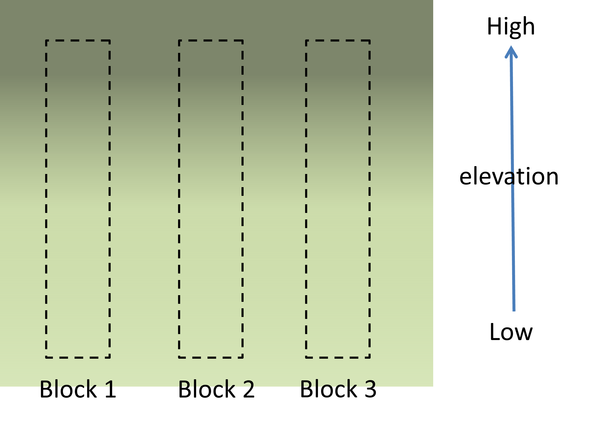
```

---
