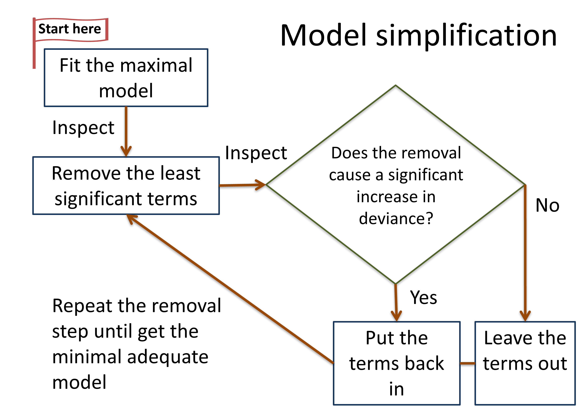
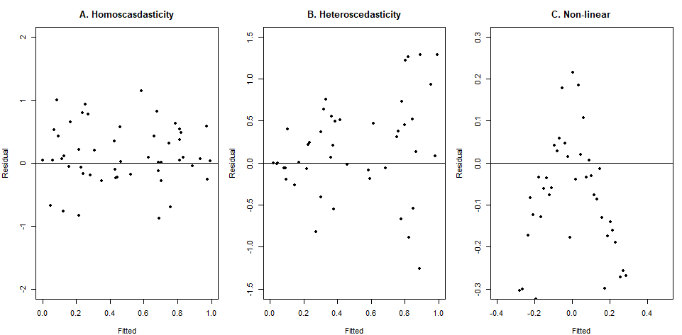

# Statistical Modeling

**Duration:** 2-hour lecture

## Learning outcomes

Students should be able to:

1.     Identify suitable type of models according to response and explanatory variables
2.    Apply the steps of model selection with different datasets
3.    Explain model validation

## Introduction

After a dataset is obtained, the process of doing statistical analysis is statistical modeling.

> "All models are wrong, but some are useful." - @Box1976

Statistical models are mathematical frameworks from which statistical hypothesis tests are derived and statistical estimators are developed. Statistical models are the foundation of statistical inference.

A primary goal of modeling is to determine parameter values that lead to the best fit of the model to the data. The best fit model is the model that produces the least unexplained variation (minimum deviance).

## Models vs hypotheses

A key difference is that models are usually more specific than hypotheses.

**Example**:

**Hypothesis**: "Birds forage more efficiently in flocks." The researchers expect that when birds go hunting for food together in a flock, they get more food in comparison when the birds hunt alone.

**Models**: The researchers come up with several models to explain the relationship between the size of bird flocks and the amount of food the birds get. The models will have parameters that represent the size (Size) and amount of food (Consumption). Some models are:

If the relationship is proportional, the model has one parameter ($a$) to be estimated.

$$\text{Consumption} = a \cdot \text{Size}$$

If the consumption increases and after reaching a certain size of the flocks the consumption saturated, the model has two parameters:

$$\text{Consumption} = \frac{a \cdot \text{Size}}{1 + b \cdot \text{Size}}$$

## Choosing the right statistical analysis

This is the hardest part to select the appropriate statistical analysis. There are two key questions to ask yourself beforehand.

1. What kind of response variable do you have?
   Response variables are what the researchers want to understand. (\@ref(type-of-variables))

2. What is the nature of your explanatory variables? (continuous, categorical, or mixed)

### Model selection based on explanatory variables (independent variables)

Table: (\#tab:guideline-exp) Guideline for choosing models based on the type of explanatory variables

| The explanatory variables            | Model                                                          |
|--------------------------------------|----------------------------------------------------------------|
| All continuous                       | Regression                                                     |
| All categorical                      | Analysis of variance (ANOVA)                                   |
| Mixed continuous and categorical     | Analysis of covariance (ANCOVA), regression (depends on response variables) |

### Model selection based on response variables

Table: (\#tab:guideline-res) Guideline for choosing models based on the type of response variables

| The response variable | Model                            |
|-----------------------|----------------------------------|
| Continuous            | Normal regression, ANOVA, ANCOVA |
| Proportion            | Logistic regression              |
| Count                 | Log-linear models (regression)   |
| Binary                | Binary logistic analysis (regression) |
| Time at death         | Survival analysis                |

#### Case study example

@tiansawat2013 investigated how the red to far-red light ratio (R:FR)—a key environmental light cue influenced by vegetation density—affects seed germination across a broad range of species with differing life-history traits such as seed mass, latitudinal distribution (tropical vs. temperate), dormancy status, and growth form.

**Research Question**: How does light dependency of seed germination vary with plant life form, seed mass, and latitude?

**Variables**:

1. **Response**: Germination depends on light (0 = do not need light, 1 = need light): binary data
2. **Explanatory**:
   - Plant life form (woody vs non-woody): categorical data
   - Seed mass (dry weight in mg.): continuous data
   - Latitude (tropical vs temperate): categorical data

**Appropriate analysis**: Binary logistic analysis

In the study, @tiansawat2013 used data from 62 published species and new data from 10 tropical species in Borneo and applied phylogenetic logistic regression to assess how these traits influence light dependence of germination.

## Model selection and validation

> "The correct explanation is the simplest explanation." - William Occam (c. 1287–1347)

### The principle of parsimony (Occam's razor)

Occam's razor is a guiding concept in statistical modeling and scientific research. It suggests that when several models explain the data equally well, the simpler model with fewer parameters or assumptions should be preferred (Figure 9.1).

The parsimony emphasizes finding the right balance between model fit (how well a model explains the data) and model complexity (the number of parameters or assumptions included). Overly complex models may fit the data very well but risk overfitting (Figure \@ref(fig:fig-model-complexity)), meaning they capture random noise rather than underlying patterns. Conversely, overly simple models may underfit, failing to capture important structure in the data.

**Application of Occam's razor to modeling**:

- Models should have as few parameters as possible.
- Linear models should be preferred to non-linear models.
- Experiments should rely on few assumptions.
- Models should be paired down until they are minimally adequate.
- Simple explanations should be preferred to complex ones.

```{r fig-model-complexity, echo=FALSE, fig.cap="Complex (left: purple line) and simple model (right: red line) fit to a same dataset", out.width="90%"}
knitr::include_graphics("figures/fig9-1modelcomplexity.jpg")
```

## Model simplification process

Understanding some terms in modeling is important (Table \@ref(tab:model-term)). The terms are used to represent the states of model in the model selection steps.

Table: (\#tab:model-term) Terminology of models modified from The R book [@crawleych9].
Where $n$ = sample size and $p$ = number of factors

| Model                        | Interpretation                                                                                                     | Fit                                                    | Degree of freedom | Explanatory power of the model            |
|------------------------------|-------------------------------------------------------------------------------------------------------------------|--------------------------------------------------------|-------------------|-------------------------------------------|
| Saturated model              | One parameter for every data point (Figure 9.1 left)                                                              | Perfect                                                | None              | None                                      |
| Maximal model                | Contains all factors, interactions, and covariates of interest. Many of the model's terms are likely to be insignificant. | Less than the saturated model                          | $n - p - 1$       | It depends.                               |
| Minimal adequate model       | A simplified model with fewer parameters than the maximal model (Figure 9.1 right)                                | Less than the maximal model, but not significantly so  | $n - p - 1$       | Coefficient of determination ($r^2$) (Chapter 8.5.1) |
| Null model                   | One parameter in the model - the overall mean of $y$                                                              | None                                                   | $n - 1$           | None                                      |

### The step of model selection (Figure \@ref(fig:fig-model-fitting))

**Deviance** is a measure of how well a model fits the data. The aim of modeling is to find the best model to fit the data. The model that fits well will have low deviance.

1. Fit the maximal model including all possible terms. Then inspect how well model fit the data and the significant of the model terms.
2. Remove the least significant terms one at a time and run the model.
3. Inspect the change by asking:
   - Does the removal of the term cause significantly increase in deviance? (Increase in deviance means that the model fits worse.)
     - If 'Yes': Put the term back in
     - If 'No': Leave the term out
4. Repeat step 2 and 3 until you reach the minimal adequate model.

```{r fig-model-fitting, echo=FALSE, fig.cap="Steps of model fitting", out.width="70%"}

```

## Model selection criteria

Likelihood-based metrics are tools used to compare competing statistical models by balancing goodness-of-fit (how well a model explains the observed data) with model complexity (the number of parameters estimated). They are grounded in the principle of maximum likelihood estimation (MLE), which finds parameter values that maximize the likelihood of observing the data under a given model.

### Likelihood Ratio Test (LRT)

LRT compares goodness-of-fit of two competing statistical models based on the ratio of their relative probabilities [@gotelli2013]. The two models are nested models meaning that one model is special case of another. It tests if the more complex model significantly improves the likelihood.

The LRT is a hypothesis testing.

- $H_0$: The two models are similar.
- $H_a$: The two models are different.

**Formula**:

$$LR = \frac{L(x|\theta_a)}{L(x|\theta_b)}$$

$$D = -2\ln L(x|\theta_a) - (-2\ln L(x|\theta_b))$$

**Test Statistic**: $D$ follows Chi-square distribution

**Degrees of freedom**: Difference in number of parameters between models

**Advantages and disadvantages of LRTs**:

✓ The test provides P-value.

✗ The test only applies to nested models.

✗ The test only allows pairwise comparisons.

✗ The LRT lightly biases toward complex models.

### Akaike Information Criteria (AIC)

The concept is based on information theory by Hirotugu Akaike. With this method, a score called AIC is calculated for each model. The models with lowest AIC value wins.

$$\text{AIC} = -2 \log\text{-likelihood} + 2P$$

Where $P$ = number of parameters in the model

**Advantages**:

✓ It can compare multiple models simultaneously.

✓ There is no P-value (avoids multiple testing issues).

In addition, the models can be compared based on the differences in the AIC values from the best fit model with the lowest AIC ($\Delta$AIC: delta AIC). The interpretation of $\Delta$AIC between the best fit model and the model of interest is as follows [@greenwood2022]:

- $\Delta$AIC = 0 - 2: The model is as good as the best fit model.
- $\Delta$AIC = 3 - 4: The model has a weak support that it is similar to the best model.
- $\Delta$AIC > 4: The model differs from the best fit model.

## Model checking and validation

This step is conducted after fitting. It is good to always check how well the model describes the data.

### Residual analysis

The distance between the fitted and the observed values of response variable ($y$) can be obtained. The fitted value and its residuals are visualized in a scatter plot called a residual plot.

$$\text{residuals} = y - \text{fitted values}$$

The pattern of points in the scatter plot reflects if the model fits well  (Plot A in Figure \@ref(fig:fig-residual-plots)) or if there are some problems such as heteroscedasticity and inappropriateness of the model.

#### Heteroscedasticity

Heteroscedasticity means that variance increases with a factor or means. The heteroscedasticity violates assumption of constant variance (homoscedasticity) for regression analysis. The violation reflects that the result of the analysis is not reliable (Figure \@ref(fig:fig-residual-plots)).

#### Non-linear model

Sometimes linear models are used for data with non-linear relationships. The residual plot can reflect non-linearity. In this case, the problem is solved by using nonlinear models instead (Figure \@ref(fig:fig-residual-plots)).

```{r fig-residual-plots, echo=FALSE, fig.cap="Examples of residual plots showing different patterns. Plot A is what we look for if the model fits well. Plots B and C indicate some issues that need to be fix.", out.width="90%"}



# I use this code to generate the fig until I like the plot and I save the plot in the figure folder and use that.
# Create three types of residual plots
# Set up plotting area with 3 panels

#par(mfrow = c(1, 2), mar = c(4, 4, 3, 1))

# Set seed for reproducibility
#set.seed(123)

# Number of observations
# <- 50

# ============================================
# Plot 1: No problem - Random scatter
# ============================================
#fitted1 <- runif(n, 0, 1)
#residuals1 <- rnorm(n, 0, 0.5)

#plot(fitted1, residuals1, 
#     pch = 19, 
#     cex = 0.8,
#     xlab = "Fitted", 
#     ylab = "Residual",
#     main = "A. Homoscasdasticity",
#     xlim = c(0, 1),
#     ylim = c(-2, 2))
#abline(h = 0, lty = 1)

# ============================================
# Plot 2: Heteroscedasticity - Increasing variance
# ============================================
#fitted2 <- runif(n, 0, 1)
# Variance increases with fitted values
#residuals2 <- rnorm(n, 0, fitted2 * 1.5)

#plot(fitted2, residuals2, 
#     pch = 19, 
#     cex = 0.8,
#     xlab = "Fitted", 
#     ylab = "Residual",
#     main = "B. Heteroscedasticity",
#     xlim = c(0, 1),
#     ylim = c(-1.5, 1.5))
#abline(h = 0, lty = 1)

# ============================================
# Plot 3: Nonlinear - Curved pattern
# ============================================
#fitted3 <- seq(-1, 0.4, length.out = 100)
#Create a curved pattern
#residuals3 <- -4.5 * fitted3^2 + rnorm(n, 0, 0.08)

#plot(fitted3, residuals3, 
#    pch = 19, 
#    cex = 0.8,
#     xlab = "Fitted", 
#     ylab = "Residual",
#    main = "C. Non-linear",
#  xlim = c(-0.4, 0.5),
#  ylim = c(-0.3, 0.3))
#abline(h = 0, lty = 1)

# Reset plotting parameters
#par(mfrow = c(1, 1))

```

## Model validation

After checking, model validation helps evaluate how well the model performs on an existing data or a new set of data to ensure the predictions are reliable. For regression analysis performance metrics such as Mean Absolute Error (MAE), Mean Squared Error (MSE), or R-squared are typically calculated to evaluate the model.

### Validation using the existing dataset

The dataset is split into two parts: training, and test data sets. The model is trained on the training set and finally evaluated on the test set.

A common validation technique is **cross-validation**. The data is divided into several subsets (folds), and the model is trained and tested multiple times using different combinations of these folds. This helps reduce the risk of biased results and gives a more reliable estimate. For example, 10-fold cross-validation means the dataset is randomly divided into 10 folds. The model is trained 10 times, each time using 9 folds for training and 1 fold for testing. In each model run (iteration), a different fold is used as the test data set, and the 9 remaining one are used to train the model. After 10 iterations, the model accuracy metrics calculated from each test fold are averaged.

### Validation using the new dataset

A new dataset is obtained in the same fashion as the original dataset or generated from a possible range of data. Then the best fit model is used to generate predictions on the new dataset.

## Model predictions and reports

The next step is to use the information from the fitted model to produce smooth functions for plotting a line through the scatter plot of the data.

The steps would be:

1. Produce smooth functions for plotting.
2. Provide new data with all necessary explanatory variables for prediction and make predictions for new data.
3. Draw lines through scatter plots.
4. Report on the model equation and performance metrics of the models.

In summary, for statistical modeling the types of models to use are chosen based on the types of explanatory and response variables. Starting from a complex model, the model is simplified, and the best fit model is selected based on criteria such as likelihood ratio test and AIC. After modeling, it is important to check if models fit well with the data, check model assumptions and residuals, and then the prediction is made using new data set.

## Exercise

1. Fill in the blank in the table below to identify suitable types of models according to response and explanatory variables

| Explanatory variables              | Response variables | Model |
|------------------------------------|--------------------|-------|
| All continuous                     | Proportion         |       |
| All categorical                    | Continuous         |       |
| All continuous                     | Continuous         |       |
| Mixed continuous and categorical   | Binary             |       |
| Mixed continuous and categorical   | Count              |       |

2. Describe the following terms – maximal model, minimal adequate model, best fit model, Occam's razor. Then explain how those terms are related to the steps of model selection.

3. What is model validation? Explain some techniques to validate a model.

---

## References
