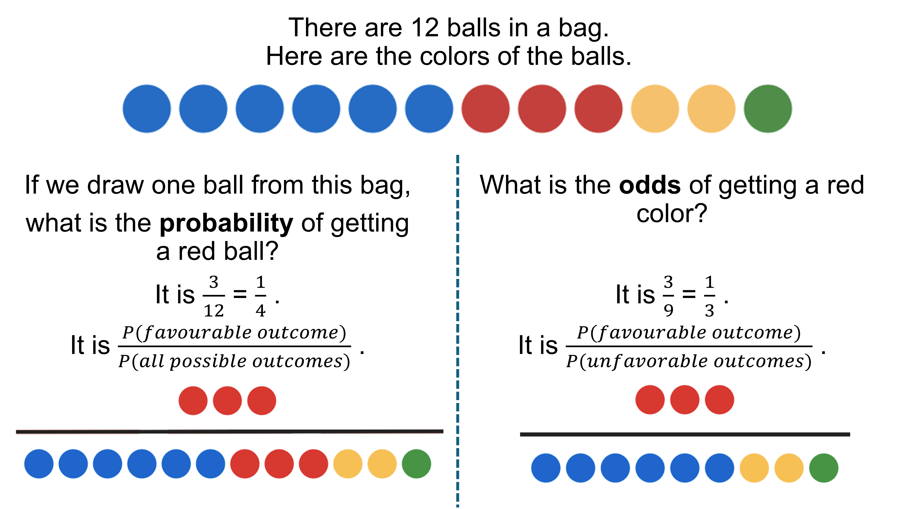
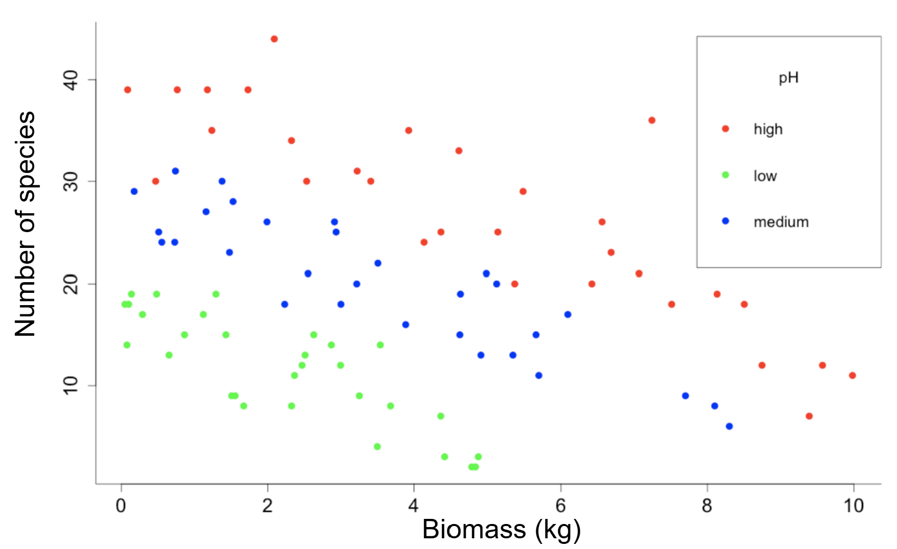

# Regression {#10regression}

**Duration:** 4-hour lecture

## Learning outcomes

Students should be able to:

1.   Give some examples of types of regression analyses
2.   Identify if data are suitable for regression analysis
3.   Determine the steps for doing regression analysis
4.   Determine link functions to be used for different data types
5.   Identify the problems with fitting generalized linear models and adjust the models

## Introduction

Regression analysis is a fundamental statistical technique used to explore and model the relationship between variables. The primary goal is to determine how one or more explanatory (independent) variables influence a response (dependent) variable. Beyond identifying relationships, regression models are widely applied for making predictions.

For regression analysis, both response and explanatory variables are *continuous*. It allows researchers to:

1.  Quantify the strength and form of the relationship between variables.
2.  Estimate parameters that describe this relationship.
3.  Use the model for prediction.

We will explore different types of regression models, with emphasis on linear and non-linear regression. At its core, a regression model expresses the response variable, $Y$, as a function of one or more explanatory variables $X$, plus an error term. Here is an example of equation for multiple linear regression when there is more than one explanatory variable.

$$Y = a + b_1 X_1 + b_2 X_2 + \cdots + b_k X_k + \varepsilon$$

Where:

-   $\varepsilon$ = random error that cannot be explained by the model
-   $a$, $b$ = parameter estimate

## Different types of regression

There is not a single fixed number of regression types, but statisticians usually group them into several major categories depending on data structure, assumptions, the form of the relationship, and the research question. In this teaching material, four types of regression are represented.

### Linear regression

Linear regression is the simplest and most common approach, where the relationship between explanatory and response variables is assumed to follow a straight line. Some subtypes of linear regression are:

-   **Simple linear regression** -- there is one explanatory variable
-   **Multiple linear regression** -- there are two or more explanatory variables
-   **Polynomial** - this is considered a linear model, even though the curve it produces is not a straight line. For example, below the relationship between $X$ and $Y$ is not linear in shape but each parameter enters the equation in a linear way.

$$Y = a + b_1 X + b_2 X^2 + \varepsilon$$

-   **Piecewise regression** -- it fits separate linear models to different ranges of data, allowing researchers to capture relationships that change at certain thresholds or breakpoints.
-   **Robust regression** - This is useful when a dataset contains outliers or influential points. Robust regression reduces the impact of extreme values, producing more reliable estimates in the presence of noisy or imperfect data.

### Non-linear regression

Non-linear regression is used when the relationship between explanatory and response variables cannot be adequately described by a straight line. Instead of assuming linearity, the model specifies a non-linear function, such as exponential, logarithmic, or logistic forms.

### Generalized linear regression or generalized linear models (GLMs)

This extends the framework of linear regression to situations where the response variable does not follow a normal distribution. GLMs allow for different types of response distributions (e.g., binomial for binary outcomes, Poisson for count data).

### Other approaches such as nonparametric regression

The nonparametric regression does not assume a specific functional form. It is flexible but less interpretable.

In this course, the focus will be on simple linear regression, non-linear regression and GLMs.

## Linear regression

The simplest form of regression is linear regression, where the relationship between $Y$ and $X$ is assumed to be linear. For a simple linear regression (a single explanatory variable), the model is:

$$Y = a + bX + \varepsilon$$

Where:

-   $Y$ is the response variable
-   $X$ is the explanatory variable
-   $a$ is the intercept (value of $Y$ when $X = 0$)
-   $b$ is the slope (change in $Y$ for a one-unit change in $X$)
-   $\varepsilon$ is the random error term

### Assumptions of linear regression

For the linear regression model to be valid, several assumptions must be met. Violations of these assumptions can lead to biased estimates or invalid conclusions.

1.  **Linearity** - The relationship between explanatory variables and the response is linear.
2.  **Independence** - Observations are independent of one another.
3.  **Homoscedasticity** - Errors have constant variance ($\sigma^2$).
4.  **Normality** - Errors are normally distributed with mean zero.
5.  **No errors in X**
6.  **No missing value**

### Example: examine the relationship between ground vs aerial based seedling-height survey

@changsalak2022 compared software tools to help with seedling measurement in a restoration project. They aimed to compare the seedling height from ground measurement with the seedling height from 3D models of aerial photographs. The $Y$ was seedling height of the models, and the $X$ was height from the ground measurement (ground truth data) (Figure \@ref(fig:fig-seedling-height)).

**Biological hypothesis**: The researchers expected that if the aerial photography is a good estimate of seedling height, the slope coefficient should be close to 1 and the $R^2$ should be close to 1.

```{r fig-seedling-height, echo=FALSE, fig.cap="Plotting seedling height from ground measurements against the height derived from the 3D model of aerial photography (Figure is modified from [@changsalak2022])", out.width="80%"}

# Load required library
library(ggplot2)

# Create sample data (approximating the plot)
# You should replace this with your actual data
ground_Height <- c(0.3, 0.5, 0.6, 0.7, 0.75, 0.8, 0.85, 1.0, 1.05, 1.1, 1.15, 1.2, 1.3, 1.6, 1.9)
Dronedeploy_Height <- c(0.28, 0.52, 0.72, 0.62, 0.8, 0.72, 0.65, 1.15, 0.9, 1.15, 1.28, 1.1, 1.05, 1.6, 1.6)

# Create a data frame
data <- data.frame(ground_Height, Dronedeploy_Height)

# Fit linear regression through the origin (intercept = 0)
model <- lm(Dronedeploy_Height ~ 0 + ground_Height, data = data)

# Get the slope
slope <- coef(model)[1]

# Calculate fitted values and residuals
data$fitted <- predict(model, data)
data$residuals <- data$Dronedeploy_Height - data$fitted

# Calculate fitted values and residuals
data$fitted <- predict(model, data)
data$residuals <- data$Dronedeploy_Height - data$fitted

# Get R-squared value
r_squared <- summary(model)$r.squared

# Create equation text
equation_text <- paste0("y = ", round(slope, 2), "x")
r2_text <- paste0("R² = ", round(r_squared, 3))

# Create the plot
ggplot(data, aes(x = ground_Height, y = Dronedeploy_Height)) +
  
  # Add points on top
  geom_point(color = "#3182bd", size = 4, alpha = 0.8) +
  
  labs(x = "\nGround truth height (m)",
       y = "Height derived from Dronedeploy (m)\n") +
  theme_minimal() +
  theme(
    plot.title = element_text(size = 16, face = "bold", hjust = 0),
    axis.title = element_text(size = 12),
    axis.text = element_text(size = 10),
    panel.grid.major = element_line(color = "gray90"),
    panel.grid.minor = element_line(color = "gray95"),
    panel.background = element_rect(fill = "gray98", color = NA),
    plot.background = element_rect(fill = "gray98", color = NA)
  ) +
  scale_x_continuous(limits = c(0, 2.1), breaks = seq(0, 2, 0.5)) +
  scale_y_continuous(limits = c(0, 2.1), breaks = seq(0, 2, 0.5)) +
  coord_fixed(ratio = 1)  # Equal aspect ratio

# Alternative: to save the plot
# ggsave("dronedeploy_regression.png", width = 8, height = 6, dpi = 300)
```

Linear regression attempts to fit a straight line through a cloud of data points. Many lines are generated through the data points. Each line has its own intercept and slope coefficient estimates. The best-fitting line (black line in Figure \@ref(fig:fig-residuals)) is the line that minimizes the sum of squared differences between observed values and predicted values (least squares method).

It is important to see that there are residuals (errors) between the actual data points and the fitted line (Figure \@ref(fig:fig-residuals)). The residual means the vertical distance between observed points and the fitted line.

```{r fig-residuals, echo=FALSE, fig.cap="Residuals of the regression line. Residuals provide a measure of model accuracy. If residuals are large or show patterns, the linear model may be inappropriate. (Figure is modified from [@changsalak2022])", out.width="80%"}
# Create the plot
ggplot(data, aes(x = ground_Height, y = Dronedeploy_Height)) +
  # Add red residual lines first
  geom_segment(aes(x = ground_Height, y = Dronedeploy_Height,
                   xend = ground_Height, yend = fitted),
               color = "red", linewidth = 0.5, alpha = 0.7) +
  # Add regression line
  geom_abline(intercept = 0, slope = slope, 
              color = "#2c3e50", linewidth = 0.8) +
  # Add points on top
  geom_point(color = "#3182bd", size = 4, alpha = 0.8) +
  # Add equation and R-squared text
  annotate("text", x = 0.3, y = 1.9, 
           label = equation_text, 
           hjust = 0, size = 4.5, fontface = "bold") +
  annotate("text", x = 0.3, y = 1.75, 
           label = r2_text, 
           hjust = 0, size = 4.5, fontface = "bold") +
  labs(x = "\nGround truth height (m)",
       y = "Height derived from Dronedeploy (m)\n") +
  theme_minimal() +
  theme(
    plot.title = element_text(size = 16, face = "bold", hjust = 0),
    axis.title = element_text(size = 12),
    axis.text = element_text(size = 10),
    panel.grid.major = element_line(color = "gray90"),
    panel.grid.minor = element_line(color = "gray95"),
    panel.background = element_rect(fill = "gray98", color = NA),
    plot.background = element_rect(fill = "gray98", color = NA)
  ) +
  scale_x_continuous(limits = c(0, 2.1), breaks = seq(0, 2, 0.5)) +
  scale_y_continuous(limits = c(0, 2.1), breaks = seq(0, 2, 0.5)) +
  coord_fixed(ratio = 1)  # Equal aspect ratio

# Print regression statistics
cat("Regression through the origin:\n")
cat("Slope:", round(slope, 3), "\n")
cat("R-squared:", round(summary(model)$r.squared, 3), "\n")

```

By plotting ground height against height derived from one of the models, we observe a positive linear trend. After using linear regression, the linear equation ($n = 15$) is $Y = 0.94X$ and the $R^2 = 0.98$. It seems like the height from 3D model can be used to estimate the height of seedlings well.

## Non-linear regression

Scatter plots are a good way to visualize the relationship between $X$ and $Y$ variables. a non-linear regression can be used, if the pattern of points in space are not fit with a straight line. In addition, we may have a mechanistic model for the relationships and we would like to estimate the parameters of the non-linear equation.

## Generalized Linear Regression or Generalized Linear Models (GLMs)

Generalized linear models extend traditional linear regression to accommodate response variables that follow non-normal distributions from the exponential family. This framework is particularly valuable when working with count data, binary outcomes, or proportions where the assumptions of ordinary least squares regression are violated. For example, - Poisson distributions require that the rate parameter λ be positive. - Binomial distributions constrain the probability parameter θ to lie between 0 and 1---restrictions that linear functions cannot safely maintain without transformation.

The fundamental structure of a GLM involves three key components: 1. A probability distribution from the exponential family for the response variable 2. A linear predictor combining the explanatory variables 3. A link function that connects the expected value of the response to the linear predictor.

Unlike traditional linear models, GLMs do not require errors to be normally distributed, though they must be independent. Parameter estimation relies on maximum likelihood estimation (MLE) rather than ordinary least squares. The choice of distribution and link function depends on the type of response variable (Table \@ref(tab:link-function)):

| Distribution of response variable (y) | Link function | Model name           | Explanatory variables (x) |
|-------------------|------------------|------------------|------------------|
| Normal (Continuous data)              | Identity      | Linear regression    | Continuous                |
| Binomial (Binary data)                | Logit         | Logistic regression  | Mixed                     |
| Binomial (Binary data)                | Logit         | Logit model          | Categorical               |
| Poisson (Count data)                  | Log           | Loglinear regression | Categorical               |
| Poisson (Count data)                  | Log           | Poisson regression   | Mixed                     |

: (\#tab:link-function) Link functions of different types of response variables and explanatory variables

### Understanding Probability and Odds

It is essential to understand the distinction between probability and odds (Figure \@ref(fig:odds)), concepts that form the foundation of logistic regression. Probability represents the likelihood of an event occurring, expressed as a value between 0 and 1. For example, if drawing balls from a bag, the probability of selecting a red ball equals the number of red balls divided by the total number of balls. Odds, in contrast, represent the ratio of the probability of success to the probability of failure---in other words, the ratio of favorable outcomes to unfavorable outcomes. While probability answers "how likely is this event," odds answer "how many times more likely is success than failure."

```{r odds, echo = FALSE, fig.cap="Probabiliy vs odds", out.width="100%"}
# Placeholder for Figure


```

The relationship between probability and odds becomes particularly important in logistic regression. If the probability of success is denoted as $p$, then the probability of failure is $1-p$, and the odds ratio equals $\frac{p}{(1-p)}$. This formulation allows us to transform probabilities, which are bounded between 0 and 1, into odds that range from 0 to infinity. The logit link function takes this one step further by applying the natural logarithm to the odds, creating the log-odds or logit: $ln(\frac{p}{(1-p)})$. This transformation produces values ranging from negative to positive infinity, which can then be modeled as a linear function of explanatory variables. When we exponentiate the logit function, we recover the probability through the equation $p = \frac{1}{(1 + e^{-βx})}$, creating the characteristic S-shaped curve of logistic regression.

### Logistic Regression for Binary Data

Logistic regression is the most commonly used GLM for analyzing binary response variables---data with only two possible outcomes such as dead/alive, presence/absence, or success/failure. These outcomes are typically coded as 0 and 1, with the model estimating the probability that the response equals 1 given specific values of the explanatory variables. The binomial distribution with n=1 (known as the Bernoulli distribution) provides the probability framework, while the logit link function ensures that predicted probabilities remain within the valid range of 0 to 1 regardless of the values of the predictors. Explanatory variables in logistic regression can be continuous, categorical, or a mixture of both, providing considerable flexibility in modeling real-world phenomena.

##### Example: bird breeding patterns on islands (@crawley2012)

Consider an ecological example examining bird breeding patterns on islands (Figure \@ref(fig:isolation-data)). The response variable is binary (incidence: breeding (1) or not breeding (0)), while explanatory variables include island area ($km^2$: continuous) and isolation distance from the mainland ($km$: continuous).

```{r isolation-data, echo=FALSE, eval=TRUE, fig.cap="The example of top rows of the breeding dataset with three variables", message=FALSE, warning=FALSE}
if(!require("gridExtra", character.only = TRUE)) {
  install.packages("gridExtra", dependencies = TRUE)
  library("gridExtra", character.only = TRUE)
}
if(!require("grid", character.only = TRUE)) {
  install.packages("grid", dependencies = TRUE)
  library("grid", character.only = TRUE)
}

breed.data <- read.table("data/isolation.txt", header = T)
rownames(breed.data) <- NULL
# Capture printed output into a grob

tbl <- tableGrob(head(breed.data), rows = NULL)

grid::grid.draw(tbl)
```

In R, we fit this model using the `glm()` function with `family = "binomial"`. The model takes the form $ln(p/(1-p)) = β₀ + β₁(area) + β₂(isolation)$, where the coefficients represent the change in log-odds for each unit increase in the predictor (Figure \@ref(fig:glm-isolation)).

```{r glm-isolation, echo=FALSE, eval=TRUE, fig.cap="The output of the logistic regression with bird breeding data"}

model <- glm(incidence ~ area + isolation, family = "binomial", data = breed.data)

summary_text <- capture.output(summary(model))

summary_df <- data.frame(Output = summary_text, stringsAsFactors = FALSE)

# Display the table
grid.table(summary_df, rows = NULL)

```

Interpreting these coefficients (Figure \@ref(fig:glm-isolation)) requires exponentiation: $exp(β)$ gives the multiplicative change in odds for a one-unit increase in the corresponding variable. For instance, if the coefficient for `area` is 0.5807, then $exp(0.5807) = 1.78$, meaning that each additional unit of island area increases the odds of bird breeding by 78%. Similarly, a negative coefficient for `isolation` of -1.3719 yields $exp(-1.3719) = 0.25$, indicating that each unit increase in isolation distance reduces the odds of breeding to 25% of their previous value.

### Poisson Regression for Count Data

When the response variable consists of counts---such as the number of species in ecological plots, the number of defects in manufacturing, or the number of events occurring in a fixed time period---Poisson regression provides an appropriate modeling framework.

Count data are non-negative integers that often exhibit variance proportional to their mean, a characteristic feature of the Poisson distribution. The log link function, which takes the natural logarithm of the expected count, ensures that predicted values remain positive while allowing the linear predictor to range over all real numbers. This transformation means we model $ln(E[Y]) = β₀ + β₁X₁ + β₂X₂ + ...$, which implies that $E[Y] = exp(β₀ + β₁X₁ + β₂X₂ + ...)$.

#### Example: species richness in the plot (@crawley2012)

We are studying plant species richness in plots with varying biomass levels and soil pH categories (high, mid, low). The response variable is the count of species, biomass is a continuous explanatory variable, and pH is categorical with three levels (Figure \@ref(fig:fig-poisson)).

```{r fig-poisson, echo = FALSE, fig.cap ="The number of plant species influenced by plots' biomass and soil pH", out.width="100%"}
# Placeholder for Figure


```

We fit this model in R using `glm(Species ~ Biomass * pH, family = "poisson")` to allow for interaction effects, or `glm(Species ~ Biomass + pH, family = "poisson")` for additive effects only.

Model selection can be performed using analysis of deviance, which compares nested models through a chi-squared test. The deviance measures the distance between two probabilistic models, with the difference in deviance between models following a chi-squared distribution with degrees of freedom equal to the difference in the number of parameters. Coefficients in Poisson regression are interpreted on the log scale, so $exp(β)$ represents the multiplicative change in the expected count for each unit increase in the predictor.

### Model Diagnostics and Overdispersion

Proper model checking is crucial for ensuring that GLM assumptions are met and that the model provides reliable inferences. One fundamental assumption is homoscedasticity---constant variance of errors across fitted values. Plotting residuals against fitted values helps diagnose violations of this assumption, with patterns or systematic trends indicating potential problems (Figure \@ref(fig:fig-residuals)).

Additionally, GLMs assume that the variance of the response follows what is specified by the chosen distribution family: for binomial data, variance should equal $np(1-p)$, and for Poisson data, variance should equal the mean. When observed variance exceeds what the model predicts, we encounter overdispersion, a common problem that leads to underestimated standard errors and overly optimistic significance tests.

Overdispersion can be detected by examining the ratio of residual deviance to residual degrees of freedom in the model output. For a well-fitting model, this ratio should be approximately 1. Values substantially greater than 1 indicate overdispersion, which can arise from several sources:

1.  individual-level variability in experimental material, correlation between responses (such as when sampling units come from related individuals)
2.  cluster sampling effects e.g. areas; schools; classes; children
3.  excess zero counts in the data.

For the bird breeding example (Figure \@ref(fig:glm-isolation)), a residual deviance of 28.402 on 47 degrees of freedom yields a ratio of 0.60, suggesting adequate model fit. However, if this ratio exceeded 1.5 or 2, we would need to address overdispersion. The solution involves using quasi-likelihood methods by specifying `family = "quasibinomial"` for binary data or `family = "quasipoisson"` for count data. These families estimate a dispersion parameter from the data rather than fixing it at 1, providing more realistic standard errors and preserving the validity of hypothesis tests even when the strict distributional assumptions are not met.

## Exercise: Lesson 10 Regression

1.  Give three names of types of regression analyses

2.  What are the assumptions of a linear regression?

3.  Is this data set suitable for regression analysis?

| Independent variable                  | Dependent variable                              | Answer |
|---------------------------|--------------------------|-------------------|
| Different plant species               | Leaf color                                      |        |
| Leaf length (mm)                      | Leaf thickness (mm)                             |        |
| Smoke or not                          | Life span (years)                               |        |
| Amount of heavy metal (mg/kg) in soil | Amount of heavy metal in tissue of bats (mg/kg) |        |

4.  Determine the steps for doing regression analysis

5.  Determine link functions to be used for different data types

| Response variables | Link function |
|--------------------|---------------|
| Proportion         |               |
| Continuous         |               |
| Binary             |               |
| Count              |               |

6.  What is overdispersion? Why is it a problem when fitting generalized linear models? What to do if you encounter overdispersion?

---
