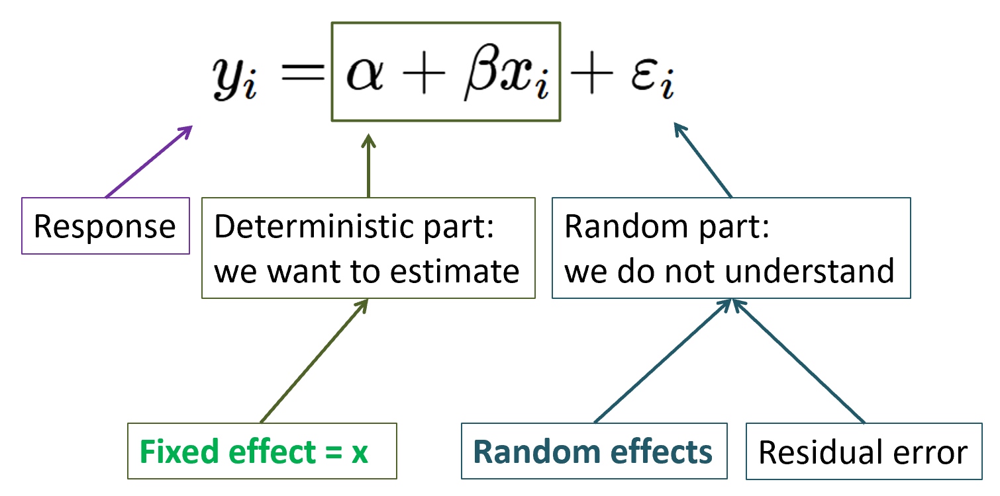
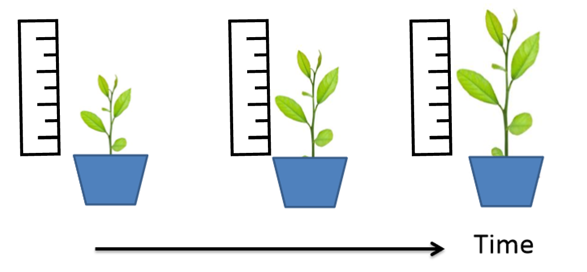

# Mixed Effects Models {#12mixed-effect}

**Duration:** 2-hour lecture

## Learning Outcomes

Students should be able to:

-   Describe the difference between fixed and random effects
-   Describe replication versus pseudoreplication
-   Validate mixed effects model outputs

## Introduction

In many ecological and biological studies, data are collected from multiple levels of organisation --- for example, repeated measurements from the same individual, samples nested within sites, or plants grouped within plots. In these cases, standard linear regression and ANOVA assume that all observations are independent, an assumption that is often violated.

**Mixed effects models** (also called multilevel models or hierarchical models) address this by separating the sources of variation in the data into two types of effects [@Zuur2009]:

1.  **Fixed effects**: the explanatory variables of primary interest (e.g., treatment, species)
2.  **Random effects**: grouping variables that account for the non-independence of observations (e.g., individual, site, block)

Recall the general form of a linear regression (Figure \@ref(fig:effects-chart)) :

The **fixed effects** represent the deterministic part of the model --- the effects we want to estimate. The **random effects** and **residual error** together represent the stochastic (random) part (Figure \@ref(fig:effects-chart)).

```{r effects-chart, echo=FALSE, message=FALSE, warning=FALSE, fig.cap= "The sources of variation in a linear model", results='asis', fig.align='center'}

```

## Fixed Effects vs. Random Effects

Understanding the conceptual distinction between fixed and random effects is essential before fitting mixed effects models (Table \@ref(tab:effects-table)).

```{r effects-table, echo=FALSE, message=FALSE, warning=FALSE, results='asis'}
if(!require("knitr", character.only = TRUE)) {
  install.packages("knitr", dependencies = TRUE)}
if(!require("kableExtra", character.only = TRUE)) {
  install.packages("kableExtra", dependencies = TRUE)}
if(!require("ggplot2", character.only = TRUE)) {
  install.packages("ggplot2", dependencies = TRUE)}

library(ggplot2)
library(knitr)
library(kableExtra)

effects_df <- data.frame(
  Feature = c("Influence on response", "Goal of estimation",
              "Repeatability", "Variable type"),
  Fixed = c("Influences the mean", "Estimate the effect directly",
            "Repeatable levels (can be replicated)", "Categorical or continuous"),
  Random = c("Influences the variance", "Rarely the main interest; accounts for structure",
             "Non-repeatable (random sample of levels)", "Categorical only")
)

kbl(effects_df,
    col.names = c("Feature", "Fixed Effects", "Random Effects"),
    caption = "Comparison of fixed and random effects in mixed models") %>%
  kable_styling(full_width = TRUE, bootstrap_options = "striped") %>%
  column_spec(1, bold = TRUE)
```

### Examples of Fixed and Random Effects

Table \@ref(tab:examples-table) gives some common examples from studies in ecology and biology.

```{r examples-table, echo=FALSE, message=FALSE, warning=FALSE, results='asis'}
examples_df <- data.frame(
  Fixed = c("Predation exclusion treatment in tree canopies",
            "Nutrient addition treatment",
            "Drug treatment"),
  Random = c("Tree (the unit receiving the treatment)",
             "Block within a field",
             "Individual patient receiving the drug")
)

kbl(examples_df,
    col.names = c("Fixed Effects", "Random Effects"),
    caption = "Examples of fixed and random effects in ecological and biological studies") %>%
  kable_styling(full_width = TRUE, bootstrap_options = "striped")
```

## Replication and Pseudoreplication

Before fitting any model, it is important to correctly identify your **experimental unit** or **sample unit** --- the smallest unit that independently received the treatment (Lesson 2 section \@ref(replication)).

**Pseudoreplication** occurs when observations that are not truly independent are treated as independent replicates. There are two common forms:

1.  **Spatial pseudoreplication** arises when multiple measurements are taken from the same vicinity (Figure \@ref(fig:spatial-rep)) --- for example, measuring several leaves from the same plant, or several plants in the same pot. Each leaf or plant is not an independent replicate; the pot or plant is.

```{r spatial-rep, echo=FALSE, message=FALSE, warning=FALSE, results='asis', fig.cap="Measurements of three leaves per plant are not independent.", fig.align='center'}

```

2.  **Temporal pseudoreplication** arises when data are collected from the same sampling unit on successive occasions. Because they share the same history, repeated measurements from the same individual are not independent. These are sometimes called repeated measures (Figure \@ref(fig:temporal-rep)).

```{r temporal-rep, echo=FALSE, message=FALSE, warning=FALSE, results='asis', fig.cap="Measurements of plant size through time. The measurements are not independent.", fig.align='center'}

```

Mixed effects models provide an elegant solution to both forms of pseudoreplication: the grouping unit (the plant, pot, individual, or site) is included as a **random effect**, which accounts for the correlation among observations within the same group.

## Structure of Random Effects

Random effects can be specified in three ways depending on whether they influence the intercept, the slope, or both (Figure \@ref(fig:random-effects-diagram)).

```{r random-effects-diagram, echo=FALSE, fig.cap="Schematic of three types of random effect structures. Left: random intercepts only (parallel lines); Centre: random slopes only (lines pivot around a common intercept); Right: random intercepts and slopes (lines differ in both position and steepness).", fig.height=4, message=FALSE, warning=FALSE, fig.align='center'}
library(ggplot2)
library(patchwork)

set.seed(42)
groups <- LETTERS[1:5]
x_vals <- seq(0, 3, length.out = 30)

# Random intercepts
df_ri <- do.call(rbind, lapply(groups, function(g) {
  intercept <- rnorm(1, 5, 1.5)
  data.frame(x = x_vals, y = intercept + 1.5 * x_vals + rnorm(30, 0, 0.3), group = g)
}))

# Random slopes
df_rs <- do.call(rbind, lapply(groups, function(g) {
  slope <- rnorm(1, 1.5, 0.8)
  data.frame(x = x_vals, y = 5 + slope * x_vals + rnorm(30, 0, 0.3), group = g)
}))

# Random intercepts and slopes
df_ris <- do.call(rbind, lapply(groups, function(g) {
  intercept <- rnorm(1, 5, 1.5)
  slope <- rnorm(1, 1.5, 0.8)
  data.frame(x = x_vals, y = intercept + slope * x_vals + rnorm(30, 0, 0.3), group = g)
}))

p1 <- ggplot(df_ri, aes(x, y, colour = group, linetype = group)) +
  geom_smooth(method = "lm", se = FALSE, linewidth = 1) +
  labs(title = "A. Random Intercepts", x = "Explanatory variable", y = "Response") +
  theme_classic() + theme(legend.position = "none",
                     plot.title = element_text(size = 14, face = "bold"),
                     axis.text = element_text(size = 14),
                     axis.title = element_text(size = 14))

p2 <- ggplot(df_rs, aes(x, y, colour = group, linetype = group)) +
  geom_smooth(method = "lm", se = FALSE, linewidth = 1) +
  labs(title = "B. Random Slopes", x = "Explanatory variable", y = NULL) +
  theme_classic() + theme(legend.position = "none",
                     plot.title = element_text(size = 14, face = "bold"),
                     axis.text = element_text(size = 14),
                     axis.title = element_text(size = 14))

p3 <- ggplot(df_ris, aes(x, y, colour = group, linetype = group)) +
  geom_smooth(method = "lm", se = FALSE, linewidth = 1) +
  labs(title = "C. Random Intercepts & Slopes", x = "Explanatory variable", y = NULL) +
  theme_classic() + theme(legend.position = "none",
                     plot.title = element_text(size = 14, face = "bold"),
                     axis.text = element_text(size = 14),
                     axis.title = element_text(size = 14))

p1 + p2 + p3
```

```{r syntax-table, echo=FALSE, message=FALSE, warning=FALSE, results='asis', include=FALSE}

### R Syntax for Random Effects (This section is not in the actual material)

#In R (using the `lme4` package), random #effects are specified inside parentheses in #the model formula (Table #\@ref(tab:syntax-table)).

syntax_df <- data.frame(
  Type = c("Random intercepts only",
           "Random slopes only (no random intercept)",
           "Random intercepts and slopes"),
  Formula = c("`(1 | random)`",
              "`(0 + fixed | random)`",
              "`(1 + fixed | random)`"),
  Meaning = c("Each group gets its own intercept; slopes are shared",
              "Each group gets its own slope; intercept is shared",
              "Each group gets its own intercept and its own slope")
)

kbl(syntax_df,
    col.names = c("Type", "R syntax", "Interpretation"),
    caption = "R syntax for specifying random effects in lme4") %>%
  kable_styling(full_width = TRUE, bootstrap_options = "striped") %>%
  column_spec(1, bold = TRUE)
```

## Advantages of Mixed Effects Models

Mixed effects models are more flexible than standard ANOVA because they:

-   Can be used on data that violate some ANOVA assumptions (e.g., independence of observations)
-   Can handle **unbalanced designs** (unequal sample sizes per group)
-   Can include many kinds of explanatory variables --- continuous and categorical
-   Properly account for the **hierarchical or nested structure** in ecological data (Lesson \@ref(nested-design-section))
-   Can be extended to non-normal response variables using **Generalized Linear Mixed Effects Models (GLMMs)**

## Example: Nursery Propagation Systems and Tree Performance [@Chaiklang2025]

### Background

Chaiklang et al. (2025) conducted an experiment testing whether growing tropical tree saplings in bottle crates --- a simple, low-cost modification to standard polybag nursery practice --- improved their performance after planting out on a degraded restoration site in Krabi Province, southern Thailand.

The experiment used five framework tree species (*Saraca indica*, *Sandoricum koetjape*, *Cleistocalyx operculatus*, *Lepisanthes rubiginosa*, and *Garcinia hombroniana*) and compared three nursery production systems:

1.  **CON** (control): polybags standing directly on the ground
2.  **COB**: polybags in crates raised on wire benches
3.  **COG**: polybags in crates placed on the ground

Crating was hypothesised to promote **air root-pruning**, stimulating better root development and improving field performance. The experiment used a **randomised complete block design (RCBD)** with three replicates (blocks) per species (Figure \@ref(fig:root-exp)). There were several response variables. Here root length data are used as an example for the mixed model analysis (Table \@ref(tab:chaiklang-summary)).

```{r root-exp, echo=FALSE, message=FALSE, warning=FALSE, results='asis', fig.cap=" The experiment set-up by Chaiklang et al. 2025. The experiment was a randomized complete-block design with 3 replicates (R1, R2 and R3)", fig.align='center'}
knitr::include_graphics("figures/12_4_root_exp.png")
```

### Why a Mixed Effects Model?

The key analysis question was: *Does treatment (CON, COB, COG) affect sapling growth (e.g., root length)?*

However, the data have a hierarchical structure:

-   Multiple saplings were observed per replicate block
-   Species and treatments were crossed
-   The replicate block is not a treatment of interest. It is a nuisance variable capturing spatial variation in the nursery

**Treatment** and **Species** are therefore **fixed effects**; **Replicate** (block location in the nursery) is a **random effect**. The general model structure used by Chaiklang et al. (2025) was:

$$\text{Response} \sim \text{Treatment} + \text{Species} + \\ \text{Treatment} \times \text{Species} + (1 \mid \text{Replicate})$$

```{r setup-data-mixed, echo=FALSE, message=FALSE, warning=FALSE, results='hide'}
# Install and load required packages
if (!require("lme4"))     install.packages("lme4",     dependencies = TRUE)
if (!require("lmerTest")) install.packages("lmerTest", dependencies = TRUE)
if (!require("emmeans"))  install.packages("emmeans",  dependencies = TRUE)
if (!require("ggplot2"))  install.packages("ggplot2",  dependencies = TRUE)
if (!require("dplyr"))    install.packages("dplyr",    dependencies = TRUE)
if (!require("knitr"))    install.packages("knitr",    dependencies = TRUE)
if (!require("kableExtra")) install.packages("kableExtra", dependencies = TRUE)
if (!require("ggpattern")) install.packages("ggpattern", dependencies = TRUE)
if(!require("MuMIn")) install.packages("MuMIn", dependencies = TRUE)
if(!require("sfsmisc", character.only = TRUE)) {
  install.packages("sfsmisc", dependencies = TRUE)}
if(!require("formatdown", character.only = TRUE)) {
  install.packages("formatdown", dependencies = TRUE)}

library(lme4)
library(lmerTest)
library(emmeans)
library(ggplot2)
library(dplyr)
library(knitr)
library(kableExtra)
library(ggpattern)
library(MuMIn)
library(sfsmisc)
library(formatdown)

# actual data based on Chaiklang et al. (2025) reported means for root length
# 
set.seed(213708)

chaiklang_data <- read.csv("data/root_data_chaiklang.csv", header = T)
chaiklang_data$Treatment <- factor(chaiklang_data$Treatment,
                                   levels = c("CON", "COB", "COG"))
chaiklang_data$Species   <- factor(chaiklang_data$Species,
                                   levels = c("C.operculatus", "G.hombroniana",
                   "L.rubiginosa",  "S.indica", "S.koetjape"))

head(chaiklang_data, 12)
unique(chaiklang_data$Species)
```

### Visualizing the Data

It is always a good practice to explore the data before fitting a model. A boxplot separated by treatment and species reveals the overall patterns (Figure \@ref(fig:chaiklang-boxplot)).

```{r chaiklang-boxplot, fig.height=5, fig.cap="Root length (cm) of five framework tree species under three nursery production systems. CON = polybags on ground (control); COB = crates on wire benches; COG = crates on ground. Points represent individual sapling measurements.", echo=FALSE, fig.align='center', message=FALSE, warning=FALSE}
ggplot(chaiklang_data,
       aes(x = Treatment, y = Rootlength, fill = Treatment)) +
  geom_boxplot_pattern(aes(pattern = Treatment), alpha = 0.6, outlier.shape = NA,
                       pattern_color = "black",
                       pattern_fill = "white",
                       pattern_density = 0.1) +
  #geom_jitter(width = 0.15, size = 0.8, alpha = 0.4) +
  facet_wrap(~ Species, nrow = 1) +
  #scale_fill_manual(values = c("CON" = "#4575b4",
  #                             "COB" = "#d73027",
  #                             "COG" = "#1a9850")) +
  labs(x = "Treatment",
       y = "Root length (cm)",
       fill = "Treatment") +
  theme_bw() +
  theme(axis.title = element_text(size = 14),
        axis.text.y  = element_text(size = 14),
    axis.text.x  = element_text(angle = 45, hjust = 1, size = 13),
    strip.text   = element_text(face = "italic", size = 13),
    legend.position = "none"
  )
```

A summary table of means and standard errors is also useful before modelling (Table \@ref(tab:chaiklang-summary)).

```{r chaiklang-summary, echo=FALSE, message=FALSE, warning=FALSE, results='asis'}
summary_ch <- chaiklang_data %>%
  group_by(Species, Treatment) %>%
  summarise(
    n    = n(),
    Mean = round(mean(Rootlength), 1),
    SD   = round(sd(Rootlength),   1),
    SE   = round(SD / sqrt(n), 1),
    .groups = "drop"
  )

kbl(summary_ch,
    col.names = c("Species", "Treatment", "n", "Mean root length (cm)",
                  "SD", "SE"),
    caption = "Summary statistics for root length (cm) by species and treatment") %>%
  kable_styling(full_width = TRUE, bootstrap_options = "striped") %>%
  column_spec(1, italic = TRUE)
```

### Fitting the Mixed Effects Model

Following Chaiklang et al. (2025), we fit a **random intercept model** with `Treatment`, `Species`, and their interaction as fixed effects, and `Replicate` as a random effect. We use the `lmerTest` package [@lmerTest2017] which extends `lme4` [@Bates2015] to provide p-values in the summary table. The results from `R` are below (Figure \@ref(fig:show-results-mixed2)).

```{r fit-model, echo=FALSE, message=FALSE, warning=FALSE, results='hide'}
# Fit the mixed effects model
# Fixed effects: Treatment + Species + Treatment:Species interaction
# Random effect: random intercept for Replicate (block)
mixed_model_IntOnly2 <- lmer(Rootlength ~ Treatment * Species + (1|Replicate),
                             REML = TRUE, data = chaiklang_data)

mixed_model_IntSlope2 <- lmer(Rootlength ~ Treatment * Species + 
                          (1 + Species|Replicate),
                          data = chaiklang_data, REML = TRUE)

AICc(mixed_model_IntOnly2, mixed_model_IntSlope2) ### model selection
## The model with random intercept is better.
## Also, no interaction effect.


model_ch <- lmer(Rootlength ~ Treatment * Species + (1 | Replicate),
                 data = chaiklang_data,
                 REML = FALSE)

## this model is for final results
model_final <- lmer(Rootlength ~ Treatment + Species + (1 | Replicate),
                 data = chaiklang_data,
                 REML = FALSE)

```

```{r show-results-mixed, echo=FALSE, eval=TRUE, message=FALSE, warning=FALSE, results='hide'}

if(!require("gridExtra", character.only = TRUE)) {
  install.packages("gridExtra", dependencies = TRUE)
  library("gridExtra", character.only = TRUE)
}
if(!require("grid", character.only = TRUE)) {
  install.packages("grid", dependencies = TRUE)
  library("grid", character.only = TRUE)
}

summary_text_mixed <- capture.output(print(summary(model_ch)))

summary_df_mixed <- data.frame(Output = summary_text_mixed, 
                               stringsAsFactors = FALSE)


# Display the table Use this to make the .png file and save as a figure
#grid.table(summary_df_mixed[1:17,], rows = NULL)
#grid.table(summary_df_mixed[17:36,], rows = NULL)

```

```{r show-results-mixed2, echo=FALSE, message=FALSE, warning=FALSE, fig.cap="The output of the mixed effect model", out.width="80%", fig.align='center'}
knitr::include_graphics("figures/12_7 output_mixed.png")
```

The output shows:

-   **Random effects**: the variance attributed to Replicate (between-block variation) and the residual variance (within-block variation)
-   **Fixed effects**: estimated coefficients for Treatment, Species, and their interaction, along with standard errors and p-values (from the Satterthwaite approximation in `lmerTest`)

### ANOVA Table for Fixed Effects

```{r anova-table-mixed, echo=FALSE, message=FALSE, warning=FALSE, results='asis'}
anova_ch <- anova(model_ch)
anova_final <- anova(model_final)

kbl(round(as.data.frame(anova_ch), 2),
    caption = "ANOVA table (Type III Sums of Squares) for the mixed effects model of root length") %>%
  kable_styling(full_width = FALSE, bootstrap_options = "striped",font_size = 13)
```

There are significant effects of Treatment (the crating treatments increasing root length) and Species (different species grow at different rates). The interaction between the two variables are not significant (Table \@ref(tab:anova-table-mixed)).

After fitting the models, @Chaiklang2025 compared treatments effects on root length separately by species using estimated marginal means (EMMs) with Tukey's HSD correction (See @Chaiklang2025).

```{r posthoc-table-mixed, echo=FALSE, message=FALSE, warning=FALSE, include = FALSE}
# Estimated marginal means for Treatment within each Species
emm_ch <- emmeans(model_final, ~ Treatment | Species)

# Pairwise comparisons with Tukey adjustment
pairs_ch <- pairs(emm_ch, adjust = "tukey")

kbl(as.data.frame(pairs_ch) %>%
      mutate(across(where(is.numeric), ~ round(., 3))),
    caption = "Tukey pairwise comparisons of treatment effects on RGR-H within each species") %>%
  kable_styling(full_width = TRUE, bootstrap_options = "striped") %>%
  scroll_box(height = "350px")
```

```{r emm-plot, fig.height=5, fig.cap="Estimated marginal means (±95% CI) for relative height growth rate (RGR-H) of five framework tree species under three nursery production systems from the mixed effects model.", echo=FALSE, message=FALSE, warning=FALSE, include = FALSE}

### Visualising Estimated Marginal Means

#Figure \@ref(fig:emm-plot) displays the model-estimated means and 95% confidence intervals for each species-treatment combination.

# I didn't use this in the lesson content. This might be useful for practical session
emm_df <- as.data.frame(emm_ch)

ggplot(emm_df, aes(x = Treatment, y = emmean,
                   colour = Treatment, group = Treatment)) +
  geom_point(size = 3) +
  geom_errorbar(aes(ymin = lower.CL, ymax = upper.CL), width = 0.2, linewidth = 0.8) +
  facet_wrap(~ Species, nrow = 1) +
  scale_colour_manual(values = c("CON" = "#4575b4",
                                 "COB" = "#d73027",
                                 "COG" = "#1a9850")) +
  labs(x = "Treatment",
       y = "Mean root length (cm)",
       colour = "Treatment") +
  theme_bw() +
  theme(
    axis.text.x  = element_text(angle = 45, hjust = 1),
    strip.text   = element_text(face = "italic", size = 9),
    legend.position = "bottom"
  )
```

### Model Validation

Before interpreting the model, we must check the residuals. The key assumptions of a linear mixed effects model are:

1.  Residuals are approximately normally distributed
2.  Residuals have roughly constant variance (homoscedasticity)
3.  Random effects are normally distributed

```{r model-validation, fig.height=4, fig.cap="Model diagnostics for the mixed effects model: (A) residuals vs. fitted values (checks homoscedasticity); (B) Q-Q plot of residuals (checks normality).", fig.align='center', echo=FALSE, message=FALSE, warning=FALSE}
par(mfrow = c(1, 2))

# Residuals vs fitted
plot(fitted(model_final), resid(model_final),
     xlab = "Fitted values", ylab = "Residuals",
     main = "(A) Residuals vs Fitted",
     pch = 16, col = "steelblue", cex = 0.6)
abline(h = 0, lty = 2, col = "red")

# Q-Q plot
qqnorm(resid(model_ch), main = "(B) Q-Q Plot of Residuals",
       pch = 16, col = "steelblue", cex = 0.6)
qqline(resid(model_ch), col = "red", lty = 2)

par(mfrow = c(1, 1))
```

No strong patterns in the residual plot; however, there are some outliers. Also, the Q-Q plot indicate that the model assumptions are reasonably satisfied.

### Reporting Results

The following paragraph presents the written report for a mixed effects model.

> A linear mixed effects model (lme4; Bates et al. 2015) was used to assess the effects of nursery production system (CON, COB, COG) and species on the root length of five framework tree species. Treatment and species were included as fixed effects along with their interaction. Replicate (block location in the nursery) was included as a random intercept to account for spatial variability. Significant effects of treatment (F = `r round(anova_final["Treatment","F value"], 2)`, P \< 0.05), species (F = `r round(anova_final["Species","F value"], 2)`, P \< 0.05) were detected. Post-hoc comparisons (Tukey HSD) showed that both crating treatments (COB and COG) significantly increased mean rooth length compared with the control for most species, consistent with the hypothesis that crating promotes air root-pruning and improves post-planting sapling performance.

------------------------------------------------------------------------

## Generalised Linear Mixed Effects Models (GLMMs)

When the response variable does not follow a normal distribution, we use a **Generalised Linear Mixed Effects Model (GLMM)** using the `glmer()` function in `lme4` [@Bates2015]. Common families include:

-   `family = binomial` for proportions or binary data (e.g., survival: alive/dead)
-   `family = poisson` for count data (e.g., number of insects, seedling counts)

For example, to analyse field **survival** (a binary outcome) from the Chaiklang et al. (2025) study:

```{r glmm-example, echo=TRUE, eval=FALSE, include=FALSE}
# Example: GLMM for binary survival data
# (not run — requires actual survival (0/1) data per sapling)
model_surv <- glmer(Survival ~ Treatment + Species + Treatment:Species +
                      (1 | Replicate),
                    data   = field_data,
                    family = binomial)
summary(model_surv)
```

## Practical Recommendations

When running mixed effects models, keep the following in mind:

-   **Standardise continuous explanatory variables** (use `scale()` in R) if they are on very different scales. This improves model convergence and makes coefficients more comparable.
-   **Start with a maximal model** (as many fixed effects as justified by your hypotheses) and use model comparison by AIC to simplify if needed. The model with the **lowest AIC** is generally preferred.
-   **Use REML** (`REML = TRUE`) when comparing models that differ only in their random effects structure. Use **ML** (`REML = FALSE`) when comparing fixed effects via AIC.
-   **Increase iterations** if a model fails to converge, using the `control` argument in `lmer()`.
-   Always **validate the model** by checking residual plots before interpreting results.

## R Packages for Mixed Effects Models

Several R packages are available for fitting mixed effects models (Table \@ref(tab:packages-table)).

```{r packages-table, echo=FALSE, message=FALSE, warning=FALSE, results='asis'}
pkg_df <- data.frame(
  Package = c("lme4", "nlme", "lmerTest", "glmmTMB", "brms"),
  Description = c(
    "Fit linear and generalised linear mixed effects models. The most widely used package for LMMs and GLMMs.",
    "Fit and compare linear and nonlinear mixed effects models. Older but offers more control over variance structures.",
    "Extends lme4 to provide p-values and summary tables for lmer models using the Satterthwaite approximation.",
    "Generalised linear mixed models using Template Model Builder. Handles a wide range of response distributions.",
    "Bayesian regression models using Stan. Suitable for complex hierarchical models."
  ),
  Reference = c("@Bates2015", "@nlme2000",
                "@lmerTest2017", "@glmmTMB2017", "@brms2017")
)

kbl(pkg_df,
    col.names = c("Package", "Description", "Reference"),
    caption = "Commonly used R packages for mixed effects models") %>%
  kable_styling(full_width = TRUE, bootstrap_options = "striped") %>%
  column_spec(1, bold = TRUE, monospace = TRUE)
```

## Exercise

**Scenario For questions 1 and 2**

A researcher measures the diameter growth of trees in a forest restoration experiment. There are four fertilizer treatments applied to plots. Each plot contains 15 trees that are each measured once. The researcher treats all 60 observations as independent replicates in a one-way ANOVA.

1.  Is the researcher's approach correct? Identify the type of pseudoreplication involved and explain why it matters.

2.  How would you redesign the analysis to correctly account for the data structure? Name the fixed and random effects you would include.

**Answer question 3 in the table**

3.  For each situation below, decide whether a **fixed** or **random** effect is more appropriate and justify your answer.

| Variable                                                                        | Fixed or Random? | Justification |
|-------------------|----------------------------|-------------------------|
| Fertilizer treatment (4 specific types tested)                                  |                  |               |
| Individual tree identity (100 trees sampled)                                    |                  |               |
| Forest site (3 sites purposely selected as degraded, medium, good)              |                  |               |
| Year of measurement (random sample of 5 years from a 20-year monitoring series) |                  |               |

4.  After running a mixed effectd model, what should be checked to ensure the reliability of the model?

---
