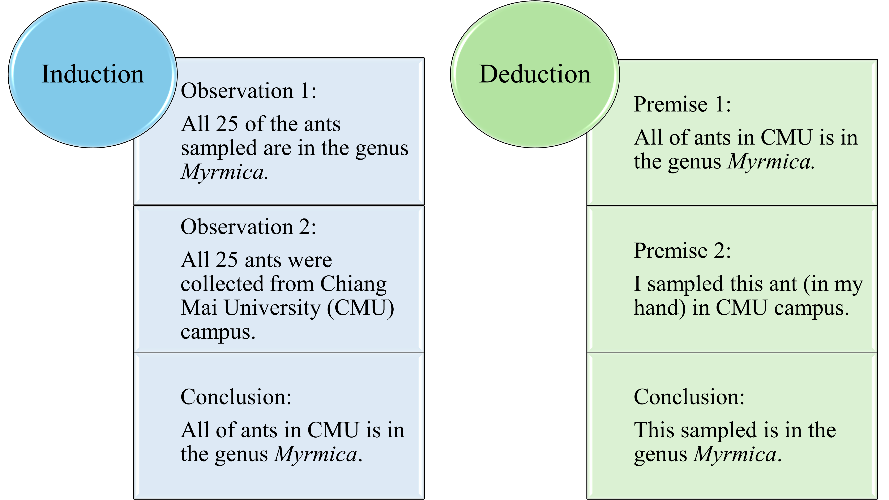
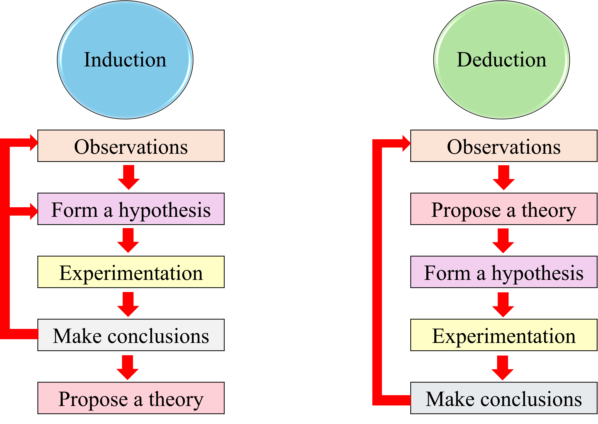
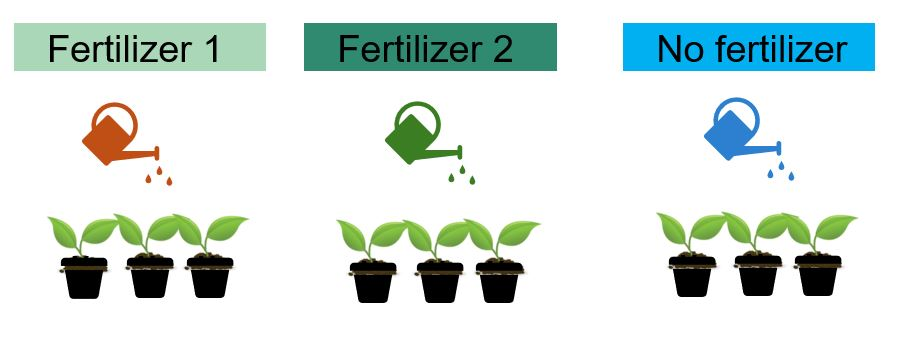
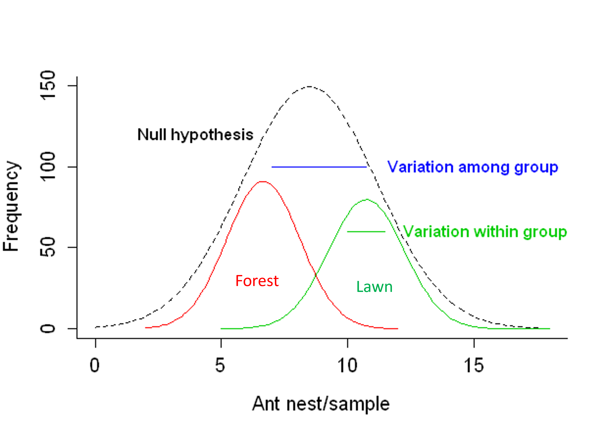
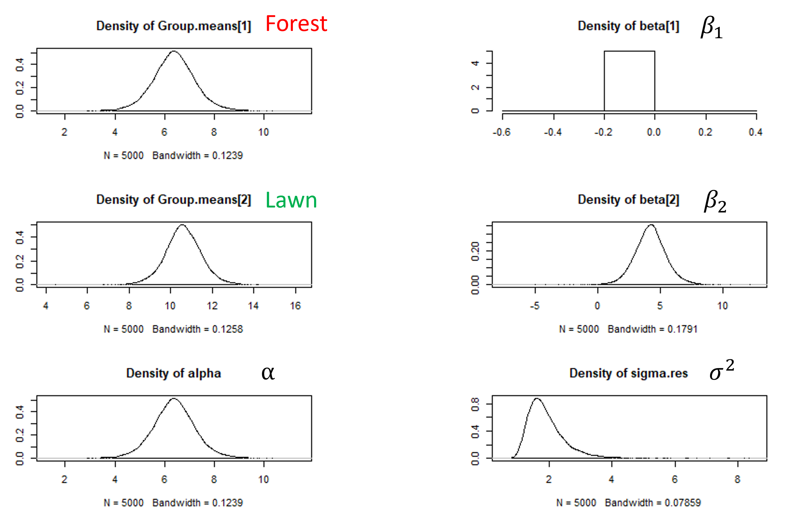

--- 
title: "213708 Teaching materials"
subtitle: "Experimental design and environmental data analysis"
author: "Assistant Professor Dr. Pimonrat Tiansawat"
date: "`r Sys.Date()`"
site: bookdown::bookdown_site
output: bookdown::pdf_book
documentclass: book
bibliography: [book.bib, packages.bib]
biblio-style: apalike
link-citations: yes

description: "This is material for lectures."
---

# Preface {-}

These teaching materials are for the course "Experimental design and environmental data analysis" (Course code 213708), taught by the author. The materials are designed for graduate students across multiple curricula. The teaching materials are divided into thirteen lessons, totaling thirty lecture hours. 

The lessons include :-

1. Scientific methods, role of experimental design, and statistics in ecological and environmental studies, 
2. Nature of experimentation and principles of experimental design, 
3. Random variables,  
4. Probability and stochastic distributions,
5. Exploratory data analysis,
6. Design of experiments,
7. Inferential statistics,
8. Hypothesis testing,
9. Statistical modeling,
10. Regression
11. Analysis of Variance and Analysis of Covariance,  
12. Mixed model, and 
13. Multivariate analyses in ecological and environmental studies.

The illustrations in this teaching material consist of images taken or created by the author, as well as images obtained from other sources, including articles published in academic journals by the author.

The author would like to thank Associate Professor Dr. Jatupol Kampuansai for his comments on the earlier version of the materials and suggestions for improving these materials.

<!--chapter:end:index.Rmd-->

---
output:
  pdf_document: default
  html_document: default
---
# Scientific methods, role of experimental design and statistics in  ecological and environmental studies {#scientific-methods}

**Duration:** 1-hour lecture

## Learning Outcomes

Students should be able to:

1. Describe scientific reasoning and scientific methods.
2. Explain the importance of experimental design and data analysis.

## Introduction

The first lesson serves as a review of the scientific method, the essence of experimentation, and the fundamental principles of experimental design. The aim of this class is to enable students to articulate scientific reasoning and the scientific method while emphasizing the significance of experimental design and data analysis in research studies especially in ecology and environmental sciences.

In this class, we will introduce key terminology such as falsifiability, deduction, induction, predictive models, and testing—each integral to the scientific method. Let's begin with falsifiability.

## Falsifiability

This is a concept pioneered by Mr. Karl Popper, a renowned philosopher depicted in the accompanying image. Popper's contemplation on scientific methodology underscore the importance of falsifiability as a cornerstone of rigorous scientific inquiry.

Falsifiability refers to the idea that for a theory or hypothesis to be considered scientific, it must be capable of being proven false through empirical observation or experimentation. In other words, a scientific claim should be structured in a way that can be tested and potentially disproven by evidence.

Let's look at the following two statements and answer which one is falsifiable?

  1. Rhinoceros lives on Doi Suthep.
  2. No rhinoceros has lived in Doi Suthep.

**Hint:** If you find just one rhino, which statement is disproved?

The answer is that statement 2. is falsifiable.

Falsifiability is essential for distinguishing scientific theories from non-scientific or pseudoscientific claims. Scientific theories should be open to testing and potential refutation, which allows for the advancement of knowledge through the iterative process of experimentation and observation. However, the concept of falsifiability does have some significant drawbacks. Its strict definition does not adequately consider the contributions of observational studies to scientific inquiry.

## Inductive and Deductive Reasoning

Inductive reasoning involves deriving general principles or conclusions from specific observations (Figure \@ref(fig:reasoning)). While deductive reasoning involves deriving specific conclusions from general principles or premises. Let's look at the two examples below.

```{r reasoning, echo = FALSE, fig.cap = "Examples of inductive vs deductive reasoning", out.width="100%"}

```

In summary, deduction moves from general principles to specific conclusions, ensuring certainty if the premises are true, while induction moves from specific observations to general principles, providing probabilistic support for its conclusions.

In doing scientific research, one can use either reasoning to form the basis of studies. Let's see Figure \@ref(fig:scientific-process) to understand the scientific process based on inductive and deductive reasoning. For induction, we start from specific observations and patterns and then generalize to form broader conclusions. For deduction, we form a specific hypothesis based on previous proposed theories then we conduct experiments to test those hypotheses and make a conclusion whether we have the evidence to support the theory. For both types of reasoning, the findings from a study may become a background observation of a new study (notice the arrow from conclusions to observations/hypothesis).

```{r scientific-process, echo = FALSE, fig.cap = "Scientific process based on inductive and deductive reasoning", out.width="80%"}

```

## Roles of Experimental Design in Ecological and Environmental Studies

Experimental design helps guide the process of data collection and interpreting the results [@gotelli2013]. Well-designed experiments make sure that the results are credible while badly designed experiments can lead to incorrect results and conclusions. Because research studies require time, labor, and money, wrong conclusions from badly designed experiments wasted the resources and money. We will learn more in a later topic about principles of experimental designs and several types of designs and their advantages and disadvantages.

## Roles of Statistics in Ecological and Environmental Studies

Statistics provides the quantitative tools and methodologies necessary for ecological and environmental research studies.

### Sampling Design

Due to limitations in accessing all possible subjects of interest (population), we need to sample some individuals in the population. Statistics play a role in sample size determination, randomization, and stratification to ensure that data collected are representative of the population of interest and provide reliable estimates of ecological parameters.

### Data Analysis

Statistics play a role in obtaining information from raw data. The raw data collected from a study are valuable, but the data are not informative until they are analyzed. For data analysis, statistics provides the tools to analyze complex ecological and environmental data. Data analysis is one of the main focuses of this course. From simple descriptive statistics to advanced multivariate techniques, statistical analysis helps researchers identify patterns, trends, and relationships within datasets. Examples include:

#### Hypothesis Testing

Research studies often involve testing hypotheses about the relationships between variables or the effects of specific factors (independent variables) on ecosystems or environmental processes (dependent variables). Statistics allows researchers to quantify the strength and significance of these relationships and determine whether observed differences are statistically significant or occurred by chance. You will learn more about hypothesis testing in a later topic.

#### Modeling

Statistical modeling is widely used in ecological and environmental studies to develop predictive models, assess the impact of environmental changes, and simulate ecological processes. Techniques such as regression analysis and generalized linear models (GLMs) help researchers understand and predict complex ecological systems and environmental processes. You will learn more about statistical modeling in a later topic.

#### Biodiversity Assessment

Statistical methods are used to assess biodiversity patterns, estimate species richness, and analyze species abundance and distributions in ecological communities. Indices such as Shannon diversity index, Simpson diversity index, and species accumulation curves are used to quantify and compare biodiversity across different habitats or regions. This course will not focus on this subject.

#### Meta-analysis

Meta-analysis is a statistical technique for synthesizing results from multiple studies [@koricheva2013]. The step includes gathering data from existing literature (both published and non-published forms) and analyzing the data to quantify the effects of independent variables and identify sources of variation across studies. Meta-analysis helps researchers draw more robust conclusions and generalize findings beyond individual studies. This course will not focus on this subject.

## Exercises

1. Why is experimental design important for scientific studies?

2. How many replicates are in this experiment?

```{r lesson1-exercise, echo = FALSE, out.width = "80%", results='asis', fig.cap = "Illustration of a fertilizer experiment"}

```

3. In what step of scientific methods (e.g. Figure \@ref(fig:lesson1-exercise)) are the data obtained?

## References

::: {#refs}
:::

<!--chapter:end:01-lesson-1.Rmd-->

# Nature of Experimentation and Principles of Experimental Design {#experimentation}

**Duration:** 1-hour lecture**

## Learning Outcomes

Students should be able to:

1. Explain different types of variables in experiments
2. List three basic principles of experimental design and explain them

## Introduction

The second lesson emphasizes the components of experiments and the principles of experimental design. It is important to come up with research questions and hypotheses because it will lead to proper identification of variables in the experiments.

## Experimentation

After we have research questions and hypotheses, we are ready to run an experiment. At the beginning it is possible that the experiment may not be working as we expected. As researchers we should be flexible and come up with the solutions for the problems (Figure \@ref(fig:experiment-flow)). If the experiment works well, we should expect to get data and move on to the data analysis.

```{r experiment-flow, echo=FALSE, fig.cap="The flow of experimentation", out.width="80%"}
knitr::include_graphics("figures/2p1.jpg")
```

## Variables

It is very crucial to identify variables in an experiment.

1. **Independent variable:** The factor that is changed or manipulated in an experiment.
2. **Dependent variable:** The factor that is measured or observed in response to the independent variable. This is your measurement of the outcome of your experiment. In many experiments, there is more than one dependent variable.

For instance, in an experiment testing the effect of fertilizer on plant growth, the fertilizer would be the independent variable, the plant growth would be the dependent variable.

## Errors in Experiments

Experiments are prone to errors. It's important to understand experimental errors because by recognizing and addressing potential sources of error, researchers can improve the accuracy and reliability of their results. There are two common types of experimental errors.

### Random Error

This is unpredictable variations in measurements. The source of these errors may arise from variation in environmental conditions when the experiment was done, variations in equipment used for measurements. Human errors in measuring are also a cause.

**Example of random error:** When measuring the height of a seedling several times, you might get slightly different readings due to variations in how you align the measuring tape from the ground up to the top of the seedling.

### Systematic Error

This type of error consistently occurs in the experiment from issues with the experimental setup, equipment calibration, or assumptions made in the procedure.

**Example of systematic error:** When measuring the weight of seedlings, the scale that we use always reads 0.5 gram lower than the actual weight. When we use this to measure 30 seedlings, all seedlings will be 0.5 gram lighter.

When we know that errors can occur, we should use various techniques to minimize experimental errors. Techniques to minimize experimental errors include:

1. Multiple measurements of dependent variables,
2. Proper calibration of equipment,
3. Comparing experimental results to a control group,
etc.

## Three Principles of Experimental Design

First, let me give an example to make you think about experiments.

### Is This a Good Design?

A researcher is doing an experiment testing the effect of fertilization on plant growth. The researcher sets up an experiment as shown in Figure \@ref(fig:fertilizer-design). There are three treatments - no fertilizer and two types of fertilizers. The researcher put three seedlings in each of the growing pots and each growing pot received one of the treatments. At the end of the experiment the researcher measures the growth of each seedling. For each treatment, he has three numerical values of seedling growth (in total of nine values). He says that he had three replicates of each treatment. Does he really have three replicates?

```{r fertilizer-design, echo=FALSE, fig.cap="A fertilizer experiment. Is this a good design if a researcher treats each of the seedlings as a true replicate for each treatment?", out.width="80%"}
knitr::include_graphics("figures/2p2.png")
```

The answer is **no**. If you look closely at this experiment, the researcher only has one replicate of each treatment. The growing pot is the smallest unit that received independent treatments. Three seedlings are planted in the same growing pot. In each plot, the three seedlings are not independent from one another. The three seedlings are pseudo-replicates or subsamples. To make sure that there are three actual replicates in this experiment, the researcher must separate the three seedlings into each individual pot and apply the treatments to them or repeat multiple pots for each treatment. More detail is in a replication topic below.

Understanding and applying these principles is critical for minimizing bias and improving the power of statistical analyses. Three core principles of experimental design [@gotelli2013] are:

1. Randomization
2. Replication
3. Control group

### Randomization

Randomization refers to an unbiased process to assign treatments, participants, or experimental units to different groups. The goal is to minimize biases and ensure that the treatment groups have as similar starting conditions as possible.

#### Purposes of Randomization

**1. To reduce bias**

Randomization helps ensure that outcomes that are observed between groups or treatments are due to the treatment, not some other factors. Figure \@ref(fig:bias) shows the bias of assigning seedlings of different sizes into fertilizer treatments without randomization. For example, all small seedlings go into fertilizer 1 while the biggest seedlings go into fertilizer 2. It is possible that the different outcome among treatment (e.g. the growth of seedlings) may be due to the seedling size (not the fertilizer.)

```{r bias, echo=FALSE, fig.cap="Bias and confounding effect of seedling size and fertilizer", out.width="80%"}
knitr::include_graphics("figures/2p3.jpg")
```

**2. To avoid confounding effects**

Confounding effects are factors that could affect the outcomes. Figure \@ref(fig:bias) shows a confounding effect of seedling size and fertilizer treatment. It is possible that the different outcome among treatment (e.g. the growth of seedlings) may be due to the seedling size (not the fertilizer.) Randomization aims to evenly distribute confounding variables across different treatment groups (Figure \@ref(fig:randomization)).

```{r randomization, echo=FALSE, fig.cap="Randomization of seedling sizes among treatments", out.width="80%"}
knitr::include_graphics("figures/2p4.jpg")
```

**3. To enable statistical inference**

Randomization makes it possible to apply probability theory to the results of experiments. If group assignments are random, statistical tests (e.g. t-tests and ANOVA) can assume that any differences between treatment groups due to chance follow predictable distributions. Randomization makes the conclusions of cause-and-effect relationships reliable.

#### How to Randomize Test Subjects in Experimental Design

**1. Simple randomization**

Every participant or experimental unit has an equal chance of being assigned to any group. For example, we assign numbers to each treatment (Figure \@ref(fig:simple-random), e.g. treatment 1, 2, 3). Each experimental unit gets a number drawn from a pool.

```{r simple-random, echo=FALSE, fig.cap="An example of a simple randomization", out.width="80%"}
knitr::include_graphics("figures/2p5.jpg")
```

**2. Stratified randomization**

Experimental units are divided into subgroups (strata) based on a characteristic, for example, age or gender or size (Figure \@ref(fig:stratified-random)). Then the treatments are assigned randomly within those groups to ensure balance.

```{r stratified-random, echo=FALSE, fig.cap="An example of a stratified randomization", out.width="80%"}
knitr::include_graphics("figures/2p6.jpg")
```

### Replication {#replication}

Replication refers to the repetition of the same experimental conditions multiple times. Replication increases the reliability and credibility of experimental outcomes. In addition, replication ensures that the findings are not due to random chance, variability, or specific conditions of a single experiment.

The concept of **an experimental unit** is essential to ensure that there is true replication. The experimental unit is the smallest unit of test subjects or materials that treatments are applied independently. For example, in Figure \@ref(fig:fertilizer-design) the smallest unit that a treatment is applied to is a gray planting pot. The experiment only has one replication. There are two ways to solve the replication issue. First, the researcher must separate the three seedlings into each individual pot and apply the treatments to them. Second, the researcher must use multiple pots of three seedlings each for one treatment (Figure \@ref(fig:replicates)).

```{r replicates, echo=FALSE, fig.cap="An alternative way to have replicates in a fertilizer experiment", out.width="80%"}
knitr::include_graphics("figures/2p7.jpg")
```

#### How Many Replicates Are Enough in an Experiment?

The number of replicates depends on many factors [@herzog2019guidelines; @minitab2025]. Key factors are:

**1. Types of experiments**

Field experiments may require more replications than easy-to-control laboratory experiments due to high variability of the environmental conditions.

**2. The variability in the experimental units**

If there are biological differences among individuals and environmental factors, more replications are preferable to get reliable results.

**3. Desired precision and statistical power**

If you need high precision in your results, more replications will be necessary to detect these small effects. For example, if you are looking for small differences between treatments, more replications will be required. In addition, we also consider statistical power i.e. the likelihood of detecting a true effect if it exists. Experiments aim for a power of at least 80%, meaning an 80% chance of detecting a true effect. The more power you would like to have, the more replications you will want to have.

**4. Practical factors**

When it comes to experimentation, we have to consider resources we have - financial support, labor, and time. We should maximize the number of replicates when the cost, labor and time allow.

### Control Group

A control group is under identical conditions to the treatment group, except for the independent variable. It is important to have a control group to compare the effects of the independent variable (Figure \@ref(fig:replicates), Figure \@ref(fig:competition)). For example, we study the effects of plant competition on plant growth and survival. The independent variable is the existence of competition. The control group is the group that shows no competition, meaning seedlings that live alone without competing for resources from other plants (Figure \@ref(fig:competition)).

```{r competition, echo=FALSE, fig.cap="A study of the effect of plant competition", out.width="80%"}
knitr::include_graphics("figures/2p8.png")
```

In addition, if there are treatments that change some environmental conditions of the experimental unit, it is also useful to have an extra control group for the changes we make. For example, we study the effect of fungicide on fruit set on a tree species. The treatment is to apply fungicide in a liquid solution to flowers, and the control group has no fungicide application. Liquid fungicide may change the moisture content of the flowers and may affect the fruit set. To control the moisture change, we should have another treatment that applies water in the same way we apply the fungicide to the flowers.

## Exercises

1. In a field experiment, we want to test the effects of weed removal on seedling survival and growth. What is an independent variable and a dependent variable?

2. What are the three principles of experimental design? Explain why each of them is important.

3. In a field experiment, we want to test the effects of weed removal on seedling survival and growth. What would be the treatment and control group of this experiment?

## References

::: {#refs}
:::

<!--chapter:end:02-lesson2.Rmd-->

# Random Variables {#random-variables}

**Duration:** 2-hour lecture

## Learning Outcomes

Students should be able to:

1. Describe keywords related to the topics and describe expected values and variance
2. Explain how population, samples and inference are related
3. Identify different types of random variables

## Introduction

Random variables are a fundamental concept in probability and statistics. They allow us to model and analyze outcomes of random phenomena in a structured way. In this lesson, we will explore the definition of random variables, their types and characteristics. By understanding random variables, you will gain the tools to quantify uncertainty and make informed predictions. Before we learn about random variables, we should know the relationships among population, sample and inference.

## Population, Sample, and Statistical Inference

In a study, the **population** refers to the entire group of individuals or test subjects that we are interested in studying (Figure \@ref(fig:pop-sample-inference)). It is impossible to study the entire population of interest because we have limited resources. Therefore, we must take samples from the population. The **sample** is a smaller, representative subset of that population that we collect the data from. The sample data will come from sample space in the population. We work with samples - measuring and analyzing the data from the samples. Finally, we would like to make a conclusion about our population of interest. **Inference** bridges the gap between the sample and the population by using statistical methods to draw conclusions and/or make predictions about the population based on the sample data. The reliability of the inferences depends on the quality of the sampling process and the methods used for analysis.

For example, if we would like to sample the height of Chiang Mai University students. The population is the set of all students we can choose from. The sample space is the set of all possible outcomes of height from 0 to possible 250 cm. Then we can plan a sampling process to get height measurements from a subset of students in an unbiased way to represent our population. If we are interested in the academic performance of the Chiang Mai University students, the population will be the same, but sample space will be a set of possible outcomes of grade point average (0-4).

```{r pop-sample-inference, echo=FALSE, fig.cap="The relationship between population, sample, and inference.", out.width="80%"}
# Placeholder for Figure 3.1
knitr::include_graphics("figures/fig3-1-population-sample.png")
```

## What is a Random Variable?

A **random variable** is a numerical value associated with the random outcome of an experiment/study in the sample space (Figure \@ref(fig:random-var-link)). Only one numerical value is assigned to each sample point. The results of the measurements (measuring space) are random variables. To continue with the height of Chiang Mai University students, the sample space is the set of all possible outcomes of height from 0 to possible 250 cm. When we measure the height of students we sample, we will get one numerical value from each student.

```{r random-var-link, echo=FALSE, fig.cap="The link of random variables and measurements.", out.width="80%"}
# Placeholder for Figure 3.2

knitr::include_graphics("figures/fig3-2-random-variables.png")

```

## Types of Random Variables

There are two main types of random variables based on nature of their values [@gotelli2013]:

### Discrete Random Variables

A **discrete random variable** takes on finite or countable values (integer). Examples of discrete random variables include:

a) The number of heads in a series of coin flips
b) The results of rolling a die
c) The number of birds you found when walking in the park for an hour
d) The number of seeds that germinate or not germinate

The probabilities associated with each possible value are described by a **probability mass function (PMF)**. PMF maps the possible values of X against their respective probabilities of occurrence, P(X). P(X) is a number from 0 to 1. The area under a probability function is always 1.

#### Example of PMF: Rolling a Fair Die

The sample space is point numbers on the six sides - 1, 2, 3, 4, 5, and 6.

- The probability of getting 1 (X = 1) is 1 in 6; $P(X) = \frac{1}{6}$
- The probability of getting 2 (X = 2) is 1 in 6; $P(X) = \frac{1}{6}$
- The probability of getting 3 (X = 3) is 1 in 6; $P(X) = \frac{1}{6}$, and so on

Then we make a graph of X on the x-axis and its P(X) on the y-axis. We will get the following graph (Figure \@ref(fig:die-pmf)):

```{r die-pmf, echo = FALSE, fig.cap="PMF of rolling a die.", fig.width=6, fig.height=4}
# Create PMF for rolling a die
x <- 1:6
prob <- rep(1/6, 6)

barplot(prob, names.arg = x, 
        xlab = "Outcome (X)", 
        ylab = "Probability P(X)",
        main = "Probability nass function of rolling a die",
        col = "steelblue",
        ylim = c(0, 0.2))
```

### Continuous Random Variables

A **continuous random variable** takes on an infinite number of possible values (real number), within a given range. The continuous random variable is uncountable. Examples of continuous random variables include:

a) The height of Chiang Mai University students
b) The length of leaves of a tree species
c) The weight of dry seeds
d) The distance traveled by car

These values are described by a **probability density function (PDF)**, which assigns probabilities to intervals rather than specific values. For example, if we measure the height of a human (X), the probability that X is any exact value is zero. In other words, the probability that X is 155.532340954... centimeters is zero. There is no ruler with a fine enough scale to measure it to the exact value. PDF maps the possible values of X against their respective probabilities of occurrence, P(X). The area under a probability function is always 1.

#### Example of PDF: Height Measurements of Students

Figure \@ref(fig:height-pdf) shows the height data modeled as a normal distribution with a mean height of 170 cm and a standard deviation of 10 cm. The curve represents the likelihood of observing a given height, with the area under the curve summing up to 1.

```{r height-pdf, echo = FALSE, fig.cap="PDF of height measurement of students.", fig.width=7, fig.height=5}
# Create PDF for height measurements
x <- seq(130, 210, length.out = 1000)
y <- dnorm(x, mean = 170, sd = 10)

plot(x, y, type = "l", lwd = 2, col = "darkblue",
     xlab = "Height (cm)", 
     ylab = "Probability density",
     main = "Probability density function of student heights")
grid()
```

## Expected Values and Variances

All probability distributions are characterized by an expected value (mean) and a variance (standard deviation squared).

### Expected Value of a Random Variable

The **expected value** of a random variable X represents how we expect X to behave on average over the long run. We can think of the expected value as the theoretical average of a random variable for the entire population. The average is called "weighted average" because more frequent values of X are weighted more highly in the average.

The expected value of a discrete random variable is defined as:

$$E(X) = \sum_{i=1}^{n} x_i \cdot P(x_i)$$

where:

- $x_1, x_2, ..., x_n$ are the possible values of the random variable X
- $P(x_i)$ is the probability of $x_i$

#### Example: Expected Value of Rolling a Die

From the example of rolling a fair die in Figure \@ref(fig:die-pmf), the expected value is:

$$E(X) = 1 \times \frac{1}{6} + 2 \times \frac{1}{6} + 3 \times \frac{1}{6} + 4 \times \frac{1}{6} + 5 \times \frac{1}{6} + 6 \times \frac{1}{6} = 3.5$$

This means that the average outcome over many rolls is 3.5 (Figure \@ref(fig:die-running-avg)).

```{r die-running-avg, echo = FALSE, fig.cap="Running average of rolling a die 1000 times and the expected value.", fig.width=7, fig.height=5}
# Simulate rolling a die 1000 times
set.seed(123)
rolls <- sample(1:6, 1000, replace = TRUE)
running_avg <- cumsum(rolls) / seq_along(rolls)

plot(1:1000, running_avg, type = "l", lwd = 2, col = "darkgreen",
     xlab = "Number of rolls", 
     ylab = "Running average",
     main = "Running average of die rolls",
     ylim = c(2.5, 4.5))
abline(h = 3.5, col = "red", lwd = 2, lty = 2)
legend("topright", legend = c("Running average", "Expected value (3.5)"),
       col = c("darkgreen", "red"), lwd = 2, lty = c(1, 2))
grid()
```

The expected value of a continuous random variable is defined as:

$$E(X) = \int_{-\infty}^{\infty} x \cdot f(x) \, dx$$

where $f(x)$ is the PDF of the random variable X.

### Expected Values of Population vs Sample Mean

A sample mean ($\bar{x}$) is a special case of the expected value. The sample mean represents the actual average of observed data points, while the expected value is the theoretical average of a random variable of the population ($\mu$). If we sample many times from the population, the sample mean is a good estimate of the population's expected value.

For example, from the example of student heights in Figure \@ref(fig:height-pdf), the expected value is 170 cm. If we sample about 30 students, we will calculate the average height of 30 sampled students, $\bar{x}$, as:

$$\bar{x} = \frac{x_1 + x_2 + ... + x_{30}}{30} = \sum_{i=1}^{30} x_i \cdot P(x_i)$$

The probability of each person in the sample is $\frac{1}{30}$.

### Example: Thai Government Lottery

Let's learn more about expected values from a Thai lottery example.

The Thai Government Lottery draws twice a month. Each ticket has a six-digit number (000000 – 999999). Each ticket costs 80 baht. The first prize money is 6,000,000 baht but it ends up paying 5,970,000 baht due to taxation.

If you buy a ticket, what are your expected wins or losses? Let's work it out with the money involved.

| Outcome | Money (baht) | P(X) |
|---------|--------------|------|
| Win | 5,970,000 | 1/1,000,000 = 0.000001 |
| Lose | -80 (You lose 80 baht of the ticket price) | 1 - (1/1,000,000) = 0.999999 |

Calculate the expected value for 1 ticket buying:

$$E(X) = 5,970,000 \times 0.000001 + (-80) \times 0.999999 = -74.03 \text{ baht}$$

Maybe if we hope to win a smaller prize - two-digit prize (00 - 99):

| Outcome | Money (baht) | P(X) |
|---------|--------------|------|
| Win | 2,000 | 1/100 = 0.01 |
| Lose | -80 (You lose 80 baht of the ticket price) | 1 - (1/100) = 0.99 |

$$E(X) = 2,000 \times 0.01 + (-80) \times 0.99 = -59.2 \text{ baht}$$

The expected value is still negative.

```{r lottery-expected, echo= FALSE}
# Calculate expected values for Thai lottery
first_prize <- 5970000 * 0.000001 + (-80) * 0.999999
two_digit <- 2000 * 0.01 + (-80) * 0.99

cat("Expected value for first prize ticket:", round(first_prize, 2), "baht\n")
cat("Expected value for two-digit prize:", round(two_digit, 2), "baht\n")
```

### Variance

The variance measures the **expected squared distance from the mean**. It indicates how much the data points deviate from the mean, on average, and is a key concept in probability and statistics. The unit of a variance is expressed as the square of the units of the variable itself. A small variance means that the data points are close to the mean (less spread) and a large variance means a wider spread. The expression of variance of a random variable is $\text{Var}(X)$ or $\sigma^2$.

For **population variance**, the symbol is $\sigma^2$:

$$\sigma^2 = \frac{\sum_{i=1}^{N}(x_i - \mu)^2}{N}$$

where:

- N is the number of data points
- $\mu$ is population mean
- $x_i$ are the values of each data point

For **sample variance**, the symbol is $s^2$:

$$s^2 = \frac{\sum_{i=1}^{n}(x_i - \bar{x})^2}{n-1}$$

where:

- $n$ is the number of sampled data points
- $x_i$ are the values of each data point
- $\bar{x}$ is sample mean

```{r variance-example, echo = FALSE, fig.cap="An example of 10 data points of cat's height and the mean.", fig.width=7, fig.height=5}
if (!require("png")) {
install.packages("png")
library(png)
}

if (!require("patchwork")) {
install.packages("patchwork")
library(patchwork)
}

if (!require("ggplot2")) {
install.packages("ggplot2")
library(ggplot2)
}
# Example: 10 data points
set.seed(456)
par(mar = c(5, 4, 1, 1), oma = c(0, 0, 1, 0))
cat_heights <- c(25, 27, 26, 28, 24, 29, 25, 26, 27, 28)
mean_height <- mean(cat_heights)

# Visualize data points and mean
cat_data <- data.frame(
  cat_number = 1:10,
  height = cat_heights
)

# Calculate variance
variance <- var(cat_heights)
cat("\nSample variance:", round(variance, 2), "cm²\n")

# Create the plot
cat.plot <- ggplot(cat_data, aes(x = cat_number, y = height)) +
  geom_hline(aes(yintercept = mean_height, linetype = "Mean Height"), 
             color = "purple", linewidth = 1) +
  geom_segment(aes(xend = cat_number, yend = mean_height, linetype = "Deviation"), 
               color = "darkgreen") +
  geom_point(aes(shape = "Cat Height"), color = "darkgreen", size = 4) +
  scale_x_continuous(breaks = 1:10) +
  scale_y_continuous(limits = c(17, 30)) +
  scale_shape_manual(values = c("Cat Height" = 16)) +
  scale_linetype_manual(values = c("Mean Height" = "dashed", "Deviation" = "dashed")) +
  labs(x = "Cat number", 
       y = "Height (cm)",
       title = "Cat heights and mean",
       shape = NULL,
       linetype = NULL) +
  theme_minimal() +
  theme(
    legend.position = "top",
    legend.direction = "horizontal",
    legend.box = "horizontal",
    plot.title = element_text(hjust = 0.5)
  )

cat.image <- readPNG("figures/cat.png", native = TRUE)

# Combine plot & image
combine.image <- cat.plot +                  
  inset_element(p = cat.image,
                left = 0,
                bottom = 0,
                right = 1,
                top = 0.4)
combine.image 

```

### Variance and Standard Deviation

A **standard deviation** is a square root of variance and expressed in the same unit as the data.

$$\text{Standard Deviation} = \sqrt{\text{Variance}}$$

For population: $\sigma = \sqrt{\sigma^2}$

For sample: $s = \sqrt{s^2}$

```{r std-dev, echo=TRUE}
# Calculate standard deviation
std_dev <- sd(cat_heights)
cat("Sample standard deviation:", round(std_dev, 2), "cm\n")
```

## Exercises

1. With the following research question, what is the population of interest and what is the sample?

   "Does seed mass variation underlie interspecific differences in seed physical and chemical defenses of species in the genus *Macaranga*?"

2. If you run a study with the research question in Exercise 1, what would be random variables we measure from the experiment?

3. From Question 2, what types of each of the random variables of the measurements?

4. If two populations of the same means have variances of 5 and 10, respectively, which population has the data points that are spread wider from the mean?

## Summary

In this lesson, we learned:

- The relationships among population, sample, and statistical inference
- The definition and characteristics of random variables
- The distinction between discrete and continuous random variables
- How to calculate and interpret expected values
- How to calculate and interpret variance and standard deviation
- Practical applications of these concepts through examples

These concepts will be essential as we move forward to more advanced statistical topics in subsequent lesson.

## References

::: {#refs}
:::

<!--chapter:end:03-lesson3.Rmd-->

# Probability distributions {#distributions}

**Duration:** 2-hour lecture

## Learning Outcomes

Students should be able to:

1. Name some discrete probability distributions and give some examples of data
2. Name some continuous probability distributions and give some examples of data

## Introduction

Probability distributions are the basis for most statistics. Learning probability distributions is beneficial because it makes us understand the nature of data we have and allows us to select appropriate statistics for data analysis and make predictions. In this lesson, we will explore the various types of probability distributions – discrete and continuous ones. Let's start with continuous probability distributions.

## Continuous Probability Distribution

We will learn three examples of continuous probability distribution.

### Normal Distribution

Normal distribution is also called Gaussian distribution, Gauss distribution, and Laplace-Gauss distribution. A random variable, $X$, follows a normal distribution with two parameters - $\mu$ and $\sigma^2$ parameter:

$$X \sim N(\mu, \sigma^2)$$

The distribution is characterized by:

$$E(X) = \mu$$
$$Var(X) = \sigma^2$$
$$SD(X) = \sigma$$

#### Properties of Normal Distribution

- The range is from $-\infty, +\infty$
- Symmetric around the mean (mode and median)
- It is unimodal
- It follows a **68-95-99.7 rule** (Figure \@ref(fig:normal-distribution) meaning that:
  - 68% of the data points is within the area between $\mu - \sigma$ and $\mu + \sigma$ (1 standard deviation)
  - 95% of data points is within the area between $\mu - 2\sigma$ and $\mu + 2\sigma$ (2 standard deviations)
  - 99.7% of the data points is within the area between $\mu - 3\sigma$ and $\mu + 3\sigma$ (3 standard deviations)

```{r normal-distribution, fig.cap="The 68-95-99.7 rule of the normal distribution with mean of 0 and standard deviation of 1", echo = FALSE}
# Generate normal distribution
x <- seq(-4, 4, length.out = 1000)
y <- dnorm(x, mean = 0, sd = 1)

# Plot
plot(x, y, type = "l", lwd = 2, col = "blue",
     xlab = "Value", ylab = "Density",
     main = "Normal Distribution (μ = 0, σ = 1)")

# Add shaded regions for 68-95-99.7 rule
polygon(c(x[x >= -1 & x <= 1], 1, -1), 
        c(y[x >= -1 & x <= 1], 0, 0), 
        col = rgb(0, 0, 1, 0.2), border = NA)
polygon(c(x[x >= -2 & x <= 2], 2, -2), 
        c(y[x >= -2 & x <= 2], 0, 0), 
        col = rgb(0, 0, 1, 0.1), border = NA)
polygon(c(x[x >= -3 & x <= 3], 3, -3), 
        c(y[x >= -3 & x <= 3], 0, 0), 
        col = rgb(0, 0, 1, 0.05), border = NA)

# Add vertical lines
abline(v = c(-3, -2, -1, 0, 1, 2, 3), lty = 2, col = "gray")
legend("topright", legend = c("68%", "95%", "99.7%"), 
       fill = rgb(0, 0, 1, c(0.2, 0.1, 0.05)), bty = "n")
```

#### Examples of Data in Ecology and Environmental Science

1. **Tree height in a forest stand.** Tree height within a homogenous forest stand often follows a normal distribution, as environmental factors like soil, water, and sunlight are uniformly distributed. For example, @zhang2015 studied tree height and diameter in boreal forests.

2. **Body size of animal populations.** The body size of animals such as fish or birds in a controlled habitat tends to be normally distributed. For example, @bonner2011.

3. **Plant leaf size.** Leaf length or area within a specific plant species growing in a uniform environment typically exhibits a normal distribution. For example, @nicotra2010 studied leaf phenotypic plasticity in *Centaurea melitensis*.

4. **Water quality measurements in stable lakes.** In stable, well-mixed lakes, parameters such as dissolved oxygen concentrations or pH over time can follow a normal distribution [@wetzel2001].

5. **Rainfall distribution over short timeframes.** Daily amount of rainfall in a specific region over short periods (e.g., a month) often approximate a normal distribution, especially in regions with consistent weather patterns [@wilks2006].

### Continuous Uniform Distribution

Uniform distribution is also called the rectangular distribution (Figure \@ref(fig:uniform-distribution)). It represents equal probability of an event occurring over a range of values. A random variable, $X$, follows a uniform distribution with two parameters - $a$ and $b$ parameter:

$$X \sim \text{Unif}(a, b)$$

The distribution is characterized by:

$$E(X) = \frac{1}{2}(a + b)$$
$$Var(X) = \frac{1}{12}(b - a)^2$$

#### Properties of Uniform Distribution

- The range is from $-\infty, +\infty$
- Symmetric around the mean (mean and median are the same) (Figure \@ref(fig:uniform-distribution))
- All outcomes in the range of distribution have an equal probability of occurring
- The probability of occurring is zero outside the interval $a$ and $b$

```{r uniform-distribution, fig.cap="An example of uniform distribution with a = 0, b = 2", echo = FALSE}
# Generate uniform distribution
x <- seq(-0.5, 2.5, length.out = 1000)
y <- dunif(x, min = 0, max = 2)

# Plot
plot(x, y, type = "l", lwd = 2, col = "red",
     xlab = "Value", ylab = "Density",
     main = "Uniform Distribution (a = 0, b = 2)",
     ylim = c(0, 0.6))
abline(v = c(0, 2), lty = 2, col = "gray")
```

#### Examples of Data in Ecology and Environmental Science

1. **Seed dispersion in designed experimental plots.** When seeds are scattered evenly over an experimental plot, their locations follow a uniform distribution within the plot boundaries [@harper1977].

2. **Sampling time for environmental monitoring.** Environmental data such as air quality or water quality are often sampled randomly within a fixed time frame such as at 8 am – 6 pm. The sampling times can follow a uniform distribution [@ott1978].

### Lognormal Distribution

A probability distribution of a random variable whose logarithm is normally distributed. If $X$ has a log-normal distribution, then $\ln(X)$ has a normal distribution. A random variable, $X$, follows a lognormal distribution with two parameters – $\mu$ (the mean of the logarithm of the variable) and $\sigma^2$ (the variance of the logarithm of the variable) parameter:

$$X \sim \text{Lognormal}(\mu, \sigma^2)$$

The distribution is characterized by:

$$E(X) = \exp(\mu + \sigma^2/2)$$
$$Var(X) = [\exp(\sigma^2) - 1] \cdot \exp(2\mu + \sigma^2)$$

#### Properties of Log-Normal Distribution

- The log-normal distribution is only for positive data ($X > 0$) (Figure \@ref(fig:lognormal-distribution))
- It is unimodal and asymmetrical. A peak is near the lower bound and a long tail is toward higher values (right skewed)

```{r lognormal-distribution, fig.cap="Lognormal distributions with different means (dashed lines)", echo = FALSE}
# Generate lognormal distributions
x <- seq(0.01, 10, length.out = 1000)
y1 <- dlnorm(x, meanlog = 0, sdlog = 0.5)
y2 <- dlnorm(x, meanlog = 1, sdlog = 0.5)
y3 <- dlnorm(x, meanlog = 0, sdlog = 1)

# Plot
plot(x, y1, type = "l", lwd = 2, col = "blue",
     xlab = "Value", ylab = "Density",
     main = "Lognormal Distributions",
     ylim = c(0, max(y1)))
lines(x, y2, lwd = 2, col = "red")
lines(x, y3, lwd = 2, col = "green")

# Add mean lines
abline(v = exp(0 + 0.5^2/2), lty = 2, col = "blue")
abline(v = exp(1 + 0.5^2/2), lty = 2, col = "red")
abline(v = exp(0 + 1^2/2), lty = 2, col = "green")

legend("topright", 
       legend = c("μ = 0, σ = 0.5", "μ = 1, σ = 0.5", "μ = 0, σ = 1"),
       col = c("blue", "red", "green"), lwd = 2, bty = "n")
```

#### Examples of Log-Normal Distribution in Ecology and Environmental Science

1. **Body sizes of animals or plants within a species.** Tree diameters [@enquist2001] often follow a log-normal distribution due to multiplicative growth processes.

2. **Concentrations of pollutants in the environment.** The levels of pollutants, such as heavy metals in soil or air pollution particulates, often follow a lognormal distribution because of the accumulation and dilution processes involved [@ott1990].

3. **Species abundance in ecological communities.** The number of individuals per species in an ecosystem often follows a log-normal distribution. It shows that some species are common while some species are rare [@preston1948].

## Discrete Probability Distribution

We will learn two examples of discrete probability distribution.

### Poisson Distribution

The Poisson distribution models discrete events that occur in a fixed interval of time and space. The assumptions of Poisson distribution are:

1. The rate of occurrence is constant
2. The occurrence of events is independent
3. Two events cannot occur at the same time

A random variable, $X$, follows a Poisson distribution with one parameter - $\lambda$ parameter (lambda):

$$X \sim \text{Pois}(\lambda)$$

The distribution is characterized by:

$$E(X) = \lambda$$
$$Var(X) = \lambda$$

#### Properties of Poisson Distribution

- The Poisson distribution is for natural numbers starting from 0 (Figure \@ref(fig:poisson-distribution))
- It is unimodal. The skewness depends on the $\lambda$ parameter
- The mean and variance of Poisson distribution are equal

```{r poisson-distribution, fig.cap="Poisson distributions with different values of lambda. Dashed lines show the means", echo = FALSE}
# Generate Poisson distributions
par(mfrow = c(1, 1))
b <- 0:12

plot(b, dpois(b, 1),type ='o',
     main = "Different lambda", lwd = 1.5,
     xlab = "Value", ylab = "Probability")
lines(b,dpois(b, 2),type ='o', col = 2, lwd = 1.5)
lines(b,dpois(b, 3),type ='o', col = 3, lwd = 1.5)

legend("topright", legend = c("1","2","3", "mean = lambda"), col = c(1:3,1),
       lwd = 1.5, lty = c(1, 1, 1, 2))

for(i in 1:3){
  abline(v = i, col = i, lty = 2, lwd = 1.5)
  text(i + 0.2, 0.35,
       label = i, col = i)
}
```

#### Examples of Poisson Distribution in Ecology and Environmental Science

1. **Number of animals observed per area** [@buckland1993]. The count of animals, such as birds or insects, observed in a fixed survey area during a specific time follows a Poisson distribution.

2. **Number of trees or seedlings in a surveyed plot** [@khamyong2018].

3. **Counts of pollinators' visits to flowers.** The number of pollinators visiting individual flowers in a set amount of time is often Poisson-distributed [@ricketts2004].

4. **Rainfall-induced landslides in a region** [@guzzetti2007]. The number of landslides after rainfall events in a fixed region during a particular time interval often follows Poisson distribution.

### Binomial Distribution

The binomial distribution models the number of successes in a sequence of independent trials. The assumptions of binomial distribution are:

1. The number of trials is fixed
2. The outcome is binary, meaning there are two options i.e., success and failure
3. For each trial, the probability of success is constant

A random variable, $X$, follows a binomial distribution with two parameters – $n$ and $p$ parameter. Parameter $n$ represents the number of trials and $p$ represents the probability of success:

$$X \sim \text{Bin}(n, p)$$

The distribution is characterized by:

$$E(X) = np$$
$$Var(X) = np(1-p)$$

#### Properties of Binomial Distribution

- The number of successes can be from 0 to $n$ (Figure \@ref(fig: binomial-distribution))
- It is unimodal. The skewness depends on the $p$ parameter
- For large number of trials, $n$, the distribution approaches a normal distribution
- For the probability of success is 0.5, the distribution is symmetric

```{r binomial-distribution, fig.cap="Binomial distributions with same probability of success at p = 0.5 and different number of trials (n). Dashed lines show the means", echo = FALSE}

# Generate binomial distributions
par(mar = c(5, 4, 1, 1))
a <- seq(0, 20)
par(mfrow = c(1, 1))

## vary size parameter
size <- c(1, 5, 20)
plot(a, dbinom(a, size[1], 0.5), type = 'o',
     main = "Different number of trials (p = 0.5)",
     xlim = c(0, 20), lwd = 1.5, xlab = "Value", ylab = "Probability")

for(i in 2:3){
  lines(a,dbinom(a, size[i], 0.5), type ='o', col = i,
        lwd = 1.5)
}

legend("topright",legend = c("1","5","20", "mean = np"), col = c(1:3, "black"),
       lty = c(1, 1, 1, 2), lwd = 1.5)

for(i in 1:3){
  abline(v = 0.5 * size[i], col = i, lty = 2, lwd = 1.5)
  text((0.5 * size[i]) + 0.6, 0.4,
       label = 0.5 * size[i], col = i)
}

```

#### Examples of Binomial Distribution in Ecology and Environmental Science

1. **Seed germination data** (e.g., @tiansawat2013, @yiamthaisong2024). There are two outcomes for each seed – germinate or does not germinate.

2. **Seedling survival (success or failure)** (e.g., @naruangsri2023). Dead or alive seedlings are recorded and can be modeled using a binomial response.

3. **Occurrence of some plant characteristics.** Often, we are interested in the presence and absence of some species traits, for example, light dependency of seed germination (e.g., @tiansawat2013). We can model the light dependency of different species (need light or do not need light) as a binomial response.

## Exercises

Fill in this following table to complete information of probability distributions. Then do more research and give two other examples of probability distributions.

| Probability Distribution | Discrete or Continuous | Range of Data | Example 1 | Example 2 |
|-------------------------|------------------------|---------------|-----------|-----------|
| Normal | | | | |
| Uniform | | | | |
| Lognormal | | | | |
| Binomial | | | | |
| Poisson | | | | |
| | | | | |
| | | | | |

## References

::: {#refs}
:::


<!--chapter:end:04-distributions.Rmd-->

# Exploratory Data Analysis {#eda}

**Duration:** 2-hour lecture

## Learning outcomes

Students should be able to:

1. Describe what measure of location and measure of spread are
2. Describe types of data attributes and give some examples
3. Give some examples of steps for exploratory data analysis

## Introduction

Exploratory Data Analysis is a fundamental process in environmental studies, where researchers delve into datasets to uncover patterns, identify trends, and gain insights that inform decision-making and further research. This lesson will discuss the key elements of Exploratory Data Analysis, including the central limit theorem, measures of location and spread, as well as univariate and bivariate exploratory analysis. [@mottin2017]

```{r data-process, echo = FALSE, fig.cap="Data process", out.width="80%"}
# Placeholder for Figure 3.2

knitr::include_graphics("figures/fig5-1process.jpg")
```

## What is exploratory data analysis?

Exploratory Data Analysis is a data analysis approach that focuses on understanding the underlying structure of a dataset (Figure \@ref(fig:data-process)) before making any formal statistical inferences [@mottin2017]. It involves a systematic exploration of the data, with the aim of identifying relevant features, relationships, and potential outliers.

### An example of steps for exploratory data analysis 

(Modified from @geeksforgeeks2022)

**Step 1: Understand the research questions and link to the data**

The first step is to start identifying the statistical questions that are related to the research questions. It is important to know what independent and dependent variables are because it helps to identify appropriate analyses.

**Step 2: Import and inspect the data in the software you want to use**

**Step 3: Handling missing values**
(Clean data in Figure \@ref(fig:data-process))

Missing value is common in experiments. The decision whether to remove missing data or impute them should be made before further analysis.

**Step 4: Explore data characteristics and/or perform data transformation if necessary**

In this step. It is good practice to compute measures of central tendency and spread (see topics \@ref(central-tendency) and \@ref(spread) for more details).

**Step 6: Visualize data**

In this step, plots are made to see patterns of data and/or to see relationships between data. (see topic \@ref(graphical-eda) for more details).

**Step 7: Handling outliers**

Outliers are the data points that deviate significantly from the rest of the data points. Outliers may arise from measurement errors. It is good to check and handle them properly.

**Step 8: Interpret and communicate findings**

This step gives insights that guide further analysis.

## Understanding data attributes

Data attributes refer to the properties or characteristics of the data. These attributes determine how data should be analyzed and interpreted.

### Types of data attributes

**1. Nominal Data:** Categorical data with no inherent order

- Example: gender, eye color, ID numbers
- Operations: Equality (=, ≠)

**2. Ordinal Data:** Categorical data with a meaningful order but without a fixed interval between values

- Examples: Grades (A, B, C), rankings, levels (low, medium, high)
- Operations: Equality and comparison (<, >, =, ≠)

**3. Interval Data:** Numerical data where differences between values are meaningful, but there is no true zero

- Examples: Temperature in Celsius or Fahrenheit, calendar dates
- Operations: Addition, subtraction

**4. Ratio Data:** Numerical data where both differences and ratios are meaningful, and a true zero exists

- Examples: Height, weight, counts, temperature in Kelvin
- Operations: Addition, subtraction, multiplication, division

### Case Study: The Iris Dataset

The Iris flower dataset is one of the most famous datasets in the field of statistics and machine learning. The dataset was collected by botanist Edgar Anderson and introduced by statistician Ronald Fisher in 1936 [@fisher1936]. It consists of 50 samples from each of three species of Iris flowers: *Iris setosa*, *Iris virginica*, *Iris versicolor*.

For each sample, four features were measured (in centimeters):

- Sepal length
- Sepal width
- Petal length
- Petal width

**Sample of the Iris dataset**

| Sepal.Length | Sepal.Width | Petal.Length | Petal.Width | Species   |
|--------------|-------------|--------------|-------------|-----------|
| 5.1          | 3.5         | 1.4          | 0.2         | setosa    |
| 4.9          | 3.0         | 1.4          | 0.2         | setosa    |
| 4.7          | 3.2         | 1.3          | 0.2         | setosa    |
| 4.6          | 3.1         | 1.5          | 0.2         | setosa    |
| 5.0          | 3.6         | 1.4          | 0.2         | setosa    |
| ...          | ...         | ...          | ...         | ...       |
| 6.2          | 3.4         | 5.4          | 2.3         | virginica |
| 5.9          | 3.0         | 5.1          | 1.8         | virginica |

**Data attribute of the Iris dataset**

- ID: Nominal data (identifier with no natural order)
- Sepal.Length, Sepal.Width, Petal.Length, Petal.Width: Ratio data (continuous measurements with true zero point)
- Species: Nominal data (categorical with no inherent order)

## Measures of Location (Central Tendency) {#central-tendency}

Measures of location help summarize the dataset by identifying a central value:

### Mean (Arithmetic Mean)

The mean is the sum of all values divided by the total number of observations.

$$\bar{x} = \frac{\sum_{i=1}^{n} x_i}{n}$$

Where:

- $\bar{x}$ = Arithmetic Mean
- $x$ = data point
- $n$ = number of data points


```{r rose1, echo = FALSE, fig.cap="A dataset of seven roses with a mean, median, and mode", out.width="80%"}
# Placeholder for Figure

knitr::include_graphics("figures/fig5rose1.jpg")
```

From the example of roses (Figure \@ref(fig:rose1)), the mean of rose height is $$\bar{x} = \frac{6 + 6 + 6.5 + 6.5 + 6.5 +6.5 + 7 }{7} = 6.43$$ inches.

**Properties of the Arithmetic Mean**

The arithmetic mean is an unbiased estimator of the population mean (μ) when observations are made on randomly selected individuals. The observations in the sample are independent of each other and observations are drawn from a population that can be described by a normal random variable.

### Median

The middle value when data is ordered. From the example of roses (Figure \@ref(fig:rose1)), the median of rose height is the height of the number 4th rose, which is 6.5 inches.

### Mode

The most frequently occurring value. From the example of roses (Figure \@ref(fig:rose1)), the mode of rose height is 6.5 because there are four data points with the value of 6.5 inches.

### Quartiles

Values that divide the dataset into four equal parts (25%, 50%, 75%).

### Choosing the right measure

- Use the **arithmetic mean** when data is symmetrically distributed. It is the best choice when data is evenly spread around a central point because it considers all values in the dataset, making it a reliable indicator of the overall trend. However, it can be misleading if the dataset contains extreme values (outliers) that disproportionately influence the mean.

- Use the **median** when data is skewed or contains outliers. It is particularly useful when dealing with skewed data or datasets with extreme values, as it is not affected by outliers. For example, in income distributions where a few individuals earn significantly more than the rest, the median provides a more representative measure of a typical income than the mean.

- Use the **mode** when identifying the most common category. It is especially useful for categorical data, such as determining the most popular product color in a survey or the most common diagnosis in a medical study. Unlike the mean and median, which describe numerical trends, the mode helps in understanding patterns in non-numeric data.

## Measures of spread (measures of dispersion) {#spread}

Measures of spread helps to understand how data values are spread out from the center (Figure \@ref(fig:rose2)). Key measures include:

### Range

It is the simplest measure of dispersion, calculated as the difference between the maximum and minimum values in a dataset. It provides a quick sense of variability but is highly sensitive to outliers, making it less reliable for datasets with extreme values.

### Variance (σ²)

It measures how much each data point deviates from the mean, on average. It is calculated by taking the average of the squared differences between each value and the mean. Squaring these deviations ensures that both positive and negative differences contribute equally, but it also means the units of variance are different from the original data, making interpretation less intuitive. For a sample variance, the symbol is S².

$$S^2 = \frac{\sum_{i=1}^{n} (x_i - \bar{x})^2}{n-1}$$

Where:

- $\bar{x}$ = Arithmetic Mean
- $x$ = data point
- $n$ = number of data points

**Degrees of Freedom**

The concept of degrees of freedom (df) refers to the number of values in the final calculation of statistics that are free to vary. For the sample variance, df is n-1 because there is one parameter estimated, the sample mean.

### Standard Deviation (σ)

It is the square root of the variance and provides a more interpretable measure of spread in the same units as the original data. A higher standard deviation indicates that data points are more spread out from the mean, while a lower standard deviation suggests that data points are closer together. For a sample standard deviation, the symbol is S.

$$S = \sqrt{\frac{\sum_{i=1}^{n} (x_i - \bar{x})^2}{n-1}}$$

Where:

- $\bar{x}$ = Arithmetic Mean
- $x$ = data point
- $n$ = number of data points

### Interquartile Range (IQR)

It is the difference between the third quartile (Q3) and the first quartile (Q1), representing the middle 50% of the data. Unlike the range, IQR is resistant to outliers because it focuses on the central portion of the dataset, making it a more robust measure of variability, especially for skewed distributions.

$$IQR = Q3 - Q1$$

```{r rose2, echo = FALSE, fig.cap="A dataset of seven roses with measures of spread", out.width="80%"}
# Placeholder for Figure

knitr::include_graphics("figures/fig5rose2.jpg")
```

## Law of Large Numbers & Central Limit Theorem

- **Law of Large Numbers:** As the sample size increases, the sample mean approaches the true population mean.

- **Central Limit Theorem:** The distribution of the sample mean becomes approximately normal when the sample size is large, regardless of the original data distribution.

## Graphical Methods in EDA {#graphical-eda}

Different types of graphs help visualize data in meaningful ways, making it easier to identify patterns, trends, and distributions. Some useful graphs include:

### Histograms

They are used to display frequency distributions by grouping data into bins and showing how often values fall within each range (Figure \@ref(fig:hist)). The height of each bar represents the number of observations in that interval. Histograms are useful for identifying the shape of a distribution, such as whether it is symmetric, skewed, or multimodal.


```{r hist, echo = FALSE, fig.cap="Histogram of sepal length data in the iris dataset (Fisher 1936). The frequency on the y-axis and the sepal length data in centimeters on the x-axis. The curve is kernel smoothing for probability density estimation to show overall shape of the distribution", out.width="80%"}
# Placeholder for Figure

data(iris)

# Load necessary libraries
library(ggplot2)

# Load the iris dataset
data(iris)

# histogram
ggplot(iris, aes(x = Sepal.Length)) +
  geom_histogram(col = "black", fill = "lightgreen", 
                 bins = 15) +
  labs(x = "Sepal Length (cm)", y = "Count") +
  theme_bw() +
  theme_classic(base_size = 16)

```


### Skewness

It measures the asymmetry of a distribution. There are two types of skewness – skewed to the left and to the right (Figure \@ref(fig:skew)).

```{r skew, echo = FALSE, fig.cap="Two types of skewness", out.width="80%"}
# Placeholder for Figure

knitr::include_graphics("figures/fig5-skew.png")
```


### Kurtosis

It measures how much probability is distributed in the tails versus the center. There are three types of kurtosis (Figure \@ref(fig:kurtosis)):

- **Mesokurtic:** Normal distribution
- **Leptokurtic:** Heavy-tailed distribution
- **Platykurtic:** Light-tailed distribution

```{r kurtosis, echo = FALSE, fig.cap="Three types of kurtosis", out.width="80%"}
# Placeholder for Figure

knitr::include_graphics("figures/fig5-kurtosis.png")
```

### Box-and-whisker plot (Box plot)

The plots summarize data distributions by showing key statistics such as the median, quartiles (Q1 and Q3), and potential outliers. The box represents (Figure \@ref(fig:boxplot)) the interquartile range (IQR), while the "whiskers" extend to the smallest and largest values within a reasonable range. Any points beyond the whiskers are considered outliers. Box plots are particularly useful for comparing multiple datasets and identifying skewness.


```{r boxplot, echo = FALSE, fig.cap="Box plot of sepal length data in the iris dataset (Fisher 1936)", out.width="80%"}
ggplot(iris, aes(y = Sepal.Length)) +
  geom_boxplot(col = "black", fill = "lightgreen", 
               width = 0.6, staplewidth = 0.5
               ) +
  xlim(-1, 1) +
  labs(y = "Sepal Length (cm)") +
  coord_flip() +
  theme_bw() +
  theme_classic(base_size = 16)
```

### Q-Q plots (Quantile-Quantile plots)

They are used to compare the distribution of a dataset to a theoretical distribution, such as the normal distribution. If the data points in a Q-Q plot align closely along a straight diagonal line (red line in Figure 5.8) it indicates that the data follows the expected distribution. Deviations from this line suggest skewness, heavy tails, or other departures from normality. Q-Q plots are particularly useful for checking assumptions of statistical tests that require normality.

```{r qqplot, echo = FALSE, fig.cap="Q-Q plot of sepal length data in the iris dataset (Fisher 1936). The data are on the y-axis and the theoretical quantiles of normal distribution is on the x-axis. A straight diagonal red line indicates the expected normal distribution", out.width="80%"}
ggplot(iris, aes(sample = Sepal.Length)) +
  stat_qq(col = "blue") +
  stat_qq_line(col = "red", lwd = 1) +
  labs(x = "Theoretical Quantiles", y = "Sample Quantiles") +
  theme_bw() +
  theme_classic(base_size = 16)
```

### Scatter plots

They are used to visualize the relationship between two numerical variables by plotting points on a coordinate plane (Figure \@ref(fig:scatter)). If the points form a clear pattern (such as a rising or falling trend), it suggests a correlation between the variables. Scatter plots are commonly used in regression analysis to examine how one variable influences another.

```{r scatter, echo = FALSE, fig.cap="Scatter plot of sepal length (x axis) and petal length (y axis) of the iris dataset (Fisher 1936)", out.width="80%"}
# Create a scatter plot of sepal length and sepal width
ggplot(iris, aes(x = Sepal.Length, y = Petal.Length)) +
  geom_point(col = "dark green") +
  labs(x = "Sepal Length (cm)", y = "Petal Length (cm)") +
  #theme(axis.text = element_text(size = 14), axis.title = element_text(size = 16)) +
  theme_bw() +
  theme_classic(base_size = 16)
```

## Correlation and Covariance

### Covariance

It measures how two variables change together (direction but not strength of relationship). A covariance of zero means that there is no clear directional relationship.

$$cov_{x,y} = \frac{\sum_{i=1}^{N} (x_i - \bar{x})(y_i - \bar{y})}{N-1}$$

Where:

- $cov_{x,y}$ is covariance between variable x and y
- $x_i$ is the value of x
- $\bar{x}$ is the mean of x
- $y_i$ is the value of y
- $\bar{y}$ is the mean of y
- $N$ is the number of data points

From the example of iris' sepal length (cm) and petal length (cm) (Figure \@ref(fig:scatter)) the covariance of the two variables is 1.27. The positive covariance means that the sepal and petal length move in the same direction.

### Correlation

It measures both direction and strength of the relationship, standardized between -1 and 1. There are many ways to calculate correlation. Pearson's correlation coefficient is the most common measuring a linear correlation of variables. A correlation of zero means that there is no clear linear relationship. The value of 1 (in both positive and negative direction) indicates perfect correlation of the two variables.

$$r_{xy} = \frac{cov_{x,y}}{S_x S_y}$$

Where:

- $r_{xy}$ is Pearson's correlation coefficient
- $cov_{x,y}$ is covariance between x and y
- $S_x$ and $S_y$ are standard deviation of x and y, respectively

From the example of iris' sepal length (cm) and petal length (cm) (Figure \@ref(fig:scatter)), the Pearson's correlation coefficient of the two variables is 0.87. This positive coefficient value indicates strong correlations between the two variables. It is to remember that "correlation does not imply causation". The idea that ones should not interpret correlation as causation is originated by Karl Pearson. The phrase is popularized overtime by various books e.g. @huff1954.

## Confidence Intervals (CI)

A confidence interval provides a range within which we expect the population parameter to lie, based on sample data. The sample standard deviation (S) is used to construct CI around the mean. The 95% CI is bound by:

$$(\bar{x} - 1.96 \cdot S, \bar{x} + 1.96 \cdot S)$$

From the example of iris' sepal length (cm) the 95% confidence interval lie between 5.71 to 5.98 cm. This CI will change if the samples are redrawn. It means that the probability that the true population mean of the iris' sepal length falls within 5.71 – 5.98 is 95%. 5% of the time the true population mean would lie outside of this CI. In other words, if we took 100 different samples and computed a 95% confidence interval for each sample, approximately 95 of the 100 confidence intervals would contain the true population mean.

**Misconception of CI:** There is a 95% chance that the population mean is within this interval.

## Exploratory analysis findings

After EDA, we gain more insights allowing us to choose further analyses. Here are examples of key findings from Iris dataset EDA:

- **Distribution:** Petal measurements show clear bi-modal or tri-modal distributions, suggesting distinct groups
- **Correlation analysis:** Strong positive correlation between petal length and petal width (r = 0.96)
- **Potential outliers:** Box plots reveal some outliers, particularly in sepal width measurements
- **Species differentiation:** *Iris setosa* is clearly separated from the other species based on petal measurements

EDA is a fundamental step in data analysis that ensures a deep understanding of the dataset before applying modeling techniques. By using summary statistics and visualizations, analysts can detect patterns, assess distributions, and draw meaningful conclusions from data.

## Exercises

1. What are measures of location and measures of spread? Provide two examples of each and explain their importance in data analysis.
2. What are the different types of data attributes? Give an example of each type and explain how they are used in data analysis.
3. Why is exploratory data analysis (EDA) important? Describe three key steps in EDA and their purpose.

## References

::: {#refs}
:::


<!--chapter:end:05-eda.Rmd-->

# Design of Experiments

**Duration:** 4-hour lecture

## Learning outcomes

Students should be able to:

1. Describe the basic principles of experimental design.
2. Differentiate between manipulative and natural experiments.
3. Understand the limitations of various types of experiments.
4. Apply key principles such as replication, randomization, and control.
5. Define experimental units, variables, and treatment structures.

## Introduction

Design of Experiments (DOE) is a systematic approach to planning, conducting, analyzing, and interpreting controlled tests to evaluate the factors that may influence a particular outcome or response. In ecology and other biological sciences, experimental design plays a critical role in establishing causal relationships and minimizing the effects of confounding variables.

## Components of Experimental Design

A well-structured experiment includes three primary components:

1. **Factors**: The independent variables that are manipulated in an experiment.
2. **Levels**: The different values or settings of a factor.
3. **Responses**: The dependent variables that are measured as outcomes.

For example, in an experiment making the best apple pie (Figure \@ref(fig:pie)). There are ingredient factors and baking factors that can be varied. For example, for the effect of apple type on pie taste, the factor would be apples, levels might be Granny Smith, Honeycrisp and Jazz. For the effect of baking temperature on pie taste, levels might include 190°C, and 200°C. The response could be texture and taste ratings given by participants.

```{r pie, echo = FALSE, fig.cap="Three components of experimental design analog to making pies", out.width="80%"}
# Placeholder for Figure

knitr::include_graphics("figures/fig6-1pie.jpg")
```

## Types of Experiments

Experiments generally fall into two categories: manipulative and natural experiments [@gotelli2004].

### Manipulative experiments

These involve direct intervention by the researcher, who alters one or more independent variables to observe the resulting changes in dependent variables. They are conducted either in the lab or in the field.

### Natural experiments (Observational Studies)

Here, the researcher observes natural variations without manipulation. These studies are often used when direct intervention is impractical or unethical.

## Principles of experimental design

The details of the three principles are in Lesson 2. Here a recap is presented. 

Three core principles ensure the reliability and validity of experimental results:

1. Replication
2. Randomization
3. Control

### Randomization

Randomization is the process of assigning treatments to experimental units in a random manner. It reduces selection bias and balances out unknown confounding variables across treatments. Avoiding confounding variables is essential. For example, treatments should be randomly distributed to prevent systematic biases due to environmental gradients or other factors.

**Example**: In a plant growth experiment, assigning treatments randomly to pots of different sizes (Figure \@ref(fig:randomization)).

### Replication

Replication involves repeating the same treatment across multiple experimental units. This reduces the influence of random variability and enhances the reliability of results (Figure \@ref(fig:replicates)). Replicates must be independent, meaning they should not influence each other. This often requires sufficient spatial or temporal separation between units.

The number of replicates needed depends on:

1. The variance in the data.
2. The expected effect size (i.e., the difference between treatment groups).

Effect size is often calculated as:

$$d = \frac{\bar{x}_1 - \bar{x}_2}{s}$$

where $s$ is the pooled standard deviation. Larger effect sizes require fewer replicates to detect statistically significant differences.

### Control group

Controls are untreated or standard conditions used for comparison. They help establish a baseline against which the effects of treatments can be assessed.

**Example**: In seed predation studies, researchers wanted to compare the effect of insect seed predators on seed set [@tiansawat2017]. They set up an insect exclusion experiment using netting to prevent insects access to the fruit. The researchers have a control group by leaving the fruit alone, representing control treatment. In addition, an extra control group, cut netting material, is also installed to the fruit controlling for the presence of netting material and its effect that it might have alter insect's behavior and/or microclimate condition around the fruit (Figure \@ref(fig:control))

```{r control, echo = FALSE, fig.cap="An example diagram of an additional control treatment in seed predation experiment [@tiansawat2017]", out.width="80%"}
# Placeholder for Figure

knitr::include_graphics("figures/fig6-2control.png")
```

## Defining experimental design elements

### Experimental units

An experimental unit is the smallest division of the experimental material such that any two units may receive different treatments. It is the basic entity to which treatment is applied and from which data are independently collected.

**Example**: In a study examining the effect of water quality (two treatments: good and bad quality) on fish growth, each tank with fish could be considered an experimental unit if each tank receives a different treatment (Figure \@ref(fig:fish)). Fish in each tank are not the smallest independent unit of receiving the treatment. It is wrong to claim that there are six replicates of fish in this setup.

```{r fish, echo = FALSE, fig.cap="Tanks are experimental unit. Fish are subsample in each tank.", out.width="80%"}
# Placeholder for Figure

knitr::include_graphics("figures/fig6-3fish.png")
```

### Types of variables

Variables in experimental design are categorized based on their roles and measurement scales [@abs2025]:

#### Variable based on roles

a) **Independent variables (Factors)**: Manipulated to observe their effect.
b) **Dependent variables (Responses)**: Measured outcomes influenced by independent variables.

It is possible to have more than one independent and dependent variable in an experiment. It is crucial to identify what independent and dependent variables are in the experiment because it will help in selecting correct data analysis/models in the data analysis step.

**Examples**: 

1. In seed predation studies (Figure \@ref(fig:control)), researchers wanted to compare the effect of insect seed predators on seed set [@tiansawat2017]. They set up an insect exclusion experiment using netting to prevent insects access to the fruit.
   - Independent variable: exposure to seed predators.
   - Dependent variable: seed set.

2. In a study examining the effect of water quality (two treatments: good and bad quality) on fish growth (Figure \@ref(fig:fish)),
   - Independent variable: water quality.
   - Dependent variable: fish growth.

#### Variable based on measurement scales
[@abs2025]

a) **Categorical variables**: This type of variable takes on qualitative information or characteristics of the data. Categorical variables can be presented as non-numeric value. There are two types of categorical data (Figure \@ref(fig:variable)):

   1. **Nominal categorical data** with no inherent order
      - Examples: ID number of test subjects, color of eyes
   
   2. **Ordinal categorical data** with a meaningful order but without a fixed interval between values
      - Examples: academic grades A-F, size of seeds when expressed in small, medium, large.

b) **Numeric variables**: This type of variable can take on any measurable quantity as a number. There are two types of numeric variables (Figure 6.3):

   1. **Discrete data**: The data take a value based on a count. There is no value with a decimal point. (See topic \@ref(discrete-random-variables))
      - Examples: the number of seeds, the number of birds observed in an hour.
   
   2. **Continuous data**: The data take any value in a set of real numbers. (See lesson 3.3.2 continuous random variables)
      - Examples: The length of leaves of a tree species, the weight of seeds

```{r variable, echo = FALSE, fig.cap="Types of variables based on measurement scales", out.width="80%"}
# Placeholder for Figure

knitr::include_graphics("figures/fig6-4var.png")
```

**Examples to link with variables based on roles**:

1. In seed predation studies (Figure \@ref(fig:control)), researchers wanted to compare the effect of insect seed predators on seed set of *Luehea seemanii* [@tiansawat2017]. They set up an insect exclusion experiment using netting to prevent insects access to the fruit.
   - Independent variable: exclusion treatment is categorical variable.
   - Dependent variable: seed set. If the seed set is the count of seeds in each treatment, it is a discrete numeric variable.

2. In a study examining the effect of water quality (two treatments: good and bad quality) on fish growth (Figure \@ref(fig:fish)),
   - Independent variable: water quality treatment is categorical in this setup.
   - Dependent variable: fish growth. If the fish growth is measured as fish weight, and length, they are continuous. It is possible also to have discrete data, if the fish growth measured, for example, health score.

### Treatment and design structures

**Terminology**:

1. **Factor**: An independent variable. In an experiment, it is possible to have more than one factor.
2. **Treatment**: A specific condition applied to experimental units.
3. **Treatment Level**: A value or category within a factor.

Treatment structure defines how the different levels of factors are organized in the experiment. Design structure refers to how experimental units are assigned to treatments.

**Example**: Comparing the growth of five plant species under four levels of nitrogen fertilizer involves:

1. **Factor**: plant species and fertilization
2. **Treatment**: nitrogen fertilizer addition applied to five plant species.
3. **Treatment Level**: 
   - nitrogen fertilizer addition: no fertilizer, small, medium, and large amount of fertilizer 
   - five plant species: level is each plant species

## Types of Experimental Designs

### Single-factor designs

A single-factor design is used when the experiment involves only one independent variable (factor). Each level of this factor represents a treatment group. This design is particularly useful for simple studies aiming to test one primary hypothesis.

**Example**:

A researcher wants to test the effect of nitrogen fertilization on the growth of one plant species. The treatment includes no fertilizer, low, medium, and high nitrogen treatments. The dependent variable (response variable) would be plant height or biomass.

**Advantages of single-factor designs**:

1. Simplicity
2. Easier analysis and interpretation

**Limitations of single-factor designs**:

1. Does not account for interactions between multiple variables
2. Less realistic for complex ecological or biological systems

### Multifactor (Factorial) Designs

Multifactor designs incorporate two or more factors and test their effects simultaneously. These are ideal for studying interactions between variables and are highly informative.

**Example**:

@yiamthaisong2024 determined suitable sterilizing agents for seed cleaning and suitable moist storage conditions. They used a factorial design with three factors: sterilizing agents, storage temperature and storage media. There were four surface-sterilization treatments – i) no sterilization (control), ii) 70% ethanol, iii) 3% NaOCl, and iv) 25% metalaxyl. Seeds were stored with two storage media (moist sand and moist filter paper) and at two storage temperatures (room temperature and 4 °C)

**Advantages of multiple-factor designs**:

1. Tests interactions between factors
2. Increases statistical power when properly replicated

**Limitations of multiple-factor designs**:

1. Complexity in setup and analysis
2. Requires a larger number of replicates

## Four classes of experimental and sampling designs

In case there is one dependent variable (univariate data), four different design classes can be classified based on the type of dependent and independent variables (Table \@ref(tab:designclass)). Note that all designs fit into these four categories [@gotelli2004].

Table: (\#tab:designclass) Four classes of designs

| Dependent variable | Independent variable |                         |
|-------------------|---------------------|-------------------------|
|                   | Continuous          | Categorical             |
| Continuous        | Regression          | ANOVA                   |
| Categorical       | Logistic regression | Chi-square or Tabular test |

### Regression designs

#### Single-factor regression

This is a simple design involving one continuous independent and one continuous dependent variable. For every replicate, the independent and dependent variables are measured.

**Example**:

@tiansawat2014 examined the relationship between seed dry mass and seed coat thickness of 11 *Macaranga* species. For seed samples of every species, seed dry mass and seed coat thickness were measured, and then the means of both variables for each of species were calculated [@tiansawat2014].


For regression, researchers should make sure that the sample size is large enough and span the entire range of the independent variable. If the sample size and range of measurement is too limited, the relationship between the variables does not reflect the truth (Figure \@ref(fig:regdesign)).

```{r regdesign, echo = FALSE, fig.cap="Inadequate sampling in regression designs leads to missing the true relationship between x and y", out.width="80%"}
# Placeholder for Figure

knitr::include_graphics("figures/fig6-5reg.png")
```

#### Multiple regression

This is more complex than single factor regression. It includes two or more independent variables and one dependent variable. It allows for modeling more complex relationships and interactions among factors.

Replications become important as we add predictor variables to the analysis. You should have at least 10 replicates for each predictor variable in your study.

### ANOVA designs

#### Single factor designs

##### Completely Randomized Design (CRD)

This is the simplest experimental layout where treatments are randomly assigned to all experimental units. CRD is appropriate when all units are similar, and there is no need to account for spatial or temporal variation.

**Example**:

Forty identical pots in a growth chamber are randomly assigned to one of four watering treatments (Figure \@ref(fig:crd), Table \@ref(tab:crd)).

```{r crd, echo = FALSE, fig.cap="CRD single-factor (one-way) layout and the example of a data sheet", out.width="80%"}
# Placeholder for Figure

knitr::include_graphics("figures/fig6-6crd.png")

```
 
Table: (\#tab:crd) Example data sheet for CRD

| ID number | Treatment | Replicate | Response variable |
|:---------:|:----------:|:---------:|:-----------------:|
| 1         | A         | 1         |                   |
| 2         | Control   | 1         |                   |
| 3         | A         | 2         |                   |
| 4         | Control   | 2         |                   |
| 5         | Control   | 3         |                   |
| 6         | A         | 3         |                   |
| 7         | B         | 1         |                   |
| 8         | C         | 1         |                   |
| 9         | B         | 2         |                   |
| 10        | Control   | 4         |                   |
| 11        | Control   | 5         |                   |
| 12        | C         | 2         |                   |
| ...       | ...       | ...       | ...               |
| 40        | C         | 10        |                   |

**Advantages of CRD**:

1. CRD is easy to implement and analyze, making it especially suitable for simple experiments where experimental units are relatively uniform and logistical constraints are minimal.
2. The random assignment of treatments helps minimize bias, ensuring that unknown or uncontrollable confounding factors are evenly distributed across treatment groups, thereby improving the validity of the results.

**Limitations of CRD**:

1. CRD assumes that all experimental units are homogeneous, meaning they are expected to respond similarly in the absence of treatment effects. If this assumption is violated, the results may be misleading.
2. This design is highly sensitive to uncontrolled variation, such as environmental gradients or temporal fluctuations, which can introduce noise and reduce the ability to detect true treatment effects.

##### Randomized Block Design (RBD)

One simple experiment is a single-factor design with blocking. This design is a type of experimental design used when the study investigates the effect of only one independent variable (factor), but the experimental units are not homogeneous due to some known source of variation (e.g. soil fertility, light exposure, and time of day). To control this variation, the experiment is divided into blocks. Blocking is used to control for known or suspected sources of variability in the environment. By grouping similar experimental units together and applying all treatments within each block, researchers can reduce the impact of confounding variables and improve the sensitivity of the experiment.

Within a block, conditions are homogeneous. Each block must contain all treatment levels. Blocks are far enough from one another. Underwood (1997) suggested having replication within blocks. Replication ensures security for replicate loss. With replication researchers can analyze for main effects, block effects, and interaction effects (Underwood, 1997).

**Example**:

Forty identical pots in a growing house where the light environment is varied spatially i.e. a gradient of low to high light level. Researchers use RBD to account for light variation. (Figure \@ref(fig:rbd), Table \@ref(tab:rbd)). Note that the layout shown here is without replication.

```{r rbd, echo = FALSE, fig.cap="RBD single-factor with blocking", out.width="80%"}
# Placeholder for Figure

knitr::include_graphics("figures/fig6-7rbd.png")
```

Table: (\#tab:rbd) Example data sheet for RBD

| ID number | Treatment | Block | Response variable |
|:---------:|:---------:|:-----:|:-----------------:|
| 1         | A         | 1     |                   |
| 2         | B         | 1     |                   |
| 3         | C         | 1     |                   |
| 4         | Control   | 1     |                   |
| 5         | Control   | 2     |                   |
| 6         | A         | 2     |                   |
| 7         | B         | 2     |                   |
| 8         | C         | 2     |                   |
| 9         | B         | 3     |                   |
| 10        | Control   | 3     |                   |
| 11        | A         | 3     |                   |
| 12        | C         | 3     |                   |
| ...       | ...       | ...   | ...               |
| 40        | B         | 10    |                   |

**Advantages of RBD**:

1. Blocking accounts for environmental or temporal heterogeneity that could confound treatment effects, improving the accuracy of comparisons.
2. By reducing within-block variability, blocking helps to isolate the treatment effect, making it easier to detect statistically significant differences.
3. Since there is only one factor of interest, the analysis (typically an ANOVA with blocks) remains straightforward while still improving rigor.

**Limitations of RBD**:

1. If the sample size is small and the block effect is weak, RBD is less powerful than a simple one-way layout.
2. RBD requires identification of meaningful blocks. Effective blocking depends on the experimenter's ability to identify and group units with similar conditions. Poorly chosen blocks may fail to reduce variability or could even introduce bias.
3. Compared to a CRD, implementing a blocked design requires more planning and care in layout and randomization within blocks.
4. It assumes there is no interaction between blocks and the treatments.

##### Interaction effect

Interaction effects occur when the effect of one independent variable on a dependent variable depends on the level of another independent variable. In other words, two factors do not act independently—their combined influence on the outcome is different from what would be expected based on their individual effects alone. Interaction effects are especially important in multifactor experiments, where researchers test more than one factor simultaneously.

**Example**:

A researcher tests the effect of three fertilization treatments (independent variable) on the growth rate (dependent variable) of one plant species in three greenhouses (block). The results of no interaction between block and the treatment would be in Figure \@ref(fig:nointer). The parallel trend lines indicate that the response to the effect of the fertilizer treatments are similar between the two greenhouses.

```{r nointer, echo = FALSE, fig.cap="There is no interaction between block and the treatment.", out.width="80%"}
# Placeholder for Figure

knitr::include_graphics("figures/fig6-8nointer.png")
```

On the other hand, when there is an interaction between block and the treatment (Figure \@ref(fig:inter)). In the same fertilizer treatment example, the plot will show non-parallel trend lines meaning that the effect of treatment depends on the which greenhouse the plant is grown in. The researcher cannot conclude the effect of fertilizer without mentioning the block.

```{r inter, echo = FALSE, fig.cap="These plots show an interaction between block and the treatment.", out.width="80%"}
# Placeholder for Figure

knitr::include_graphics("figures/fig6-9inter.png")
```

##### Nested design {#nested-design-section}

A nested design is a type of experimental design where one factor is contained entirely within the levels of another factor or multiple measurements taken within each experimental unit. This structure is used when experimental units are organized in a hierarchy, and the levels of one factor (the nested factor) are not repeated across the levels of another. For example, if leaves are sampled from different trees, and each leaf only belongs to one tree, then "leaf" is nested within "tree."

Nested designs are useful when dealing with grouped or clustered data and are common in ecological, educational, and hierarchical sampling studies. They require special statistical treatment to correctly account for the structure and avoid confounding variability across levels.

**Example**:

Forty identical pots in a growth chamber are randomly assigned to one of four watering treatments (Figure \@ref(fig:nested), Table \@ref(tab:nested)). For each of the pots, the researcher grows three seedlings and measures the size of three seedlings as a response variable. The three seedlings are not independent replicates. They are nested in the pot (subsample).

```{r nested, echo = FALSE, fig.cap="Nested single-factor design", out.width="80%"}
# Placeholder for Figure

knitr::include_graphics("figures/fig6-10nested.png")
```

Table: (\#tab:nested) Example data sheet for nested design

| ID number | Treatment | Replicate | Subsample | Response variable |
|:---------:|:---------:|:---------:|:---------:|:-----------------:|
| 1         | A         | 1         | 1         |                   |
| 2         | A         | 1         | 2         |                   |
| 3         | A         | 1         | 3         |                   |
| 4         | Control   | 1         | 1         |                   |
| 5         | Control   | 1         | 2         |                   |
| 6         | Control   | 1         | 3         |                   |
| 7         | A         | 2         | 1         |                   |
| 8         | A         | 2         | 2         |                   |
| 9         | A         | 2         | 3         |                   |
| 10        | Control   | 2         | 1         |                   |
| ...       | ...       | ...       | ...       | ...               |
| 120       | C         | 10        | 3         |                   |

**Advantages of nested design**:

1. Subsampling increases the precision of the estimate. Subsampling reduces the effect of random measurement error and increases the precision of the estimate for each treatment group. Rather than relying on a single data point per unit, multiple measurements allow the researcher to better characterize the true mean and variation of each group.
2. Nested design allows testing of variation among treatments and variation among replicates within treatments. Nested designs allow researchers to clearly assess whether there is significant variation among treatments, which is often the main goal of the study. This improves the ability to detect meaningful differences between groups, even when noise exists at different levels. In addition to testing treatment effects, nested designs allow researchers to quantify variability within treatments, that is, among the replicates or subsamples nested within a treatment group. Identifying this variation helps researchers refining hypotheses and improving experimental control.
3. Nested designs naturally extend into hierarchical sampling designs, which are common in ecological, environmental, and social sciences. In hierarchical designs, data are collected across multiple levels of organization, such as regions, sites within regions, plots within sites, and subsamples within plots. This structure allows for multi-scale analysis, where variation can be partitioned at each level. Hierarchical sampling provides a more realistic representation of complex systems, where processes often operate at different spatial or temporal scales. It also supports more robust statistical models, such as mixed-effects or multilevel models, which can handle nested variance structures appropriately.

**Limitations of nested design**:

1. It is easy to mistake subsamples as independent replicates. In a nested design, subsamples are taken within a higher-level unit (e.g., leaves on the same tree, fish within the same tank), and they are not independent of one another. Treating them as independent replicates in statistical analysis artificially inflates the sample size. This mistake can result in significant results that are not truly meaningful. The analysis must account for the nested structure and treat higher-level units (e.g., trees, tanks) as the true replicates.
2. It is easy to misplace sampling effort and to overemphasize subsampling. Although subsampling improves precision, it does not substitute for true replication. A well-balanced design requires sufficient replication at the highest level of inference, often the treatment or block level. Overinvesting in subsampling may lead to a design that lacks the statistical power to detect treatment effects, especially if there are only a few actual replicates. Researchers must therefore carefully plan their sampling strategy, prioritizing the number of independent experimental units over excessive subsampling unless both can be accommodated.

#### Multiple factor designs

A multiple-factor design, a factorial design, is used when a study includes two or more independent variables (factors) of interest, and the goal is to understand not only the main effects of each factor but also their potential interactions (see interaction example in RBD). This approach allows researchers to explore more complex ecological or experimental systems where outcomes are influenced by combinations of factors rather than a single variable. While the design becomes more complex, the foundational principles of replication, randomization, and control remain just as essential as in single factor designs.

**Example**:

A researcher was interested in testing seed coating techniques to prevent seed removal in forests, aiming to apply in forest restoration by direct seeding [@rodpothong2018]. There were two independent factors - seed coating and odor treatments. For seed coating, there were three levels - no coating, coating with clay, and coating with clay and biochar mixture). The second factor was to test whether the presence of predators like cats would scare the seed removers like rats away from the seeds. The researcher used cat urine to represent the predator odor. There were two levels - urine and no-urine treatment. Then the researcher compared the number of seeds removed among treatments. In total, there were six treatment combinations (3 × 2 factorial) (Figure \@ref(fig:factorial), Table \@ref(tab:factorial)).

```{r factorial, echo = FALSE, fig.cap="An example diagram of a 3 × 2 factorial design of a seed-coating study ", out.width="80%"}
# Placeholder for Figure

knitr::include_graphics("figures/fig6-11fac.png")
```

Table: (\#tab:factorial) Example data sheet for factorial design with 50 seeds per combination ($$3×2×50=300$$ seeds)

| Seed ID number | Factor 1 coating | Factor 2 urine | Removed or not |
|:--------------:|:----------------:|:--------------:|:--------------:|
| 1              | No               | No             |                |
| ...            | No               | No             |                |
| 50             | No               | No             |                |
| 51             | Clay             | No             |                |
| 52             | Clay             | No             |                |
| ...            | ...              | ...            | ...            |
| 101            | No               | Urine          |                |
| ...            | ...              | ...            | ...            |
| 251            | Clay + char      | Urine          |                |
| ...            | ...              | ...            | ...            |
| 300            | Clay + char      | Urine          |                |


Notice the difference between the factorial design and two single-factor designs (Figure \@ref(fig:twosingle)). There is no interaction between the two factors if doing the experiment separately for the two factors. Therefore, the conclusion would be limited to each factor only.

```{r twosingle, echo = FALSE, fig.cap="Two single-factor designs of coating and urine treatment", out.width="80%"}
# Placeholder for Figure

knitr::include_graphics("figures/fig6-12fac.png")
```

**Advantages of factorial designs**:

1. Factorial designs allow analyzing both main effects and interaction effects between two or more factors. The main effect refers to the independent influence of one factor on the outcome, while an interaction effect reveals whether the effect of one factor depends on the level of another. This helps researchers to uncover more complex and realistic relationships among variables.

**Limitations of factorial designs**:

1. As the number of factors and levels increases, the total number of treatment combinations can become very large, making the design difficult or even impossible to implement.
2. In some cases, not all combinations are feasible or logical. For example, in a study aiming to investigate the competition between two plant species on survival and growth rate. The full set will have four treatment combinations (Figure \@ref(fig:notsuitablefac)). However, the treatment where the two species are absent is not logical and the dependent variables would not be possible to collect. Finally, researchers may need to focus only on a subset of meaningful treatment combinations.

```{r notsuitablefac, echo = FALSE, fig.cap="The factorial design may not suitable for some studies", out.width="80%"}
# Placeholder for Figure

knitr::include_graphics("figures/fig6-13fac.png")
```

#### Split plot design

A split-plot design is an extension of RBD. It is used when two or more factors are tested. One of the factors is harder or more expensive to apply randomly across small units. The harder-to-set-up factor is applied at a larger scale (the whole plot), while the other factor(s) are applied within these units (the subplots). This design is common in agriculture, ecology, and field studies where logistical or spatial constraints make full randomization impractical.

**Example**:

In an experiment testing seed coating, there were two independent factors - seed coating and the types of areas (Figure \@ref(fig:split), \@ref(fig:splitlayout)). For seed coating, there were three levels - no coating, coating with clay, and coating with clay and biochar mixture). The second factor is to test whether the seeds are less likely to be removed if there are grasses cover. The grass cover is easier to set up in a large field than smaller one. The grass cover is the whole plot factor, and the seed coating treatment is the subplot factor (Figure \@ref(fig:splitlayout)). If there are 50 seeds per treatment, there will be $$4×3×50=600$$ seeds (Table \@ref(tab:splitplot)).

```{r split, echo = FALSE, fig.cap="An example diagran of a split-plot design experiment", out.width="80%"}
# Placeholder for Figure

knitr::include_graphics("figures/fig6-14split.jpg")
```

```{r splitlayout, echo = FALSE, fig.cap="The layout of whole plot and subplot factors", out.width="80%"}
# Placeholder for Figure

knitr::include_graphics("figures/fig6-15split.jpg")
```

Table: (\#tab:splitplot) An example of a split-plot design data sheet. If there are 50 seeds per treatment, there will be $$4×3×50=600$$ seeds.

| Seed ID number | Field | Whole plot: Grass or no grass | Subplot: Coating | Removed or not |
|:--------------:|:-----:|:-----------------------------:|:----------------:|:--------------:|
| 1              | 1     | Grass                                  | No                        |                |
| ...            | 1     | Grass                                  | No                        |                |
| 50             | 1     | Grass                                  | No                        |                |
| 51             | 1     | Grass                                  | Clay                      |                |
| ...            | 1     | Grass                                  | Clay                      |                |
| ...            | 1     | Grass                                  | Clay + char               |                |
| 300            | 1     | Grass                                  | Clay + char               |                |
| 301            | 2     | No                                     | No                        |                |
| 302            | 2     | No                                     | No                        |                |
| ...            | ...   | ...                                    | ...                       | ...            |
| 600            | 4     | Grass                                  | Clay + char               |                |

**Advantages of split plot design**:

1. It allows efficient testing of factors that are hard to randomize at fine scales, such as irrigation methods or landscape-level interventions.
2. The design is efficient for field studies because it supports factorial testing of both whole-plot and subplot treatments in a single design

**Limitations of split plot design**:

1. There is less precision of whole plot factor compared to subplot factors because of fewer replication of whole plot factors.
2. The design requires complex analyses, especially if there are some missing data points. The appropriate analyses are mixed models.

### Before-After, Control-Impact design (BACI design)

BACI design is a powerful experimental approach used to detect the effects of a disturbance or intervention in natural systems. It involves collecting data before and after an event or treatment at both control sites (unaffected by the disturbance) and impact sites (exposed to the disturbance) (Figure \@ref(fig:baci)). If it is done right, the design is useful in environmental monitoring and impact assessments. The strength of this design is that it allows comparisons across both time and space.

```{r baci, echo = FALSE, fig.cap="Framework scheme of BACI design", out.width="100%"}
# Placeholder for Figure

knitr::include_graphics("figures/fig6-17baci.jpg")
```

**Advantages of BACI design**:

1. The BACI design can help differentiate between natural variability and treatment effects. By including both temporal and spatial comparisons, the design offers stronger inference about the effects of the disturbance than simple before-after or control-impact studies alone.
2. BACI designs are also flexible. It allows multiple control and impact sites, which increase statistical power and generalizability.

**Limitations of BACI design**:

1. It requires baseline (pre-impact) data, which may not always be available if the impact was unexpected.
2. The design assumes that control and impact sites are comparable and respond similarly to natural variation, which is often difficult to guarantee.
3. If there is a single site, spatial replicates within the area are not independent replicates.

## Exercises

1. What are the three basic principles of experimental design?

2. **Identify experiment type**. For each of the following scenarios, identify whether the study is a manipulative experiment, a natural experiment, or neither. Briefly justify your answer.

   2.1. A researcher compares bird species richness across protected and unprotected forests.
   2.2. Scientists add nitrogen to some plots in a grassland area and monitor plant growth.
   2.3. A survey records the number of fish species in rivers of different altitudes.

3. **Understand the experimental designs**

   3.1. Fill in the table to describe the advantages of each design

| Design | Advantage 1 | Advantage 2 |
|--------|-------------|-------------|
| Single factor regression | | |
| Multiple regression | | |
| CRD | | |
| RBD | | |
| Nested design | | |
| Factorial design | | |
| Split plot design | | |
| BACI | | |

   3.2. Fill in the table to describe the limitations of each design

| Design | Limitation 1 | Limitation 2 |
|--------|--------------|--------------|
| Single factor regression | | |
| Multiple regression | | |
| CRD | | |
| RBD | | |
| Nested design | | |
| Factorial design | | |
| Split plot design | | |
| BACI | | |

4. **Applying the basic principles**. Explain how you would apply replication, randomization, and control in a field experiment measuring insect herbivory across different plant species. Include a diagram if helpful.

5. **Define experimental units, variables, and treatment structures**. You are investigating whether soil moisture affects seedling growth.

   - a) State your hypothesis.
   - b) Identify the independent and dependent variables.
   - c) Describe how you would randomize your treatments.
   - d) What type of design would you use (CRD, factorial, etc.)?
   - e) What covariates might be worth measuring?

6. **Is this a good blocking?** Review Figure \@ref(fig:badblock), and evaluate if the blocking is appropriate. Give the reasons why and fix it if the blocking is bad.

```{r badblock, echo = FALSE, fig.cap=" Is this a good blocking?", out.width="80%"}
# Placeholder for Figure

knitr::include_graphics("figures/fig6-18exercise.png")
```

---

## References

<!--chapter:end:06-doe.Rmd-->

# Inferential Statistics

**Duration:** 2-hour lecture

## Learning outcomes

Students should be able to:

1. Give examples of paradigms of inference
2. Identify the main differences between paradigms of inference
3. Define key terms such as parameter, statistic, and hypothesis.

## Introduction

Inferential statistics is the branch of statistics that allows us to make conclusions about a population based on data collected from a sample. Unlike descriptive statistics (exploratory data analysis see Lesson 5), which simply summarize and describe data, inferential methods use probability theory to test hypotheses, estimate population parameters, and assess the reliability of observed patterns. This lesson introduces the two primary paradigms of statistical inference: frequentist inference and Bayesian inference. These frameworks provide different approaches for estimating population parameters and testing hypotheses.

## Terminology

A **parameter** is a numerical characteristic of a population (e.g., mean, variance) that we often aim to estimate from a sample.

A **statistic** is calculated from sample data and used to estimate the parameter. For example, sample mean ($\bar{x}$) estimates population mean ($\mu$), and sample variance ($s^2$) estimates population variance ($\sigma^2$).

A parameter also represents "a constant in statistical distributions and equations that needs to be estimated from the data" [@gotelli2013]. For example, in a linear model, the parameters are $\beta_0$, $\beta_1$.

$$y = \beta_0 + \beta_1 x$$

## Paradigm of inference

The word paradigm means a distinct set of concepts and practices. There are many paradigms in statistical inference. Here two key paradigms - frequentist and Bayesian inference - are presented (Figure \@ref(fig:two-paradigms), Table \@ref(tab:compare)).

### Frequentist inference or classical statistics

This paradigm uses probability based on long-run frequencies. Parameters are fixed, and data are considered random. Repeatable random events have probability. The probability is the long-term expected frequency of the events done with large number of trials.

**Common keywords in frequentist inference**: statistical hypothesis testing, P-value, confidence interval

### Bayesian inference

Bayesian Inference uses probability to represent uncertainty in parameters. Parameters are random, and data are considered fixed. Unknown quantities (e.g. population means) have a probability distribution. The probability distribution is based on knowledge before experiments (belief) and the data that we collect.

**Common keywords in Bayesian inference**: credible interval, Bayes factors, posterior probability, prior probability

Table: (\#tab:compare) Comparisons between the two paradigms

| Criteria                    | Frequentist inference                                                                                        | Bayesian inference                                                                                                                    |
|--------------------------|--------------------------------------------------------------------------------------------------------------|---------------------------------------------------------------------------------------------------------------------------------------|
| Goal                  | To make statements about the likelihood of observing the data given a null hypothesis.                       | To interpret probability as a degree of belief or certainty about a hypothesis, which is updated as new data become available         |
| Assumption of data       | Data are sampled from an underlying distribution of known form. Data is a random variable.                   | Data are sampled from an underlying distribution of known form. Data is fixed.                                                        |
| Parameter                | Fixed and unknown                                                                                            | Random and unknown                                                                                                                    |
| Basis of inference       | Probability from observed frequencies                                                                        | Probability of data and prior knowledge                                                                                               |
| Method of estimation     | Analytical solution                                                                                          | Sampling                                                                                                                              |
| Output of estimation     | Point estimate                                                                                               | Probability distribution                                                                                                              |
| Data complexity          | Simple                                                                                                       | Complex                                                                                                                               |
| Prior knowledge          | No need                                                                                                      | Yes. Assignment of probability to parameters                                                                                          |
| Others                   | Less computationally intensive                                                                               | Computationally intensive                                                                                                             |

```{r two-paradigms, echo=FALSE, fig.cap="A diagram shows what involve in decision making in frequentist and Bayesian inference", out.width="80%"}

knitr::include_graphics("figures/fig7-1compare.jpg")
```

## Example of data analyzed in two different ways

To examine whether ants have any preference on nest establishment, researchers would like to compare the nest density of ground-foraging ants in two habitats – Chiang Mai University (CMU) lawns (Lawn) and some tree covered areas of CMU (Forest). The researchers collected the number of nests per quadrat in five plots (replicates) each of Lawn and Forest areas (Table \@ref(tab:ant-data)).

Table: (\#tab:ant-data) Data of ant nest density in two habitat types in CMU

| ID | Habitat | Nest per quadrat |
|:---:|:-------:|:----------------:|
| 1  | Lawn    | 10               |
| 2  | Lawn    | 12               |
| 3  | Lawn    | 9                |
| 4  | Lawn    | 12               |
| 5  | Lawn    | 10               |
| 6  | Forest  | 9                |
| 7  | Forest  | 6                |
| 8  | Forest  | 4                |
| 8  | Forest  | 6                |
| 10 | Forest  | 7                |

After getting the data, we first explore the data (exploratory data analysis (EDA) see Lesson \@ref(eda)) (Figure \@ref(fig:ant-eda)). On average, the lawn habitat had a higher nest density of ants, with a mean of 10.6 nests per quadrat vs the forest habitat had a mean of 6.4 nests per quadrat. This suggests both a lower average and greater variability in the forest.

The boxplot visually confirms the difference. The median and interquartile range for the lawn habitat are higher than those for the forest. The lawn shows a compact distribution of values with no outliers, while the forest data display greater spread and a few outliers (Figure \@ref(fig:ant-eda)).

```{r ant-eda, echo=FALSE, fig.cap="EDA of the CMU ant data", out.width="70%"}
knitr::include_graphics("figures/fig7-2anteda.jpg")
```

## Analysis in the frequentist way

It is also called parametric analysis. Parametric analyses assume the data approximately follows a normal distribution with a fixed set of parameters. The assumptions of the analysis are:

- The data of the whole population follows a normal distribution (not the sample data).
- Variances are the same for each of the two groups

The analysis steps are:

1. Specifying the test statistic
2. Specifying the null distribution
3. Calculating the tail probability
4. Interpret the output

### Step 1: Specifying the test statistic

We are interested in comparing the means ant nests between the two habitats. In our case, we will use Fisher's F-Ratio.

$$\text{Fisher's F-Ratio} = \frac{\text{Variance among groups}}{\text{Variance within groups}}$$

The ratio measures the relative size of two sources of variation. In our example,

$$\text{Fisher's F-Ratio} = \frac{44.10}{2.55} = 17.29$$

### Step 2: Specifying the null distribution

If ants have no preference on habitats, the nest density should be the same between the two habitats, meaning that the data are from one single distribution (Null hypothesis, Figure \@ref(fig:ant-hypo)). However, if ants prefer one habitats than the other, we should see the difference in ant density, meaning that there are two separate distributions (Figure \@ref(fig:ant-hypo)).

```{r ant-hypo, echo=FALSE, fig.cap="Null and alternative hypotheses for the example ant dataset", out.width="80%"}

```

**Null hypothesis** $H_0$: Both sets of data were drawn from a single normal distribution ($\mu_{\text{forest}} = \mu_{\text{lawn}}$)

**Alternative hypothesis** $H_a$: The samples were drawn from two different distributions. ($\mu_{\text{forest}} \neq \mu_{\text{lawn}}$)

If the data points come from the null hypothesis, then the variation among groups will be small (the same with the variance within group) and F-ratio is expected to be one.

### Step 3: Calculating the tail probability

In the frequentist statistics, a P-value will be calculated. The P-value is estimate of the probability of getting an F-ratio more than or equal ($\geq$) the F-ratio we get, given that the null hypothesis is true.

In our example, we will calculate the probability of getting an F-ratio $\geq$ 17.29, given that the null hypothesis is true ($\mu_{\text{forest}} = \mu_{\text{lawn}}$). The probability of getting F ratio of $\geq$ 17.29 equals to 0.0032. The expression to represent this probability is:

$$P(\text{data}|H_0) = 0.003$$

### Step 4: Interpret the output

If the probability is small, it means that there is low chance of the data follow the null hypothesis. It is common that if the P-value is smaller than 0.05, we will reject the null hypothesis and the conclusion will be drawn from the alternative hypothesis.

In our case, P-value < 0.05 meaning that it is unlikely that such a large F-ratio occurs by chance alone and we reject the null hypothesis. Our data were not from a single population. The ant nest density differ between the two habitats.

Interpretation of P value is very essential. The P-value is NOT the probability of rejecting or accepting the hypothesis.

The statistical test in the example is called the Analysis of Variance (ANOVA). We will learn more about ANOVA in a later lesson (Lesson 11).

### Advantages and disadvantages of frequentist analysis

**Advantages**:

- It is a powerful framework based on known probability distribution.
- It is simple in comparison to the Bayesian analysis.

**Disadvantages**:

- Assumptions are difficult to meet. For example, in ANOVA the two main assumptions are that the variances within groups are equal and that the residuals must be normally distributed.
- It may require a large sample size to be able to meet the assumptions.

## Analysis in the Bayesian way

The goal of Bayesian analysis is to determine the probability of the hypothesis given the data that are collected. The expression to represent this probability is $P(H|\text{data})$.

(Note the difference from the frequentist way: $P(\text{data}|H_0)$)

Bayesian analysis uses Bayes' theorem to update beliefs or knowledge about parameters as new data becomes available. The Bayes' theorem is:

$$P(A|B) = \frac{P(B|A) \cdot P(A)}{P(B)}$$

where:

- $A$ and $B$ = events and $P(B)$ is not 0
- $P(A|B)$ = the likelihood of event A occurring given that event B is true.
- $P(B|A)$ = the likelihood of event B occurring given that event A is true.
- $P(A)$, $P(B)$ = probability of event A, B (independently)

### Terminology in Bayesian analysis

$$P(H|\text{data}) = \frac{P(\text{data}|H) \cdot P(H)}{P(\text{data})}$$

where:

- $H$ = hypothesis
- data = data we collected
- $P(H|\text{data})$ is called **posterior distribution**.
- $P(\text{data}|H)$ is called **likelihood**.
- $P(H)$ is called **prior distribution**.

The analysis steps [@gotelli2014] are:

1. Specifying the hypothesis
2. Specify parameters as random variables
3. Specify the prior probability distribution
4. Calculate the likelihood
5. Calculate the posterior probability distribution
6. Interpret the results

### Step 1: Specifying the hypothesis

The goal is to determine the probability of ant nest density in forest differs from those of lawn. We would like to calculate the posterior distribution.

### Step 2: Specify parameters as random variables

The population mean of ant nest density is expressed as a normal random variable with its mean and variance:

$$\text{Ant nest density} \sim N(\text{mean}, \sigma^2)$$

We will use a linear model. The dependent variable ($y$) is ant nest density, and the independent variable ($x$) is habitat.

$$\text{mean} = \alpha + \beta_1 \text{Forest} + \beta_2 \text{Lawn}$$

### Step 3: Specify the prior probability distribution

What are the probability distributions for these random variables before we do the experiment?

Choosing prior distributions is important. Different priors will result in different posterior distribution.

The parameters that we do not know are $\alpha$, $\beta_1$, $\beta_2$, $\sigma^2$.

In this class, we will not go into detail about choosing prior. The main point is for the students to know that the step of choosing prior (prior knowledge) is one of differences between the Bayesian and classical statistics.

### Step 4: Calculate the likelihood

The likelihood is a distribution that is proportional to the probability of the observed data given the hypothesis. Each parameter of our prior probability distribution has its own likelihood function. This is one component to calculate the posterior.

### Step 5: Calculate the posterior probability distribution

It is common to use computational methods like Markov Chain Monte Carlo (MCMC), Gibbs sampling, or variational inference.

The results of Bayesian analysis are probability distributions (not a single P-value). Also, there are estimates of 95% Bayesian credibility interval of parameters. We are 95% sure that the estimates will be between this interval.

Here is the output of the analysis.

```{r ant-posterior, echo=FALSE, fig.cap="The outputs of posterior distributions of parameter estimates of the linear model. Each of the plots represents the distribution of parameters we specified earlier", out.width="90%"}

```

### Step 6: Interpret the results

According to our linear model:

$$\text{mean} = \alpha + \beta_1 \text{Forest} + \beta_2 \text{Lawn}$$

Notice that the distribution of $\beta_2$ (beta2) does not cover 0 (zero) meaning that there is $\beta_2$ in the linear model. Therefore, when we estimate the mean ant nest density, we must know whether the data are from which habitat. In conclusion, the Bayesian analysis indicates that ant nest densities in the two habitats are different.

### Advantages and disadvantages of Bayesian analysis

**Advantages**:

- It is intuitively straight forward to interpret.
- Inference obtained is conditional on both the observed data and the prior information.
- The analysis can handle complex data.

**Disadvantages**:

- It is a computational challenge.
- Choosing proper priors is important.

In this lesson, there are two different frameworks for estimating population parameters and testing hypotheses. Both paradigms have its own advantages and disadvantages. The choice of framework will depend on researchers' experience and the complexity of the study.

## Exercise

What are the two major paradigms of inference? 
Fill in this table to describe the similarity and/or differences between the two paradigms of inferences.

| Criteria | Paradigm 1<br>Name: | Paradigm 2<br>Name: |
|--------------------------|-------------------------|-------------------------|
| Assumption of data       |                         |                         |
| Basis of inference       |                         |                         |
| Method of estimation     |                         |                         |
| Output of estimation     |                         |                         |
| Data complexity          |                         |                         |
| Prior knowledge          |                         |                         |
| Others                   |                         |                         |

---

## References

<!--chapter:end:07-inference.Rmd-->

# Hypothesis Testing

**Duration:** 2-hour lecture

## Learning outcomes

Students should be able to:

1.   Describe the meaning of P-value
2.   Perform classical hypothesis tests
3.   Distinguish between null and alternative hypothesis

## Introduction

Hypothesis testing is a fundamental statistical method used to make decisions or inferences about a population based on sample data. It involves formulating two competing statements: the null hypothesis ($H_0$), which typically represents a position of no effect or no difference, and the alternative hypothesis ($H_1$ or $H_a$), which suggests the presence of an effect or a difference.

## The relationship between scientific and statistical hypotheses

### What is a scientific Hypothesis and its link to statistical hypothesis?

A scientific hypothesis is a testable prediction about the relationship between variables or the outcome of a phenomenon. It forms the foundation of scientific inquiry and guides our research studies. The scientific hypothesis is established before running experiments. After the experiment has finished and data are collected and ready to be analyzed, a statistical hypothesis will come into play.

Statistical hypothesis testing uses statistical methods to evaluate whether the predictions of a scientific hypothesis are supported by data. It is important to understand that:

1.  Using statistics to test hypotheses is only a small facet of the scientific method
2.  It requires significant time and effort to conduct properly
3.  We use statistics to describe patterns in our data and make inferences

### The Role of Statistics in Hypothesis Testing

The goal of hypothesis testing is to use sample evidence to determine whether to reject or fail to reject the null hypothesis. This decision is made using test statistics and a corresponding p-value, which quantifies how likely the observed data would be if the null hypothesis were true.

Statistics help us:

1.  Describe patterns in our data
2.  Test predictions derived from our hypotheses
3.  Determine probability that a given hypothesis is true: $P(\text{data}|H_0)$

## Types of Statistical Hypotheses

### Null Hypothesis ($H_0$) - Fisher's Approach

A null hypothesis is opposite of our expectation. For example, if we test the effect of newly developed fertilizer on seedling growth. Our expectation is that our fertilizer should be better than not using fertilizer (control treatment). The null hypothesis in this case is that fertilizer and the control yield the same seedling growth.

The null hypothesis is rejected based on data that is significantly unlikely if the null is true. It is important to remember that the null hypothesis is never accepted or proved. We can only reject or fail to reject it.

### Alternative Hypothesis ($H_1$ or $H_a$) - Neyman and Pearson Approach

The null hypothesis is contrasted with an alternative hypothesis. The alternative hypothesis is what we are interested in e.g. our fertilizer treatment makes seedlings grow better than the control treatment.

-   The two hypotheses are distinguished based on data, with certain error rates
-   This approach considers both hypotheses explicitly

## P-Value definition and interpretation

P-value presents the probability of finding the observed results, or more extreme results, when the null hypothesis ($H_0$) of a study question is true. P-value measures the strength of evidence against $H_0$.

It is crucial to remember that P-value is NOT the probability that the null hypothesis is true or that P-value is the probability of observing the data (or more extreme) given that $H_0$ is true.

**Example**:

If the P-value is 0.80 or 80%, it means that the probability of finding the observed results, when the null hypothesis ($H_0$) is true is very high (0.80 or 80%). So, the null hypothesis should not be rejected. We make a conclusion based on the null hypothesis.

If the P-value is 0.01 or 1%, it means that the probability of finding the observed results, when the null hypothesis ($H_0$) is true is very small (0.01 or 1%). So, if we set a significance value at 5%, the null hypothesis should be rejected. We make a conclusion based on the alternative hypothesis.

## Errors in Hypothesis Testing

Every time we make a statistical decision, we can potentially make an error [@navarro2023]. There are two types of errors (Table \@ref(tab:error-type)):

```{r table-package, echo=FALSE, include=FALSE}
if(!require("kableExtra", character.only = TRUE)) {
  install.packages("kableExtra", dependencies = TRUE)
  library("kableExtra", character.only = TRUE)
}

if(!require("knitr", character.only = TRUE)) {
  install.packages("knitr", dependencies = TRUE)
  library("knitr", character.only = TRUE)
}

```

```{r error-type, echo=FALSE, results =  "asis"}

# Create the data frame
error_table <- data.frame(
  Truth = c("$H_0$ is true", "$H_0$ is false"),
  Accept_H0 = c("Correct decision", 
                "Type II error: beta error, $\\beta$"),
  Reject_H0 = c("Type I error: alpha error, $\\alpha$ (significance level)", 
                "Correct decision P\nPower = $1 - \\beta$")
)


# Create the table with kableExtra

error_table %>%
  kbl(align = "l",
      col.names = c("Truth", "Accept $H_0$:", "Reject $H_0$:"),
      caption = "Error type summary table") %>% 
  kable_styling(full_width = F) %>%
  column_spec(column = 1, width = "8em", border_right = TRUE,
              background = "white") %>%
  column_spec(3, background = c("#FFE6CC", "white"), width = "15em",
              border_left = TRUE) %>%
  column_spec(2, background = c("white", "#FFE6CC"), width = "15em") %>%
  add_header_above(c(" " = 1, "Decision" = 2))

```

### Type I Error ($\alpha$ - Alpha Error)

This error means rejecting $H_0$ when $H_0$ is true. We use $\alpha$ to represent the probability of making a Type I error. Common values of $\alpha$ are 0.05, 0.01, 0.001.

### Type II Error ($\beta$ - Beta Error)

This error means failing to reject $H_0$ when $H_1$ is true. This is analogous to a guilty person escaping conviction (Table \@ref(tab:error-type-analog)).

```{r error-type-analog, results = "asis", echo=FALSE}

# Create the data frame
error_table_analog <- data.frame(
  Truth = c("Innocent", "Guilty"),
  Innocent = c("Correct decision", 
                "Type II error: The judge fails to convict the criminal."),
  Guilty = c("Type I error: The judge convicted an innocent person.", 
                "Correct decision P\nPower = $1 - \\beta$")
)


# Create the table with kableExtra

error_table_analog %>%
  kbl(align = "l",
      col.names = c("Truth: the suspect is", "Innocent", "Convicted"),
      caption = "Criminal trial analogy of error types") %>% 
  kable_styling(full_width = F) %>%
  column_spec(column = 1, width = "8em", border_right = TRUE,
              background = "white") %>%
  column_spec(3, background = c("#FFE6CC", "white"), width = "15em",
              border_left = TRUE) %>%
  column_spec(2, background = c("white", "#FFE6CC"), width = "15em") %>%
  add_header_above(c(" " = 1, "Decision: The judge says the suspect is" = 2))

```


## Significance level ($\alpha$: alpha)

We want to keep both $\alpha$ and $\beta$ small, but there's a trade-off.

If the $\alpha$ is set to small (0.01), it requires more evidence to reject $H_0$ compared to larger $\alpha$ (e.g., 0.05). When it is set to small, we don't want to reject the null hypothesis if it's true. The choice of $\alpha$ should be determined before collecting data, not after seeing results.

## Statistical power ($1 - \beta$)

The probability of correctly rejecting a false null hypothesis. When we have statistical power, it means we detect an effect when it truly exists.

## Power analysis

Power analysis is a statistical technique used to determine the likelihood that a study will detect an effect of a given size, assuming the effect truly exists. It is a critical step in study design, helping researchers decide how large a sample size is needed to achieve a desired level of statistical power---commonly set at 80% or higher---while controlling for the risk of Type I and Type II errors.

Four quantities have an intimate relationship in hypothesis testing:

1.  Sample size ($n$)
2.  Effect size (magnitude of the difference or relationship) calculated using some index such as Cohen's $d$.
3.  Significance level ($\alpha$) = $P(\text{Type I error})$
4.  Power ($1-\beta$) = $P(\text{detecting a true effect})$

**Example**

For a two-sample t-test (test if two means are different), the power can be estimated using:

$$\text{Power} = P(t > t_\alpha \mid \text{true effect size}, n)$$

In practice, researchers often use statistical software that numerically solves these equations based on input values. For example, if we want to determine the sample size needed for the experiment, the researcher gives the three quantities:

-   Effect size (e.g., Cohen's $d$ = 0.5)
-   Alpha level (e.g., 0.05)
-   Desired power (e.g., 0.80)

Then, the software returns the required sample size per group.

## One-tailed vs Two-tailed Tests

In hypothesis testing, the term "tail" refers to the extreme ends of a probability distribution where we look for evidence against the null hypothesis ($H_0$). The number of tails in a test---one-tailed or two-tailed---determines how you define this region of extremity.

### One-tailed test

This tests for an effect in only one direction. We place the entire significance level ($\alpha$) in one tail of the distribution. We use the one-tailed test when the alternative hypothesis ($H_1$) is directional (e.g., $\mu > \mu_0$ or $\mu < \mu_0$).

**Example** Testing if a new fertilizer treatment gives better growth of seedlings than the standard fertilizer.

### Two-tailed test

This tests for an effect in both directions (either higher or lower). The significance level ($\alpha$) is split between both tails ($\alpha/2$ in each). We use the two-tailed test when the alternative hypothesis ($H_1$) is non-directional (not equal sign) (e.g., $\mu \neq \mu_0$).

**Example** Testing if a new fertilizer treatment gives different growth of seedlings than the standard fertilizer. We are interested in both better or worse seedling growth.

It is important to remember that choosing a one-tailed test just to achieve significance is not appropriate. The choice should be based on theoretical considerations before data collection.

## Effect Size

This is a quantitative measure of the strength of a phenomenon. This is important because statistical significance does not tell us about practical significance. Reporting effect sizes is considered good practice in reporting the research findings. There are about 50-100 different measures of effect size. Here are some examples.

### Types of Effect Size Measures

#### 1. Correlation family

**Correlation coefficient (**$r$)

$$r = \frac{\sum (x_i - \bar{x})(y_i - \bar{y})}{\sqrt{\sum (x_i - \bar{x})^2 \sum (y_i - \bar{y})^2}}$$

Where:

-   $x_i$, $y_i$ are individual data points
-   $\bar{x}$, $\bar{y}$ are means of $x$ and $y$

**Interpretation**: $r$ ranges from -1 to 1

-   Small: 0.1
-   Medium: 0.3
-   Large: 0.5

**Coefficient of determination (**$r^2$): proportion of variance explained. It is calculated by squaring correlation coefficient ($r$).

**Interpretation**:

-   If it is 0, it means the model explains none of the variability.
-   If it is 1, it means the model explains all the variability.

**Example**:

If $r = 0.8$, then $r^2 = 0.64$

This means 64% of the variation in $y$ can be explained by variation in $x$.

#### 2. Difference family

**Cohen's** $d$: The difference between two means divided by pooled standard deviation

$$d = \frac{\bar{x}_1 - \bar{x}_2}{SD_{\text{pooled}}}$$

Where:

-   $\bar{x}_1$, $\bar{x}_2$ are group means
-   $SD_{\text{pooled}}$ is the pooled standard deviation

**Interpretation** (Cohen's rule of thumb):

-   Small effect: 0.2
-   Medium effect: 0.5
-   Large effect: 0.8

## Classical tests: single and two-sample problems

### Some examples of questions of single sample tests

1.  What is the mean value?
2.  Is the mean value significantly different from current expectation or theory?
3.  What is the level of uncertainty associated with our estimate?
4.  Are the values normally distributed?
5.  Are there outliers in the data?

### Test for normality

-   $H_0$: Data follows a normal distribution.
-   $H_1$: Data do not follow a normal distribution.

**Methods**:

1.  Visual: QQ plots
2.  Statistical: Shapiro-Wilk test

### R example

First, let us create hypothetical data from a normal distribution with a mean of 20 and a standard deviation of two (Figure 8.1). In this example, we expect the test of normality should lead to a decision that the data follow a normal distribution.

```{r fig-normal-data, echo=FALSE, fig.cap="An example of data from a normal distribution", }
suppressWarnings(library(ggplot2))
set.seed(1234)
y <- rnorm(100, mean = 20, sd = 2)
ggplot(data.frame(x = y), aes(x)) +
  geom_histogram(binwidth = 0.5, fill = "lightgreen", color = "black") +
  xlab("Value") + ylab("Frequency") +
  theme_bw()

```

Texts in the grey box are the R scripts to create the data and run the test.

```{r eval=FALSE}
y <- rnorm(100, mean = 20, sd = 2)
shapiro.test(y)
```

**Result of the Shapiro test**:

```         
data: y 
W = 0.98581, p-value = 0.363
```

The P-value means that the probability of finding the observed results, when the null hypothesis ($H_0$) is 0.36. It is quite likely (36%) that if the $H_0$ is true, we will see the data look like what we have. If we use the significance level of 0.05, we cannot reject the $H_0$. We will conclude that the data is normally distributed, which is what it should be.

Second, let us create hypothetical data from a non-normal distribution (here is a log-normal distribution). We expect the test of normality should lead to a decision that the data do not follow a normal distribution (reject $H_0$).

```{r fig-lognormal-data, echo=FALSE, fig.cap="An example of log-normal data"}
set.seed(1234)
ylog.norm <- rlnorm(100)
library(ggplot2)
ggplot(data.frame(x = ylog.norm), aes(x)) +
  geom_histogram(binwidth = 0.5, fill = "skyblue", color = "black") +
  xlab("Value") + ylab("Frequency") +
  theme_bw()
```

```{r eval=FALSE}
ylog.norm <- rlnorm(100)
shapiro.test(ylog.norm)
```

**Result of the Shapiro test**:

```         
data: ylog.norm 
W = 0.62803, p-value = 1.514e-14
```

The P-value means that the probability of finding the observed results, when the null hypothesis ($H_0$) is $1.5 \times 10^{-14}$ (\< 0.000001). It is unlikely to see the data like we have, if the $H_0$ is true. If we use the significance level of 0.05, we will reject the $H_0$. We will conclude that the data is not normally distributed, which is what it should be.

### Two sample tests

Here are some examples of hypothesis testing and R function to use in parentheses:

1.  Two variances: Fisher's F-test (`var.test`)
2.  Two means with normal errors: Student's T-test (`t.test`)
3.  Correlation: Pearson's or Spearman's rank correlation (`cor.test`)
4.  Two means with non-normal errors: Wilcoxon's rank test (`wilcox.test`)

Hypothesis testing provides a structured, objective framework for evaluating scientific questions and is widely applied across experimental and observational studies in ecology and environmental science.

## Exercise

1.  What is the meaning of P-value?
2.  What is alpha and beta error?
3.  Why is it good practice to report effect size in research?
4.  Give some examples of classical hypothesis tests -- single and two sample problems
5.  Fill in the table below about hypothesis and tailed tests

| Statement                                                | Is it null or an alternative hypothesis? | In case of the answer of column 2 is an alternative hypothesis, specify if it is a one- or two-tailed test. |
|------------------|------------------|-------------------------------------|
| $\mu > 20$                                               |                                          |                                                                                                             |
| $\mu = 20$                                               |                                          |                                                                                                             |
| Data follows a normal distribution                       |                                          |                                                                                                             |
| $\mu_{\text{treatment 1}} = \mu_{\text{treatment 2}}$    |                                          |                                                                                                             |
| $\mu_{\text{treatment 1}} < \mu_{\text{treatment 2}}$    |                                          |                                                                                                             |
| $\mu_{\text{treatment 1}} \neq \mu_{\text{treatment 2}}$ |                                          |                                                                                                             |
| There is no correlation between x and y.                 |                                          |                                                                                                             |
| Two variances are not equal.                             |                                          |                                                                                                             |

------------------------------------------------------------------------

## References

<!--chapter:end:08-hypothesistesting.Rmd-->

# Statistical Modeling

**Duration:** 2-hour lecture

## Learning outcomes

Students should be able to:

1.     Identify suitable type of models according to response and explanatory variables
2.    Apply the steps of model selection with different datasets
3.    Explain model validation

## Introduction

After a dataset is obtained, the process of doing statistical analysis is statistical modeling.

> "All models are wrong, but some are useful." - @Box1976

Statistical models are mathematical frameworks from which statistical hypothesis tests are derived and statistical estimators are developed. Statistical models are the foundation of statistical inference.

A primary goal of modeling is to determine parameter values that lead to the best fit of the model to the data. The best fit model is the model that produces the least unexplained variation (minimum deviance).

## Models vs hypotheses

A key difference is that models are usually more specific than hypotheses.

**Example**:

**Hypothesis**: "Birds forage more efficiently in flocks." The researchers expect that when birds go hunting for food together in a flock, they get more food in comparison when the birds hunt alone.

**Models**: The researchers come up with several models to explain the relationship between the size of bird flocks and the amount of food the birds get. The models will have parameters that represent the size (Size) and amount of food (Consumption). Some models are:

If the relationship is proportional, the model has one parameter ($a$) to be estimated.

$$\text{Consumption} = a \cdot \text{Size}$$

If the consumption increases and after reaching a certain size of the flocks the consumption saturated, the model has two parameters:

$$\text{Consumption} = \frac{a \cdot \text{Size}}{1 + b \cdot \text{Size}}$$

## Choosing the right statistical analysis

This is the hardest part to select the appropriate statistical analysis. There are two key questions to ask yourself beforehand.

1. What kind of response variable do you have?
   Response variables are what the researchers want to understand. (\@ref(type-of-variables))

2. What is the nature of your explanatory variables? (continuous, categorical, or mixed)

### Model selection based on explanatory variables (independent variables)

Table: (\#tab:guideline-exp) Guideline for choosing models based on the type of explanatory variables

| The explanatory variables            | Model                                                          |
|--------------------------------------|----------------------------------------------------------------|
| All continuous                       | Regression                                                     |
| All categorical                      | Analysis of variance (ANOVA)                                   |
| Mixed continuous and categorical     | Analysis of covariance (ANCOVA), regression (depends on response variables) |

### Model selection based on response variables

Table: (\#tab:guideline-res) Guideline for choosing models based on the type of response variables

| The response variable | Model                            |
|-----------------------|----------------------------------|
| Continuous            | Normal regression, ANOVA, ANCOVA |
| Proportion            | Logistic regression              |
| Count                 | Log-linear models (regression)   |
| Binary                | Binary logistic analysis (regression) |
| Time at death         | Survival analysis                |

#### Case study example

@tiansawat2013 investigated how the red to far-red light ratio (R:FR)—a key environmental light cue influenced by vegetation density—affects seed germination across a broad range of species with differing life-history traits such as seed mass, latitudinal distribution (tropical vs. temperate), dormancy status, and growth form.

**Research Question**: How does light dependency of seed germination vary with plant life form, seed mass, and latitude?

**Variables**:

1. **Response**: Germination depends on light (0 = do not need light, 1 = need light): binary data
2. **Explanatory**:
   - Plant life form (woody vs non-woody): categorical data
   - Seed mass (dry weight in mg.): continuous data
   - Latitude (tropical vs temperate): categorical data

**Appropriate analysis**: Binary logistic analysis

In the study, @tiansawat2013 used data from 62 published species and new data from 10 tropical species in Borneo and applied phylogenetic logistic regression to assess how these traits influence light dependence of germination.

## Model selection and validation

> "The correct explanation is the simplest explanation." - William Occam (c. 1287–1347)

### The principle of parsimony (Occam's razor)

Occam's razor is a guiding concept in statistical modeling and scientific research. It suggests that when several models explain the data equally well, the simpler model with fewer parameters or assumptions should be preferred (Figure 9.1).

The parsimony emphasizes finding the right balance between model fit (how well a model explains the data) and model complexity (the number of parameters or assumptions included). Overly complex models may fit the data very well but risk overfitting (Figure \@ref(fig:fig-model-complexity)), meaning they capture random noise rather than underlying patterns. Conversely, overly simple models may underfit, failing to capture important structure in the data.

**Application of Occam's razor to modeling**:

- Models should have as few parameters as possible.
- Linear models should be preferred to non-linear models.
- Experiments should rely on few assumptions.
- Models should be paired down until they are minimally adequate.
- Simple explanations should be preferred to complex ones.

```{r fig-model-complexity, echo=FALSE, fig.cap="Complex (left: purple line) and simple model (right: red line) fit to a same dataset", out.width="90%"}
knitr::include_graphics("figures/fig9-1modelcomplexity.jpg")
```

## Model simplification process

Understanding some terms in modeling is important (Table \@ref(tab:model-term)). The terms are used to represent the states of model in the model selection steps.

Table: (\#tab:model-term) Terminology of models modified from The R book [@crawleych9].
Where $n$ = sample size and $p$ = number of factors

| Model                        | Interpretation                                                                                                     | Fit                                                    | Degree of freedom | Explanatory power of the model            |
|------------------------------|-------------------------------------------------------------------------------------------------------------------|--------------------------------------------------------|-------------------|-------------------------------------------|
| Saturated model              | One parameter for every data point (Figure 9.1 left)                                                              | Perfect                                                | None              | None                                      |
| Maximal model                | Contains all factors, interactions, and covariates of interest. Many of the model's terms are likely to be insignificant. | Less than the saturated model                          | $n - p - 1$       | It depends.                               |
| Minimal adequate model       | A simplified model with fewer parameters than the maximal model (Figure 9.1 right)                                | Less than the maximal model, but not significantly so  | $n - p - 1$       | Coefficient of determination ($r^2$) (Chapter 8.5.1) |
| Null model                   | One parameter in the model - the overall mean of $y$                                                              | None                                                   | $n - 1$           | None                                      |

### The step of model selection (Figure \@ref(fig:fig-model-fitting))

**Deviance** is a measure of how well a model fits the data. The aim of modeling is to find the best model to fit the data. The model that fits well will have low deviance.

1. Fit the maximal model including all possible terms. Then inspect how well model fit the data and the significant of the model terms.
2. Remove the least significant terms one at a time and run the model.
3. Inspect the change by asking:
   - Does the removal of the term cause significantly increase in deviance? (Increase in deviance means that the model fits worse.)
     - If 'Yes': Put the term back in
     - If 'No': Leave the term out
4. Repeat step 2 and 3 until you reach the minimal adequate model.

```{r fig-model-fitting, echo=FALSE, fig.cap="Steps of model fitting", out.width="70%"}
knitr::include_graphics("figures/fig9-2steps.png")
```

## Model selection criteria

Likelihood-based metrics are tools used to compare competing statistical models by balancing goodness-of-fit (how well a model explains the observed data) with model complexity (the number of parameters estimated). They are grounded in the principle of maximum likelihood estimation (MLE), which finds parameter values that maximize the likelihood of observing the data under a given model.

### Likelihood Ratio Test (LRT)

LRT compares goodness-of-fit of two competing statistical models based on the ratio of their relative probabilities [@gotelli2013]. The two models are nested models meaning that one model is special case of another. It tests if the more complex model significantly improves the likelihood.

The LRT is a hypothesis testing.

- $H_0$: The two models are similar.
- $H_a$: The two models are different.

**Formula**:

$$LR = \frac{L(x|\theta_a)}{L(x|\theta_b)}$$

$$D = -2\ln L(x|\theta_a) - (-2\ln L(x|\theta_b))$$

**Test Statistic**: $D$ follows Chi-square distribution

**Degrees of freedom**: Difference in number of parameters between models

**Advantages and disadvantages of LRTs**:

✓ The test provides P-value.

✗ The test only applies to nested models.

✗ The test only allows pairwise comparisons.

✗ The LRT lightly biases toward complex models.

### Akaike Information Criteria (AIC)

The concept is based on information theory by Hirotugu Akaike. With this method, a score called AIC is calculated for each model. The models with lowest AIC value wins.

$$\text{AIC} = -2 \log\text{-likelihood} + 2P$$

Where $P$ = number of parameters in the model

**Advantages**:

✓ It can compare multiple models simultaneously.

✓ There is no P-value (avoids multiple testing issues).

In addition, the models can be compared based on the differences in the AIC values from the best fit model with the lowest AIC ($\Delta$AIC: delta AIC). The interpretation of $\Delta$AIC between the best fit model and the model of interest is as follows [@greenwood2022]:

- $\Delta$AIC = 0 - 2: The model is as good as the best fit model.
- $\Delta$AIC = 3 - 4: The model has a weak support that it is similar to the best model.
- $\Delta$AIC > 4: The model differs from the best fit model.

## Model checking and validation

This step is conducted after fitting. It is good to always check how well the model describes the data.

### Residual analysis

The distance between the fitted and the observed values of response variable ($y$) can be obtained. The fitted value and its residuals are visualized in a scatter plot called a residual plot.

$$\text{residuals} = y - \text{fitted values}$$

The pattern of points in the scatter plot reflects if the model fits well  (Plot A in Figure \@ref(fig:fig-residual-plots)) or if there are some problems such as heteroscedasticity and inappropriateness of the model.

#### Heteroscedasticity

Heteroscedasticity means that variance increases with a factor or means. The heteroscedasticity violates assumption of constant variance (homoscedasticity) for regression analysis. The violation reflects that the result of the analysis is not reliable (Figure \@ref(fig:fig-residual-plots)).

#### Non-linear model

Sometimes linear models are used for data with non-linear relationships. The residual plot can reflect non-linearity. In this case, the problem is solved by using nonlinear models instead (Figure \@ref(fig:fig-residual-plots)).

```{r fig-residual-plots, echo=FALSE, fig.cap="Examples of residual plots showing different patterns. Plot A is what we look for if the model fits well. Plots B and C indicate some issues that need to be fix.", out.width="90%"}

knitr::include_graphics("figures/fig9-3hetero.png")

# I use this code to generate the fig until I like the plot and I save the plot in the figure folder and use that.
# Create three types of residual plots
# Set up plotting area with 3 panels

#par(mfrow = c(1, 2), mar = c(4, 4, 3, 1))

# Set seed for reproducibility
#set.seed(123)

# Number of observations
# <- 50

# ============================================
# Plot 1: No problem - Random scatter
# ============================================
#fitted1 <- runif(n, 0, 1)
#residuals1 <- rnorm(n, 0, 0.5)

#plot(fitted1, residuals1, 
#     pch = 19, 
#     cex = 0.8,
#     xlab = "Fitted", 
#     ylab = "Residual",
#     main = "A. Homoscasdasticity",
#     xlim = c(0, 1),
#     ylim = c(-2, 2))
#abline(h = 0, lty = 1)

# ============================================
# Plot 2: Heteroscedasticity - Increasing variance
# ============================================
#fitted2 <- runif(n, 0, 1)
# Variance increases with fitted values
#residuals2 <- rnorm(n, 0, fitted2 * 1.5)

#plot(fitted2, residuals2, 
#     pch = 19, 
#     cex = 0.8,
#     xlab = "Fitted", 
#     ylab = "Residual",
#     main = "B. Heteroscedasticity",
#     xlim = c(0, 1),
#     ylim = c(-1.5, 1.5))
#abline(h = 0, lty = 1)

# ============================================
# Plot 3: Nonlinear - Curved pattern
# ============================================
#fitted3 <- seq(-1, 0.4, length.out = 100)
#Create a curved pattern
#residuals3 <- -4.5 * fitted3^2 + rnorm(n, 0, 0.08)

#plot(fitted3, residuals3, 
#    pch = 19, 
#    cex = 0.8,
#     xlab = "Fitted", 
#     ylab = "Residual",
#    main = "C. Non-linear",
#  xlim = c(-0.4, 0.5),
#  ylim = c(-0.3, 0.3))
#abline(h = 0, lty = 1)

# Reset plotting parameters
#par(mfrow = c(1, 1))

```

## Model validation

After checking, model validation helps evaluate how well the model performs on an existing data or a new set of data to ensure the predictions are reliable. For regression analysis performance metrics such as Mean Absolute Error (MAE), Mean Squared Error (MSE), or R-squared are typically calculated to evaluate the model.

### Validation using the existing dataset

The dataset is split into two parts: training, and test data sets. The model is trained on the training set and finally evaluated on the test set.

A common validation technique is **cross-validation**. The data is divided into several subsets (folds), and the model is trained and tested multiple times using different combinations of these folds. This helps reduce the risk of biased results and gives a more reliable estimate. For example, 10-fold cross-validation means the dataset is randomly divided into 10 folds. The model is trained 10 times, each time using 9 folds for training and 1 fold for testing. In each model run (iteration), a different fold is used as the test data set, and the 9 remaining one are used to train the model. After 10 iterations, the model accuracy metrics calculated from each test fold are averaged.

### Validation using the new dataset

A new dataset is obtained in the same fashion as the original dataset or generated from a possible range of data. Then the best fit model is used to generate predictions on the new dataset.

## Model predictions and reports

The next step is to use the information from the fitted model to produce smooth functions for plotting a line through the scatter plot of the data.

The steps would be:

1. Produce smooth functions for plotting.
2. Provide new data with all necessary explanatory variables for prediction and make predictions for new data.
3. Draw lines through scatter plots.
4. Report on the model equation and performance metrics of the models.

In summary, for statistical modeling the types of models to use are chosen based on the types of explanatory and response variables. Starting from a complex model, the model is simplified, and the best fit model is selected based on criteria such as likelihood ratio test and AIC. After modeling, it is important to check if models fit well with the data, check model assumptions and residuals, and then the prediction is made using new data set.

## Exercise

1. Fill in the blank in the table below to identify suitable types of models according to response and explanatory variables

| Explanatory variables              | Response variables | Model |
|------------------------------------|--------------------|-------|
| All continuous                     | Proportion         |       |
| All categorical                    | Continuous         |       |
| All continuous                     | Continuous         |       |
| Mixed continuous and categorical   | Binary             |       |
| Mixed continuous and categorical   | Count              |       |

2. Describe the following terms – maximal model, minimal adequate model, best fit model, Occam's razor. Then explain how those terms are related to the steps of model selection.

3. What is model validation? Explain some techniques to validate a model.

---

## References

<!--chapter:end:09-models.Rmd-->

# Regression

**Duration:** 4-hour lecture

## Learning outcomes

Students should be able to:

1.   Give some examples of types of regression analyses
2.   Identify if data are suitable for regression analysis
3.   Determine the steps for doing regression analysis
4.   Determine link functions to be used for different data types
5.   Identify the problems with fitting generalized linear models and adjust the models

## Introduction

Regression analysis is a fundamental statistical technique used to explore and model the relationship between variables. The primary goal is to determine how one or more explanatory (independent) variables influence a response (dependent) variable. Beyond identifying relationships, regression models are widely applied for making predictions.

For regression analysis, both response and explanatory variables are *continuous*. It allows researchers to:

1.  Quantify the strength and form of the relationship between variables.
2.  Estimate parameters that describe this relationship.
3.  Use the model for prediction.

We will explore different types of regression models, with emphasis on linear and non-linear regression. At its core, a regression model expresses the response variable, $Y$, as a function of one or more explanatory variables $X$, plus an error term. Here is an example of equation for multiple linear regression when there is more than one explanatory variable.

$$Y = a + b_1 X_1 + b_2 X_2 + \cdots + b_k X_k + \varepsilon$$

Where:

-   $\varepsilon$ = random error that cannot be explained by the model
-   $a$, $b$ = parameter estimate

## Different types of regression

There is not a single fixed number of regression types, but statisticians usually group them into several major categories depending on data structure, assumptions, the form of the relationship, and the research question.

### 1. Linear regression

Linear regression is the simplest and most common approach, where the relationship between explanatory and response variables is assumed to follow a straight line. Some subtypes of linear regression are:

-   **Simple linear regression** -- there is one explanatory variable
-   **Multiple linear regression** -- there are two or more explanatory variables
-   **Polynomial** - this is considered a linear model, even though the curve it produces is not a straight line. For example, below the relationship between $X$ and $Y$ is not linear in shape but each parameter enters the equation in a linear way.

$$Y = a + b_1 X + b_2 X^2 + \varepsilon$$

-   **Piecewise regression** -- it fits separate linear models to different ranges of data, allowing researchers to capture relationships that change at certain thresholds or breakpoints.
-   **Robust regression** - This is useful when a dataset contains outliers or influential points. Robust regression reduces the impact of extreme values, producing more reliable estimates in the presence of noisy or imperfect data.

### 2. Non-linear regression

Non-linear regression is used when the relationship between explanatory and response variables cannot be adequately described by a straight line. Instead of assuming linearity, the model specifies a non-linear function, such as exponential, logarithmic, or logistic forms.

### 3. Generalized linear regression or generalized linear models (GLMs)

This extends the framework of linear regression to situations where the response variable does not follow a normal distribution. GLMs allow for different types of response distributions (e.g., binomial for binary outcomes, Poisson for count data).

### 4. Other approaches such as nonparametric regression

The nonparametric regression does not assume a specific functional form. It is flexible but less interpretable.

In this course, the focus will be on simple linear regression, non-linear regression and GLMs.

## Linear regression

The simplest form of regression is linear regression, where the relationship between $Y$ and $X$ is assumed to be linear. For a simple linear regression (a single explanatory variable), the model is:

$$Y = a + bX + \varepsilon$$

Where:

-   $Y$ is the response variable
-   $X$ is the explanatory variable
-   $a$ is the intercept (value of $Y$ when $X = 0$)
-   $b$ is the slope (change in $Y$ for a one-unit change in $X$)
-   $\varepsilon$ is the random error term

### Assumptions of linear regression

For the linear regression model to be valid, several assumptions must be met. Violations of these assumptions can lead to biased estimates or invalid conclusions.

1.  **Linearity** - The relationship between explanatory variables and the response is linear.
2.  **Independence** - Observations are independent of one another.
3.  **Homoscedasticity** - Errors have constant variance ($\sigma^2$).
4.  **Normality** - Errors are normally distributed with mean zero.
5.  **No errors in X**
6.  **No missing value**

### Example: examine the relationship between ground vs aerial based seedling-height survey

@changsalak2022 compared software tools to help with seedling measurement in a restoration project. They aimed to compare the seedling height from ground measurement with the seedling height from 3D models of aerial photographs. The $Y$ was seedling height of the models, and the $X$ was height from the ground measurement (ground truth data) (Figure \@ref(fig:fig-seedling-height)).

**Biological hypothesis**: The researchers expected that if the aerial photography is a good estimate of seedling height, the slope coefficient should be close to 1 and the $R^2$ should be close to 1.

```{r fig-seedling-height, echo=FALSE, fig.cap="Plotting seedling height from ground measurements against the height derived from the 3D model of aerial photography (Figure is modified from [@changsalak2022])", out.width="80%"}

# Load required library
library(ggplot2)

# Create sample data (approximating the plot)
# You should replace this with your actual data
ground_Height <- c(0.3, 0.5, 0.6, 0.7, 0.75, 0.8, 0.85, 1.0, 1.05, 1.1, 1.15, 1.2, 1.3, 1.6, 1.9)
Dronedeploy_Height <- c(0.28, 0.52, 0.72, 0.62, 0.8, 0.72, 0.65, 1.15, 0.9, 1.15, 1.28, 1.1, 1.05, 1.6, 1.6)

# Create a data frame
data <- data.frame(ground_Height, Dronedeploy_Height)

# Fit linear regression through the origin (intercept = 0)
model <- lm(Dronedeploy_Height ~ 0 + ground_Height, data = data)

# Get the slope
slope <- coef(model)[1]

# Calculate fitted values and residuals
data$fitted <- predict(model, data)
data$residuals <- data$Dronedeploy_Height - data$fitted

# Calculate fitted values and residuals
data$fitted <- predict(model, data)
data$residuals <- data$Dronedeploy_Height - data$fitted

# Get R-squared value
r_squared <- summary(model)$r.squared

# Create equation text
equation_text <- paste0("y = ", round(slope, 2), "x")
r2_text <- paste0("R² = ", round(r_squared, 3))

# Create the plot
ggplot(data, aes(x = ground_Height, y = Dronedeploy_Height)) +
  
  # Add points on top
  geom_point(color = "#3182bd", size = 4, alpha = 0.8) +
  
  labs(x = "\nGround truth height (m)",
       y = "Height derived from Dronedeploy (m)\n") +
  theme_minimal() +
  theme(
    plot.title = element_text(size = 16, face = "bold", hjust = 0),
    axis.title = element_text(size = 12),
    axis.text = element_text(size = 10),
    panel.grid.major = element_line(color = "gray90"),
    panel.grid.minor = element_line(color = "gray95"),
    panel.background = element_rect(fill = "gray98", color = NA),
    plot.background = element_rect(fill = "gray98", color = NA)
  ) +
  scale_x_continuous(limits = c(0, 2.1), breaks = seq(0, 2, 0.5)) +
  scale_y_continuous(limits = c(0, 2.1), breaks = seq(0, 2, 0.5)) +
  coord_fixed(ratio = 1)  # Equal aspect ratio

# Alternative: to save the plot
# ggsave("dronedeploy_regression.png", width = 8, height = 6, dpi = 300)
```

Linear regression attempts to fit a straight line through a cloud of data points. Many lines are generated through the data points. Each line has its own intercept and slope coefficient estimates. The best-fitting line (black line in Figure \@ref(fig:fig-residuals)) is the line that minimizes the sum of squared differences between observed values and predicted values (least squares method).

It is important to see that there are residuals (errors) between the actual data points and the fitted line (Figure \@ref(fig:fig-residuals)). The residual means the vertical distance between observed points and the fitted line.

```{r fig-residuals, echo=FALSE, fig.cap="Residuals of the regression line. Residuals provide a measure of model accuracy. If residuals are large or show patterns, the linear model may be inappropriate. (Figure is modified from [@changsalak2022])", out.width="80%"}
# Create the plot
ggplot(data, aes(x = ground_Height, y = Dronedeploy_Height)) +
  # Add red residual lines first
  geom_segment(aes(x = ground_Height, y = Dronedeploy_Height,
                   xend = ground_Height, yend = fitted),
               color = "red", linewidth = 0.5, alpha = 0.7) +
  # Add regression line
  geom_abline(intercept = 0, slope = slope, 
              color = "#2c3e50", linewidth = 0.8) +
  # Add points on top
  geom_point(color = "#3182bd", size = 4, alpha = 0.8) +
  # Add equation and R-squared text
  annotate("text", x = 0.3, y = 1.9, 
           label = equation_text, 
           hjust = 0, size = 4.5, fontface = "bold") +
  annotate("text", x = 0.3, y = 1.75, 
           label = r2_text, 
           hjust = 0, size = 4.5, fontface = "bold") +
  labs(x = "\nGround truth height (m)",
       y = "Height derived from Dronedeploy (m)\n") +
  theme_minimal() +
  theme(
    plot.title = element_text(size = 16, face = "bold", hjust = 0),
    axis.title = element_text(size = 12),
    axis.text = element_text(size = 10),
    panel.grid.major = element_line(color = "gray90"),
    panel.grid.minor = element_line(color = "gray95"),
    panel.background = element_rect(fill = "gray98", color = NA),
    plot.background = element_rect(fill = "gray98", color = NA)
  ) +
  scale_x_continuous(limits = c(0, 2.1), breaks = seq(0, 2, 0.5)) +
  scale_y_continuous(limits = c(0, 2.1), breaks = seq(0, 2, 0.5)) +
  coord_fixed(ratio = 1)  # Equal aspect ratio

# Print regression statistics
cat("Regression through the origin:\n")
cat("Slope:", round(slope, 3), "\n")
cat("R-squared:", round(summary(model)$r.squared, 3), "\n")

```

By plotting ground height against height derived from one of the models, we observe a positive linear trend. After using linear regression, the linear equation ($n = 15$) is $Y = 0.94X$ and the $R^2 = 0.98$. It seems like the height from 3D model can be used to estimate the height of seedlings well.

## Non-linear regression

Scatter plots are a good way to visualize the relationship between $X$ and $Y$ variables. a non-linear regression can be used, if the pattern of points in space are not fit with a straight line. In addition, we may have a mechanistic model for the relationships and we would like to estimate the parameters of the non-linear equation.

## Generalized Linear Regression or Generalized Linear Models (GLMs)

Generalized linear models extend traditional linear regression to accommodate response variables that follow non-normal distributions from the exponential family. This framework is particularly valuable when working with count data, binary outcomes, or proportions where the assumptions of ordinary least squares regression are violated. For example, - Poisson distributions require that the rate parameter λ be positive. - Binomial distributions constrain the probability parameter θ to lie between 0 and 1---restrictions that linear functions cannot safely maintain without transformation.

The fundamental structure of a GLM involves three key components: 1. A probability distribution from the exponential family for the response variable 2. A linear predictor combining the explanatory variables 3. A link function that connects the expected value of the response to the linear predictor.

Unlike traditional linear models, GLMs do not require errors to be normally distributed, though they must be independent. Parameter estimation relies on maximum likelihood estimation (MLE) rather than ordinary least squares. The choice of distribution and link function depends on the type of response variable (Table \@ref(tab:link-function)):

| Distribution of response variable (y) | Link function | Model name           | Explanatory variables (x) |
|-------------------|------------------|------------------|------------------|
| Normal (Continuous data)              | Identity      | Linear regression    | Continuous                |
| Binomial (Binary data)                | Logit         | Logistic regression  | Mixed                     |
| Binomial (Binary data)                | Logit         | Logit model          | Categorical               |
| Poisson (Count data)                  | Log           | Loglinear regression | Categorical               |
| Poisson (Count data)                  | Log           | Poisson regression   | Mixed                     |

: (\#tab:link-function) Link functions of different types of response variables and explanatory variables

### Understanding Probability and Odds

It is essential to understand the distinction between probability and odds (Figure \@ref(fig:odds)), concepts that form the foundation of logistic regression. Probability represents the likelihood of an event occurring, expressed as a value between 0 and 1. For example, if drawing balls from a bag, the probability of selecting a red ball equals the number of red balls divided by the total number of balls. Odds, in contrast, represent the ratio of the probability of success to the probability of failure---in other words, the ratio of favorable outcomes to unfavorable outcomes. While probability answers "how likely is this event," odds answer "how many times more likely is success than failure."

```{r odds, echo = FALSE, fig.cap="Probabiliy vs odds", out.width="100%"}
# Placeholder for Figure

knitr::include_graphics("figures/fig10-odds.png")
```

The relationship between probability and odds becomes particularly important in logistic regression. If the probability of success is denoted as $p$, then the probability of failure is $1-p$, and the odds ratio equals $\frac{p}{(1-p)}$. This formulation allows us to transform probabilities, which are bounded between 0 and 1, into odds that range from 0 to infinity. The logit link function takes this one step further by applying the natural logarithm to the odds, creating the log-odds or logit: $ln(\frac{p}{(1-p)})$. This transformation produces values ranging from negative to positive infinity, which can then be modeled as a linear function of explanatory variables. When we exponentiate the logit function, we recover the probability through the equation $p = \frac{1}{(1 + e^{-βx})}$, creating the characteristic S-shaped curve of logistic regression.

### Logistic Regression for Binary Data

Logistic regression is the most commonly used GLM for analyzing binary response variables---data with only two possible outcomes such as dead/alive, presence/absence, or success/failure. These outcomes are typically coded as 0 and 1, with the model estimating the probability that the response equals 1 given specific values of the explanatory variables. The binomial distribution with n=1 (known as the Bernoulli distribution) provides the probability framework, while the logit link function ensures that predicted probabilities remain within the valid range of 0 to 1 regardless of the values of the predictors. Explanatory variables in logistic regression can be continuous, categorical, or a mixture of both, providing considerable flexibility in modeling real-world phenomena.

##### Example: bird breeding patterns on islands (@crawley2012)

Consider an ecological example examining bird breeding patterns on islands (Figure \@ref(fig:isolation-data)). The response variable is binary (incidence: breeding (1) or not breeding (0)), while explanatory variables include island area ($km^2$: continuous) and isolation distance from the mainland ($km$: continuous).

```{r isolation-data, echo=FALSE, eval=TRUE, fig.cap="The example of top rows of the breeding dataset with three variables", message=FALSE, warning=FALSE}
if(!require("gridExtra", character.only = TRUE)) {
  install.packages("gridExtra", dependencies = TRUE)
  library("gridExtra", character.only = TRUE)
}
if(!require("grid", character.only = TRUE)) {
  install.packages("grid", dependencies = TRUE)
  library("grid", character.only = TRUE)
}

breed.data <- read.table("data/isolation.txt", header = T)
rownames(breed.data) <- NULL
# Capture printed output into a grob

tbl <- tableGrob(head(breed.data), rows = NULL)

grid::grid.draw(tbl)
```

In R, we fit this model using the `glm()` function with `family = "binomial"`. The model takes the form $ln(p/(1-p)) = β₀ + β₁(area) + β₂(isolation)$, where the coefficients represent the change in log-odds for each unit increase in the predictor (Figure \@ref(fig:glm-isolation)).

```{r glm-isolation, echo=FALSE, eval=TRUE, fig.cap="The output of the logistic regression with bird breeding data"}

model <- glm(incidence ~ area + isolation, family = "binomial", data = breed.data)

summary_text <- capture.output(summary(model))

summary_df <- data.frame(Output = summary_text, stringsAsFactors = FALSE)

# Display the table
grid.table(summary_df, rows = NULL)

```

Interpreting these coefficients (Figure \@ref(fig:glm-isolation)) requires exponentiation: $exp(β)$ gives the multiplicative change in odds for a one-unit increase in the corresponding variable. For instance, if the coefficient for `area` is 0.5807, then $exp(0.5807) = 1.78$, meaning that each additional unit of island area increases the odds of bird breeding by 78%. Similarly, a negative coefficient for `isolation` of -1.3719 yields $exp(-1.3719) = 0.25$, indicating that each unit increase in isolation distance reduces the odds of breeding to 25% of their previous value.

### Poisson Regression for Count Data

When the response variable consists of counts---such as the number of species in ecological plots, the number of defects in manufacturing, or the number of events occurring in a fixed time period---Poisson regression provides an appropriate modeling framework.

Count data are non-negative integers that often exhibit variance proportional to their mean, a characteristic feature of the Poisson distribution. The log link function, which takes the natural logarithm of the expected count, ensures that predicted values remain positive while allowing the linear predictor to range over all real numbers. This transformation means we model $ln(E[Y]) = β₀ + β₁X₁ + β₂X₂ + ...$, which implies that $E[Y] = exp(β₀ + β₁X₁ + β₂X₂ + ...)$.

#### Example: species richness in the plot (@crawley2012)

We are studying plant species richness in plots with varying biomass levels and soil pH categories (high, mid, low). The response variable is the count of species, biomass is a continuous explanatory variable, and pH is categorical with three levels (Figure \@ref(fig:fig-poisson)).

```{r fig-poisson, echo = FALSE, fig.cap ="The number of plant species influenced by plots' biomass and soil pH", out.width="100%"}
# Placeholder for Figure

knitr::include_graphics("figures/fig10glm.png")
```

We fit this model in R using `glm(Species ~ Biomass * pH, family = "poisson")` to allow for interaction effects, or `glm(Species ~ Biomass + pH, family = "poisson")` for additive effects only.

Model selection can be performed using analysis of deviance, which compares nested models through a chi-squared test. The deviance measures the distance between two probabilistic models, with the difference in deviance between models following a chi-squared distribution with degrees of freedom equal to the difference in the number of parameters. Coefficients in Poisson regression are interpreted on the log scale, so $exp(β)$ represents the multiplicative change in the expected count for each unit increase in the predictor.

### Model Diagnostics and Overdispersion

Proper model checking is crucial for ensuring that GLM assumptions are met and that the model provides reliable inferences. One fundamental assumption is homoscedasticity---constant variance of errors across fitted values. Plotting residuals against fitted values helps diagnose violations of this assumption, with patterns or systematic trends indicating potential problems (Figure \@ref(fig:fig-residuals)).

Additionally, GLMs assume that the variance of the response follows what is specified by the chosen distribution family: for binomial data, variance should equal $np(1-p)$, and for Poisson data, variance should equal the mean. When observed variance exceeds what the model predicts, we encounter overdispersion, a common problem that leads to underestimated standard errors and overly optimistic significance tests.

Overdispersion can be detected by examining the ratio of residual deviance to residual degrees of freedom in the model output. For a well-fitting model, this ratio should be approximately 1. Values substantially greater than 1 indicate overdispersion, which can arise from several sources:

1.  individual-level variability in experimental material, correlation between responses (such as when sampling units come from related individuals)
2.  cluster sampling effects e.g. areas; schools; classes; children
3.  excess zero counts in the data.

For the bird breeding example (Figure \@ref(fig:glm-isolation)), a residual deviance of 28.402 on 47 degrees of freedom yields a ratio of 0.60, suggesting adequate model fit. However, if this ratio exceeded 1.5 or 2, we would need to address overdispersion. The solution involves using quasi-likelihood methods by specifying `family = "quasibinomial"` for binary data or `family = "quasipoisson"` for count data. These families estimate a dispersion parameter from the data rather than fixing it at 1, providing more realistic standard errors and preserving the validity of hypothesis tests even when the strict distributional assumptions are not met.

## Exercise: Lesson 10 Regression

1.  Give three names of types of regression analyses

2.  What are the assumptions of a linear regression?

3.  Is this data set suitable for regression analysis?

| Independent variable                  | Dependent variable                              | Answer |
|---------------------------|--------------------------|-------------------|
| Different plant species               | Leaf color                                      |        |
| Leaf length (mm)                      | Leaf thickness (mm)                             |        |
| Smoke or not                          | Life span (years)                               |        |
| Amount of heavy metal (mg/kg) in soil | Amount of heavy metal in tissue of bats (mg/kg) |        |

4.  Determine the steps for doing regression analysis

5.  Determine link functions to be used for different data types

| Response variables | Link function |
|--------------------|---------------|
| Proportion         |               |
| Continuous         |               |
| Binary             |               |
| Count              |               |

6.  What is overdispersion? Why is it a problem when fitting generalized linear models? What to do if you encounter overdispersion?

------------------------------------------------------------------------

## References

<!--chapter:end:10-regression.Rmd-->

---
output:
  html_document: default
  pdf_document: default
---
# Analysis of Variance and Analysis of Covariance

**Duration:** 2-hour lecture

## Learning outcomes

Students should be able to:

1.   Describe common terminology relating to ANOVA
2.   Determine steps for performing ANOVA and ANCOVA
3.   Identify when to use ANCOVA versus ANOVA
4.   Explain the purpose of covariates in experimental design
5.   Interpret ANOVA and ANCOVA results and post-hoc tests

## Introduction

Analysis of Variance (ANOVA) is a fundamental statistical technique used to test differences between two or more group means. ANOVA extends the t-test to more than two groups. The test determines whether observed differences among group means are statistically significant by partitioning total variability into meaningful sources of variation.

Analysis of Covariance (ANCOVA) is also a statistical techniques that combines ANOVA and regression to evaluate the influence of categorical and continuous predictors on a response variable. ANCOVA incorporates one or more covariates, allowing adjustment for potential confounding variables and increasing the precision of treatment comparisons.

### ANOVA vs. ANCOVA vs. Regression

There are some key different features among the tests (Table \@ref(tab:differences)). A covariate is a continuous (sometimes categorical) variable that is not the main factor of interest in a research study. However, the covariate is included in the analysis because it may influence the dependent variable. By accounting for a covariate, researchers can reduce error variation and obtain a clearer estimate of the treatment of interest.

| Feature               | ANOVA               | ANCOVA                   | Regression                        |
|-----------------|-----------------|-----------------|--------------------|
| Explanatory variables | Categorical only    | Categorical + Continuous | Any combination                   |
| Purpose               | Compare group means | Compare adjusted means   | Predict and explain relationships |
| Covariates            | None                | Yes (continuous)         | Can be included                   |

: (\#tab:differences) Key differences among ANOVA, ANCOVA, and regression

For example, suppose researchers are comparing tree growth rates among different forest restoration treatments (e.g., natural regeneration vs. active planting). In this case, soil moisture or initial seedling height could be included as a covariate. These variables are not the main treatment, but they strongly affect growth.

## What is ANOVA?

It is conceptually similar to regression analysis, with one key difference that the explanatory variable is **categorical** (e.g., treatment groups, fertilizer types) (Table \@ref(tab:differences)). ANOVA tells you whether means differ, but **not which specific means** are different from one another. To identify specific differenceswhich treatments are different post-hoc tests (e.g. Tukey's HSD) are needed.

## The Basic Concept of ANOVA

ANOVA works by partitioning the total variation in the data into:

1.  **Variation among groups** (due to treatment effects)
2.  **Variation within groups** (random error)

If the variation among groups is **substantially larger** than the variation within groups, we conclude that the groups have different means.

## One-Way ANOVA

### Hypotheses

For one-way ANOVA with k groups:

**Null Hypothesis (H₀):** μ₁ = μ₂ = μ₃ = ... = μₖ

-   All population means are equal.
-   Interpretation: There is no treatment effect.

**Alternative Hypothesis (H₁):** Not all means are equal.

-   At least one population mean is different from the others. This does NOT mean all means are different; some may be equal
-   Interpretation:There is a treatment effect.

## Example: Plant Growth with Two Fertilizers

Researcher want to compare plant height under three fertilizer treatments (Fertilizer A and B and Control - no fertilizer). The researhcers starts with seedlings with the same sizes (Table \@ref(tab:example-data)).

**Research design**

-   **Explanatory variable**: Fertilizer type (A, B, and no fertilizer)
-   **Response variable**: Plant height (cm)
-   **Sample size**: 7 plants per treatment (21 plants total)

```{r example-data, echo=FALSE, results = 'hide', message=FALSE, warning=FALSE}
# Create example dataset
set.seed(213708)
fertilizer <- rep(c("A", "B", "No fertilizer"), each = 7)
height <- c(
  # Treatment A (lower heights)
  6, 3, 4, 5, 3, 6, 4,
  # Treatment B (higher heights)
  8, 5, 6, 7, 8, 6, 8,
  # control (lower heights)
  3, 2, 4, 5, 3, 3, 2
)

plant_data <- data.frame(
  Plant_ID = 1:21,
  Fertilizer = factor(fertilizer),
  Height = height
)

# Display the data
#print(plant_data)

# Summary statistics
library(dplyr)
summary_plant <- plant_data %>%
  group_by(Fertilizer) %>%
  summarise(
    n = n(),
    Mean = round(mean(Height), digit = 1),
    SD = round(sd(Height), digit = 1),
    SE = round(SD / sqrt(n), digit = 1),
    Min = min(Height),
    Max = max(Height),
    .groups = 'drop'
  )

```


```{r plant-data-tab, echo=FALSE, message=FALSE, warning=FALSE, tab.cap="The data of fertilizer experiment for ANOVA", results='asis'}
### Write the data into a table
library(knitr)
library(kableExtra)

plant_data %>%
  kbl(align = "c",
      col.names = c("Plant ID", "Fertilizer", "Height (cm)"),
      caption = "Plant height under different fertilizer treatments") %>%
  kable_styling(full_width = F) %>%
  column_spec(1, bold = TRUE)
```

### Visualizing the Data

It is always a good practice to explore the data before testing. The research should make the summary of the data separated by the factor of interest (Fertilizer) in a table (Table \@ref(tab:summary-data)) and/or a boxplot (Figure \@ref(fig:visualize-groups)).

```{r summary-data, echo=FALSE, message=FALSE, warning=FALSE, tab.cap="Summary of experiment data for ANOVA", results='asis'}
summary_plant%>%
  kbl(align = "c",
      col.names = c("Fertilizer", "n", "Mean height (cm)", 
                    "SD (cm)", "SE (cm)",
                    "Mininum height (cm)",
                    "Maximum height (cm)"),
      caption = "Summary of plant height separated by fertilizer treatments") %>% 
  kable_styling(full_width = F) %>%
  column_spec(1, bold = TRUE)
```


```{r visualize-groups, fig.height=5, message=FALSE, warning=FALSE, echo=FALSE, fig.cap="Boxplot shows plant height under different treatments"}

if(!require("ggthemes", character.only = TRUE)) {
  install.packages("ggthemes", dependencies = TRUE)}

library(ggplot2)
library(ggthemes)

# Boxplot
ggplot(plant_data, aes(x = Fertilizer, y = Height, fill = Fertilizer)) +
  geom_boxplot(alpha = 0.6) +
  geom_jitter(width = 0.1, size = 2) +
  geom_hline(yintercept = mean(plant_data$Height), 
             linetype = "dashed", color = "purple", size = 1) +
  annotate("text", x = 1.5, y = mean(plant_data$Height) + 0.3, 
           label = "Overall Mean", color = "purple") +
  labs(
       x = "Fertilizer Treatment",
       y = "Plant height (cm)") +
  theme_bw() +
  theme(panel.border = element_blank(), legend.position = "none",
  axis.line.x = element_line(linewidth = 0.5, linetype = "solid", colour = "black"),
  axis.line.y = element_line(linewidth = 0.5, linetype = "solid", colour = "black"),
  axis.text = element_text(size = 14), axis.title = element_text(size = 14))

```

### Understanding Sums of Squares

ANOVA partitions the total variation into components:

#### Total Sum of Squares (SSTotal)

SSTotal measures total variation of all observations from the overall mean:

$$SS{Total} = \sum_{i=1}^{n}(y_i - \bar{\bar{y}})^2$$

where:

- $y_i$ = value of each data point
- $\bar{\bar{y}}$ = overall mean (grand mean)

#### Sum of Squared Error (SSE)

SSE is also called "within-group variation" or "residual variation":

$$SSE = \sum_{i=1}^{n}(y_i - \bar{y}_A)^2 + \sum_{i=1}^{n}(y_i - \bar{y}_B)^2$$

This represents variation of individuals within each treatment group.

#### Sum of Squares Between (SSB)

SSB is also called "among-group variation" or "treatment variation." It measures variation of group means from the overall mean, weighted by sample size.

#### The Partition

$$SS{Total} = SSB + SSE$$

```{r calculate-ss, message=FALSE, echo=FALSE, warning=FALSE, results='hide'}
# Calculate sums of squares manually
overall_mean <- mean(plant_data$Height)
group_means <- plant_data %>%
  group_by(Fertilizer) %>%
  summarise(group_mean = mean(Height))

# SSTotal
ss_total <- sum((plant_data$Height - overall_mean)^2)

# SSE (within groups)
sse <- plant_data %>%
  left_join(group_means, by = "Fertilizer") %>%
  mutate(sq_dev = (Height - group_mean)^2) %>%
  summarise(SSE = sum(sq_dev)) %>%
  pull(SSE)

# SSB (between groups)
ssb <- sum(7 * (group_means$group_mean - overall_mean)^2)

# Verify partition
cat("SSTotal =", round(ss_total, digits = 2), "\n")
cat("SSB =", round(ssb, digits = 2), "\n")
cat("SSE =", round(sse, digits = 2), "\n")
cat("SSB + SSE =", round(ssb + sse, digits = 2), "\n")
```

In this fertilizer experiment, 
- SSB is `r round(ssb, digits = 2)`.
- SSE is `r round(sse, digits = 2)`.
- SSTotal is `r round(ssb, digits = 2)` + `r round(sse, digits = 2)`, equal to `r round(ss_total, digits = 2)`.

### Degrees of Freedom

The concept of degrees of freedom (df) was introduced by Johann Carl Friedrich Gauss in 1821. It represents the **number of values in a calculation that are free to vary**.

For our fertilizer example:

- **df for SSB** = k - 1 = 3 - 1 = 2 (where k = number of treatments)
- **df for SSE** = k(n - 1) = 3(7 - 1) = 18 (where n = replicates per treatment)
- **df for SSTotal** = N - 1 = 21 - 1 = 20 (where N = total observations)

### The F-Distribution and F-Statistic

The F-distribution is used to test whether two variances are equal. The F-statistic is the ratio:

$$F = \frac{\text{Variance among groups}}{\text{Variance within groups}} = \frac{MSB}{MSE}$$

where:

- $MSB = \frac{SSB}{df_SSB}$ (Mean Square Between)
- $MSE = \frac{SSE}{df_SSE}$ (Mean Square Error)

**Interpretation:**

- If F is close to 1, sample variances are equal (no treatment effect)
- If F is large, variation among groups exceeds variation within groups (treatment effect likely)

### The ANOVA Table

The standard format for presenting ANOVA results is in Table \@ref(tab:anova-tab-temp).

| Source of Variation | Sum Square | df | Mean Square (MS) | F | P-value |
|---------------------|----|----|------------------|---|------------|
| Treatment (Between) | SSB | k-1 | MSB = SSB/(k-1) | F = MSB/MSE | From F-table |
| Error (Within) | SSE | k(n-1) | MSE = SSE/[k(n-1)] |  |  |
| Total | SSTotal | kn-1 |  |  |  |

: (\#tab:anova-tab-temp) ANOVA table

ANOVA is a hypothesis testing, so p-value is interpreted accordingly. In common practice, the significance level is set at $\alpha$ = 0.05.

- If the P-value $\geq$ 0.05, the null hypothesis is not rejected.
- If the P-value $<$ 0.05, the null hypothesis is rejected.

```{r run-anova, echo = FALSE, results='hide', message=FALSE, echo=FALSE, warning=FALSE}
if(!require("gridExtra", character.only = TRUE)) {
  install.packages("gridExtra", dependencies = TRUE)
  library("gridExtra", character.only = TRUE)
}

# Fit the model
anova_model <- aov(Height ~ Fertilizer, data = plant_data)

# Display ANOVA table
#summary(anova_model)

# More detailed output
anova_results <- anova(anova_model)
#print(anova_results)


if(!require("sfsmisc", character.only = TRUE)) {
  install.packages("sfsmisc", dependencies = TRUE)}
if(!require("formatdown", character.only = TRUE)) {
  install.packages("formatdown", dependencies = TRUE)}

library(sfsmisc)
library(formatdown)
```

Table \@ref(tab:anova-tab-fertilizer) shows the result of the fertilizer experiment. If the P-value $<$ 0.05, the null hypothesis is rejected. There are at least one mean of the plant growth differ from other means.

| Source of Variation | Sum Square | df | Mean Square (MS) | F | P-value |
|---------------------|----|----|------------------|---|------------|
| Treatment (Between) | `r round(anova_results$"Sum Sq"[1], digit = 1)` | `r round(anova_results$"Df"[1], digit = 1)` | `r round(anova_results$"Mean Sq"[1], digit = 1)` | `r round(anova_results$"F value"[1], digit = 1)` | `r format_sci(anova_results$"Pr(>F)"[1], digits = 2)` |
| Error (Within) | `r round(anova_results$"Sum Sq"[2], digit = 1)` | `r round(anova_results$"Df"[2], digit = 1)` | `r round(anova_results$"Mean Sq"[2], digit = 1)` |  |  |
| Total | `r round(anova_results$"Sum Sq"[1] + anova_results$"Sum Sq"[2] , digit = 1)` | `r anova_results$"Df"[1] + anova_results$"Df"[2]` |  |  |  |

: (\#tab:anova-tab-fertilizer) ANOVA table of the fertilizer experiment

Before reporting the results, researchers must check if the assumptions of ANOVA are met.

### Assumptions of ANOVA
It is important that before interpreting ANOVA results, the following assumptions must be verified [@field2012discovering]

#### Random Sampling
Data should be collected through random sampling.

#### Homogeneity of Variance (Homoscedasticity)
Variances should be equal across groups.

**Check BEFORE running ANOVA:**

There are several tests for homogeneity of variance such as Levene's test below. It is a hypothesis testing with a null hypothesis of equal variances. For visual check, boxplots should have similar spreads (see Figure (\@ref(fig:visualize-groups))).

```{r levene-test, , echo = FALSE, message=FALSE, warning=FALSE, results='hide'}
# Levene's test for homogeneity of variance
library(car)
levene <- leveneTest(Height ~ Fertilizer, data = plant_data)

# Visual check
#ggplot(plant_data, aes(x = Fertilizer, y = Height)) +
#  geom_boxplot() +
#  labs(title = "Check for Equal Variances",
#       subtitle = "Boxplots should have similar spreads") +
#  theme_minimal()
```

In our case, the result of the Levene's Test (P-value  = `r round(levene$"Pr(>F)"[1], digit = 2)`) indicates that the null hypothesis is not rejected. The variances among groups are homogeneous (Table \@ref(tab:levene-tab)).

|  | df | F | P-value |
|-----|----|---|------------|
| group |`r levene$Df`|`r round(levene$"F value"[1], digit = 2)`|`r format_sci(levene$"Pr(>F)"[1], digits = 2)`|

: (\#tab:levene-tab) `r attr(levene, "heading")`

#### Independence of Errors
Residuals should be independent of each other.

#### Normality of Residuals
Residuals should follow a normal distribution.

**Check AFTER running ANOVA:**

```{r shapiro-fertilizer, message=FALSE, warning=FALSE, echo = FALSE}
# Shapiro-Wilk test

# Extract residuals
residuals <- residuals(anova_model)

shapiro <- shapiro.test(residuals)
```

This assumption is checked using visualization (Figure \@ref(fig:check-normality)) and Shapiro-Wilk normality test .

```{r check-normality, message=FALSE, warning=FALSE, echo = FALSE, fig.cap="Q-Q plot (left) and histogram (right) of the residuals of the ANOVA model"}


# Q-Q plot
par(mfrow = c(1, 2))
qqnorm(residuals)
qqline(residuals, col = "red")

# Histogram
hist(residuals, breaks = 10, main = "Histogram of Residuals",
     xlab = "Residuals", col = "lightblue")
```

For the Shapiro test, the P-value is `r shapiro$p.value`; the null hypothesis is not rejected. The Shapiro test indicates that the residuals are normally distributed.

## Effect Size: Eta-Squared (η²)

Effect size measures the magnitude of the treatment effect:

$$\eta^2 = \frac{SSE}{SSTotal}$$
For our example, the η² is `r round(sse/ss_total, digit = 2)` for the fertilizer treatment. This means that 34% of the variance in the outcome can be explained by the treatment. 

## Post-Hoc Tests

After running the test and checking all the assumptions, the ANOVA test we ran is valid. The conclusion is that not all plant height means are equal. There are the effects of fertilizer treatment on plant growth.

When ANOVA shows a significant F-statistic, we know that **at least one group mean differs** from the others. However, ANOVA does not tell us:

- Which specific groups are different?
- How many pairwise differences exist?
- The magnitude of these differences?

The next step is to use a post-hoc test.

Post-hoc tests are conducted **after** finding significant ANOVA. The tests compare all possible pairs or specific subsets of treatment.

### Common Post-Hoc Tests

There are many post-hoc tests to choose from (Table \@ref(tab:post-hoc-test)). It is good to keep in mind the features of each test and the purpose of the comparisons. In terms of conservativeness, that the test is conservative means that the method requires stronger evidence to reject the null hypothesis. The method keeps Type I error (false positives) very low, but reducing statistical power to detect real differences.

| Test | Use When | Conservativeness | Special Features |
|------|----------|------------------|------------------|
| **Tukey HSD** | All pairwise comparisons | Moderate | Most popular, good power |
| **Bonferroni** | Few planned comparisons | Conservative | Simple, very strict |
| **Holm** | Multiple comparisons | Less conservative than Bonferroni | Sequential method |
| **Scheffe** | Complex contrasts | Very conservative | Can test any contrast |
| **Dunnett** | Comparing to control | Moderate | Only vs. control group |
| **Fisher LSD** | Protected by significant ANOVA | Liberal | Use cautiously |
| **Games-Howell** | Unequal variances | Moderate | No homogeneity assumption |

: (\#tab:post-hoc-test) Comparisons of Post-Hoc Methods

## Example: Post-hoc Test of Plant Growth Example 

Let's use the fertilizer experiment with three treatments to demonstrate two of the post-hoc tests:

### Tukey's Honestly Significant Difference (HSD)

Tukey's HSD compares all possible pairs of means (All pairwise comparisons among groups) using the Studentized Range Distribution.

- Tukey's HSD works best with **Equal sample sizes** (but it is robust to minor imbalances).
- The test assumes **Homogeneity of variance**.
- Tukey's HSD is the most common post-hoc test.

From the fertilizer experiment, the mean of plant height from Fertilizer A did not significantly from that of the control group. Other pairs of comparison shows significantly differences (Table \@ref(tab:tukey-hsd-tab)).

```{r tukey-hsd, message=FALSE, echo = FALSE, results='hide', warning=FALSE}
# Perform Tukey's HSD test
tukey_results <- TukeyHSD(anova_model, conf.level = 0.95)

print(tukey_results)

# Access the table
tukey_table <- as.data.frame(tukey_results$Fertilizer)
tukey_table$Comparison <- rownames(tukey_table)
tukey_table <- tukey_table[, c("Comparison", "diff", "lwr", "upr", "p adj")]
colnames(tukey_table) <- c("Comparison", "Mean_Diff", "Lower_CI", "Upper_CI", "p_adj")

# Add significance indicator
tukey_table$Significant <- ifelse(tukey_table$p_adj < 0.05, "***", 
                                  ifelse(tukey_table$p_adj < 0.10, "*", "ns"))

```


```{r tukey-hsd-tab, message=FALSE, echo = FALSE, tab.cap= "Tukey's HSD results comparing three treatment pairs", warning=FALSE, results='asis'} 
kbl(tukey_table, digit = 2, row.names = FALSE,
    caption = "Tukey's HSD results comparing three treatment pairs") %>%
kable_styling(bootstrap_options = "striped", full_width = F)
```

The results are visualized with letters to indicate the significant difference (Figure \@ref(fig:visualize-hsd)). The treatments that share the same letters are not significantly different from each other.

```{r visualize-hsd, echo=FALSE, message=FALSE, warning=FALSE, fig.height = 5, fig.cap= "Visualization of Tukey's HSD results"}

if(!require("ggthemes", character.only = TRUE)) {
  install.packages("ggthemes", dependencies = TRUE)}
library(ggplot2)
library(ggthemes)

add_letter <- c(by(plant_data$Height, plant_data$Fertilizer, mean))

# Boxplot
ggplot(plant_data, aes(x = Fertilizer, y = Height, fill = Fertilizer)) +
  geom_boxplot(alpha = 0.6) +
#  geom_jitter(width = 0.1, size = 2) +
#  geom_hline(yintercept = mean(plant_data$Height), 
#             linetype = "dashed", color = "purple", size = 1) +
  annotate("text", x = 1:3, y = add_letter + 2.5, 
           label = c("b", "a", "b"), color = "black", size = 6, fontface = "bold") +
  stat_summary(fun.y = mean, geom = "point", shape = 18, size = 3, color = "darkred") +
  geom_point(x = 2.8, y = 9, shape = 18, size = 3, color = "darkred") +
  annotate("text", x = 3.1, y = 9, 
           label = "=  Mean", color = "black", size = 5) +
  annotate("rect", xmin = 2.6, xmax = 3.5, ymin = 8.5, ymax = 9.5,
           fill = NA, alpha = 0.3, color = "black") +
  labs(
       x = "Fertilizer Treatment",
       y = "Plant height (cm)") +
  ylim(0, 9.5) +
  theme_bw() +
  theme(panel.border = element_blank(), legend.position = "none",
  axis.line.x = element_line(size = 0.5, linetype = "solid", colour = "black"),
  axis.line.y = element_line(size = 0.5, linetype = "solid", colour = "black"),
  axis.text = element_text(size = 14), axis.title = element_text(size = 14))
```

### Dunnett's Test

Dunnett's Test is used to compare treatments to a control group. The test is used when the researchers are not interested in comparing treatments to each other. It is more powerful than Tukey's HSD for this specific purpose. In our example, Dunnet's test is used to compare fertilizers A and B to "No fertilizer" control. It does NOT compare A vs B. It shows that only Fertilizer B give significant taller plants than the control treatment (Table \@ref(tab:dunnett-tab)).

```{r dunnett, message=FALSE, results='hide', warning=FALSE, echo=FALSE}
library(DescTools)

# Dunnett's test (comparing all to No fertilizer control)
dunnett_results <- DunnettTest(
  Height ~ Fertilizer,
  data = plant_data,
  control = "No fertilizer"  # Specify control group
)

#print(dunnett_results)

#cat("\nInterpretation:\n")
#cat("This test compares Fertilizer A and Fertilizer B to the control (No fertilizer)\n")
#cat("It does NOT compare A vs B\n")
```


```{r dunnett-tab, message=FALSE, echo = FALSE, tab.cap= "Dunnett's results comparing each treatments with the control treatment", warning=FALSE, results='asis'} 
kbl(dunnett_results$`No fertilizer`, digit = 2, row.names = TRUE,
    caption = "Dunnett's results comparing each treatments with the control treatment") %>%
kable_styling(bootstrap_options = "striped", full_width = F)
```

## Reporting ANOVA Results

The following paragraph presents the written report for ANOVA.

> "An analysis of variance (ANOVA) was conducted to evaluate the effect of fertilizer treatment (Control, Fertilizer A, and B) on final plant height. There was a significant effect of fertilizer treatment on final plant height (F(2, 18) = `r round(anova_results$"F value"[1], digit = 2)`, P < 0.001, η² = `r round(sse/ss_total, digit = 2)`). 
>
> Post-hoc pairwise comparisons using the Tukey's HSD revealed that Fertilizer B resulted in significantly taller plants (Mean = `r summary_plant$Mean[2]` cm, SE = `r summary_plant$SE[2]`) than both Fertilizer A (Mean = `r summary_plant$Mean[1]` cm, SE = `r summary_plant$SE[1]`, p < 0.001) and the control with no fertilizer (Mean = `r summary_plant$Mean[3]` cm, SE = `r summary_plant$SE[3]`, p < 0.001). Fertilizer A did not produced significantly taller plants than the control (P > 0.05). Fertilizer B is recommended to be used for increase plant height."

## What is ANCOVA?
ANCOVA is a statistical technique that combines ANOVA and regression. It allows us to compare group means (like ANOVA) and control for the effect of continuous variables (covariates).

### Benefits of ANCOVA

Sometimes we cannot randomly assign subjects to groups, or we want to control for pre-existing differences. Even with randomization, groups may differ at baseline on important variables. By accounting for variation due to covariates, we reduce error variance and increase our ability to detect treatment effects. 

## Example: Fertilizer Experiment with Initial Seedling Size

Researchers want to compare three fertilizer treatments (Organic, Synthetic, and Control - no fertilizer) on final plant height (Table \@ref(tab:ancova-data-tab)). However, seedlings have different initial sizes when the experiment begins, which could confound our results.

**Research Design:**
-   **Independent Variable (Treatment):** Fertilizer type (3 levels)
-   **Dependent Variable (Outcome):** Final plant height (cm) after 8 weeks
-   **Covariate:** Initial seedling height (cm) at the start of the experiment

**Why use ANCOVA here?**
Even with random assignment, seedlings naturally vary in initial size. By controlling for initial height, we can more accurately assess the effect of fertilizer treatments on growth.

```{r create-data, echo =FALSE, message=FALSE, warning=FALSE, results='hide'}
library(dplyr)
library(ggplot2)

set.seed(213708)

# Number of seedlings per treatment
n_per_group <- 15

# Create the dataset
fertilizer_data <- data.frame(
  Seedling_ID = 1:(3 * n_per_group),
  Fertilizer = factor(rep(c("Control", "Organic", "Synthetic"), each = n_per_group),
                      levels = c("Control", "Organic", "Synthetic")),
  Initial_Height = c(
    rnorm(n_per_group, 8, 2),    # Control - similar initial heights
    rnorm(n_per_group, 8.5, 2),  # Organic - slightly taller initially
    rnorm(n_per_group, 7.8, 2)   # Synthetic - slightly shorter initially
  )
)

# Generate final heights based on initial height + treatment effect + growth rate
fertilizer_data <- fertilizer_data %>%
  mutate(
    Treatment_Effect = case_when(
      Fertilizer == "Control" ~ 12,      # Baseline growth
      Fertilizer == "Organic" ~ 18,      # Moderate enhancement
      Fertilizer == "Synthetic" ~ 24     # Strong enhancement
    ),
    # Final height = Initial height + Treatment effect + random growth variation
    Final_Height = Initial_Height + Treatment_Effect + rnorm(3 * n_per_group, 0, 2.5)
  )

fertilizer_data$Initial_Height <- round(fertilizer_data$Initial_Height, 1)

fertilizer_data$Final_Height <- round(fertilizer_data$Final_Height, 1)
# Display first few rows
#cat("Fertilizer Experiment Dataset\n")
#cat("============================\n\n")
#head(fertilizer_data, 12)

# Summary statistics
#cat("\n\nSummary Statistics by Fertilizer Treatment:\n")
summary_stats <- fertilizer_data %>%
  group_by(Fertilizer) %>%
  summarise(
    n = n(),
    Initial_Mean = round(mean(Initial_Height), 1),
    Initial_SD = round(sd(Initial_Height), 1),
    Final_Mean = round(mean(Final_Height), 1),
    Final_SD = round(sd(Final_Height), 2),
    Growth = round(Final_Mean - Initial_Mean, 1),
    .groups = 'drop'
  )

#print(summary_stats)
```

```{r ancova-data-tab, echo=FALSE, message=FALSE, warning=FALSE, tab.cap="The data of fertilizer experiment for ANCOVA", results='asis'}
### Write the data into a table
library(knitr)
library(kableExtra)

fertilizer_data[,-4] %>%
  kbl(align = "c",
      col.names = c("Seedling ID", "Fertilizer", "Initial Height (cm)",
                    "Final Height (cm)"), 
      caption = "Initial and Final height under different fertilizer treatments") %>% 
  kable_styling(full_width = F) %>%
  column_spec(1, bold = TRUE)

```

### Visualizing the Data

First, let's explore the data before testing. The research should make the summary of the data separated by the factor of interest (Fertilizer) in Table \@ref(tab:summary-data-ancova). In addition, let's plot some graph showing the relationship between initial and final height of plants (Figure \@ref(fig:visualize-data))

```{r summary-data-ancova, echo=FALSE, message=FALSE, warning=FALSE, tab.cap="Summary of fertilizer experiment data by treatment", results='asis'}
summary_stats %>%
  kbl(align = "c",
      col.names = c("Fertilizer type", "n", "Mean initial height (cm)", 
                    "Initial height SD (cm)", "Mean final height (cm)", "Final height SD (cm)", "Absolute growth (cm)"),
      caption = "Summary of plant height separated by fertilizer treatments") %>% 
  kable_styling(full_width = F) %>%
  column_spec(1, bold = TRUE)
```

```{r visualize-data, fig.height=8, echo =FALSE, message=FALSE, warning=FALSE, fig.cap="Scatter plot (A.) shows the relationship between initial and final plant height and boxplots of initial (B.) and final heights (C.)"}

library(patchwork)

# Scatter plot: Initial vs Final Height by Fertilizer
p1 <- ggplot(fertilizer_data, aes(x = Initial_Height, y = Final_Height, color = Fertilizer)) +
  geom_point(size = 3, alpha = 0.7) +
  geom_smooth(method = "lm", se = FALSE, size = 1.2) +
  labs(title = "A.",
       #subtitle = "Colored by fertilizer treatment",
       x = "Initial Seedling Height (cm)",
       y = "Final Plant Height (cm)") +
  theme_classic() +
  theme(legend.position = "none", 
        axis.text = element_text(size = 14), axis.title = element_text(size = 14))

# Boxplot: Initial heights
p2 <- ggplot(fertilizer_data, aes(x = Fertilizer, y = Initial_Height, fill = Fertilizer)) +
  geom_boxplot(alpha = 0.6) +
  geom_jitter(width = 0.1, alpha = 0.5) +
  labs(title = "B.",
       #subtitle = "Shows baseline differences",
       x = "Fertilizer Treatment",
       y = "Initial Height (cm)") +
  theme_classic() +
  theme(legend.position = "none", 
        axis.text = element_text(size = 14), axis.title = element_text(size = 14))
  

# Boxplot: Final heights
p3 <- ggplot(fertilizer_data, aes(x = Fertilizer, y = Final_Height, fill = Fertilizer)) +
  geom_boxplot(alpha = 0.6) +
  geom_jitter(width = 0.1, alpha = 0.5) +
  labs(title = "C.",
       #subtitle = "Outcome variable",
       x = "Fertilizer Treatment",
       y = "Final Height (cm)") +
  theme_classic() +
  theme(legend.position = "none", 
        axis.text = element_text(size = 14), axis.title = element_text(size = 14))

# Combine plots
p1 / (p2 + p3)
```

## Comparison: ANOVA vs. ANCOVA

Let's compare what happens when we ignore vs. control for initial seedling height.

### Analysis 1: ANOVA (Ignoring Initial Height)

Table \@ref(tab:anova-only-tab) presents the result of ANOVA that did not take into the account of initial height. The conclusion is that at least one mean differs from the others.

```{r anova-only, echo =FALSE, message=FALSE, warning=FALSE}
# Traditional ANOVA - ignoring initial height
anova_model_cov <- aov(Final_Height ~ Fertilizer, data = fertilizer_data)
#summary(anova_model_cov)

# Extract key statistics
anova_results_cov <- anova(anova_model_cov)

#cat("\nANOVA Results (Without Covariate):\n")
#cat("F-statistic:", round(anova_f, 3), "\n")
#cat("p-value:", round(anova_p, 4), "\n")
#cat("\nThis analysis ignores initial seedling size differences.\n")
```

```{r anova-only-tab, message=FALSE, echo = FALSE, include=FALSE, tab.cap= "ANOVA results that ignore initial height", warning=FALSE, results='asis'} 
kbl(anova_results_cov, digit = 2, row.names = TRUE) %>%
kable_styling(bootstrap_options = "striped", full_width = F)
```

| Source of Variation | Sum Square | df | Mean Square (MS) | F | P-value |
|---------------------|----|----|------------------|---|------------|
| Treatment (Between) | `r round(anova_results_cov$"Sum Sq"[1], digit = 1)` | `r round(anova_results_cov$"Df"[1], digit = 1)` | `r round(anova_results_cov$"Mean Sq"[1], digit = 1)` | `r round(anova_results_cov$"F value"[1], digit = 1)` | `r format_sci(anova_results_cov$"Pr(>F)"[1], digits = 2)` |
| Error (Within) | `r round(anova_results_cov$"Sum Sq"[2], digit = 1)` | `r round(anova_results_cov$"Df"[2], digit = 1)` | `r round(anova_results_cov$"Mean Sq"[2], digit = 1)` |  |  |
| Total | `r round(anova_results_cov$"Sum Sq"[1] + anova_results_cov$"Sum Sq"[2] , digit = 1)` | `r anova_results_cov$"Df"[1] + anova_results_cov$"Df"[2]` |  |  |  |

: (#tab:anova-only-tab) ANOVA Results of Fertilizer Experiment (This analysis ignores the effect of initial height)

### Analysis 2: ANCOVA (Controlling for Initial Height)

Table \@ref(tab:ancova-tab) presents the result of ANCOVA that take into the account of initial height. The conclusion is that at least one mean differs from the others. There is also significant effect on initial height on final height of the plants. In comparison, ANCOVA increases statistical power.

```{r ancova, echo =FALSE, message=FALSE, warning=FALSE, results='hide'}
# ANCOVA with initial height as covariate
ancova_model <- aov(Final_Height ~ Initial_Height + Fertilizer, data = fertilizer_data)
summary(ancova_model)

# Extract key statistics
ancova_results <- anova(ancova_model)
#ancova_f <- ancova_results[[1]]["Fertilizer", "F value"]
#ancova_p <- ancova_results[[1]]["Fertilizer", "Pr(>F)"]

#cat("\nANCOVA Results (With Covariate):\n")
#cat("F-statistic:", round(ancova_f, 3), "\n")
#cat("p-value:", round(ancova_p, 4), "\n")

# Effect of covariate
#covariate_f <- ancova_results[[1]]["Initial_Height", "F value"]
#covariate_p <- ancova_results[[1]]["Initial_Height", "Pr(>F)"]
#cat("\nCovariate (Initial Height) Effect:\n")
#cat("F-statistic:", round(covariate_f, 3), "\n")
#cat("p-value:", round(covariate_p, 4), "\n")
#cat("\nThis shows that initial height is a significant predictor of final height.\n")
```

| Source of Variation | Sum Square | df | Mean Square (MS) | F | P-value |
|---------------------|----|----|------------------|---|------------|
| Initial Height (covariate) | `r round(ancova_results$"Sum Sq"[1], digit = 1)` | `r round(ancova_results$"Df"[1], digit = 1)` | `r round(ancova_results$"Mean Sq"[1], digit = 1)` | `r round(ancova_results$"F value"[1], digit = 1)` | `r format_sci(ancova_results$"Pr(>F)"[1], digits = 2)` |
| Treatment (Between Fertilizer) | `r round(ancova_results$"Sum Sq"[2], digit = 1)` | `r round(ancova_results$"Df"[2], digit = 1)` | `r round(ancova_results$"Mean Sq"[2], digit = 1)` | `r round(ancova_results$"F value"[2], digit = 1)` | `r format_sci(ancova_results$"Pr(>F)"[2], digits = 2)` |
| Error | `r round(ancova_results$"Sum Sq"[3], digit = 1)` | `r round(ancova_results$"Df"[3], digit = 1)` | `r round(ancova_results$"Mean Sq"[3], digit = 1)` |  |  |
| Total | `r round(sum(ancova_results$"Sum Sq") , digit = 1)` | `r sum(ancova_results$"Df")`|  |  |  |

: (\#tab:ancova-tab) ANCOVA results of the Fertilizer Treatment

```{r comparison, echo =FALSE, message=FALSE, warning=FALSE, tab.cap="Comparisons fo F statistics and P-value of ANOVA and ANCOVA", include=FALSE, results='asis'}
comparison <- data.frame(
  Analysis = c("ANOVA", "ANCOVA"),
  F_statistic = c(anova_results$"F value"[1], ancova_results$"F value"[2]),
  P_value = format(c(anova_results$"Pr(>F)"[1], ancova_results$"Pr(>F)"[2]),
  Significant = c(anova_results$"Pr(>F)"[1] < 0.05, ancova_results$"Pr(>F)"[2]) < 0.05)
)

#print(comparison)

#cat("\n*** Notice how ANCOVA increases statistical power! ***\n")

kbl(comparison, digit = 2, row.names = TRUE) %>%
kable_styling(bootstrap_options = "striped", full_width = F)
```


## Understanding Adjusted Means

### What Are Adjusted Means?

In ANCOVA, we calculate **adjusted means** - the expected group means if all groups had the same average covariate value. When taking the initial height into account, the adjusted mean of seedlings in the organic fertilizer treatment is slightly lower, while the seedling height mean of the synthetic fertilizer treatment is slightly higher than unadjusted means (Figure \@ref(fig:plot-adjusted-means)).

```{r adjusted-means, results='hide', echo=FALSE, warning=FALSE, message=FALSE}
library(emmeans)

# Calculate adjusted means
adjusted_means <- emmeans(ancova_model, ~ Fertilizer)
#print(adjusted_means)

# Compare with unadjusted means
unadjusted_means <- fertilizer_data %>%
  group_by(Fertilizer) %>%
  summarise(Unadjusted_Mean = mean(Final_Height))

# Combine for comparison
adjusted_df <- as.data.frame(adjusted_means)

comparison_means <- unadjusted_means %>%
  left_join(
    adjusted_df,
    by = "Fertilizer") %>%
  rename(adjusted_mean = emmean)

#print(comparison_means)
```

```{r plot-adjusted-means, echo=FALSE, warning=FALSE, message=FALSE, fig.height=6, fig.cap= "Comparisons of unadjusted and adjusted means" ,}
# Reshape for plotting
#if(!require("ggpattern", character.only = TRUE)) {
#  install.packages("ggpattern", dependencies = TRUE)}
library(tidyr)
#library(ggpattern)

comparison_long <- comparison_means %>%
  pivot_longer(cols = c(Unadjusted_Mean, adjusted_mean),
               names_to = "Type",
               values_to = "Mean")

ggplot(comparison_long, aes(x = Fertilizer, y = Mean, fill = Type)) +
  geom_col(position = "dodge", alpha = 0.7, color = "black") +
  geom_text(aes(label = round(Mean, 1)), 
            position = position_dodge(width = 0.9),
            vjust = -0.5, size = 3.5) +
  scale_fill_manual(values = c("Unadjusted_Mean" = "grey", "adjusted_mean" = "white")) +
  labs(title = "Adjusted means control for initial seedling height differences",
       #subtitle = "",
       y = "Final Plant Height (cm)",
       x = "Fertilizer Treatment",
       fill = "Mean Type") +
  theme_classic() +
  theme(legend.position = "bottom", 
        axis.text = element_text(size = 14), axis.title = element_text(size = 14))
  
```

**Interpretation:** The adjusted means show what the final heights would be if all seedlings started at the same initial height. This gives us a fairer comparison of the fertilizer treatments' true effects.

## Assumptions of ANCOVA

ANCOVA has all the assumptions of ANOVA, **plus additional ones**:

### Linear Relationship

The relationship between the covariate (initial height) and dependent variable (final height) should be linear.

If the relationship is linear, the blue and red lines should be similar (Figure \@ref(fig:check-linearity)), and residuals should show no pattern (Figure \@ref(fig:check-residuals)).

```{r check-linearity, echo = FALSE, message=FALSE, warning=FALSE, fig.cap="Linearity Check: Initial vs. Final Height"}
# Scatter plot with linear fit
ggplot(fertilizer_data, aes(x = Initial_Height, y = Final_Height)) +
  geom_point(alpha = 0.6, size = 2) +
  geom_smooth(method = "lm", se = FALSE, color = "blue", size = 1.2) +
  geom_smooth(method = "loess", se = FALSE, color = "red", linetype = "dashed") +
  labs(title = "Blue line = linear fit, Red line = loess (flexible) fit",
       x = "Initial Seedling Height (cm)",
       y = "Final Plant Height (cm)") +
  theme_classic() +
  theme(legend.position = "bottom", 
        axis.text = element_text(size = 14), axis.title = element_text(size = 14))
```

```{r check-residuals, echo = FALSE, message=FALSE, warning=FALSE, fig.cap="Residuals and covariate (Initial height) plot"}
# Check residuals vs. covariate
plot(fertilizer_data$Initial_Height, residuals(ancova_model),
     xlab = "Initial Height (cm)", ylab = "Residuals",
     pch = 16, col = rgb(0, 0, 1, 0.5))
abline(h = 0, col = "red", lty = 2, lwd = 2)
```

### Homogeneity of Regression Slopes

**Critical assumption:** The relationship between initial height and final height should be the same across all fertilizer treatments (parallel slopes) (Figure \@ref(fig:check-slopes)).

```{r check-slopes, fig.height=6, fig.cap="Homogeneity of Slopes Test", echo=FALSE, message=FALSE, warning=FALSE}
# Visual check: separate regression lines by group
ggplot(fertilizer_data, aes(x = Initial_Height, y = Final_Height, color = Fertilizer)) +
  geom_point(alpha = 0.6, size = 2) +
  geom_smooth(method = "lm", se = TRUE, alpha = 0.2, size = 1.2) +
  labs(title = "Lines should be roughly parallel (similar slopes)",
       x = "Initial Seedling Height (cm)",
       y = "Final Plant Height (cm)") +
  theme_classic() +
  theme(legend.position = "bottom",
        axis.text = element_text(size = 14), axis.title = element_text(size = 14))

# Statistical test for homogeneity of slopes
# Test interaction between Fertilizer and Initial_Height
interaction_model <- aov(Final_Height ~ Initial_Height * Fertilizer, data = fertilizer_data)
#summary(interaction_model)

# Check the interaction term
interaction_p <- summary(interaction_model)[[1]]["Initial_Height:Fertilizer", "Pr(>F)"]

#summary(interaction_model)[[1]]["Initial_Height:Fertilizer", "F value"]
#cat("\nHomogeneity of Slopes Test:\n")
#cat("Interaction p-value:", round(interaction_p, 4), "\n")

#if (interaction_p < 0.05) {
#  cat("\n⚠ WARNING: Slopes are NOT homogeneous! ANCOVA may not be appropriate.\n")
#  cat("The relationship between initial and final height differs across fertilizer treatments.\n")
#} else {
#  cat("\n✓ Good: Slopes are homogeneous. ANCOVA assumptions are met.\n")
#  cat("The relationship between initial and final height is similar across all treatments.\n")
#}
```

**Why this matters:** If slopes differ, it means the fertilizer treatments affect not just overall growth, but how much plants respond to their initial size. In that case, ANCOVA's assumption is violated.

### Independence of Covariate and Treatment

The covariate should not be affected by the treatment. This means:

- The covariate should be measured **before** treatment
- The covariate should not be influenced by group assignment

In our fertilizer example:
- Initial seedling height was measured **before** fertilizer treatments were applied
- Random assignment ensures fertilizer type doesn't affect initial height
- The covariate (initial size) is a pre-existing characteristic

**Counter-example where this would be violated:**
If we measured "leaf chlorophyll content" after one week of fertilizer treatment and used it as a covariate, this would be wrong because the fertilizer already influenced chlorophyll levels.

### Standard ANOVA Assumptions

Researchers also should check for:
- **Normality of residuals**
- **Homogeneity of variance**
- **Independence of observations**

```{r check-standard-assumptions, include=FALSE, echo=FALSE}
# Normality check
par(mfrow = c(1, 2))
qqnorm(residuals(ancova_model), main = "Q-Q Plot of Residuals")
qqline(residuals(ancova_model), col = "red", lwd = 2)
hist(residuals(ancova_model), breaks = 15, main = "Histogram of Residuals",
     xlab = "Residuals", col = "lightblue", border = "white")
par(mfrow = c(1, 1))

# Shapiro-Wilk test for normality
shapiro_test <- shapiro.test(residuals(ancova_model))
cat("Shapiro-Wilk Test for Normality:\n")
cat("W =", round(shapiro_test$statistic, 4), ", p-value =", round(shapiro_test$p.value, 4), "\n")
if (shapiro_test$p.value > 0.05) {
  cat("✓ Residuals are normally distributed (p > 0.05)\n\n")
} else {
  cat("⚠ Residuals may not be normally distributed (p < 0.05)\n\n")
}

# Homogeneity of variance (Levene's test)
library(car)
levene_test <- leveneTest(Final_Height ~ Fertilizer, data = fertilizer_data)
cat("Levene's Test for Homogeneity of Variance:\n")
print(levene_test)
if (levene_test$`Pr(>F)`[1] > 0.05) {
  cat("\n✓ Variances are equal across groups (p > 0.05)\n")
} else {
  cat("\n⚠ Variances may not be equal across groups (p < 0.05)\n")
}

# Comprehensive diagnostic plots
par(mfrow = c(2, 2))
plot(ancova_model)
par(mfrow = c(1, 1))
```

## Post-Hoc Comparisons with ANCOVA and Visualizing Post-Hoc Results

When ANCOVA shows significant group differences, we use a Tukeys's HSD post-hoc test to identify which groups differ (Figure \@ref(fig:plot-posthoc)).

```{r posthoc-ancova, echo=FALSE, results='hide', warning=FALSE, message=FALSE}
# Pairwise comparisons of adjusted means
pairwise_results <- pairs(adjusted_means)
print(pairwise_results)

# Confidence intervals
confint(pairwise_results)

# Compact letter display
library(multcomp)
cld(adjusted_means, Letters = letters)
```

```{r plot-posthoc, fig.height=6, fig.cap="Adjusted Means with Post-Hoc Comparisons. Groups with different letters are significantly different.", echo=FALSE, warning=FALSE, message=FALSE}
#if(!require("mulcompView", character.only = TRUE)) {
#  install.packages("mulcompView", dependencies = TRUE, 
#                   repos = "http://cran.us.r-project.org")}
#library(multcompView)

# Plot adjusted means with error bars and significance letters
adj_means_df <- as.data.frame(adjusted_means)

# Get compact letter display
cld_result <- cld(adjusted_means, Letters = letters)
cld_df <- as.data.frame(cld_result)

ggplot(cld_df, aes(x = Fertilizer, y = emmean, fill = Fertilizer)) +
  geom_col(alpha = 0.7) +
  geom_errorbar(aes(ymin = lower.CL, ymax = upper.CL), 
                width = 0.2, size = 1) +
  geom_text(aes(label = .group, y = upper.CL + 2), 
            size = 5, fontface = "bold") +
  labs(title = "Error bars show 95% confidence intervals",
       y = "Adjusted Mean of Plant Height") +
 theme_classic() +
  theme(legend.position = "bottom", 
        legend.text = element_text(size = 14),
        legend.title = element_text(size = 14),
        axis.text = element_text(size = 14), axis.title = element_text(size = 14))
```

### Effect Size for ANCOVA - Partial Eta-Squared

For ANCOVA, we use **partial eta-squared** which shows the proportion of variance in the outcome explained by each effect, after controlling for other effects (Table \@ref(tab:effect-size-ancova)).

The interpretation of effect size
Small: η² = 0.01
Medium: η² = 0.06
Large: η² = 0.14

```{r effect-size-ancova, tab.cap="Partial eta-squared of ANCOVA model of the fertilizer experiment", echo =FALSE, warning=FALSE, message=FALSE, results='asis'}
library(effectsize)

# Calculate effect sizes
partial_eta <- eta_squared(ancova_model, partial = TRUE)

kbl(eta_squared(ancova_model, partial = TRUE), digit = 2, row.names = FALSE,
    caption = "Partial eta-squared of ANCOVA model of the fertilizer experiment") %>%
kable_styling(bootstrap_options = "striped", full_width = F)

# Interpretation
#cat("\nEffect Size Interpretation:\n")
#cat("Small: η² = 0.01\n")
#cat("Medium: η² = 0.06\n")
#cat("Large: η² = 0.14\n")
```

## Multiple Covariates

ANCOVA can include multiple covariates to further improve precision. For example, with the fertilizer experiment, adding one more covariate of leaf number to reflect seedling vigor at the beginning of the experiment will give us a more precise estimate of fertilizer effects.

## When NOT to Use ANCOVA

ANCOVA is **not appropriate** when:

1. **Slopes are not homogeneous** (interaction between covariate and treatment)
   - Solution: Consider separate regression analyses for each group
   
2. **Covariate is affected by treatment**
   - Solution: Use the covariate as an outcome variable or use different design
   
3. **Relationship is non-linear**
   - Solution: Transform variables or use polynomial terms
   
4. **Covariate has measurement error**
   - Solution: Consider structural equation modeling or reliability correction

## Reporting ANCOVA Results of the Fertilizer Experiment

The following paragraph presents the written report for ANCOVA.

> "An analysis of covariance (ANCOVA) was conducted to evaluate the effect of fertilizer treatment (Control, Organic, Synthetic) on final plant height after 8 weeks, while controlling for initial seedling height. The assumption of homogeneity of regression slopes was tested and satisfied (F(2, 39) = `r round(summary(interaction_model)[[1]]["Initial_Height:Fertilizer", "F value"], digit = 2)`, P = `r round(summary(interaction_model)[[1]]["Initial_Height:Fertilizer", "Pr(>F)"], digit = 2)`), indicating that the relationship between initial and final height was similar across all fertilizer treatments. 
>
> The covariate, initial seedling height, was significantly related to final plant height (F(1, 40) = `r round(ancova_results$"F value"[1], digit = 2)`), P < 0.01, partial η² = `r round(partial_eta[1,2], digit = 2)`), demonstrating that larger seedlings at the start of the experiment grew to be larger plants. After controlling for initial seedling height, there was a significant effect of fertilizer treatment on final plant height (F(2, 40) = `r round(ancova_results$"F value"[2], digit = 2)`, P < 0.001, partial η² = `r round(partial_eta[2,2], digit = 2)`). 
>
> Post-hoc pairwise comparisons using the Bonferroni correction revealed that synthetic fertilizer (Adjusted Mean = `r round(comparison_means$adjusted_mean[3], digit = 1)` cm, SE = `r round(comparison_means$SE[3], digit = 1)`) resulted in significantly taller plants than both organic fertilizer (Adjusted Mean = `r round(comparison_means$adjusted_mean[2], digit = 1)` cm, SE = `r round(comparison_means$SE[2], digit = 1)`), p < 0.001) and the control with no fertilizer (Adjusted Mean = `r round(comparison_means$adjusted_mean[1], digit = 1)` cm, SE = `r round(comparison_means$SE[1], digit = 1)`), p < 0.001). Organic fertilizer also produced significantly taller plants than the control (P < 0.001), demonstrating that both fertilizer types enhanced plant growth beyond the baseline."

In summay, ANOVA and ANCOVA are common techniques to determine differences in mean among categorical explanatory variables. The techniques have assumptions that researchers must check before and after running the analysis. 

## Exercise

**Scenario A:** (For questions 1 and 2) 
You have collected data on seedling growth under four different light conditions (Full sun, Partial shade, Full shade, and Artificial light). You measured the final height of 10 seedlings per treatment.

1. State the null and alternative hypotheses in words.

2. Arrange the following steps in the correct order for performing a one-way ANOVA:

A. Conduct post-hoc tests if ANOVA is significant  
B. Check assumptions (normality, homogeneity of variance)  
C. State the research question and hypotheses
D. Calculate and interpret effect size (η²)  
E. Run the ANOVA and examine the F-statistic and p-value  
F. Visualize the data (boxplots, means plot)
G. Report results with appropriate statistics  

**Correct order for question 2:** ___ → ___ → ___ → ___ → ___ → ___ →

3. For each research scenario, determine whether ANOVA or ANCOVA is more appropriate. Explain your reasoning and identify any covariates.

**Scenario B:**
A researcher compares plant yield across four irrigation methods. The fields have different baseline soil moisture levels (measured before irrigation started) and different initial nutrient levels (also measured beforehand).

- **Best analysis:** ☐ ANOVA ☐ ANCOVA
- **Reasoning:**
- **Covariates (if ANCOVA):**

**Scenario C:**
Testing whether three different pesticides affect insect populations. One week after application, insect counts are recorded. The researcher also measures plant health at that same time point.

- **Best analysis:** ☐ ANOVA ☐ ANCOVA
- **Can plant health (measured at week 1) be used as a covariate?** ☐ Yes ☐ No
- **Reasoning:**

4. List three benefits of using a covariate in research studies.

5. Interpreting the outputs of a study 

**Scenario D:** A study compared three fertilizer treatment - Control (no fertilizer), Organic, and Synthetic - on tomato yield (kg), controlling for initial soil nitrogen (ppm).

**ANCOVA Results:**
```
                      Df Sum Sq Mean Sq F value   Pr(>F)
Soil_Nitrogen          1  842.3   842.3  125.41  < 0.001
Fertilizer             2  256.8   128.4   19.12  < 0.001
Residuals             36  241.7     6.7
```

**Adjusted Means:**
```
Fertilizer    Adjusted Mean (kg)    SE
Control            15.2             0.8
Organic            21.5             0.7
Synthetic          24.8             0.8
```

**Questions:**

5.1) Is soil nitrogen significantly related to yield? What does this tell you about the importance of controlling for it?

5.2) Is there a significant effect of fertilizer type?

5.3) Calculate partial η² for the fertilizer effect: Formula: SS_fertilizer / (SS_fertilizer + SS_residuals)

5.4 The unadjusted means were: 
- Control = 14.8 kg,
- Organic = 22.1 kg, and
- Synthetic = 24.3 kg. 
Why do the adjusted and unadjusted means differ?

---

## Reference

<!--chapter:end:11-Anova.Rmd-->

---
output:
  html_document: default
  pdf_document: default
---

# Mixed Effects Models

**Duration:** 2-hour lecture

## Learning Outcomes

Students should be able to:

-   Describe the difference between fixed and random effects
-   Describe replication versus pseudoreplication
-   Validate mixed effects model outputs

## Introduction

In many ecological and biological studies, data are collected from multiple levels of organisation — for example, repeated measurements from the same individual, samples nested within sites, or plants grouped within plots. In these cases, standard linear regression and ANOVA assume that all observations are independent, an assumption that is often violated.

**Mixed effects models** (also called multilevel models or hierarchical models)  address this by separating the sources of variation in the data into two types of effects [@Zuur2009]:

1.  **Fixed effects**: the explanatory variables of primary interest (e.g., treatment, species)
2.  **Random effects**: grouping variables that account for the non-independence of observations (e.g., individual, site, block)

Recall the general form of a linear regression (Figure \@ref(fig:effects-chart)) :

The **fixed effects** represent the deterministic part of the model — the effects we want to estimate. The **random effects** and **residual error** together represent the stochastic (random) part (Figure \@ref(fig:effects-chart)).

```{r effects-chart, echo=FALSE, message=FALSE, warning=FALSE, fig.cap= "The sources of variation in a linear model", results='asis',}
knitr::include_graphics("figures/12_1.png")
```

## Fixed Effects vs. Random Effects

Understanding the conceptual distinction between fixed and random effects is essential before fitting mixed effects models (Table \@ref(tab:effects-table)).

```{r effects-table, echo=FALSE, message=FALSE, warning=FALSE, results='asis'}
if(!require("knitr", character.only = TRUE)) {
  install.packages("knitr", dependencies = TRUE)}
if(!require("kableExtra", character.only = TRUE)) {
  install.packages("kableExtra", dependencies = TRUE)}
if(!require("ggplot2", character.only = TRUE)) {
  install.packages("ggplot2", dependencies = TRUE)}

library(ggplot2)
library(knitr)
library(kableExtra)

effects_df <- data.frame(
  Feature = c("Influence on response", "Goal of estimation",
              "Repeatability", "Variable type"),
  Fixed = c("Influences the mean", "Estimate the effect directly",
            "Repeatable levels (can be replicated)", "Categorical or continuous"),
  Random = c("Influences the variance", "Rarely the main interest; accounts for structure",
             "Non-repeatable (random sample of levels)", "Categorical only")
)

kbl(effects_df,
    col.names = c("Feature", "Fixed Effects", "Random Effects"),
    caption = "Comparison of fixed and random effects in mixed models") %>%
  kable_styling(full_width = TRUE, bootstrap_options = "striped") %>%
  column_spec(1, bold = TRUE)
```

### Examples of Fixed and Random Effects

Table \@ref(tab:examples-table) gives some common examples from studies in ecology and biology.

```{r examples-table, echo=FALSE, message=FALSE, warning=FALSE, results='asis'}
examples_df <- data.frame(
  Fixed = c("Predation exclusion treatment in tree canopies",
            "Nutrient addition treatment",
            "Drug treatment"),
  Random = c("Tree (the unit receiving the treatment)",
             "Block within a field",
             "Individual patient receiving the drug")
)

kbl(examples_df,
    col.names = c("Fixed Effects", "Random Effects"),
    caption = "Examples of fixed and random effects in ecological and biological studies") %>%
  kable_styling(full_width = TRUE, bootstrap_options = "striped")
```

## Replication and Pseudoreplication

Before fitting any model, it is important to correctly identify your **experimental unit** or **sample unit** — the smallest unit that independently received the treatment (Lesson 2 section \@ref(replication)).

**Pseudoreplication** occurs when observations that are not truly independent are treated as independent replicates. There are two common forms:

1. **Spatial pseudoreplication** arises when multiple measurements are taken from the same vicinity (Figure \@ref(fig:spatial-rep)) — for example, measuring several leaves from the same plant, or several plants in the same pot. Each leaf or plant is not an independent replicate; the pot or plant is.

```{r spatial-rep, echo=FALSE, message=FALSE, warning=FALSE, results='asis', fig.cap="Measurements of three leaves per plant are not independent."}
knitr::include_graphics("figures/12_2_spatial_rep.png")
```

2. **Temporal pseudoreplication** arises when data are collected from the same sampling unit on successive occasions. Because they share the same history, repeated measurements from the same individual are not independent. These are sometimes called repeated measures (Figure \@ref(fig:temporal-rep)).

```{r temporal-rep, echo=FALSE, message=FALSE, warning=FALSE, results='asis', fig.cap="Measurements of plant size through time. The measurements are not independent."}
knitr::include_graphics("figures/12_3_temporal_rep.png")
```

Mixed effects models provide an elegant solution to both forms of pseudoreplication: the grouping unit (the plant, pot, individual, or site) is included as a **random effect**, which accounts for the correlation among observations within the same group.

## Structure of Random Effects

Random effects can be specified in three ways depending on whether they influence the intercept, the slope, or both (Figure \@ref(fig:random-effects-diagram)).

```{r random-effects-diagram, echo=FALSE, fig.cap="Schematic of three types of random effect structures. Left: random intercepts only (parallel lines); Centre: random slopes only (lines pivot around a common intercept); Right: random intercepts and slopes (lines differ in both position and steepness).", fig.height=4, message=FALSE, warning=FALSE}
library(ggplot2)
library(patchwork)

set.seed(42)
groups <- LETTERS[1:5]
x_vals <- seq(0, 3, length.out = 30)

# Random intercepts
df_ri <- do.call(rbind, lapply(groups, function(g) {
  intercept <- rnorm(1, 5, 1.5)
  data.frame(x = x_vals, y = intercept + 1.5 * x_vals + rnorm(30, 0, 0.3), group = g)
}))

# Random slopes
df_rs <- do.call(rbind, lapply(groups, function(g) {
  slope <- rnorm(1, 1.5, 0.8)
  data.frame(x = x_vals, y = 5 + slope * x_vals + rnorm(30, 0, 0.3), group = g)
}))

# Random intercepts and slopes
df_ris <- do.call(rbind, lapply(groups, function(g) {
  intercept <- rnorm(1, 5, 1.5)
  slope <- rnorm(1, 1.5, 0.8)
  data.frame(x = x_vals, y = intercept + slope * x_vals + rnorm(30, 0, 0.3), group = g)
}))

p1 <- ggplot(df_ri, aes(x, y, colour = group, linetype = group)) +
  geom_smooth(method = "lm", se = FALSE, linewidth = 1) +
  labs(title = "A. Random Intercepts", x = "Explanatory variable", y = "Response") +
  theme_classic() + theme(legend.position = "none",
                     plot.title = element_text(size = 14, face = "bold"),
                     axis.text = element_text(size = 14),
                     axis.title = element_text(size = 14))

p2 <- ggplot(df_rs, aes(x, y, colour = group, linetype = group)) +
  geom_smooth(method = "lm", se = FALSE, linewidth = 1) +
  labs(title = "B. Random Slopes", x = "Explanatory variable", y = NULL) +
  theme_classic() + theme(legend.position = "none",
                     plot.title = element_text(size = 14, face = "bold"),
                     axis.text = element_text(size = 14),
                     axis.title = element_text(size = 14))

p3 <- ggplot(df_ris, aes(x, y, colour = group, linetype = group)) +
  geom_smooth(method = "lm", se = FALSE, linewidth = 1) +
  labs(title = "C. Random Intercepts & Slopes", x = "Explanatory variable", y = NULL) +
  theme_classic() + theme(legend.position = "none",
                     plot.title = element_text(size = 14, face = "bold"),
                     axis.text = element_text(size = 14),
                     axis.title = element_text(size = 14))

p1 + p2 + p3
```


```{r syntax-table, echo=FALSE, message=FALSE, warning=FALSE, results='asis', include=FALSE}

### R Syntax for Random Effects (This section is not in the actual material)

#In R (using the `lme4` package), random #effects are specified inside parentheses in #the model formula (Table #\@ref(tab:syntax-table)).

syntax_df <- data.frame(
  Type = c("Random intercepts only",
           "Random slopes only (no random intercept)",
           "Random intercepts and slopes"),
  Formula = c("`(1 | random)`",
              "`(0 + fixed | random)`",
              "`(1 + fixed | random)`"),
  Meaning = c("Each group gets its own intercept; slopes are shared",
              "Each group gets its own slope; intercept is shared",
              "Each group gets its own intercept and its own slope")
)

kbl(syntax_df,
    col.names = c("Type", "R syntax", "Interpretation"),
    caption = "R syntax for specifying random effects in lme4") %>%
  kable_styling(full_width = TRUE, bootstrap_options = "striped") %>%
  column_spec(1, bold = TRUE)
```

## Advantages of Mixed Effects Models

Mixed effects models are more flexible than standard ANOVA because they:

-   Can be used on data that violate some ANOVA assumptions (e.g., independence of observations)
-   Can handle **unbalanced designs** (unequal sample sizes per group)
-   Can include many kinds of explanatory variables — continuous and categorical
-   Properly account for the **hierarchical or nested structure** in ecological data (Lesson \@ref(nested-design-section))
-   Can be extended to non-normal response variables using **Generalized Linear Mixed Effects Models (GLMMs)**

## Example: Nursery Propagation Systems and Tree Performance [@Chaiklang2025]

### Background

Chaiklang et al. (2025) conducted an experiment testing whether growing tropical tree saplings in bottle crates — a simple, low-cost modification to standard polybag nursery practice — improved their performance after planting out on a degraded restoration site in Krabi Province, southern Thailand.

The experiment used five framework tree species (*Saraca indica*, *Sandoricum koetjape*, *Cleistocalyx operculatus*, *Lepisanthes rubiginosa*, and *Garcinia hombroniana*) and compared three nursery production systems:

1.  **CON** (control): polybags standing directly on the ground
2.  **COB**: polybags in crates raised on wire benches
3.  **COG**: polybags in crates placed on the ground

Crating was hypothesised to promote **air root-pruning**, stimulating better root development and improving field performance. The experiment used a **randomised complete block design (RCBD)** with three replicates (blocks) per species (Figure \@ref(fig:root-exp)). There were several response variables. Here root length data are used as an example for the mixed model analysis (Table \@ref(tab:chaiklang-summary)).

```{r root-exp, echo=FALSE, message=FALSE, warning=FALSE, results='asis', fig.cap=" The experiment set-up by Chaiklang et al. 2025. The experiment was a randomized complete-block design with 3 replicates (R1, R2 and R3)"}
knitr::include_graphics("figures/12_4_root_exp.png")
```

### Why a Mixed Effects Model?

The key analysis question was: *Does treatment (CON, COB, COG) affect sapling growth (e.g., root length)?*

However, the data have a hierarchical structure:

-   Multiple saplings were observed per replicate block
-   Species and treatments were crossed
-   The replicate block is not a treatment of interest. It is a nuisance variable capturing spatial variation in the nursery

**Treatment** and **Species** are therefore **fixed effects**; **Replicate** (block location in the nursery) is a **random effect**. The general model structure used by Chaiklang et al. (2025) was:

$$\text{Response} \sim \text{Treatment} + \text{Species} + \text{Treatment} \times \text{Species} + (1 \mid \text{Replicate})$$

```{r setup-data-mixed, echo=FALSE, message=FALSE, warning=FALSE, results='hide'}
# Install and load required packages
if (!require("lme4"))     install.packages("lme4",     dependencies = TRUE)
if (!require("lmerTest")) install.packages("lmerTest", dependencies = TRUE)
if (!require("emmeans"))  install.packages("emmeans",  dependencies = TRUE)
if (!require("ggplot2"))  install.packages("ggplot2",  dependencies = TRUE)
if (!require("dplyr"))    install.packages("dplyr",    dependencies = TRUE)
if (!require("knitr"))    install.packages("knitr",    dependencies = TRUE)
if (!require("kableExtra")) install.packages("kableExtra", dependencies = TRUE)
if (!require("ggpattern")) install.packages("ggpattern", dependencies = TRUE)
if(!require("MuMIn")) install.packages("MuMIn", dependencies = TRUE)
if(!require("sfsmisc", character.only = TRUE)) {
  install.packages("sfsmisc", dependencies = TRUE)}
if(!require("formatdown", character.only = TRUE)) {
  install.packages("formatdown", dependencies = TRUE)}

library(lme4)
library(lmerTest)
library(emmeans)
library(ggplot2)
library(dplyr)
library(knitr)
library(kableExtra)
library(ggpattern)
library(MuMIn)
library(sfsmisc)
library(formatdown)

# actual data based on Chaiklang et al. (2025) reported means for root length
# 
set.seed(213708)

chaiklang_data <- read.csv("data/root_data_chaiklang.csv", header = T)
chaiklang_data$Treatment <- factor(chaiklang_data$Treatment,
                                   levels = c("CON", "COB", "COG"))
chaiklang_data$Species   <- factor(chaiklang_data$Species,
                                   levels = c("C.operculatus", "G.hombroniana",
                   "L.rubiginosa",  "S.indica", "S.koetjape"))

head(chaiklang_data, 12)
unique(chaiklang_data$Species)
```

### Visualising the Data

It is always a good practice to explore the data before fitting a model. A boxplot separated by treatment and species reveals the overall patterns (Figure \@ref(fig:chaiklang-boxplot)).

```{r chaiklang-boxplot, fig.height=5, fig.cap="Root length (cm) of five framework tree species under three nursery production systems. CON = polybags on ground (control); COB = crates on wire benches; COG = crates on ground. Points represent individual sapling measurements.", echo=FALSE, message=FALSE, warning=FALSE}
ggplot(chaiklang_data,
       aes(x = Treatment, y = Rootlength, fill = Treatment)) +
  geom_boxplot_pattern(aes(pattern = Treatment), alpha = 0.6, outlier.shape = NA,
                       pattern_color = "black",
                       pattern_fill = "white",
                       pattern_density = 0.1) +
  #geom_jitter(width = 0.15, size = 0.8, alpha = 0.4) +
  facet_wrap(~ Species, nrow = 1) +
  #scale_fill_manual(values = c("CON" = "#4575b4",
  #                             "COB" = "#d73027",
  #                             "COG" = "#1a9850")) +
  labs(x = "Treatment",
       y = "Root length (cm)",
       fill = "Treatment") +
  theme_bw() +
  theme(axis.title = element_text(size = 14),
        axis.text.y  = element_text(size = 14),
    axis.text.x  = element_text(angle = 45, hjust = 1, size = 13),
    strip.text   = element_text(face = "italic", size = 13),
    legend.position = "none"
  )
```

A summary table of means and standard errors is also useful before modelling (Table \@ref(tab:chaiklang-summary)).

```{r chaiklang-summary, echo=FALSE, message=FALSE, warning=FALSE, results='asis'}
summary_ch <- chaiklang_data %>%
  group_by(Species, Treatment) %>%
  summarise(
    n    = n(),
    Mean = round(mean(Rootlength), 1),
    SD   = round(sd(Rootlength),   1),
    SE   = round(SD / sqrt(n), 1),
    .groups = "drop"
  )

kbl(summary_ch,
    col.names = c("Species", "Treatment", "n", "Mean root length (cm)",
                  "SD", "SE"),
    caption = "Summary statistics for root length (cm) by species and treatment") %>%
  kable_styling(full_width = TRUE, bootstrap_options = "striped") %>%
  column_spec(1, italic = TRUE)
```

### Fitting the Mixed Effects Model

Following Chaiklang et al. (2025), we fit a **random intercept model** with `Treatment`, `Species`, and their interaction as fixed effects, and `Replicate` as a random effect. We use the `lmerTest` package [@lmerTest2017] which extends `lme4`  [@Bates2015] to provide p-values in the summary table. The results from `R` are below.

```{r fit-model, echo=FALSE, message=FALSE, warning=FALSE, results='hide'}
# Fit the mixed effects model
# Fixed effects: Treatment + Species + Treatment:Species interaction
# Random effect: random intercept for Replicate (block)
mixed_model_IntOnly2 <- lmer(Rootlength ~ Treatment * Species + (1|Replicate),
                             REML = TRUE, data = chaiklang_data)

mixed_model_IntSlope2 <- lmer(Rootlength ~ Treatment * Species + 
                          (1 + Species|Replicate),
                          data = chaiklang_data, REML = TRUE)

AICc(mixed_model_IntOnly2, mixed_model_IntSlope2) ### model selection
## The model with random intercept is better.
## Also, no interaction effect.


model_ch <- lmer(Rootlength ~ Treatment * Species + (1 | Replicate),
                 data = chaiklang_data,
                 REML = FALSE)

## this model is for final results
model_final <- lmer(Rootlength ~ Treatment + Species + (1 | Replicate),
                 data = chaiklang_data,
                 REML = FALSE)

```

```{r fit-model-summary, echo=FALSE, message=FALSE, warning=FALSE, results='as.is'}
# Display the summary
summary(model_ch)
```

The output shows:

-   **Random effects**: the variance attributed to Replicate (between-block variation) and the residual variance (within-block variation)
-   **Fixed effects**: estimated coefficients for Treatment, Species, and their interaction, along with standard errors and p-values (from the Satterthwaite approximation in `lmerTest`)

### ANOVA Table for Fixed Effects

```{r anova-table-mixed, echo=FALSE, message=FALSE, warning=FALSE, results='asis'}
anova_ch <- anova(model_ch)
anova_final <- anova(model_final)

kbl(round(as.data.frame(anova_ch), 2),
    caption = "ANOVA table (Type III Sums of Squares) for the mixed effects model of root length") %>%
  kable_styling(full_width = FALSE, bootstrap_options = "striped")
```

There are significant effects of Treatment (the crating treatments increasing root length) and Species (different species grow at different rates). The interaction between the two variables are not significant (Table \@ref(tab:anova-table-mixed)).

After fiting the models, @Chaiklang2025 compared treatments effects on root length separately by species using estimated marginal means (EMMs) with Tukey's HSD correction (See @Chaiklang2025).

```{r posthoc-table-mixed, echo=FALSE, message=FALSE, warning=FALSE, include = FALSE}
# Estimated marginal means for Treatment within each Species
emm_ch <- emmeans(model_final, ~ Treatment | Species)

# Pairwise comparisons with Tukey adjustment
pairs_ch <- pairs(emm_ch, adjust = "tukey")

kbl(as.data.frame(pairs_ch) %>%
      mutate(across(where(is.numeric), ~ round(., 3))),
    caption = "Tukey pairwise comparisons of treatment effects on RGR-H within each species") %>%
  kable_styling(full_width = TRUE, bootstrap_options = "striped") %>%
  scroll_box(height = "350px")
```

```{r emm-plot, fig.height=5, fig.cap="Estimated marginal means (±95% CI) for relative height growth rate (RGR-H) of five framework tree species under three nursery production systems from the mixed effects model.", echo=FALSE, message=FALSE, warning=FALSE, include = FALSE}

### Visualising Estimated Marginal Means

#Figure \@ref(fig:emm-plot) displays the model-estimated means and 95% confidence intervals for each species-treatment combination.

# I didn't use this in the lesson content. This might be useful for practical session
emm_df <- as.data.frame(emm_ch)

ggplot(emm_df, aes(x = Treatment, y = emmean,
                   colour = Treatment, group = Treatment)) +
  geom_point(size = 3) +
  geom_errorbar(aes(ymin = lower.CL, ymax = upper.CL), width = 0.2, linewidth = 0.8) +
  facet_wrap(~ Species, nrow = 1) +
  scale_colour_manual(values = c("CON" = "#4575b4",
                                 "COB" = "#d73027",
                                 "COG" = "#1a9850")) +
  labs(x = "Treatment",
       y = "Mean root length (cm)",
       colour = "Treatment") +
  theme_bw() +
  theme(
    axis.text.x  = element_text(angle = 45, hjust = 1),
    strip.text   = element_text(face = "italic", size = 9),
    legend.position = "bottom"
  )
```

### Model Validation

Before interpreting the model, we must check the residuals. The key assumptions of a linear mixed effects model are:

1.  Residuals are approximately normally distributed
2.  Residuals have roughly constant variance (homoscedasticity)
3.  Random effects are normally distributed

```{r model-validation, fig.height=4, fig.cap="Model diagnostics for the mixed effects model: (A) residuals vs. fitted values (checks homoscedasticity); (B) Q-Q plot of residuals (checks normality).", echo=FALSE, message=FALSE, warning=FALSE}
par(mfrow = c(1, 2))

# Residuals vs fitted
plot(fitted(model_final), resid(model_final),
     xlab = "Fitted values", ylab = "Residuals",
     main = "(A) Residuals vs Fitted",
     pch = 16, col = "steelblue", cex = 0.6)
abline(h = 0, lty = 2, col = "red")

# Q-Q plot
qqnorm(resid(model_ch), main = "(B) Q-Q Plot of Residuals",
       pch = 16, col = "steelblue", cex = 0.6)
qqline(resid(model_ch), col = "red", lty = 2)

par(mfrow = c(1, 1))
```

No strong patterns in the residual plot; however, there are some outliers. Also, the Q-Q plot indicate that the model assumptions are reasonably satisfied.

### Reporting Results

The following paragraph presents the written report for a mixed effects model.

> A linear mixed effects model (lme4; Bates et al. 2015) was used to assess the effects of nursery production system (CON, COB, COG) and species on the root length of five framework tree species. Treatment and species were included as fixed effects along with their interaction. Replicate (block location in the nursery) was included as a random intercept to account for spatial variability. Significant effects of treatment (F = `r round(anova_final["Treatment","F value"], 2)`, P \< 0.05), species (F = `r round(anova_final["Species","F value"], 2)`, P \< 0.05) were detected. Post-hoc comparisons (Tukey HSD) showed that both crating treatments (COB and COG) significantly increased mean rooth length compared with the control for most species, consistent with the hypothesis that crating promotes air root-pruning and improves post-planting sapling performance.

------------------------------------------------------------------------

## Generalised Linear Mixed Effects Models (GLMMs)

When the response variable does not follow a normal distribution, we use a **Generalised Linear Mixed Effects Model (GLMM)** using the `glmer()` function in `lme4` [@Bates2015]. Common families include:

-   `family = binomial` for proportions or binary data (e.g., survival: alive/dead)
-   `family = poisson` for count data (e.g., number of insects, seedling counts)

For example, to analyse field **survival** (a binary outcome) from the Chaiklang et al. (2025) study:

```{r glmm-example, echo=TRUE, eval=FALSE, include=FALSE}
# Example: GLMM for binary survival data
# (not run — requires actual survival (0/1) data per sapling)
model_surv <- glmer(Survival ~ Treatment + Species + Treatment:Species +
                      (1 | Replicate),
                    data   = field_data,
                    family = binomial)
summary(model_surv)
```

## Practical Recommendations

When running mixed effects models, keep the following in mind:

-   **Standardise continuous explanatory variables** (use `scale()` in R) if they are on very different scales. This improves model convergence and makes coefficients more comparable.
-   **Start with a maximal model** (as many fixed effects as justified by your hypotheses) and use model comparison by AIC to simplify if needed. The model with the **lowest AIC** is generally preferred.
-   **Use REML** (`REML = TRUE`) when comparing models that differ only in their random effects structure. Use **ML** (`REML = FALSE`) when comparing fixed effects via AIC.
-   **Increase iterations** if a model fails to converge, using the `control` argument in `lmer()`.
-   Always **validate the model** by checking residual plots before interpreting results.

## R Packages for Mixed Effects Models

Several R packages are available for fitting mixed effects models (Table \@ref(tab:packages-table)).

```{r packages-table, echo=FALSE, message=FALSE, warning=FALSE, results='asis'}
pkg_df <- data.frame(
  Package = c("lme4", "nlme", "lmerTest", "glmmTMB", "brms"),
  Description = c(
    "Fit linear and generalised linear mixed effects models. The most widely used package for LMMs and GLMMs.",
    "Fit and compare linear and nonlinear mixed effects models. Older but offers more control over variance structures.",
    "Extends lme4 to provide p-values and summary tables for lmer models using the Satterthwaite approximation.",
    "Generalised linear mixed models using Template Model Builder. Handles a wide range of response distributions.",
    "Bayesian regression models using Stan. Suitable for complex hierarchical models."
  ),
  Reference = c("@Bates2015", "@nlme2000",
                "@lmertest2017", "@glmmTMB2017", "@brms2017")
)

kbl(pkg_df,
    col.names = c("Package", "Description", "Reference"),
    caption = "Commonly used R packages for mixed effects models") %>%
  kable_styling(full_width = TRUE, bootstrap_options = "striped") %>%
  column_spec(1, bold = TRUE, monospace = TRUE)
```

------------------------------------------------------------------------

## Exercise

**Scenario For questions 1 and 2**

  A researcher measures the diameter growth of trees in a forest restoration experiment. There are four fertilizer treatments applied to plots. Each plot contains 15 trees that are each measured once. The researcher treats all 60 observations as independent replicates in a one-way ANOVA.

1.  Is the researcher's approach correct? Identify the type of pseudoreplication involved and explain why it matters.

2.  How would you redesign the analysis to correctly account for the data structure? Name the fixed and random effects you would include.

**Answer question 3 in the table**

3. For each situation below, decide whether a **fixed** or **random** effect is more appropriate and justify your answer.

| Variable | Fixed or Random? | Justification |
|------------------|-----------------------------|-------------------------|
| Fertilizer treatment (4 specific types tested) |  |  |
| Individual tree identity (100 trees sampled) |  |  |
| Forest site (3 sites purposely selected as degraded, medium, good) |  |  |
| Year of measurement (random sample of 5 years from a 20-year monitoring series) |  |  |

4. After running a mixed effectd model, what should be checked to ensure the reliability of the model?

------------------------------------------------------------------------

## References

Bates, D., Mächler, M., Bolker, B., Walker, S. (2015). Fitting linear mixed-effects models using lme4. *Journal of Statistical Software*, 67(1), 1–48.

Chaiklang, P., Elliott, S., Chairuangsri, S., Tiansawat, P. (2025). Effects of a low-cost crate-based tree-propagation system on the field performance of framework species when initiating lowland tropical forest restoration. *Trees, Forests and People*, 20, 100862.

Kuznetsova, A., Brockhoff, P. B., Christensen, R. H. B. (2017). lmerTest Package: Tests in linear mixed effects models. *Journal of Statistical Software*, 82(13), 1–26.

Pinheiro, J., Bates, D., DebRoy, S., Sarkar, D., R Core Team (2018). nlme: Linear and Nonlinear Mixed Effects Models. R package version 3.1-137.

Zuur, A. F., Ieno, E. N., Walker, N. J., Saveliev, A. A., Smith, G. M. (2009). *Mixed Effects Models and Extensions in Ecology with R*. Springer, New York.

<!--chapter:end:12-Mixed_Effect_Model.Rmd-->

---
output:
  html_document: default
  pdf_document: default
---
# Multivariate Analysis

**Duration:** 4-hour lecture

## Learning Outcomes

Students should be able to:

1.    Describe common terminology in multivariate analysis
2.    Distinguish between dependence and interdependence techniques
3.   Describe how Principal Component Analysis (PCA) works and interpret PCA outputs including eigenvalues, eigenvectors, and biplots
4.   Distinguish LDA from PCA and explain when each is appropriate
5.   List and check the assumptions of LDA

## Introduction

In ecology and biology, researchers often collect measurements on many variables simultaneously — such as morphological traits, environmental gradients, or species abundances. Analysing each variable separately can miss important patterns and relationships that exist across variables together. **Multivariate analysis** refers to a family of statistical techniques designed to analyse data sets in which multiple variables are measured on each observation simultaneously [@gotelli2013].

Multivariate methods allow researchers to:

-   Detect structure and patterns hidden in complex data
-   Identify natural groupings or categories among observations
-   Reduce the dimensionality of data while retaining most of the information
-   Generate hypotheses for further study

A classic example is the Iris dataset (@Anderson1935, published by @Fisher1936), which contains four morphological measurements — petal width, petal length, sepal width, and sepal length — for 150 specimens across three *Iris* species. No single variable cleanly separates the species, but multivariate analysis can reveal the underlying structure effectively.

## Two Main Categories of Multivariate Techniques

Multivariate techniques are broadly classified into two categories based on how variables are treated (Table \@ref(tab:mv-categories)).

**Interdependence techniques** treat all variables simultaneously, with no distinction between dependent and independent variables. The goal is to uncover structure within the data. Examples include:

-   Principal Component Analysis (PCA)
-   Cluster analysis
-   Multidimensional scaling
-   Correspondence analysis

**Dependence techniques** assume a distinction between dependent (response) and independent (explanatory) variables. The goal is to explain or predict the dependent variable(s) from the independent variable(s). Examples include:

-   Multiple Analysis of Variance (MANOVA)
-   Multivariate discriminant analysis
-   Canonical correlation analysis
-   Structural equation modelling

In this lesson, we present one example each of the **interdependence** and **dependence techniques**. The two examples covered in this lesson are considered an ordination technique.

```{r mv-categories, echo=FALSE, message=FALSE, warning=FALSE, results='asis'}
library(knitr)
library(kableExtra)

mv_table <- data.frame(
  Feature = c("Variable roles", "Primary goal", "Examples"),
  Interdependence = c("No distinction", 
                      "Uncover structure among all variables", 
                      "PCA, Cluster analysis, Multidimensional scaling"),
  Dependence = c("Dependent vs. independent", 
                 "Explain or predict y from x", 
                 "MANOVA, Discriminant analysis, Canonical correlation")
  )

mv_table %>%
  kbl(align = "l",
      col.names = c("Feature", "Interdependence", "Dependence"),
      caption = "Comparison of interdependence and dependence multivariate techniques") %>%
  kable_styling(bootstrap_options = "striped", full_width = TRUE) %>%
  column_spec(1, bold = TRUE)
```

## Ordination and Data Reduction

**Ordination** is the process of ordering or arranging sampling units along axes that represent major gradients of variation in the data [@gotelli2013]. Rather than working in a high-dimensional space with many variables, ordination reduces the data to two or three summary axes that capture the most important patterns.

The key benefits of ordination are:

-   **Noise reduction** — minor, random variation is filtered into lower-priority axes
-   **Redundancy reduction** — correlated variables are combined into composite axes
-   **Visualization** — complex multivariate patterns can be plotted in two dimensions

Formally, ordination summarises a dataset containing $n$ variables into a smaller number $p$ of composite (synthetic) variables, where $p < n$. Each composite variable is a linear combination of the original variables.

## Interdependence Category of Multivariate Analysis: Principal Component Analysis

**Principal Component Analysis (PCA)** is one of the most widely used exploratory multivariate techniques. It was introduced by Karl Pearson in 1901 [@Pearson1901] in his paper *"On Lines and Planes of Closest Fit to Systems of Points in Space"* and further developed by Harold Hotelling [@Hotelling1933].

The core idea of PCA is to find a small number of **linear combinations** of the original variables — called **principal components (PCs)** — that capture as much of the variation in the data as possible. Mathematically, if the original data have variables $X_1, X_2, \ldots, X_n$, PCA finds new composite variables:

$$C_1 = a_{11}X_1 + a_{12}X_2 + \cdots + a_{1n}X_n$$
$$C_2 = a_{21}X_1 + a_{22}X_2 + \cdots + a_{2n}X_n$$
$$\vdots$$

such that $C_1$ explains the maximum possible variance in the data, $C_2$ explains the maximum remaining variance orthogonal (perpendicular and independent) to $C_1$, and so on.

The coefficients $\{a_{11}, a_{12}, \ldots, a_{1n}\}$ are called **eigenvectors** (or loadings) of the covariance or correlation matrix, and the variance explained by each component is its associated **eigenvalue**.

### When to Use PCA

PCA is appropriate when:

-   You want to reduce many variables to a smaller number of composite variables while retaining most information
-   Variables have approximately linear relationships with one another
-   Sample size is adequate: Tabachnick and Fidell (1989) suggested a minimum of 5 observations per variable; Tabachnick and Fidell (1996) recommended at least 100 observations in total. When the correlation structure among variables is weak, a larger sample is needed.

## Key Mathematical Concepts

### Variance-Covariance Matrix

The **variance-covariance matrix** (often called simply the covariance matrix) summarises how each variable varies on its own and co-varies with every other variable. For variables $A$, $B$, and $C$, the matrix has the form shown in Table \@ref(tab:cov-matrix).

The **variance** of variable $A$ is:
$$\text{Var}(A) = \frac{\sum (A_i - \bar{A})^2}{N}$$

The **covariance** between variables $A$ and $B$ is:
$$\text{Cov}(A, B) = \frac{\sum (A_i - \bar{A})(B_i - \bar{B})}{N}$$

A positive covariance means the two variables tend to increase together; a negative covariance means one increases as the other decreases.

```{r cov-matrix, echo=FALSE, message=FALSE, warning=FALSE, results='asis'}
cov_df <- data.frame(
  ` ` = c("A", "B", "C"),
  A = c("Var(A)", "Cov(A,B)", "Cov(A,C)"),
  B = c("Cov(A,B)", "Var(B)", "Cov(B,C)"),
  C = c("Cov(A,C)", "Cov(B,C)", "Var(C)")
)

cov_df %>%
  kbl(align = "c",
      col.names = c("", "A", "B", "C"),
      caption = "Structure of a variance-covariance matrix for three variables A, B, and C") %>%
  kable_styling(bootstrap_options = c("striped", "hover"), full_width = FALSE) %>%
  column_spec(1, bold = TRUE)
```

### Correlation Matrix

The **correlation matrix** standardizes the covariances so all values lie between −1 and +1. The correlation between $A$ and $B$ is:

$$\text{corr}(A, B) = \frac{\text{Cov}(A, B)}{sd(A) \cdot sd(B)}$$

where $sd(A)$ and $sd(B)$ are the standard deviations of $A$ and $B$.

### Covariance Matrix vs. Correlation Matrix in PCA

The choice of which matrix to use for PCA has important implications (Table \@ref(tab:matrix-choice)):

-   **Covariance matrix**: use when all variables are measured in the **same units** and you want variables with larger variance to have more influence on the analysis.
-   **Correlation matrix**: use when variables are measured in **different units**, or when you want all variables to have equal influence. Using the correlation matrix is equivalent to standardising all variables to mean = 0 and SD = 1 before the analysis.

```{r matrix-choice, echo=FALSE, message=FALSE, warning=FALSE, results='asis'}
matrix_df <- data.frame(
  Feature = c("Variable units", "Effect of scale", "Variable influence", "Mean eigenvalue"),
  Covariance = c("Must be same units", 
                 "Variables with large variance dominate", 
                 "Unequal — proportional to variance",
                 "Not equal to 1.0"),
  Correlation = c("Can be different units", 
                  "All variables standardized first", 
                  "Equal — all variables contribute similarly",
                  "Equal to 1.0")
)

matrix_df %>%
  kbl(align = "l",
      col.names = c("Feature", "Covariance Matrix", "Correlation Matrix"),
      caption = "Comparison of using covariance versus correlation matrix in PCA") %>%
  kable_styling(bootstrap_options = c("striped", "hover"), full_width = TRUE) %>%
  column_spec(1, bold = TRUE)
```

### Orthogonality

A key property of principal components is that they are **orthogonal** — they are perpendicular to one another in multivariate space. This means each principal component captures a completely independent (uncorrelated) dimension of variation. The first PC captures the direction of maximum variance, the second captures the next greatest variance in a direction perpendicular to the first, and so on (Figure \@ref(fig:pca-concept)).

```{r pca-concept, echo=FALSE, fig.cap="Conceptual diagram of the first two principal components (PC1 and PC2) fitted to a two-dimensional data cloud. PC1 runs along the axis of greatest variation; PC2 is perpendicular to PC1.", fig.height=4.5, fig.width=4.5, message=FALSE, warning=FALSE}

set.seed(42)
n <- 60
x1 <- rnorm(n, 5, 0.5)
x2 <- 0.7 * x1 + rnorm(n, 0, 0.3)

par(mar = c(4, 4, 2, 2))
plot(x1, x2, pch = 1, col = "steelblue", cex = 1.2,
     xlab = "Variable X1", ylab = "Variable X2",
     xlim = c(3.5, 6.5), ylim = c(2.0, 5.5),
     main = "")

# Draw PC1 direction (red arrow)
arrows(3.5, 2.1, 6.1, 4.6, col = "red", lwd = 2.5, length = 0.15)
text(6.1, 4.8, expression(italic(PC[1])), col = "red", cex = 1.1, font = 2)

# Draw PC2 direction (blue arrow)
arrows(5.4, 2.8, 4.3, 4.4, col = "steelblue4", lwd = 2.5, length = 0.15)
text(4.0, 4.3, expression(italic(PC[2])), col = "steelblue4", cex = 1.1, font = 2)
```

## Steps in Performing PCA 

PCA proceeds as follows [@jaadi2025pca]:

1.  **Standardize the continuous variables** — subtract the mean and divide by the standard deviation (if using the correlation matrix).

2.  **Compute the covariance or correlation matrix** — this captures all pairwise relationships between variables.

3.  **Compute eigenvectors and eigenvalues** of the covariance/correlation matrix — eigenvectors define the directions of the new axes (principal components); eigenvalues indicate the amount of variance explained by each axis.

4.  **Create a feature vector** — decide how many principal components to retain based on their eigenvalues and variance explained.

5.  **Recast the data** along the principal component axes — project the original data onto the new axes to obtain PC scores for each observation.

## How Many Principal Components to Retain?

### The Scree Plot

A **scree plot** displays eigenvalues in decreasing order against component number. The analyst looks for an "elbow" — a sharp bend where eigenvalues begin to level off. Components before the elbow are retained; those in the flat tail are discarded as they explain relatively little additional variance (Figure \@ref(fig:screeplot-concept)).

### Kaiser's Rule

**Kaiser's rule** states: retain all principal components with eigenvalues **greater than 1.0** (when using the correlation matrix) (Figure \@ref(fig:screeplot-concept)). An eigenvalue of 1.0 means the component explains as much variance as a single standardized variable — components below this threshold are considered to explain less than their "fair share."

### Cumulative Variance Explained

A complementary criterion is to retain enough components to account for a **cumulative variance of 50–70%** of the total. In ecological studies with complex data, even 50% cumulative variance may be acceptable.

```{r screeplot-concept, echo=FALSE, fig.cap="Example scree plot showing eigenvalues for 12 components. The elbow at component 2 (dashed line) suggests retaining the first two principal components. The horizontal dotted line marks eigenvalue = 1 (Kaiser's rule).", fig.height=4, fig.width=6, message=FALSE, warning=FALSE}

eigenvalues <- c(6.2, 1.3, 0.75, 0.6, 0.5, 0.45, 0.38, 0.3, 0.25, 0.22, 0.18, 0.15)
components <- 1:12

par(mar = c(4, 4, 2, 2))
plot(components, eigenvalues, type = "b", pch = 19, col = "darkblue",
     xlab = "Component Number", ylab = "Eigenvalue",
     ylim = c(0, 7), xaxt = "n")
axis(1, at = 1:12)
abline(v = 2, lty = 2, col = "red", lwd = 1.5)
abline(h = 1, lty = 3, col = "gray40", lwd = 1.5)
legend("topright", legend = c("Elbow (retain up to here)", "Kaiser threshold (eigenvalue = 1)"),
       lty = c(2, 3), col = c("red", "gray40"), bty = "n", cex = 1)
```

## Example: PCA of Seed Morphology Data

To illustrate PCA in practice, we use a dataset of seed morphological measurements from three tropical tree species collected in northern Thailand [@doisuthep2022final]:

-   *Neocinnamomum caudatum* (Nees) Merr. (Lauraceae)
-   *Erythrina subumbrans* (Hassk.) Merr. (Fabaceae)
-   *Garcinia cowa* Roxb. ex Choisy (Clusiaceae)

Twenty seeds were measured per species ($n = 60$ total). The measured variables are: seed width (mm), seed length (mm), seed thickness (mm), estimated volume (mm³), seed coat thickness (mm), wet weight (g), dry weight (g), and moisture content (%) [Table \@ref(tab:seed-data)].

### Exploring the Data

```{r load-data, echo=FALSE, message=FALSE, warning=FALSE, include = FALSE}

library(dplyr)
library(ggplot2)
library(knitr)
library(kableExtra)

# Load data
seed <- read.csv("data/seed3spp.csv")

# Create species label
seed$species <- paste(seed$genus, seed$epithet)
seed$species <- trimws(seed$species)

seed$species.abb <- paste0(substr(seed$genus, 1, 1),". ",seed$epithet)

seed$species <- as.factor(seed$species)
seed$species.abb <- as.factor(seed$species.abb)
# Preview
seed.head <- head(seed)[, -c(1:2,13)]
seed.for.table <- seed.head %>%
  relocate(species)


# Select trait variables and species label for LDA later
## dplyr and MASS have the same function named select()
seed_traits <- seed %>% 
  dplyr::select(species.abb, width_mm, long_mm, thickness_mm, volume_mm3,
         coat_thick_mm, wet_weight_g, dry_weight_g, moisture_percent)

# Quick summary
table(seed_traits$species.abb)

```

```{r seed-data, echo=FALSE, message=FALSE, warning=FALSE}

seed.for.table %>% 
  kbl(align = "c",
      col.names = c("Species", "Seed ID", "Width (mm)", "Length (mm)",
                    "Thickness (mm³)" ,"Volume (cubic mm)", "Seed coat thickness (mm)", "Wet weight (g)", "Dry weight (g)", "Moisture content (%)"),
      caption = "First Part of a Data Set of Seed Morphology") %>%
  kable_styling(bootstrap_options = "striped", full_width = F) %>%
  column_spec(1, bold = FALSE, italic = TRUE)
```

Then, let's explore the data set and calculate mean traits for the three species.
```{r summary-seed, echo=FALSE, message=FALSE, warning=FALSE, results='asis'}
# Summary statistics by species
sum_seed <- seed %>%
  group_by(species.abb) %>%
  summarise(
    n = n(),
    `Width (mm)` = round(mean(width_mm), 1),
    `Length (mm)` = round(mean(long_mm), 1),
    `Thickness (mm)` = round(mean(thickness_mm), 1),
    `Volume (mm³)` = round(mean(volume_mm3), 1),
    `Coat thick (mm)` = round(mean(coat_thick_mm), 1),
    `Wet wt (g)` = round(mean(wet_weight_g), 1),
    `Dry wt (g)` = round(mean(dry_weight_g), 1),
    `Moisture (%)` = round(mean(moisture_percent), 0),
    .groups = "drop"
  )

sum_seed %>%
  kbl(align = "c",
      col.names = c("Species", "n", "Width (mm)", "Length (mm)",
                    "Thickness (mm³)" ,"Volume (cubic mm)", "Seed coat thickness (mm)", "Wet weight (g)", "Dry weight (g)", "Moisture content (%)"),
      caption = "Mean seed morphological traits for three tropical tree species (n = 20 seeds per species)") %>%
  kable_styling(bootstrap_options = "striped", full_width = TRUE) %>%
  column_spec(1, bold = FALSE, italic = TRUE)
```

### Visualizing the Raw Data

Before running PCA it is always good practice to visualize variation in individual traits across species (Figure \@ref(fig:boxplots-seed)). Here are examples of four seed traits

```{r boxplots-seed, echo=FALSE, fig.cap="Boxplots of all eight seed morphological traits by species. Note that Garcinia cowa seeds are substantially larger than the other two species on all traits.", fig.height=7, fig.width=10, message=FALSE, warning=FALSE}

if(!require("ggthemes", character.only = TRUE)) {
  install.packages("ggthemes", dependencies = TRUE)
}
library(ggthemes)
library(tidyr)
library(scales)

trait_labels <- c(
  width_mm      = "Width (mm)",
  long_mm       = "Length (mm)",
  thickness_mm  = "Thickness (mm)",
  volume_mm3    = "Volume (mm³)",
  coat_thick_mm = "Coat thickness (mm)",
  wet_weight_g  = "Wet weight (g)",
  dry_weight_g  = "Dry weight (g)",
  moisture_percent = "Moisture (%)"
)

seed_long <- seed_traits %>%
  pivot_longer(cols = -species.abb, names_to = "trait", values_to = "value")

ggplot(seed_long, aes(x = species.abb, y = value, fill = species.abb)) +
  geom_boxplot(alpha = 0.6, outlier.shape = 21) +
  geom_jitter(width = 0.12, size = 1.3, alpha = 0.5) +
  facet_wrap(~ trait, scales = "free_y", ncol = 4) +
  labs(x = NULL, y = "Value") +
  scale_x_discrete(guide = guide_axis(n.dodge = 2.5)) +
  theme_bw() +
  theme(
    legend.position = "none",
    legend.title = element_blank(),
    #axis.text.x = element_blank(),
    #axis.ticks.x = element_blank(),
    strip.text = element_text(size = 14),
    axis.text.x = element_text(size = 14, face = "italic", 
                               ),
    
    axis.text.y = element_text(size = 14),
    axis.title = element_text(size = 14))
    #legend.text = element_text(face = "italic", size = 10)
```

### Running PCA

We select the eight continuous morphological variables for PCA. Because the variables are measured in different units and span very different scales (e.g., mm vs. mm³ vs. g), we use the **correlation matrix**, which standardizes all variables to mean = 0 and SD = 1 before analysis. In R, we use `prcomp` to run PCA.

```{r run-pca, echo=FALSE, message=FALSE, warning=FALSE, include = FALSE}
# Select numeric trait columns
pca_vars <- seed %>%
  select(width_mm, long_mm, thickness_mm, volume_mm3,
         coat_thick_mm, wet_weight_g, dry_weight_g, moisture_percent)

# Run PCA using the correlation matrix (scale = TRUE)
pca_result <- prcomp(pca_vars, center = TRUE, scale. = TRUE)

# View summary
summary(pca_result)
```

### Eigenvalues and Variance Explained

```{r eigenvalues, echo=FALSE, fig.cap="Scree plot of eigenvalues for the eight principal components from seed morphology PCA. The elbow appears after PC2, and the dashed line shows the Kaiser threshold (eigenvalue = 1).", fig.height=4, fig.width=6, message=FALSE, warning=FALSE}

eigenvalues <- pca_result$sdev^2
pct_var <- round(eigenvalues / sum(eigenvalues) * 100, 1)
cum_var <- cumsum(pct_var)

# Scree plot
par(mar = c(4, 4, 2, 2))
plot(1:length(eigenvalues), eigenvalues, type = "b", pch = 19,
     col = "steelblue", xlab = "Principal Component", ylab = "Eigenvalue",
     xaxt = "n")
axis(1, at = 1:length(eigenvalues))
abline(h = 1, lty = 2, col = "red", lwd = 1.5)
legend("topright", legend = "Kaiser threshold (eigenvalue = 1)",
       lty = 2, col = "red", bty = "n", cex =1)
```

The variance explained by each PC is shown in Table (\@ref(tab:variance-table))

```{r variance-table, echo=FALSE, message=FALSE, warning=FALSE, results='asis'}
var_table <- data.frame(
  PC = paste0("PC", 1:length(eigenvalues)),
  Eigenvalue = round(eigenvalues, 3),
  `Variance Explained (%)` = pct_var,
  `Cumulative (%)` = cum_var
)

var_table %>%
  kbl(align = "c",
      col.names = c("Component", "Eigenvalue", "Variance Explained (%)", "Cumulative (%)"),
      caption = "Eigenvalues and variance explained by each principal component from the seed morphology PCA. The PC that has the eigenvalue >= 1 is blue highlighted.") %>%
  kable_styling(bootstrap_options = c("striped", "hover"), full_width = FALSE) %>%
  row_spec(which(var_table$Eigenvalue >= 1), background = "#e8f4f8") %>%
  column_spec(1, bold = TRUE)
```


We can use the scree plot of eigenvalues to decide how many PC should be retained. Based on Kaiser's rule (eigenvalue ≥ 1), **`r sum(eigenvalues >= 1)` principal components** should be retained. These components together explain **`r cum_var[sum(eigenvalues >= 1)]`%** of the total variation in seed morphology (Figure \@ref(fig:eigenvalues)). 

### Loadings (Eigenvectors)

**Loadings** show the correlation between each original variable and each principal component. Large positive or negative loadings (typically |loading| > 0.5) indicate that a variable is strongly associated with that component and helps to interpret what biological gradient the component represents.

```{r loadings-table, echo=FALSE, message=FALSE, warning=FALSE, results='asis'}
loadings_df <- as.data.frame(round(pca_result$rotation[, 1:3], 3))
loadings_df$Variable <- rownames(loadings_df)

loadings_df <- loadings_df %>%
  mutate(Variable = recode(Variable,
    width_mm = "Width (mm)",
    long_mm = "Length (mm)",
    thickness_mm = "Thickness (mm)",
    volume_mm3 = "Volume (mm³)",
    coat_thick_mm = "Coat thickness (mm)",
    wet_weight_g = "Wet weight (g)",
    dry_weight_g = "Dry weight (g)",
    moisture_percent = "Moisture content (%)"
  )) %>%
  select(Variable, PC1, PC2, PC3)

rownames(loadings_df) <- NULL
loadings_df %>%
  kbl(align = "c",
      col.names = c("Variable", "PC1", "PC2", "PC3"),
      caption = "PCA loadings for the first three principal components. Values close to ±1 indicate strong association with the component.") %>%
  kable_styling(bootstrap_options = "striped", full_width = FALSE) %>%
  column_spec(1, bold = TRUE)
```

**Interpretation of loadings**

-   **PC1** has large positive loadings for width, length, thickness, volume, wet weight, and dry weight. This component represents overall **seed size** — seeds scoring high on PC1 are large in all dimensions.
-   **PC2** has a large positive loading for moisture content and a contrasting loading for dry weight. This component represents a **water content gradient**, distinguishing seeds that retain relatively more or less moisture relative to their dry mass.

### PCA Biplot

A **biplot** displays the PC scores of observations (as points) and the loadings of variables (as arrows). Arrows pointing in the same direction indicate positively correlated variables; arrows pointing in opposite directions indicate negatively correlated variables; arrows that are roughly perpendicular are uncorrelated. The length of an arrow is proportional to how well the variable is represented in the reduced PCA space (Figure \@ref(fig:biplot)).

```{r biplot, echo=FALSE, fig.cap="PCA biplot of seed morphological data for three tropical tree species. Points represent individual seeds coloured by species; arrows show variable loadings on PC1 and PC2. The percentage of variance explained by each axis is shown in parentheses.", fig.height=6, fig.width=7, message=FALSE, warning=FALSE}

if(!require("ggrepel", character.only = TRUE)) {
  install.packages("ggrepel", dependencies = TRUE)
}
library(ggrepel)

# PC scores
scores <- as.data.frame(pca_result$x[, 1:2])
scores$species <- seed$species

# Loadings scaled for biplot
load_scale <- 3
loadings_plot <- as.data.frame(pca_result$rotation[, 1:2] * load_scale)
loadings_plot$variable <- c("Width", "Length", "Thickness", "Volume",
                             "Coat thick.", "Wet weight.", "Dry weight.", "Moisture")

# Variance labels
pct1 <- round(pct_var[1], 1)
pct2 <- round(pct_var[2], 1)

ggplot() +
  # Points
  geom_point(data = scores, aes(x = PC1, y = PC2, colour = species, shape = species),
             size = 2.5, alpha = 0.8) +
  # Arrows
  geom_segment(data = loadings_plot,
               aes(x = 0, y = 0, xend = PC1, yend = PC2),
               arrow = arrow(length = unit(0.2, "cm")),
               colour = "black", linewidth = 0.7) +
  # Variable labels
  geom_text_repel(data = loadings_plot,
                  aes(x = PC1, y = PC2, label = variable),
                  size = 3.5, colour = "black", fontface = "bold") +
  # Reference lines
  geom_hline(yintercept = 0, linetype = "dashed", colour = "grey60") +
  geom_vline(xintercept = 0, linetype = "dashed", colour = "grey60") +
  labs(
    x = paste0("PC1 (", pct1, "% variance explained)"),
    y = paste0("PC2 (", pct2, "% variance explained)"),
    colour = "Species", shape = "Species"
  ) +
  theme_bw() +
  theme(
    legend.position = "bottom",
    legend.title = element_blank(),
    legend.text = element_text(face = "italic", size = 10),
    axis.title = element_text(size = 11)
  )
```

**Interpretation of the biplot:**

-   The three species are well separated along **PC1** (the size axis). *Garcinia cowa* seeds (large, heavy) score high on PC1, while *Neocinnamomum caudatum* seeds (small, light) score low. *Erythrina subumbrans* is intermediate.
-   Along **PC2**, *Erythrina subumbrans* tends to score higher, suggesting its seeds have relatively higher moisture content for their dry mass compared with the other two species.
-   Length, width, thickness, volume, wet weight, and dry weight arrows all point in roughly the same direction, confirming that these size-related traits are strongly positively correlated.
-   Moisture content points in a distinct direction from dry weight, indicating it is not strongly correlated with dry mass — moisture is a separate axis of variation.

### Reporting PCA Results

The following paragraph presents the written report for PCA.

> "A principal component analysis was conducted on eight seed morphological traits (width, length, thickness, volume, coat thickness, wet weight, dry weight, and moisture content) for 60 seeds from three tropical tree species, using the correlation matrix. Based on Kaiser's rule (eigenvalue ≥ 1), the first `r sum(eigenvalues >= 1)` principal components were retained, explaining `r cum_var[sum(eigenvalues >= 1)]`% of the total variance. PC1 (explaining `r pct_var[1]`% of variance) had high positive loadings for all size-related traits and is interpreted as a **seed size** axis. PC2 (explaining `r pct_var[2]`% of variance) was strongly loaded by moisture content and is interpreted as a **moisture content** axis. The biplot showed clear separation among the three species, primarily along PC1, with *Garcinia cowa* occupying the high-size end, *Neocinnamomum caudatum* the low-size end, and *Erythrina subumbrans* in an intermediate position with relatively higher moisture content."

## Summary of PCA

Table \@ref(tab:pca-summary) summarises the key decision points when performing PCA.

```{r pca-summary, echo=FALSE, message=FALSE, warning=FALSE, results='asis'}
sum_df <- data.frame(
  Step = c("Matrix choice", "Retention criterion 1", "Retention criterion 2", 
           "Interpreting components", "Visualization"),
  Decision = c("Correlation matrix if variables have different units or scales",
               "Kaiser's rule: retain PCs with eigenvalue > 1",
               "Retain enough PCs for cumulative variance > 50–70%",
               "Examine loadings; high |loading| (> 0.5) indicates strong association",
               "Biplot — simultaneously shows scores and loadings")
)

sum_df %>%
  kbl(align = "l",
      col.names = c("Step", "Guidance"),
      caption = "Key decision points in PCA") %>%
  kable_styling(bootstrap_options = c("striped", "hover"), full_width = TRUE) %>%
  column_spec(1, bold = TRUE)
```

## Dependence Category of Multivariate Analysis: Linear Discriminant Analysis (LDA)

From the example of the seed morphological data set (Table \@ref(tab:seed-data)), PCA results suggest that the species occupy distinct regions of multivariate space — but PCA is an **unsupervised** technique. It finds axes of maximum overall variance without any knowledge of group membership.

A next question is: *given that we know which species each seed belongs to, can we find the combination of traits that best separates the groups — and can we use that combination to classify unknown specimens?* This question can be answered using **Linear Discriminant Analysis (LDA)**, also known as Multivariate Discriminant Analysis or Fisher's Discriminant Analysis.

LDA is in the **dependence** category of multivariate techniques: 

-   **The dependent variable** is species,
-   **The independent (predictor) variables** are the morphological measurements are the .

LDA is both a dimension-reduction tool — like PCA — and a classification method, making it one of the most practically useful multivariate techniques in biology and ecology.

## LDA vs. PCA: Key Differences

Although both LDA and PCA produce linear combinations of variables and reduce dimensionality, they pursue fundamentally different goals (Table \@ref(tab:lda-vs-pca)).

```{r lda-vs-pca, echo=FALSE, message=FALSE, warning=FALSE, results='asis'}
library(knitr)
library(kableExtra)

comp_df <- data.frame(
  Feature = c("Category", "Uses group labels?", "Goal",
              "Axes maximise", "Number of axes", "Typical use"),
  PCA = c("Interdependence (unsupervised)",
          "No",
          "Summarise overall variation",
          "Total variance",
          "Up to p (number of variables)",
          "Explore data structure, reduce dimensions"),
  LDA = c("Dependence (supervised)",
          "Yes",
          "Separate known groups",
          "Between-group variance relative to within-group variance",
          "Up to g − 1 (number of groups minus one)",
          "Classify observations, confirm group separation")
)

comp_df %>%
  kbl(align = "l",
      col.names = c("Feature", "PCA", "LDA"),
      caption = "Comparison of Principal Component Analysis (PCA) and Linear Discriminant Analysis (LDA)") %>%
  kable_styling(bootstrap_options = c("striped", "hover"), full_width = TRUE) %>%
  column_spec(1, bold = TRUE)
```

A useful way to remember the distinction: PCA asks *"where is the most variation?"*, while LDA asks *"where are the groups most different?"*.

## The Logic of LDA

LDA finds linear combinations of predictor variables — called **discriminant functions** — that maximise the ratio of **between-group variance** to **within-group variance**. A good discriminant function spreads the group means far apart while keeping the observations within each group tightly clustered.

For $p$ predictor variables and $g$ groups, the discriminant functions are:

$$D_k = b_{k1}X_1 + b_{k2}X_2 + \cdots + b_{kp}X_p \quad k = 1, 2, \ldots, g-1$$

where $b_{k1}, b_{k2}, \ldots, b_{kp}$ are the **discriminant coefficients** (analogous to eigenvectors in PCA). Each observation receives a **discriminant score** on each function, and classification is based on which group centroid (mean discriminant score) the observation is closest to.

### Between-Group and Within-Group Matrices

LDA decomposes total multivariate variance into two parts:

-   **Within-group scatter matrix ($\mathbf{W}$)**: summarizes variation of observations around their own group mean. This is "noise" — variance that does not help separate groups.
-   **Between-group scatter matrix ($\mathbf{B}$)**: summarises how far apart the group means are from the overall mean. This is "signal" — variance that helps separate groups.

LDA finds the axis that maximizes $\mathbf{B} / \mathbf{W}$, the ratio of between-group to within-group dispersion. This is solved as an **eigenvalue problem** on the matrix $\mathbf{W}^{-1}\mathbf{B}$: the eigenvectors give the discriminant function coefficients and the eigenvalues indicate how much group separation each function achieves.

### How Many Discriminant Functions?

The maximum number of discriminant functions is $\min(p,\; g-1)$, 
where $p$ is the number of predictor variables and $g$ is the number of groups. With three species and eight morphological traits, we can extract at most $3 - 1 = 2$ discriminant functions.

### Mahalanobis Distance and Classification

To classify a new observation, LDA computes its **Mahalanobis distance** to each group centroid. The Mahalanobis distance accounts for correlations among variables and differences in variance, making it more appropriate than ordinary Euclidean distance in multivariate settings. An observation is assigned to the group whose centroid it is closest to.

## Assumptions of LDA

LDA has the following assumptions (Table \@ref(tab:lda-assumptions)):

```{r lda-assumptions, echo=FALSE, message=FALSE, warning=FALSE, results='asis'}

if(!require("knitr", character.only = TRUE)) {
  install.packages("knitr", dependencies = TRUE)}
if(!require("kableExtra", character.only = TRUE)) {
  install.packages("kableExtra", dependencies = TRUE)}
if(!require("ggplot2", character.only = TRUE)) {
  install.packages("ggplot2", dependencies = TRUE)}
if(!require("dplyr2", character.only = TRUE)) {
  install.packages("dplyr", dependencies = TRUE)}


library(ggplot2)
library(knitr)
library(kableExtra)
library(dplyr)

ass_df <- data.frame(
  Assumption = c("1. Multivariate normality",
                 "2. Homogeneity of covariance matrices",
                 "3. No multicollinearity",
                 "4. No outliers",
                 "5. Adequate sample size"),
  Description = c("Each group's predictor variables follow a multivariate normal distribution",
                  "The variance-covariance matrix is the same in all groups (homoscedasticity)",
                  "Predictors should not be perfectly correlated with one another",
                  "Extreme outliers can strongly influence discriminant function coefficients",
                  "At least 5 observations per predictor variable per group is recommended"),
  `How to check` = c("Univariate normality per group (Shapiro-Wilk); Q-Q plots",
                     "Box's M test; comparison of group covariance matrices",
                     "Correlation matrix; VIF values",
                     "Mahalanobis distance; scatter plots",
                     "Count observations and variables per group")
)

ass_df %>%
  kbl(align = "l",
      col.names = c("Assumption", "Description", "How to Check"),
      caption = "Assumptions of Linear Discriminant Analysis and how to check them") %>%
  kable_styling(bootstrap_options = c("striped", "hover"), full_width = TRUE) %>%
  column_spec(1, bold = TRUE)
```

When the **homogeneity of covariance** assumption is violated, **Quadratic Discriminant Analysis (QDA)** can be used as an alternative — it allows each group to have its own covariance matrix, at the cost of requiring a larger sample size.

## Steps in Performing LDA

1.  **Explore the data** — visualize group separation with boxplots and a PCA or pairs plot.
2.  **Check assumptions** — normality per group, homogeneity of covariance matrices, multicollinearity.
3.  **Fit the LDA model** — compute discriminant functions from the training data.
4.  **Examine discriminant function coefficients** — identify which variables contribute most to group separation.
5.  **Plot discriminant scores** — visualize group separation in discriminant space.
6.  **Evaluate classification accuracy** — construct a confusion matrix; perform cross-validation (leave-one-out) to estimate realistic classification rates.
7.  **Report results** — state the percentage variance explained by each function, classification accuracy, and which variables best discriminated the groups.

## Example: LDA of Seed Morphology Data

We continue with the seed morphology dataset used in the PCA example, comprising eight morphological measurements on 20 seeds each from three tropical tree species: *Neocinnamomum caudatum*, *Erythrina subumbrans*, and *Garcinia cowa*. The research question is now explicitly supervised: 

1. **Can we classify seeds to their correct species based on their morphological measurements**, and 
2. **Which traits are most informative for classification?**

### Step 1: Explore the Data

Before fitting LDA, we visualize how well individual traits separate the three species using boxplots (Figure \@ref(fig:boxplots-seed)). In the boxplots, traits with little overlap between boxes are better candidates for group discrimination. In addition we create a pairs plot of selected traits (Figure \@ref(fig:pairs-plot)).


```{r pairs-plot, echo=FALSE, fig.cap="Pairs plot of four selected seed traits coloured by species ($\\circ$ = *E. subumbrans*, $\\\triangle$ = *G. cowa*, and $\\square$ = *N. caudatum*). Pairs of traits that show good group separation in bivariate scatter are strong discriminators.", fig.height=6, fig.width=7, message=FALSE, warning=FALSE}
species_cols <- c(
  "E. subumbrans" = "#F8766D",
  "G. cowa"        = "#00BA38",
  "N. caudatum"  = "#619CFF"
)

species_shp <- c(
  "E. subumbrans" = 16,
  "G. cowa"        = 17,
    "N. caudatum"  = 15
)

#dev.off()
#par(mar = c(5, 1, 1, 1))

pairs(oma=c(2,2,7,1),
  seed_traits[, c("long_mm", "width_mm", "dry_weight_g", "moisture_percent")],
  col   = species_cols[as.character(seed_traits$species.abb)],
  pch   = species_shp[as.numeric(seed_traits$species.abb)],
  cex   = 1.2,
  labels = c("Length\n(mm)", "Width\n(mm)", "Dry wt\n(g)", "Moisture\n(%)"),
  gap   = 0.3
)
#legend("top", xpd=TRUE, horiz=TRUE,
#      legend = names(species_cols),
#       col = species_cols,
#       pch    = species_shp,
#       bty    = "n",
#       cex    = 1.2,
#       text.font = 3)

library(GGally)
library(ggplot2)

#ggpairs(
#  seed_traits,
#  columns = c("long_mm", "width_mm", "dry_weight_g", "moisture_percent"),
#  aes(
#    color = species.abb,
#    shape = species.abb
#  ),
#  labels = c("Length\n(mm)", "Width\n(mm)", "Dry wt\n(g)", "Moisture\n(%)")
#) +
  
#  scale_color_manual(values = species_cols) +
#  scale_shape_manual(values = species_shp) +
#  theme_bw() +
#  theme(
#    strip.text = element_text(face = "bold", size = 13),
#    legend.position = "top",
#    legend.title = element_blank(),
#    legend.text = element_text(face = "italic", size = 12)
#  )

```

### Step 2: Check Assumptions

#### Normality

We test univariate normality of each trait within each species using the Shapiro-Wilk test. A non-significant result (p > 0.05) is consistent with normality. Here the normalliuty test was satisfied except for two  variables each of *E. subumbrans* and *G. cowa* (Table \@ref(tab:normality-test-lda)).

```{r normality-test-lda, echo=FALSE, message=FALSE, warning=FALSE, results='asis'}
library(dplyr)
traits <- c("width_mm","long_mm","thickness_mm","volume_mm3",
            "coat_thick_mm","wet_weight_g","dry_weight_g","moisture_percent")

norm_results <- lapply(unique(seed_traits$species.abb), function(sp) {
  sub <- seed_traits %>% filter(species.abb == sp)
  lapply(traits, function(tr) {
    sw <- shapiro.test(sub[[tr]])
    data.frame(Species = sp, Trait = tr,
               W = round(sw$statistic, 3),
               p_value = round(sw$p.value, 3))
  }) %>% bind_rows()
}) %>% bind_rows()

library(kableExtra)

norm_results %>%
  mutate(Result = ifelse(p_value >= 0.05, "Normal", "Non-normal")) %>%

  kbl(align = "c",
      col.names = c("Species", "Trait", "W statistic", "p-value", "Decision"),
      caption = "Shapiro-Wilk normality test for each trait within each species. P > 0.05 is consistent with normality.") %>%
  remove_column(columns = 1) %>%
  kable_styling(bootstrap_options = c("striped", "hover"), full_width = TRUE) %>%
  column_spec(1, italic = TRUE) %>%
  row_spec(which(norm_results$p_value < 0.05), background = "#fff3cd")
```

#### Homogeneity of Covariance Matrices

```{r boxm-test, echo=TRUE, message=FALSE, warning=FALSE, include=FALSE}
if(!require("biotools")) install.packages("biotools", dependencies = TRUE)
library(biotools)

boxm_result <- boxM(
  seed_traits[, traits],
  seed_traits$species.abb
)
print(boxm_result)
```

Box's M test evaluates whether the covariance matrices are equal across groups. The test is sensitive to departures from normality. In our example, the Box's M-test shows that the covariance matrix are not homogenous among species (Chi-sqaure = `r round(boxm_result$statistic, digit = 2)`, P-value < 0.01). The significant result warrants caution but does not necessarily invalidate LDA, especially with balanced group sizes like in the seed example (n = 20).   


#### Multicollinearity

We inspect the correlation matrix of the trait variables. Correlations above 0.90 indicate problematic multicollinearity (Figure \@ref(fig:collinearity)). Some variables here are highly correlated with seed width. To reduce the multicollinearity, we retain three vairbles of width, dry weight and moisture and remove the variables length, volume, seed coat thickness, and wet weight from the lda model. 

```{r collinearity, echo=FALSE, fig.cap="Correlation matrix of seed morphological traits. Darker blue = strong positive correlation; white = no correlation. Highly correlated pairs (e.g., volume and dry weight) carry redundant information.", fig.height=5, fig.width=6, message=FALSE, warning=FALSE}
if(!require("corrplot")) install.packages("corrplot", dependencies = TRUE)
library(corrplot)

cor_mat <- cor(seed_traits[, traits])
rownames(cor_mat) <- colnames(cor_mat) <- c("Width","Length","Thickness",
                                             "Volume","Coat thick.","Wet wt.",
                                             "Dry wt.","Moisture")
corrplot(cor_mat, method = "color", type = "upper",
         tl.col = "black", tl.srt = 45, tl.cex = 0.85,
         addCoef.col = "black", number.cex = 0.70,
         col = colorRampPalette(c("white", "cyan", "#619CFF"))(200))
```

### Step 3: Fit the LDA Model and Obtain Discriminant Function Coefficients

In `R`, the function `lda` is used to fit the LDA model. After fitting, the output including discriminant function coefficient are obtained.

```{r fit-lda, echo=FALSE, message=FALSE, warning=FALSE, include = FALSE}
library(MASS)

lda_model <- lda(species.abb ~ width_mm + dry_weight_g + moisture_percent,
                 data = seed_traits,
                 prior = rep(1/3, 3))   # equal prior probabilities

print(lda_model)
```

The **standardized discriminant function coefficients** show the relative contribution of each variable to group separation, after accounting for differences in scale (Table \@ref(tab:std-coeffs)). Variables with large absolute standardized coefficients are the most important discriminators.

```{r std-coeffs, echo=FALSE, message=FALSE, warning=FALSE, results='asis'}
# Raw coefficients
raw_coef <- as.data.frame(lda_model$scaling)

# standardize by multiplying by within-group SD of each variable
pooled_sd <- seed_traits %>%
  group_by(species.abb) %>%
  summarise(across(all_of(traits), sd), .groups = "drop") %>%
  summarise(across(all_of(traits), mean)) %>%
  unlist()

std_coef <- sweep(lda_model$scaling, 1, pooled_sd, `*`)
std_coef_df <- as.data.frame(round(std_coef, 3))
std_coef_df$Variable <- c("Width (mm)", "Dry weight (g)", "Moisture (%)")
std_coef_df <- std_coef_df %>% dplyr::select(Variable, LD1, LD2)

std_coef_df %>%
  kbl(align = "c",
      col.names = c("Variable", "LD1", "LD2"),
      caption = "standardized discriminant function coefficients for LD1 and LD2. Larger absolute values indicate greater contribution to group separation.") %>%
  kable_styling(bootstrap_options = c("striped", "hover"), full_width = FALSE) %>%
  column_spec(1, bold = TRUE)
```

### Step 4: Proportion of Variance Explained

Each discriminant function's **eigenvalue** indicates how much between-group separation it achieves relative to within-group scatter. The proportion of variance attributed to each function shows its relative importance (Table \@ref(tab:eigenvalue-table-lda)).

```{r eigenvalue-table-lda, echo=FALSE, message=FALSE, warning=FALSE, results='asis'}
eig_vals <- lda_model$svd^2
pct_eig  <- round(eig_vals / sum(eig_vals) * 100, 1)

eig_df <- data.frame(
  Function  = c("LD1", "LD2"),
  Eigenvalue = round(eig_vals, 3),
  `Variance explained (%)` = pct_eig,
  `Cumulative (%)` = cumsum(pct_eig)
)

eig_df %>%
  kbl(align = "c",
      col.names = c("Function", "Eigenvalue", "Variance Explained (%)", "Cumulative (%)"),
      caption = "Eigenvalues and variance explained by each discriminant function") %>%
  kable_styling(bootstrap_options = c("striped", "hover"), full_width = FALSE) %>%
  column_spec(1, bold = TRUE)
```

LD1 explains **`r pct_eig[1]`%** of the between-group variance and LD2 explains the remaining **`r pct_eig[2]`%**.

### Step 6: Plot Discriminant Scores

Figure \@ref(fig:lda-scores) shows the discriminant scores of all 60 seeds on LD1 and LD2. Well-separated clusters indicate that the discriminant functions have successfully differentiated the species.

```{r lda-scores, echo=FALSE, fig.cap="Scatter plot of discriminant scores on LD1 and LD2 for 60 seeds from three tropical tree species. Points coloured by species; ellipses show 95% confidence regions for each group centroid.", fig.height=5.5, fig.width=7, message=FALSE, warning=FALSE}
# Predict discriminant scores
lda_pred   <- predict(lda_model)
scores_df  <- data.frame(lda_pred$x, species = seed_traits$species.abb)

# Group centroids
centroids <- scores_df %>%
  group_by(species) %>%
  summarise(LD1 = mean(LD1), LD2 = mean(LD2), .groups = "drop")

library(ggplot2)
ggplot(scores_df, aes(x = LD1, y = LD2, colour = species, shape = species, fill = species)) +
  stat_ellipse(geom = "polygon", alpha = 0.10, level = 0.95, linewidth = 0.8) +
  geom_point(size = 2.5, alpha = 0.8) +
  geom_point(data = centroids, aes(x = LD1, y = LD2),
             shape = 8, size = 5, stroke = 1.5, colour = "black",
             show.legend = FALSE) +
  geom_text(data = centroids, aes(x = LD1, y = LD2 + 0.35, label = species),
            fontface = "italic", size = 3.2, colour = "black") +
  geom_hline(yintercept = 0, linetype = "dashed", colour = "grey60") +
  geom_vline(xintercept = 0, linetype = "dashed", colour = "grey60") +
  labs(
    x = paste0("LD1 (", pct_eig[1], "% of between-group variance)"),
    y = paste0("LD2 (", pct_eig[2], "% of between-group variance)")
  ) +
  theme_bw() +
  theme(
    legend.position = "bottom",
    legend.title    = element_blank(),
    legend.text     = element_text(face = "italic", size = 10),
    axis.title      = element_text(size = 11)
  )
```

We can also display the distribution of discriminant scores on LD1 — the dominant axis — using density plots (Figure \@ref(fig:lda-density)).

```{r lda-density, echo=FALSE, fig.cap="Density plots of discriminant scores on LD1 by species. Non-overlapping distributions indicate good classification on this axis.", fig.height=4, fig.width=7, message=FALSE, warning=FALSE}

if(!require("geomtextpath", character.only = TRUE)) {
  install.packages("geomtextpath", dependencies = TRUE)
}
library(geomtextpath)

ggplot(scores_df, aes(x = LD1, fill = species, colour = species)) +
  geom_density(alpha = 0.35, linewidth = 0.8) +
  geom_rug(alpha = 0.6) +
  labs(x = paste0("LD1 (", pct_eig[1], "% of between-group variance)"),
       y = "Density") +
  geom_textdensity(aes(label = species), size = 4, vjust = -0.5, fontface = 4) +
  theme_bw() +
  theme(
    legend.position = "none",
    legend.title    = element_blank(),
    legend.text     = element_text(face = "italic", size = 10)
  )
```

### Step 6: Evaluate Classification Accuracy

#### Confusion Matrix (Resubstitution)

The **confusion matrix** cross-tabulates predicted group membership against true group membership. The diagonal entries are correct classifications; off-diagonal entries are misclassifications (Table \@ref(tab:confusion-matrix)).

```{r confusion-matrix, echo=FALSE, message=FALSE, warning=FALSE, results='asis'}
pred_class <- lda_pred$class
conf_mat   <- table(True = seed_traits$species.abb, Predicted = pred_class)
overall_acc <- round(sum(diag(conf_mat)) / sum(conf_mat) * 100, 1)

conf_df <- as.data.frame.matrix(conf_mat)
conf_df$`Correct (%)` <- round(diag(conf_mat) / rowSums(conf_mat) * 100, 1)
conf_df <- cbind(Species = rownames(conf_df), conf_df)
rownames(conf_df) <- NULL

conf_df %>%
  kbl(align = "c",
      caption = paste0("Confusion matrix from LDA resubstitution. Overall accuracy = ",
                       overall_acc, "%.")) %>%
  kable_styling(bootstrap_options = c("striped", "hover"), full_width = FALSE) %>%
  column_spec(1, bold = TRUE, italic = TRUE) %>%
  add_header_above(c(" " = 1, "Predicted species" = 3, " " = 1))
```

#### Cross-Validation (Leave-One-Out)

Resubstitution accuracy is **optimistic** because the model is evaluated on the same data used to fit it. A more honest estimate of classification performance comes from **leave-one-out cross-validation (LOOCV)**: each observation is removed, the LDA model is refitted on the remaining data, and the removed observation is then classified. This process is repeated for every observation.

```{r loocv, echo=FALSE, message=FALSE, warning=FALSE}
lda_cv <- lda(species.abb ~ width_mm + dry_weight_g + moisture_percent,
              data = seed_traits,
              prior = rep(1/3, 3),
              CV = TRUE)   # CV = TRUE triggers LOOCV
```

```{r loocv-matrix, echo=FALSE, message=FALSE, warning=FALSE, results='asis'}
conf_cv     <- table(True = seed_traits$species.abb, Predicted = lda_cv$class)
cv_acc      <- round(sum(diag(conf_cv)) / sum(conf_cv) * 100, 1)

conf_cv_df <- as.data.frame.matrix(conf_cv)
conf_cv_df$`Correct (%)` <- round(diag(conf_cv) / rowSums(conf_cv) * 100, 1)
conf_cv_df <- cbind(Species = rownames(conf_cv_df), conf_cv_df)
rownames(conf_cv_df) <- NULL

conf_cv_df %>%
  kbl(align = "c",
      caption = paste0("Cross-validated (LOOCV) confusion matrix. Overall cross-validated accuracy = ",
                       cv_acc, "%.")) %>%
  kable_styling(bootstrap_options = c("striped", "hover"), full_width = FALSE) %>%
  column_spec(1, bold = TRUE, italic = TRUE) %>%
  add_header_above(c(" " = 1, "Predicted species" = 3, " " = 1))
```

The cross-validated overall accuracy is **`r cv_acc`%**, compared with the resubstitution accuracy of **`r overall_acc`%**. The difference between the two estimates indicates the degree to which the original model was overfit to the training data.


```{r posterior-probs, echo=FALSE, fig.cap="Posterior probabilities of group membership for each seed, sorted by species. Stacked bars show the probability assigned to each of the three species. Seeds with mixed-colour bars are classified with lower certainty.", fig.height=5, fig.width=9, message=FALSE, warning=FALSE, include = FALSE}

### THIS IS NOT INCLUDE in the chatper
### Visualising Posterior Probabilities

#For each observation, LDA computes the **posterior probability** of belonging to each group. Figure \@ref(fig:posterior-probs) displays these probabilities: stacked bars that reach confidently to one colour indicate high certainty; mixed colours indicate borderline cases.


post_df <- as.data.frame(lda_pred$posterior)
post_df$true_species <- seed_traits$species.abb
post_df$id           <- seq_len(nrow(post_df))

# Sort within each species by posterior probability of true class
post_df <- post_df %>%
  group_by(true_species) %>%
  arrange(true_species) %>%
  mutate(id = row_number()) %>%
  ungroup()

library(tidyr)

post_long <- post_df %>%
  pivot_longer(cols = -c(true_species, id),
               names_to = "Predicted", values_to = "Probability")

ggplot(post_long, aes(x = id, y = Probability, fill = Predicted)) +
  geom_col(width = 0.9) +
  facet_wrap(~ true_species, scales = "free_x",
             labeller = label_wrap_gen(width = 20)) +
  scale_fill_manual(values = c("#E69F00","#56B4E9","#009E73")) +
  labs(x = "Seed (within species)", y = "Posterior Probability", fill = "Assigned to") +
  theme_bw() +
  theme(
    legend.position  = "bottom",
    legend.text      = element_text(face = "italic", size = 14),
    strip.text       = element_text(face = "italic", size = 14),
    axis.text.x      = element_blank(),
    axis.ticks.x     = element_blank()
  )
```

### Interpreting the Discriminant Functions

To understand *which variables* drive group separation, we compare the standardized coefficients from Table \@ref(tab:std-coeffs) and inspect the **structure matrix** (Table \@ref(tab:structure-matrix)), which shows the correlation between each original variable and each discriminant function. The structure matrix is often easier to interpret than the raw or standardized coefficients.

```{r structure-matrix, echo=FALSE, message=FALSE, warning=FALSE, results='asis'}
# Compute structure matrix: correlations between variables and discriminant scores
ld_scores <- as.matrix(lda_pred$x)
X_scaled  <- scale(as.matrix(seed_traits[, c(2, 8, 9)]))
struct_mat <- round(cor(X_scaled, ld_scores), 3)
rownames(struct_mat) <- c("Width (mm)", "Dry weight (g)", "Moisture (%)")

as.data.frame(struct_mat) %>%
  tibble::rownames_to_column("Variable") %>%
  kbl(align = "c",
      col.names = c("Variable", "LD1", "LD2"),
      caption = "Structure matrix: correlations between each morphological variable and the two discriminant functions. Values above |0.30| are considered meaningful.") %>%
  kable_styling(bootstrap_options = c("striped", "hover"), full_width = TRUE) %>%
  column_spec(1, bold = TRUE) %>%
  row_spec(which(abs(struct_mat[,"LD1"]) >= 0.30 | abs(struct_mat[,"LD2"]) >= 0.30),
           background = "#e8f4f8")
```

**Interpretation:**

-   **LD1** is most strongly correlated with overall size traits — dry weight, and width - all have large positive correlations. This function separates the large-seeded *Garcinia cowa* from the other two species.
-   **LD2** is most strongly correlated with moisture content, providing additional separation between *Erythrina subumbrans* and *Neocinnamomum caudatum* along a water-relations axis.

### Classifying a New Unknown Seed

A key practical use of LDA is **predicting the species of an unknown specimen**. Suppose a researcher finds a seed in the field with the following measurements:

- Width = 10 mm
- Dry weight = 0.8 g
- Moisture content = 25% 

Below is the `R` output of the prediction.

```{r predict-new, echo=FALSE, message=FALSE, warning=FALSE}
new_seed <- data.frame(
  width_mm      = 10,
  dry_weight_g  = 0.8,
  moisture_percent = 25
)

predict(lda_model, newdata = new_seed)

```

The model assigns the unknown seed to the species with the highest posterior probability. In our case, the LDA model predicts that the seed is likely to be *E. subumbrans* with posterior probability of **0.96**. The researcher can use this classification, together with the posterior probability, to judge their confidence in the identification.

### Reporting LDA Results

The following paragraph presents the written report for LDA.

> "Linear Discriminant Analysis was performed on eight seed morphological traits (width, length, thickness, volume, coat thickness, wet weight, dry weight, and moisture content) to evaluate the ability to discriminate among three tropical tree species (*Neocinnamomum caudatum*, *Erythrina subumbrans*, and *Garcinia cowa*; n = 20 seeds per species). Two discriminant functions were extracted. LD1 accounted for `r pct_eig[1]`% of the between-group variance and was dominated by size-related traits (volume, wet weight, dry weight, and width), effectively separating *Garcinia cowa* (large seeds) from the other two species. LD2 accounted for the remaining `r pct_eig[2]`% and was most strongly associated with moisture content, further separating *Erythrina subumbrans* from *Neocinnamomum caudatum*.
>
> Resubstitution classification accuracy was `r overall_acc`%. Leave-one-out cross-validation yielded an overall accuracy of `r cv_acc`%, demonstrating that the discriminant functions generalise well to new observations. These results indicate that seed morphology reliably distinguishes the three species in multivariate space."

## Summary

Table \@ref(tab:lda-summary) summarises the key decision points when performing LDA.

```{r lda-summary, echo=FALSE, message=FALSE, warning=FALSE, results='asis'}
sum_df <- data.frame(
  Step = c("Number of functions",
           "Most important step",
           "Key output 1",
           "Key output 2",
           "Key output 3",
           "Validation"),
  Guidance = c("Maximum = min(p, g − 1); often only the first 1–2 are meaningful",
               "Check assumptions — especially homogeneity of covariance matrices",
               "standardized coefficients / structure matrix — identify key variables",
               "Discriminant score plot — visualize group separation",
               "Confusion matrix — assess classification accuracy",
               "Always use cross-validation (LOOCV) for a realistic accuracy estimate")
)

sum_df %>%
  kbl(align = "l",
      col.names = c("Step", "Guidance"),
      caption = "Key decision points in Linear Discriminant Analysis") %>%
  kable_styling(bootstrap_options = c("striped", "hover"), full_width = TRUE) %>%
  column_spec(1, bold = TRUE)
```


## Exercise

1.    What is ordination in the context of multivariate analysis? 

2.    What are the two categories of multivariate analysis techniques? Give two examples each of those types.

3.    Use the seed morphology dataset (Table \@ref(tab:seed-data)) to answer the following questions.

    3.1  Why is the correlation matrix more appropriate than the covariance matrix for this dataset?
    
    3.2 What biological trait does PC1 represent? Name the three variables with the largest loadings on PC1 and explain what they have in common.
    
    3.3 The researcher plans to include a fourth species, which produces very small, lightweight seeds with high moisture content. Predict where this species would appear on the biplot (high or low PC1? high or low PC2?) and explain your reasoning.

4.  Explain in your own words the difference between PCA and LDA. In what situation would you choose LDA over PCA?

5.  List the assumptions of LDA

    5.1   The homogeneity of covariance matrices is an important assumption of LDA. What test was used to evaluate this assumption in the example?
    
    5.2   If this assumption is violated, what alternative method could be used?

---

## Reference

<!--chapter:end:13-Multivariate_PCA.Rmd-->

